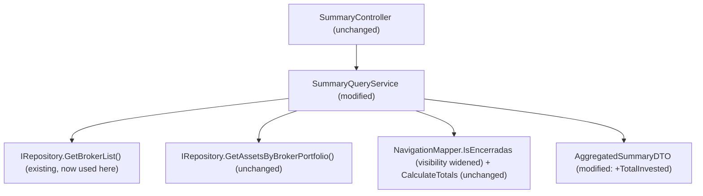

# Spec: F01 — Aggregated Totals Enhancement — Application Layer

## 1. Technical Overview

**What:** Adds a `TotalInvested` field (`TotalBought − TotalSold`) to `AggregatedSummaryDTO`, returned by both the existing broker-level and portfolio-level summary endpoints. Also corrects `SummaryQueryService.GetBrokerSummary` so that broker-level totals (`TotalBought`, `TotalSold`, `TotalCredits`, and the new `TotalInvested`) exclude all transactions and credits belonging to assets in the "Encerradas" portfolio, in addition to the existing exclusion of inactive assets (`Quantity == 0`).

**Why:** `AggregatedSummaryDTO` currently exposes only the three raw sums; both frontends would otherwise have to duplicate the `TotalBought − TotalSold` subtraction themselves (Web and WPF, in F05/F06). More importantly, `GetBrokerSummary` today aggregates via `IRepository.GetAssetsByBroker(brokerName)`, which flattens every portfolio's assets into one list with no portfolio identity — so a broker's fully-closed "Encerradas" portfolio silently inflates the broker's totals with historical, no-longer-relevant capital. `NavigationMapper` already defines this exact exclusion rule (`IsEncerradas`, used by `NavigationService` for tree ordering); this feature reuses it here instead of re-deriving the concept.

**Scope:**

Included:
- `TotalInvested` property on `AggregatedSummaryDTO`
- `SummaryQueryService.GetBrokerSummary` rewritten to source data from `IRepository.GetBrokerList()` (broker → portfolio → asset tree) instead of the flat `GetAssetsByBroker`, filtering out the Encerradas portfolio before filtering active assets
- `SummaryQueryService.GetPortfolioSummary` unchanged aggregation source (`GetAssetsByBrokerPortfolio`); only gains `TotalInvested` in its returned DTO
- `NavigationMapper.IsEncerradas` visibility changed from `private` to `internal` so `SummaryQueryService` can reuse it
- Unit test rewrite for `GetBrokerSummary` (new stub shape) and new tests for Encerradas exclusion, unknown broker, and `TotalInvested` computation
- Integration test updates asserting `totalInvested` in both endpoints' JSON responses

Excluded:
- Any change to `IRepository.GetAssetsByBroker`'s existing flat-list contract (still used unchanged by `CreditQueryService`)
- Any change to `CreditQueryService`'s broker-level credit aggregation (Credits tab breakdown is a separate, unrelated data path not scoped by this PRD)
- Any Presentation-layer (Web or WPF) display change — covered by F05 and F06
- The Broker/Portfolio breakdown pie-chart data (covered by F02)
- Excluding Encerradas from `GetPortfolioSummary` — not applicable; a direct Portfolio selection is never filtered against itself

---

## 2. Architecture Impact

**Affected components:**



---

## 3. Technical Decisions

| Decision | Chosen Approach | Alternative Considered | Trade-off |
|----------|----------------|----------------------|-----------|
| Broker-scope data source for Encerradas filtering | Reuse `IRepository.GetBrokerList()`, which already returns the full `Broker → Portfolio → Asset` tree, exactly as `NavigationService` already does for the same Encerradas concept | Add a new `IRepository.GetPortfoliosByBroker(brokerName)` method, exposing `JSONRepository`'s existing private helper | `GetBrokerList()` returns more data than strictly needed (the whole broker graph, not just portfolio names), but this is a personal-scale, in-memory dataset — the cost is negligible. Avoids growing `IRepository` for a need only one caller has today, and keeps the Encerradas-exclusion logic sourced from the exact same repository call already trusted for that purpose |
| Encerradas check reuse | Widen `NavigationMapper.IsEncerradas` from `private` to `internal`, called directly from `SummaryQueryService` (same assembly) | Duplicate the case-insensitive, trimmed name comparison inline in `SummaryQueryService` | A second copy of the same string-comparison rule would drift if the Encerradas matching logic ever changes (e.g., to support multiple archive-portfolio names); one internal helper keeps a single source of truth |
| Where `TotalInvested` is computed | Computed once in `SummaryQueryService.Aggregate`, carried on `AggregatedSummaryDTO` | Compute `TotalBought − TotalSold` independently in each frontend (Web component, WPF ViewModel) | Guarantees Web (F05) and WPF (F06) never diverge in sign or rounding; the DTO now carries one derived value alongside its two raw sums, a small increase in DTO responsibility for a meaningful reduction in duplicated logic |

---

## 4. Component Overview

**Backend:**

| File Path | New/Modified | Purpose | Key Responsibilities |
|-----------|--------------|---------|---------------------|
| `Financial.Application/DTOs/AggregatedSummaryDTO.cs` | Modified | Aggregated totals response shape | Add `TotalInvested` (`decimal`, `init`-only), following the existing three properties' style |
| `Financial.Application/Services/NavigationMapper.cs` | Modified | Shared navigation/aggregation helpers | Change `IsEncerradas` from `private static` to `internal static`; no behavioural change to the method itself |
| `Financial.Application/Services/SummaryQueryService.cs` | Modified | Broker/Portfolio totals aggregation | `GetBrokerSummary`: look up the broker via `_repository.GetBrokerList().FirstOrDefault(b => b.Name == brokerName)`, return a zero-filled DTO when not found, otherwise flatten `broker.Portfolios.Where(p => !NavigationMapper.IsEncerradas(p.Name)).SelectMany(p => p.Assets)` before the existing `.Where(a => a.Active)` filter; `GetPortfolioSummary` keeps its existing `GetAssetsByBrokerPortfolio` source unchanged; `Aggregate` gains `TotalInvested = totalBought - totalSold` in the returned DTO |
| `Tests/Financial.Application.Tests/Services/SummaryQueryServiceTests.cs` | Modified | Unit tests for `SummaryQueryService` | `StubRepository` gains a `Brokers` property (`IEnumerable<Broker>`) backing `GetBrokerList()`; all existing `GetBrokerSummary_*` tests rewritten to build a `Broker`/`Portfolio`/`Asset` graph instead of a flat asset list; new tests added for Encerradas exclusion, unknown broker name, and `TotalInvested` on both broker and portfolio scope |
| `Tests/Financial.Api.Tests/SummaryEndpointsTests.cs` | Modified | HTTP integration tests for summary endpoints | Extend `GetBrokerSummary_Returns200WithDto` and `GetPortfolioSummary_Returns200WithDto` to assert `TotalInvested` equals `TotalBought − TotalSold` on the deserialized response |

---

## 5. API Contracts

No new endpoints. Both existing endpoints gain one additional response field.

### `GET /summary/broker/{brokerName}` (modified response)

- **Method:** GET
- **Path:** `/api/v1/financial/summary/broker/{brokerName}`
- **Authentication:** None (matches existing endpoint)

**Response (Success - 200):**

| Field | Type | Description |
|-------|------|-------------|
| `totalBought` | `decimal` | Unchanged: sum of Buy transaction totals across active, non-Encerradas assets |
| `totalSold` | `decimal` | Unchanged: sum of Sell transaction totals across active, non-Encerradas assets |
| `totalCredits` | `decimal` | Unchanged: sum of credit values across active, non-Encerradas assets |
| `totalInvested` | `decimal` | **New.** `totalBought − totalSold`; may be negative |

**Response Example:**
```json
{
  "totalBought": 15250.00,
  "totalSold": 3200.00,
  "totalCredits": 480.50,
  "totalInvested": 12050.00
}
```

**Error Codes:**

| Code | HTTP Status | Description |
|------|-------------|-------------|
| N/A | 400 | Returned by ASP.NET routing when `brokerName` is whitespace-only after URL decoding (unchanged existing behaviour) |

### `GET /summary/portfolio/{brokerName}/{portfolioName}` (modified response)

- **Method:** GET
- **Path:** `/api/v1/financial/summary/portfolio/{brokerName}/{portfolioName}`
- **Authentication:** None (matches existing endpoint)

**Response (Success - 200):** same shape as above, computed only from the given portfolio's active assets (no Encerradas check applied — the selected portfolio may itself be Encerradas, in which case it is aggregated unfiltered, consistent with today's behaviour).

**Response Example:**
```json
{
  "totalBought": 4500.00,
  "totalSold": 4500.00,
  "totalCredits": 125.00,
  "totalInvested": 0.00
}
```

---

## 6. Data Model

Not applicable. No persistence schema changes; `TotalInvested` is a computed, in-memory value derived at query time from `Asset.Transactions`, exactly like the three existing totals.

---

## 7. Testing Strategy

### Test File Structure

| Test File | Test Type | Target | Coverage Goal |
|-----------|-----------|--------|---------------|
| `Tests/Financial.Application.Tests/Services/SummaryQueryServiceTests.cs` | Unit | `SummaryQueryService` | All existing broker/portfolio aggregation behaviour (rewired to new stub shape) plus Encerradas exclusion, unknown broker, and `TotalInvested` computation |
| `Tests/Financial.Api.Tests/SummaryEndpointsTests.cs` | Integration | `GET /summary/broker/{brokerName}`, `GET /summary/portfolio/{brokerName}/{portfolioName}` | `totalInvested` present and correctly computed in the live HTTP response |

### SummaryQueryServiceTests.cs

`StubRepository` is extended with a `Brokers` property (`IEnumerable<Broker>`, default `[]`) backing `GetBrokerList()`. All `GetBrokerSummary_*` tests are rewritten to build the fixture via `Broker.Create(...)`, `broker.AddPortfolio(...)`, and `portfolio.AddAsset(...)` instead of assigning `AssetsByBroker` directly. `GetPortfolioSummary_*` tests are unchanged (still use `AssetsByBrokerPortfolio`) except for new `TotalInvested` assertions.

| Test Function | Description | Assertions |
|---------------|-------------|------------|
| `GetBrokerSummary_ReturnsSumOfBuyTransactions` (rewritten) | Broker with one portfolio containing the existing fixture asset | `TotalBought` unchanged from current expected value |
| `GetBrokerSummary_ReturnsSumOfSellTransactions` (rewritten) | Same pattern | `TotalSold` unchanged from current expected value |
| `GetBrokerSummary_ReturnsSumOfCredits` (rewritten) | Same pattern | `TotalCredits` unchanged from current expected value |
| `GetBrokerSummary_ExcludesInactiveAssets` (rewritten) | Portfolio contains one active and one zero-quantity asset | `TotalBought`/`TotalCredits` reflect only the active asset (regression, existing behaviour preserved) |
| `GetBrokerSummary_ReturnsZerosForBrokerWithNoActiveAssets` (rewritten) | Portfolio contains only a zero-quantity asset | All totals, including `TotalInvested`, are 0 |
| `GetBrokerSummary_ReturnsZerosOnNullOrWhitespaceBrokerName` (unchanged assertions, `Theory` retained) | `null`/`""`/`"   "` broker name | All totals, including `TotalInvested`, are 0; `GetBrokerList()` is never queried |
| `GetBrokerSummary_ReturnsZerosForUnknownBrokerName` (new) | `Brokers` contains brokers, but none match the requested name | All totals are 0, no exception thrown |
| `GetBrokerSummary_ExcludesEncerradasPortfolio` (new) | Broker has two portfolios: "Default" (active asset, bought 100) and "Encerradas" (active asset, bought 500) | `TotalBought` is 100; the Encerradas asset's amounts are excluded entirely |
| `GetBrokerSummary_ExcludesEncerradasPortfolio_CaseInsensitive` (new) | Portfolio named `"encerradas"` (lowercase) | Still excluded, matching `IsEncerradas`'s case-insensitive comparison |
| `GetBrokerSummary_TotalInvested_EqualsBoughtMinusSold` (new) | Bought 300, sold 120 across included assets | `TotalInvested` equals 180 |
| `GetBrokerSummary_TotalInvested_CanBeNegative` (new) | Sold exceeds bought for the scope | `TotalInvested` is negative, no clamping applied |
| `GetPortfolioSummary_TotalInvested_EqualsBoughtMinusSold` (new) | Bought 200, sold 50 | `TotalInvested` equals 150 |
| `GetPortfolioSummary_ReturnsZerosOnNullOrWhitespaceInput` (existing, extended) | Existing `Theory` cases | `TotalInvested` is also asserted to be 0 |

### SummaryEndpointsTests.cs

| Test Function | Description | Assertions |
|---------------|-------------|------------|
| `GetBrokerSummary_Returns200WithDto` (extended) | Existing call to `/summary/broker/XPI` | Adds: `dto.TotalInvested.Should().Be(dto.TotalBought - dto.TotalSold)` |
| `GetPortfolioSummary_Returns200WithDto` (extended) | Existing call to `/summary/portfolio/XPI/Default` | Adds: `dto.TotalInvested.Should().Be(dto.TotalBought - dto.TotalSold)` |

### Acceptance Test Mapping

| PRD Acceptance Criterion (Section 9 — F01) | Covered By |
|---------------------------------------------|------------|
| `GET /summary/broker/{brokerName}` includes `totalInvested` equal to `totalBought − totalSold` | `GetBrokerSummary_Returns200WithDto` + `GetBrokerSummary_TotalInvested_EqualsBoughtMinusSold` |
| `GET /summary/portfolio/{brokerName}/{portfolioName}` includes `totalInvested` equal to `totalBought − totalSold` | `GetPortfolioSummary_Returns200WithDto` + `GetPortfolioSummary_TotalInvested_EqualsBoughtMinusSold` |
| Broker-level totals exclude Encerradas portfolio | `GetBrokerSummary_ExcludesEncerradasPortfolio` + `GetBrokerSummary_ExcludesEncerradasPortfolio_CaseInsensitive` |
| Broker/Portfolio totals continue to exclude `Quantity == 0` assets | `GetBrokerSummary_ExcludesInactiveAssets` (regression) + existing `GetPortfolioSummary_ExcludesInactiveAssets` (unchanged) |
| Selecting Encerradas directly still returns unfiltered totals | Implicit: `GetPortfolioSummary` source and logic are untouched by this feature; no new filter is added to it |
| Broker with zero eligible portfolios returns 0 totals, not an error | `GetBrokerSummary_ReturnsZerosForBrokerWithNoActiveAssets` + `GetBrokerSummary_ReturnsZerosForUnknownBrokerName` |
| Existing HTTP 400 behaviour unchanged | No changes to `SummaryController`; existing whitespace-routing behaviour is untouched |

### Cross-Feature Integration Tests

| PRD Section 9 — Cross-Feature Criterion | Covered By |
|------------------------------------------|------------|
| `totalInvested` computed by F01 for Broker scope is displayed without transformation in F05's and F06's fourth total | Not directly testable from F01 (F05/F06 do not exist yet); `GetBrokerSummary_Returns200WithDto`'s exact-value assertion is the contract F05/F06 will consume unmodified |
| `totalInvested` computed by F01 for Portfolio scope is displayed without transformation in F05's and F06's fourth total | Same as above, via `GetPortfolioSummary_Returns200WithDto` |
