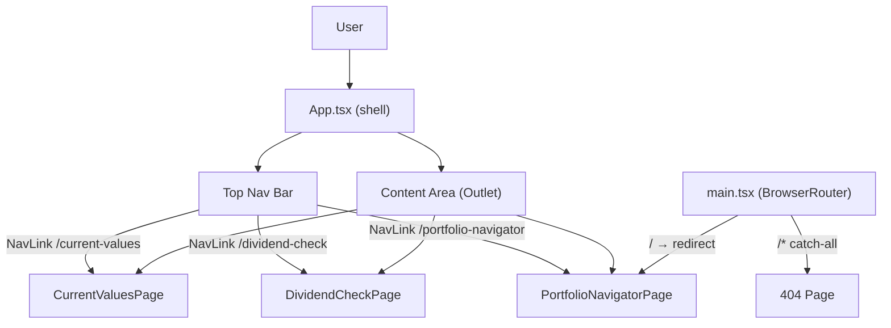

# Spec: F01 — App Navigation & Layout Restructure

## 1. Technical Overview

**What:** Restructure `Financial.Web` from a six-route fragmented layout with a persistent sidebar into a three-section single-shell application. The router is reduced to three named section routes (`/portfolio-navigator`, `/dividend-check`, `/current-values`), a default redirect from `/`, and a `*` 404 catch-all. The app shell (`App.tsx`) loses its two-column sidebar grid and embedded `NavigationTreePanel`, replaced by a flex-column shell with a three-item top navigation bar and a full-height content area. Global CSS enforces full-viewport height with no page-level overflow at any desktop resolution.

**Why:** The current architecture places the investment navigation tree (`NavigationTreePanel`) in the app shell, making it visible on every route including Dividend Check and Current Values where it is irrelevant. Centralising the app into three top-level sections aligns the shell with the WPF three-tab structure and prepares the routing foundation that F02 (split-panel Portfolio Navigator), F07 (Dividend Check redesign), and F08 (Current Values redesign) depend on.

**Scope:**

Included:
- Router restructure: remove all legacy routes; define `/portfolio-navigator`, `/dividend-check`, `/current-values`, `/` redirect, and `*` 404
- App shell redesign: remove sidebar grid and `NavigationTreePanel` from `App.tsx`; add three-item nav bar
- Viewport CSS: full-height layout, no page-level scrollbar
- `PortfolioNavigatorPage` placeholder component (replaced by F02)
- Move existing `DividendCheckPage` to `/dividend-check` and `CurrentValuesPage` to `/current-values`
- Delete five unreachable page components and their test files

Excluded:
- Portfolio Navigator content and split panel (F02)
- Dividend Check UI redesign (F07)
- Current Values UI redesign (F08)
- Any backend or API changes

---

## 2. Architecture Impact

**Affected components:**

- `Financial.Web/src/main.tsx` — Modified
- `Financial.Web/src/App.tsx` — Modified
- `Financial.Web/src/App.css` — Modified
- `Financial.Web/src/index.css` — Modified
- `Financial.Web/src/pages/PortfolioNavigatorPage.tsx` — New
- `Financial.Web/src/pages/__tests__/PortfolioNavigatorPage.test.tsx` — New
- `Financial.Web/src/pages/BrokersPage.tsx` + `__tests__/BrokersPage.test.tsx` — Deleted
- `Financial.Web/src/pages/BrokerDetailPage.tsx` + `__tests__/BrokerDetailPage.test.tsx` — Deleted
- `Financial.Web/src/pages/AssetDetailPage.tsx` + `__tests__/AssetDetailPage.test.tsx` — Deleted
- `Financial.Web/src/pages/CreditsPage.tsx` + `__tests__/CreditsPage.test.tsx` — Deleted
- `Financial.Web/src/pages/NavigationTreePage.tsx` + `__tests__/NavigationTreePage.test.tsx` — Deleted

**Architecture diagram:**

---

## 3. Technical Decisions

| Decision | Chosen Approach | Alternative Considered | Trade-off |
|----------|----------------|----------------------|-----------|
| Legacy route disposal | Remove from router; fall through to `/*` 404 catch-all | Explicit `<Navigate>` redirects to `/portfolio-navigator` | Simpler router config; no backwards-compat overhead since no active users |
| Portfolio Navigator F01 content | Minimal `PortfolioNavigatorPage` placeholder component | Temporarily embed existing `NavigationTreePage` | Keeps F01 self-contained; avoids coupling to a component F02 will fully replace |
| Unreachable page components | Delete all five page files and their co-located tests | Keep as dead code | Enforces Clean Code; no unused modules in the build |
| Viewport full-height | `html, body { height: 100%; overflow: hidden; }` + `.app { height: 100vh; display: flex; flex-direction: column; }` | `min-height: 100vh` with auto overflow | `overflow: hidden` is required by the PRD to suppress page-level scrollbars at all desktop resolutions |
| Nav active highlight | React Router `NavLink` `className` callback (existing pattern) | Manual active-state tracking with `useLocation` | Consistent with the existing `NavLink` usage in `App.tsx` |

---

## 4. Component Overview

**Frontend:**

| File Path | New/Modified | Purpose | Key Responsibilities |
|-----------|--------------|---------|---------------------|
| `Financial.Web/src/main.tsx` | Modified | Router configuration | Remove all legacy route definitions; define three section routes, `/` redirect to `/portfolio-navigator`, and `*` 404; keep `BrowserRouter` and `RouterProvider` wiring |
| `Financial.Web/src/App.tsx` | Modified | Application shell | Remove two-column sidebar grid and `NavigationTreePanel` import; render flex-column shell with three `NavLink` items (`Portfolio Navigator`, `Shares Dividend Check`, `Read Assets Current Values`) and a full-height `<Outlet>` |
| `Financial.Web/src/App.css` | Modified | Shell layout styles | Remove `.app__sidebar` and sidebar grid rules; add flex-column layout for `.app`; style `.app__nav` for three-item bar with active highlight (underline or contrasting background) |
| `Financial.Web/src/index.css` | Modified | Global viewport styles | Add `html, body { height: 100%; overflow: hidden; }` to suppress vertical and horizontal scrollbars at viewport level |
| `Financial.Web/src/pages/PortfolioNavigatorPage.tsx` | New | Portfolio Navigator placeholder | Export default functional component; render centred placeholder message; no data fetching; no props |
| `Financial.Web/src/pages/__tests__/PortfolioNavigatorPage.test.tsx` | New | Unit test for placeholder | Assert placeholder message is in the document |
| `Financial.Web/src/pages/BrokersPage.tsx` | Deleted | Unreachable after route removal | — |
| `Financial.Web/src/pages/__tests__/BrokersPage.test.tsx` | Deleted | Unreachable after route removal | — |
| `Financial.Web/src/pages/BrokerDetailPage.tsx` | Deleted | Unreachable after route removal | — |
| `Financial.Web/src/pages/__tests__/BrokerDetailPage.test.tsx` | Deleted | Unreachable after route removal | — |
| `Financial.Web/src/pages/AssetDetailPage.tsx` | Deleted | Unreachable after route removal | — |
| `Financial.Web/src/pages/__tests__/AssetDetailPage.test.tsx` | Deleted | Unreachable after route removal | — |
| `Financial.Web/src/pages/CreditsPage.tsx` | Deleted | Unreachable after route removal | — |
| `Financial.Web/src/pages/__tests__/CreditsPage.test.tsx` | Deleted | Unreachable after route removal | — |
| `Financial.Web/src/pages/NavigationTreePage.tsx` | Deleted | Unreachable after route removal; `NavigationTreePanel` component is retained for F02 | — |
| `Financial.Web/src/pages/__tests__/NavigationTreePage.test.tsx` | Deleted | Unreachable after route removal | — |

---

## 7. Testing Strategy

**Test files:**

| Test File | Test Type | Target | Coverage Goal |
|-----------|-----------|--------|---------------|
| `Financial.Web/src/__tests__/App.test.tsx` | Unit | `App` shell + routing | Navigation paths and active state |
| `Financial.Web/src/pages/__tests__/PortfolioNavigatorPage.test.tsx` | Unit | `PortfolioNavigatorPage` | 100% |

**`App.test.tsx` — test functions:**

| Test Function | Description | Assertions |
|---------------|-------------|------------|
| `renders three nav items` | Render `App` wrapped in `MemoryRouter` | Three nav links visible with labels "Portfolio Navigator", "Shares Dividend Check", "Read Assets Current Values" |
| `default route redirects to portfolio navigator` | Navigate to `/` | `PortfolioNavigatorPage` placeholder text is in the document |
| `navigates to dividend check section` | Click "Shares Dividend Check" nav link | `DividendCheckPage` content mounts; Portfolio Navigator placeholder is not visible |
| `navigates to current values section` | Click "Read Assets Current Values" nav link | `CurrentValuesPage` content mounts |
| `active nav item receives active class` | Render with initial entry `/dividend-check` | "Shares Dividend Check" `NavLink` has the active CSS class; other two links do not |
| `legacy broker route returns 404` | Navigate to `/brokers` | 404 "Page not found" text visible |
| `legacy navigation route returns 404` | Navigate to `/navigation` | 404 "Page not found" text visible |

**`PortfolioNavigatorPage.test.tsx` — test functions:**

| Test Function | Description | Assertions |
|---------------|-------------|------------|
| `renders placeholder message` | Render `PortfolioNavigatorPage` standalone | Placeholder text is in the document |
