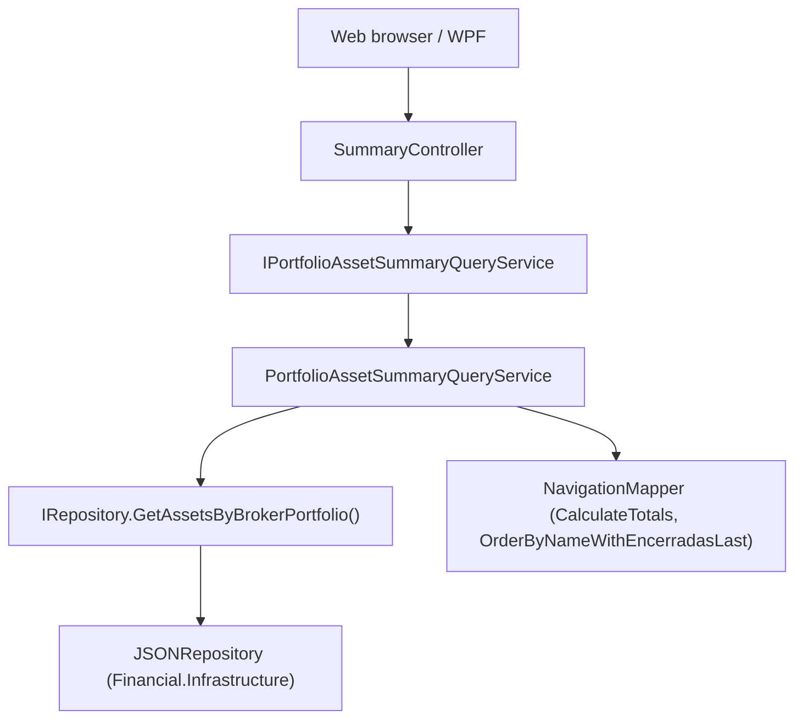

# Spec: F01 — Portfolio Assets Summary Service and Endpoint

## 1. Technical Overview

**What:** Introduces `IPortfolioAssetSummaryQueryService` / `PortfolioAssetSummaryQueryService` in the Application layer and a new GET action in the existing `SummaryController` that returns all assets of a portfolio as a list of per-asset summary items. Each item carries the static fields that F02 (web) and F03 (WPF) need to render the breakdown table before enriching it with live prices: asset name, ticker, exchange, date of first investment, current quantity, total bought, total sold, total invested, and portfolio weight.

**Why:** The existing `ISummaryQueryService` aggregates across all assets into three scalar totals; a separate service interface keeps per-asset enumeration orthogonal to that concern, respecting ISP. Both F02 and F03 need the same computation, so centralising it in the Application layer eliminates duplication across the two UI implementations.

**Scope:**

Included:
- `PortfolioAssetSummaryItemDTO` in `Financial.Application/DTOs/`
- `IPortfolioAssetSummaryQueryService` interface in `Financial.Application/Interfaces/`
- `PortfolioAssetSummaryQueryService` implementation in `Financial.Application/Services/`
- DI singleton registration in `ApplicationServiceCollectionExtensions`
- New `GetPortfolioAssetsSummary` action in the existing `SummaryController`
- Unit tests for `PortfolioAssetSummaryQueryService`
- Integration test additions to `SummaryEndpointsTests`

Excluded:
- `CurrentValue` and `% Profit` — computed by frontends after fetching live prices
- Broker-level per-asset breakdown — portfolio scope only
- Any changes to `ISummaryQueryService`, `SummaryQueryService`, or existing controller actions

---

## 2. Architecture Impact

**Affected components:**



---

## 3. Technical Decisions

| Decision | Chosen Approach | Alternative Considered | Trade-off |
|----------|----------------|----------------------|-----------|
| New interface vs. extending `ISummaryQueryService` | New `IPortfolioAssetSummaryQueryService` | Add `GetPortfolioAssetsSummary` to `ISummaryQueryService` | Respects ISP — aggregate totals and per-item list are distinct query shapes; adding to the existing interface couples two responsibilities and expands the surface area for all existing consumers |
| Null/whitespace handling | Controller validates; returns HTTP 400 | Service returns empty list silently (existing `SummaryQueryService` pattern) | PRD acceptance criterion explicitly requires 400; for a list endpoint, returning an empty list for a meaningless input would silently swallow an API misuse |
| Sort algorithm | `NavigationMapper.OrderByNameWithEncerradasLast` with `StringComparer.CurrentCultureIgnoreCase` | Plain `StringComparer.OrdinalIgnoreCase` sort | Consistency with navigation tree — asset nodes are already sorted this way in `MapPortfolio`; using the same method keeps list order identical to tree order |
| TotalBought / TotalSold computation | Reuse `NavigationMapper.CalculateTotals(asset)` | Inline LINQ | Avoids duplicating tested transaction-iteration logic; `CalculateTotals` is `internal` to the Application assembly and accessible from the new service |
| `PortfolioWeight` precision | Raw `decimal` in DTO — no server-side rounding | Round to 2 decimal places in service | Formatting is a UI concern; keeping full decimal precision lets both frontends format independently |
| DTO style | `sealed class` with `{ get; init; }` | `class` with `{ get; set; }` (used by `AssetDetailsDTO`) | Follows the `AggregatedSummaryDTO` pattern — the most recent DTO in the Summary feature; init setters prevent accidental mutation after construction |

---

## 4. Component Overview

### Backend

| File Path | New/Modified | Purpose | Key Responsibilities |
|-----------|--------------|---------|---------------------|
| `Financial.Application/DTOs/PortfolioAssetSummaryItemDTO.cs` | New | Response DTO | Sealed class with `init` properties: `AssetName` (string), `Ticker` (string), `Exchange` (string), `FirstInvestmentDate` (`DateTime?`), `CurrentQuantity` (decimal), `TotalBought` (decimal), `TotalSold` (decimal), `TotalInvested` (decimal), `PortfolioWeight` (decimal) |
| `Financial.Application/Interfaces/IPortfolioAssetSummaryQueryService.cs` | New | Service abstraction | Single method `GetPortfolioAssetsSummary(string brokerName, string portfolioName)` returning `IReadOnlyList<PortfolioAssetSummaryItemDTO>` |
| `Financial.Application/Services/PortfolioAssetSummaryQueryService.cs` | New | Query and mapping logic | Guard null/whitespace inputs (return empty list); call `_repository.GetAssetsByBrokerPortfolio`; for each asset compute `TotalBought`/`TotalSold` via `NavigationMapper.CalculateTotals`, derive `TotalInvested`, find `FirstInvestmentDate` from the earliest Buy transaction, read `CurrentQuantity` from `asset.Quantity`; compute `PortfolioWeight` per asset after summing all `TotalInvested` values (return 0 when denominator is 0); sort via `NavigationMapper.OrderByNameWithEncerradasLast`; return list |
| `Financial.Application/DependencyInjection/ApplicationServiceCollectionExtensions.cs` | Modified | DI registration | Add `services.AddSingleton<IPortfolioAssetSummaryQueryService, PortfolioAssetSummaryQueryService>()` |
| `Financial.Api/Controllers/SummaryController.cs` | Modified | New GET action | Add `IPortfolioAssetSummaryQueryService` as second constructor parameter; add `GetPortfolioAssetsSummary(string brokerName, string portfolioName)` action on route `portfolio/{brokerName}/{portfolioName}/assets`; validate both params with `string.IsNullOrWhiteSpace`, return `BadRequest()` if either is whitespace; otherwise return `Ok(result)` |

---

## 5. API Contracts

### GET Portfolio Assets Summary

- **Method:** GET
- **Path:** `/api/v1/financial/summary/portfolio/{brokerName}/{portfolioName}/assets`
- **Authentication:** None

**Path Parameters:**

| Parameter | Type | Required | Description |
|-----------|------|----------|-------------|
| `brokerName` | `string` | Yes | Exact broker name (e.g., `XPI`) |
| `portfolioName` | `string` | Yes | Exact portfolio name within the broker (e.g., `Default`) |

**Response (200 OK):**

| Field | Type | Description |
|-------|------|-------------|
| `[].assetName` | `string` | Asset name, sorted alphabetically (Encerradas-last) |
| `[].ticker` | `string` | Ticker symbol |
| `[].exchange` | `string` | Exchange code (e.g., `BVMF`, `LSE`) |
| `[].firstInvestmentDate` | `string` (ISO 8601) \| `null` | Date of earliest Buy transaction; `null` when asset has no Buy transactions |
| `[].currentQuantity` | `decimal` | Net quantity held after all Buy and Sell transactions |
| `[].totalBought` | `decimal` | Sum of `TotalPrice` for all Buy transactions |
| `[].totalSold` | `decimal` | Sum of `TotalPrice` for all Sell transactions |
| `[].totalInvested` | `decimal` | `totalBought − totalSold` |
| `[].portfolioWeight` | `decimal` | `totalInvested / portfolioTotalInvested × 100`; `0` when `portfolioTotalInvested` is `0` |

**Response Example (200):**
```json
[
  {
    "assetName": "ALZR11",
    "ticker": "ALZR11",
    "exchange": "BVMF",
    "firstInvestmentDate": "2021-03-01T00:00:00",
    "currentQuantity": 25.0,
    "totalBought": 2500.00,
    "totalSold": 0.00,
    "totalInvested": 2500.00,
    "portfolioWeight": 71.4285714285714
  },
  {
    "assetName": "MXRF11",
    "ticker": "MXRF11",
    "exchange": "BVMF",
    "firstInvestmentDate": "2021-05-15T00:00:00",
    "currentQuantity": 0.0,
    "totalBought": 1200.00,
    "totalSold": 200.00,
    "totalInvested": 1000.00,
    "portfolioWeight": 28.5714285714286
  }
]
```

**Empty portfolio response (200):**
```json
[]
```

**Error Codes:**

| HTTP Status | Condition |
|-------------|-----------|
| 200 | Successful — includes empty array when portfolio has no assets |
| 400 | `brokerName` or `portfolioName` is null, empty, or whitespace |

---

## 6. Data Model

Not applicable. No persistence schema changes. All values are computed at query time from the in-memory JSON-backed repository via the existing `IRepository.GetAssetsByBrokerPortfolio` method. The `Asset` entity already tracks `Quantity`, `Transactions`, and `Credits` in memory.

---

## 7. Testing Strategy

### Test File Structure

| Test File | Test Type | Target | Coverage Goal |
|-----------|-----------|--------|---------------|
| `Tests/Financial.Application.Tests/Services/PortfolioAssetSummaryQueryServiceTests.cs` | Unit | `PortfolioAssetSummaryQueryService` | All computation paths, sort, edge cases |
| `Tests/Financial.Api.Tests/SummaryEndpointsTests.cs` | Integration | `SummaryController.GetPortfolioAssetsSummary` | HTTP 200 with valid data; HTTP 400 on whitespace param |

### PortfolioAssetSummaryQueryServiceTests.cs

Follows the same structure as `SummaryQueryServiceTests.cs`: inner `StubRepository : IRepository`, `FluentAssertions` with `AssertionScope` for multi-field assertions, `[Theory][InlineData]` for null/whitespace variants.

| Test Function | Description | Assertions |
|---------------|-------------|------------|
| `Constructor_WithNullRepository_Throws` | Pass `null` as `IRepository` | Throws `ArgumentNullException` with parameter name `"repository"` |
| `GetPortfolioAssetsSummary_ReturnsSingleAsset_WithCorrectFields` | One asset with 2 Buy + 1 Sell transactions | `AssetName`, `Ticker`, `Exchange`, `CurrentQuantity`, `TotalBought`, `TotalSold`, `TotalInvested` all match expected values; `PortfolioWeight` is `100m` |
| `GetPortfolioAssetsSummary_SortsAlphabetically` | Three assets named `"ZEBRA"`, `"APPLE"`, `"MANGO"` | Returned list order is `APPLE`, `MANGO`, `ZEBRA` |
| `GetPortfolioAssetsSummary_ComputesPortfolioWeight` | Two assets with `TotalInvested` of `300m` and `700m` | First asset `PortfolioWeight` is `30m`; second is `70m` |
| `GetPortfolioAssetsSummary_ReturnsZeroPortfolioWeight_WhenAllTotalInvestedAreZero` | All assets have `TotalBought = TotalSold` | All `PortfolioWeight` values are `0m` |
| `GetPortfolioAssetsSummary_SetsFirstInvestmentDate_FromEarliestBuyTransaction` | Asset with Buy on `2020-01-15` and Buy on `2021-06-01` | `FirstInvestmentDate` equals `2020-01-15` (date portion only) |
| `GetPortfolioAssetsSummary_SetsFirstInvestmentDate_Null_WhenNoBuyTransactions` | Asset with no transactions | `FirstInvestmentDate` is `null` |
| `GetPortfolioAssetsSummary_IncludesAllAssets_RegardlessOfActiveStatus` | One asset with Quantity > 0 and one with Quantity = 0 | Both assets appear in result; count is 2 |
| `GetPortfolioAssetsSummary_ReturnsEmptyList_WhenPortfolioHasNoAssets` | Repository returns empty collection | Result is empty; no exception thrown |
| `GetPortfolioAssetsSummary_ReturnsEmptyList_OnNullOrWhitespaceBrokerName` | `brokerName` is `null`, `""`, `"   "` | Returns empty list without throwing — `[Theory][InlineData(null), InlineData(""), InlineData("   ")]` |
| `GetPortfolioAssetsSummary_ReturnsEmptyList_OnNullOrWhitespacePortfolioName` | `portfolioName` is `null`, `""`, `"   "` | Returns empty list without throwing — `[Theory][InlineData(null), InlineData(""), InlineData("   ")]` |

### SummaryEndpointsTests.cs (additions)

Follows the same `ApiTestFactory` / `WebApplicationFactory<Program>` pattern as existing summary tests.

| Test Function | Description | Assertions |
|---------------|-------------|------------|
| `GetPortfolioAssetsSummary_Returns200WithItems` | `GET /api/v1/financial/summary/portfolio/XPI/Default/assets` against the real test data file | HTTP 200; deserialised array is non-null and non-empty; first item has non-null `assetName`; all `totalBought ≥ 0` and `portfolioWeight ≥ 0` |
| `GetPortfolioAssetsSummary_Returns400ForWhitespaceBrokerName` | `GET /api/v1/financial/summary/portfolio/%20/Default/assets` | HTTP 400 |

### Acceptance Test Mapping

| PRD Acceptance Criterion (Section 9 — F01) | Covered By |
|---------------------------------------------|------------|
| Returns HTTP 200 with JSON array | `GetPortfolioAssetsSummary_Returns200WithItems` |
| Each item contains required fields | `GetPortfolioAssetsSummary_Returns200WithItems` + `GetPortfolioAssetsSummary_ReturnsSingleAsset_WithCorrectFields` |
| `totalInvested = totalBought − totalSold` | `GetPortfolioAssetsSummary_ReturnsSingleAsset_WithCorrectFields` |
| `portfolioWeight` values sum to 100 | `GetPortfolioAssetsSummary_ComputesPortfolioWeight` |
| All values 0 when `portfolioTotalInvested` is 0 | `GetPortfolioAssetsSummary_ReturnsZeroPortfolioWeight_WhenAllTotalInvestedAreZero` |
| Assets sorted alphabetically | `GetPortfolioAssetsSummary_SortsAlphabetically` |
| `firstInvestmentDate` from earliest Buy | `GetPortfolioAssetsSummary_SetsFirstInvestmentDate_FromEarliestBuyTransaction` |
| `firstInvestmentDate` is null with no Buys | `GetPortfolioAssetsSummary_SetsFirstInvestmentDate_Null_WhenNoBuyTransactions` |
| HTTP 400 on null/whitespace params | `GetPortfolioAssetsSummary_Returns400ForWhitespaceBrokerName` |
| Empty array on empty portfolio | `GetPortfolioAssetsSummary_ReturnsEmptyList_WhenPortfolioHasNoAssets` |
