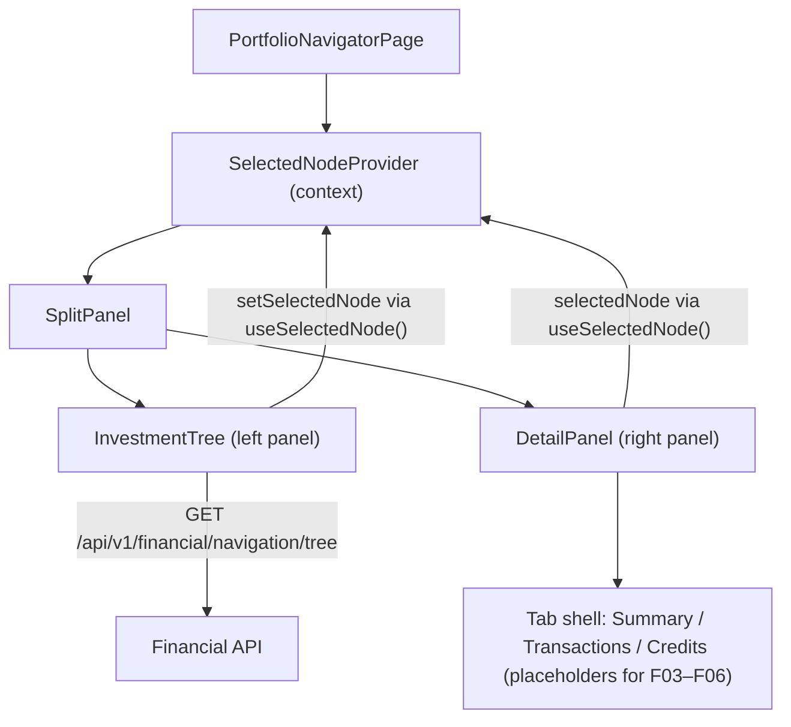

# Spec: F02 — Portfolio Navigator - Investment Tree & Split Panel Layout

## 1. Technical Overview

**What:** Replaces the `PortfolioNavigatorPage` placeholder with a full split-panel Portfolio Navigator. The page renders a resizable left panel housing the investment tree and asset class filter, and a context-sensitive right panel with a node-specific header, breadcrumb, status indicator, and three tabs (Summary | Transactions | Credits). A new React Context (`SelectedNodeContext`) carries the selected node identity across components and exposes the interface consumed by F03, F04, F05, and F06.

**Why:** F01 established the three-section shell and left the Portfolio Navigator as a placeholder. F02 delivers the core navigation experience that F03–F06 build on: the tree is the single entry point for selecting any broker, portfolio, or asset, and the right panel is the container that all subsequent feature tabs live inside.

**Scope:**

Included:
- `SelectedNodeContext`: React Context providing `selectedNode` and `setSelectedNode` to all children
- `SplitPanel`: resizable two-column container (drag handle, left min 300px, max 50% viewport)
- `InvestmentTree`: fetches `GET /navigation/tree`, renders nodes with asset class filter, expand/collapse, and click-to-select
- `DetailPanel`: context-sensitive right panel with header, breadcrumb, status indicator, copy icon, tab bar, and tab placeholder content
- `PortfolioNavigatorPage` rewrite: composes the above into the live page
- Delete `NavigationTreePanel.tsx` (replaced by `InvestmentTree`)
- Comprehensive unit test suite for all new components

Excluded:
- Summary tab content (F03, F04)
- Transactions tab content (F05)
- Credits tab content (F06)
- Any backend endpoint changes (navigation tree already provides all required metadata)

---

## 2. Architecture Impact

**Affected components:**

| File Path | Change |
|-----------|--------|
| `Financial.Web/src/api/types.ts` | Modified |
| `Financial.Web/src/context/SelectedNodeContext.tsx` | New |
| `Financial.Web/src/context/__tests__/SelectedNodeContext.test.tsx` | New |
| `Financial.Web/src/components/SplitPanel.tsx` | New |
| `Financial.Web/src/components/SplitPanel.css` | New |
| `Financial.Web/src/components/__tests__/SplitPanel.test.tsx` | New |
| `Financial.Web/src/components/InvestmentTree.tsx` | New |
| `Financial.Web/src/components/InvestmentTree.css` | New |
| `Financial.Web/src/components/__tests__/InvestmentTree.test.tsx` | New |
| `Financial.Web/src/components/DetailPanel.tsx` | New |
| `Financial.Web/src/components/DetailPanel.css` | New |
| `Financial.Web/src/components/__tests__/DetailPanel.test.tsx` | New |
| `Financial.Web/src/pages/PortfolioNavigatorPage.tsx` | Modified (rewrite) |
| `Financial.Web/src/pages/PortfolioNavigatorPage.css` | New |
| `Financial.Web/src/pages/__tests__/PortfolioNavigatorPage.test.tsx` | Modified |
| `Financial.Web/src/components/NavigationTreePanel.tsx` | Deleted |
| `Financial.Web/src/components/__tests__/NavigationTreePanel.test.tsx` | Deleted (if exists) |

**Backend:** None. `NavigationMapper.cs` (Application layer) already emits all required metadata fields in the navigation tree response.

**Architecture diagram:**



---

## 3. Technical Decisions

| Decision | Chosen Approach | Alternative Considered | Trade-off |
|----------|----------------|----------------------|-----------|
| Selected node state sharing | React Context (`SelectedNodeContext`) wrapping the page | Lift state to `PortfolioNavigatorPage`, pass as props | Context avoids prop-drilling through `SplitPanel` → `DetailPanel` → tab components (F03–F06), which would create three-level prop chains; user preference |
| NavigationTreePanel reuse | Delete; create new `InvestmentTree` from scratch | Refactor existing `NavigationTreePanel` with new props | The existing component is routing-based with `Link` navigation; F02 needs click-to-select, asset class filtering, and active/inactive indicators — the behavioural mismatch makes refactoring riskier than rewriting |
| Drag-to-resize implementation | Native mouse events (`mousedown`, `mousemove`, `mouseup`) on the drag handle | Third-party split-panel library | No additional dependency; one drag handle with pixel-width clamping is simple enough to implement natively; library adds bundle weight for no gain |
| GlobalAssetClass Unknown in filter | Exclude value 0 (Unknown) from dropdown | Include all enum values | Unknown assets are uncategorised; showing "Unknown" as a filter option adds noise without actionable value; they remain visible under "All" |
| Status indicator at broker level | Omit entirely | Show greyed-out "N/A" placeholder | PRD explicitly states "no asset active status relevant at broker level" — omitting is cleaner than a disabled indicator |
| Tab content for F03/F05/F06 | Render placeholder text per tab | Leave tab content area empty | Placeholder communicates expected content structure to developers implementing downstream features; replaced in F03/F05/F06 without touching tab infrastructure |
| Context file location | `src/context/` (new folder) | Place in `src/components/` | Separates state concerns from rendering concerns; follows idiomatic React project convention for context modules |

---

## 4. Component Overview

| File Path | New/Modified/Deleted | Purpose | Key Responsibilities |
|-----------|---------------------|---------|---------------------|
| `Financial.Web/src/api/types.ts` | Modified | Type definitions | Add `NodeType` union, `SelectedNode` interface, `SelectedNodeContextValue` interface |
| `Financial.Web/src/context/SelectedNodeContext.tsx` | New | React Context for selected tree node | Export `SelectedNodeContext`, `SelectedNodeProvider` (holds `useState<SelectedNode \| null>`), and `useSelectedNode()` hook (throws if called outside provider) |
| `Financial.Web/src/context/__tests__/SelectedNodeContext.test.tsx` | New | Unit tests for context | Default null; state update; out-of-provider guard |
| `Financial.Web/src/components/SplitPanel.tsx` | New | Resizable two-column container | Accept `left` and `right` ReactNode props; manage `leftWidth` state (default 300px, min 300px, max 50% viewport); handle drag via mousedown/mousemove/mouseup on centre handle div |
| `Financial.Web/src/components/SplitPanel.css` | New | SplitPanel layout styles | Flex-row container; drag handle cursor and visual; right panel fills remaining width with `flex: 1`; each panel `overflow: auto` for independent scrolling |
| `Financial.Web/src/components/__tests__/SplitPanel.test.tsx` | New | Unit tests for SplitPanel | Left and right children render; drag handle present; default left width 300px |
| `Financial.Web/src/components/InvestmentTree.tsx` | New | Left-panel investment tree | Fetch tree on mount via `getNavigationTree()`; show `LoadingState` / `ErrorState` with retry; render Broker/Portfolio/Asset nodes recursively; Broker and Portfolio nodes expand/collapse (Broker expanded by default, Portfolio collapsed by default); clicking a node calls `setSelectedNode`; highlight selected node with `#007ACC`; show `●`/`○` prefix on Asset nodes from `IsActive` metadata; asset class filter dropdown (client-side filtering retains matching Asset nodes and their ancestors) |
| `Financial.Web/src/components/InvestmentTree.css` | New | InvestmentTree styles | Tree node layout; selected-node highlight class; expand/collapse chevron; asset status prefix; filter dropdown; panel vertical scroll |
| `Financial.Web/src/components/__tests__/InvestmentTree.test.tsx` | New | Unit tests for InvestmentTree | Tree renders; active/inactive icons; filter hides/shows assets; ancestors retained during filter; click updates context; expand/collapse toggle; loading state; error and retry |
| `Financial.Web/src/components/DetailPanel.tsx` | New | Right-panel context-sensitive detail view | Read `selectedNode` via `useSelectedNode()`; render empty state when null; render header (name bold 20px, clipboard copy icon for Asset, breadcrumb, status indicator for Asset); render Summary/Transactions/Credits tab bar; reset active tab to `'summary'` via `useEffect` on node change; render placeholder tab content areas |
| `Financial.Web/src/components/DetailPanel.css` | New | DetailPanel styles | Header layout; breadcrumb text style; status indicator (active green, inactive grey 11px); tab bar; placeholder content padding |
| `Financial.Web/src/components/__tests__/DetailPanel.test.tsx` | New | Unit tests for DetailPanel | Empty state; broker header; portfolio header with breadcrumb; asset header with full breadcrumb and status; copy icon writes to clipboard; tab bar present; tab switching; tab reset on node change |
| `Financial.Web/src/pages/PortfolioNavigatorPage.tsx` | Modified (rewrite) | Portfolio Navigator page | Compose `SelectedNodeProvider` > `SplitPanel` with `InvestmentTree` (left) and `DetailPanel` (right); apply page-level CSS class |
| `Financial.Web/src/pages/PortfolioNavigatorPage.css` | New | Page-level layout | Full-height container for the portfolio navigator |
| `Financial.Web/src/pages/__tests__/PortfolioNavigatorPage.test.tsx` | Modified | Integration tests | Full page renders; asset selection reflected in right panel; broker selection reflected in right panel |
| `Financial.Web/src/components/NavigationTreePanel.tsx` | Deleted | Replaced by InvestmentTree | — |
| `Financial.Web/src/components/__tests__/NavigationTreePanel.test.tsx` | Deleted | Replaced by InvestmentTree tests | — |

---

## 5. Data Model

### New types in `src/api/types.ts`

```typescript
export type NodeType = 'Asset' | 'Portfolio' | 'Broker'

export interface SelectedNode {
  nodeType: NodeType
  brokerName: string
  portfolioName?: string  // present for Portfolio and Asset nodes
  assetName?: string      // present for Asset nodes only
  ticker?: string         // present for Asset nodes only
  exchange?: string       // present for Asset nodes only
  currency?: string       // present for Broker nodes only (e.g. "BRL")
  isActive?: boolean      // present for Asset nodes only
}

export interface SelectedNodeContextValue {
  selectedNode: SelectedNode | null
  setSelectedNode: (node: SelectedNode | null) => void
}
```

### TreeNodeDto metadata keys consumed by InvestmentTree

The `GET /api/v1/financial/navigation/tree` response already includes all required fields. No backend changes are needed.

| Node type | Metadata key | Value type | Used for |
|-----------|-------------|-----------|----------|
| Broker | `BrokerName` | string | `selectedNode.brokerName` |
| Broker | `Currency` | string | `selectedNode.currency` |
| Portfolio | `PortfolioName` | string | `selectedNode.portfolioName` |
| Portfolio | `AssetCount` | number | (already embedded in `displayName` by backend) |
| Asset | `AssetName` | string | `selectedNode.assetName` |
| Asset | `Ticker` | string | `selectedNode.ticker`; breadcrumb |
| Asset | `Exchange` | string | `selectedNode.exchange`; breadcrumb |
| Asset | `IsActive` | boolean | `●`/`○` prefix; status indicator |
| Asset | `GlobalAssetClass` | number | Asset class filter comparison |

Note: `displayName` for Broker is pre-formatted by the backend as `"{name} ({currency})"` (e.g. `"XPI (BRL)"`). `displayName` for Portfolio is pre-formatted as `"{name} ({N} assets)"` (e.g. `"Acoes (4 assets)"`). `displayName` for Asset is the bare name; the frontend prepends `●` or `○` based on `IsActive`.

### GlobalAssetClass filter options

`GlobalAssetClass` numeric value `0` (Unknown) is excluded. The filter dropdown renders "All" plus the following options:

| Numeric value | Display label |
|--------------|--------------|
| 1 | Equity |
| 2 | Real Estate |
| 3 | Bond |
| 4 | Fund |
| 5 | ETF |
| 6 | Cash |
| 7 | Pension |
| 8 | Other |

---

## 6. API Contracts

No new endpoints. F02 consumes one existing endpoint:

**`GET /api/v1/financial/navigation/tree`**

Returns the root `TreeNodeDto` with a nested Broker → Portfolio → Asset hierarchy. All metadata keys listed in the Data Model section are present in the current response (verified in `NavigationMapper.cs`).

Example response shape (abbreviated):
```json
{
  "nodeType": "Investments",
  "displayName": "Investments",
  "children": [
    {
      "nodeType": "Broker",
      "displayName": "XPI (BRL)",
      "metadata": { "BrokerName": "XPI", "Currency": "BRL" },
      "children": [
        {
          "nodeType": "Portfolio",
          "displayName": "Acoes (4 assets)",
          "metadata": { "PortfolioName": "Acoes", "AssetCount": 4 },
          "children": [
            {
              "nodeType": "Asset",
              "displayName": "KLBN4",
              "metadata": {
                "AssetName": "KLBN4", "Ticker": "KLBN4", "Exchange": "BVMF",
                "IsActive": true, "GlobalAssetClass": 1
              },
              "children": []
            }
          ]
        }
      ]
    }
  ]
}
```

---

## 7. Testing Strategy

### Test files

| Test File | Test Type | Target | Coverage Goal |
|-----------|-----------|--------|--------------|
| `src/context/__tests__/SelectedNodeContext.test.tsx` | Unit | `SelectedNodeContext` | Provider, hook, default values, out-of-provider guard |
| `src/components/__tests__/SplitPanel.test.tsx` | Unit | `SplitPanel` | Children rendering, drag handle presence, default width |
| `src/components/__tests__/InvestmentTree.test.tsx` | Unit | `InvestmentTree` | Tree rendering, active/inactive icons, filter, selection, expand/collapse, error/retry |
| `src/components/__tests__/DetailPanel.test.tsx` | Unit | `DetailPanel` | All node type headers, tabs, copy action, tab reset on node change |
| `src/pages/__tests__/PortfolioNavigatorPage.test.tsx` | Integration | `PortfolioNavigatorPage` | Full page tree → detail panel selection flow |

### SelectedNodeContext.test.tsx — test functions

| Test Function | Description | Assertions |
|---------------|-------------|------------|
| `useSelectedNode returns null by default` | Render consumer inside provider without calling setSelectedNode | `selectedNode` is `null` |
| `setSelectedNode updates context value` | Render consumer; call `setSelectedNode` with a broker node | Consumer reads updated `selectedNode.nodeType === 'Broker'` |
| `useSelectedNode throws when called outside provider` | Render consumer without `SelectedNodeProvider` wrapper | Error boundary catches thrown error |

### SplitPanel.test.tsx — test functions

| Test Function | Description | Assertions |
|---------------|-------------|------------|
| `renders left child content` | Render `SplitPanel` with text in `left` slot | Left content visible in document |
| `renders right child content` | Render `SplitPanel` with text in `right` slot | Right content visible in document |
| `drag handle is present` | Render `SplitPanel` | Element with drag-handle class/role is in document |
| `left panel has default width of 300px` | Render and inspect left panel inline style | Left panel style has `width: 300px` |

### InvestmentTree.test.tsx — test functions

| Test Function | Description | Assertions |
|---------------|-------------|------------|
| `shows loading state on mount` | Mock `getNavigationTree` to never resolve; render | `LoadingState` content visible |
| `renders broker nodes after successful load` | Mock tree with one broker | Broker `displayName` (e.g. "XPI (BRL)") visible |
| `renders portfolio nodes under broker` | Mock tree with broker → one portfolio | Portfolio `displayName` (e.g. "Acoes (4 assets)") visible |
| `renders active asset with filled circle prefix` | Mock asset node with `IsActive: true` | Text "● KLBN4" visible |
| `renders inactive asset with empty circle prefix` | Mock asset node with `IsActive: false` | Text "○ KLBN4" visible |
| `clicking asset node sets selectedNode in context` | Click asset row | `selectedNode` has `nodeType: 'Asset'`, correct `brokerName`, `portfolioName`, `assetName` |
| `clicking broker node sets selectedNode in context` | Click broker row | `selectedNode` has `nodeType: 'Broker'`, correct `brokerName` |
| `clicking portfolio node sets selectedNode in context` | Click portfolio row | `selectedNode` has `nodeType: 'Portfolio'`, correct `brokerName` and `portfolioName` |
| `asset class filter hides non-matching assets` | Select "Equity" (value 1); tree has Equity and Bond (value 3) assets | Equity asset visible; Bond asset absent |
| `asset class filter All restores full tree` | Select "Equity"; then select "All" | Previously hidden Bond asset visible again |
| `broker node is retained in tree when filter is active` | Filter to "Equity"; broker has one Equity asset | Broker row still visible |
| `broker node hidden when filter removes all its assets` | Filter to "Equity"; broker has only Bond assets | Broker row absent |
| `broker nodes are expanded by default on load` | Mock tree; render | Portfolio child nodes visible without clicking |
| `clicking broker chevron collapses broker` | Click chevron on expanded broker | Portfolio children no longer visible |
| `clicking broker chevron again expands broker` | Collapse then click chevron again | Portfolio children visible again |
| `shows error state on fetch failure` | Mock `getNavigationTree` to reject | `ErrorState` content with Retry button visible |
| `retry button re-fetches tree` | Click Retry after failure; second call resolves | Tree content visible after retry |

### DetailPanel.test.tsx — test functions

| Test Function | Description | Assertions |
|---------------|-------------|------------|
| `shows empty state when selectedNode is null` | Render with null context value | "Select an item to view details" text visible |
| `shows broker name in header for broker node` | Render with broker `selectedNode` | Broker name text visible |
| `does not show status indicator for broker node` | Render with broker `selectedNode` | "Active" and "Inactive" text absent |
| `does not show copy icon for broker node` | Render with broker `selectedNode` | Copy button absent |
| `shows portfolio name and broker breadcrumb` | Render with portfolio `selectedNode` | Portfolio name and `brokerName` visible |
| `shows asset name with full breadcrumb` | Render with asset `selectedNode` | Asset name and "`{ticker} · {exchange} · {brokerName} · {portfolioName}`" text visible |
| `shows Active status indicator for active asset` | Render with asset `selectedNode` where `isActive: true` | "● Active" text visible |
| `shows Inactive status indicator for inactive asset` | Render with asset `selectedNode` where `isActive: false` | "○ Inactive" text visible |
| `copy icon calls clipboard writeText with asset name` | Click copy icon in asset header | `navigator.clipboard.writeText` called with `assetName` |
| `copy icon does not show confirmation dialog` | Click copy icon | `window.alert` and `window.confirm` not called |
| `tab bar renders three tabs` | Render with any non-null `selectedNode` | "Summary", "Transactions", "Credits" tab buttons visible |
| `Summary tab is active by default` | Render with any non-null `selectedNode` | Summary tab has active class; others do not |
| `clicking Transactions tab activates it` | Click "Transactions" tab button | Transactions tab has active class |
| `active tab resets to Summary on selectedNode change` | Switch to Transactions tab; update `selectedNode` | Summary tab has active class after change |

### PortfolioNavigatorPage.test.tsx — test functions

| Test Function | Description | Assertions |
|---------------|-------------|------------|
| `renders tree and empty detail state on load` | Mock API; render page in MemoryRouter | InvestmentTree loading or content visible; "Select an item to view details" visible |
| `selecting an asset node shows asset name in right panel` | Mock API with asset; click asset node | Asset name appears in right panel header |
| `selecting a broker node shows broker name in right panel` | Mock API with broker; click broker node | Broker name appears in right panel header |

### Acceptance criteria coverage

| Acceptance criterion | Covered by |
|----------------------|-----------|
| Tree renders all brokers with portfolios and assets | `renders broker nodes after successful load`, `renders portfolio nodes under broker` |
| Broker nodes display `{BrokerName} ({CurrencyCode})` | `renders broker nodes after successful load` (displayName from API already formatted) |
| Portfolio nodes display `{PortfolioName} ({N} assets)` | `renders portfolio nodes under broker` |
| Active assets display ● prefix; inactive display ○ | `renders active asset with filled circle prefix`, `renders inactive asset with empty circle prefix` |
| Asset class filter defaults to "All" | `asset class filter All restores full tree` |
| Selecting a class filters tree client-side retaining ancestors | `asset class filter hides non-matching assets`, `broker node is retained in tree when filter is active` |
| Blue (#007ACC) selection highlight on node click | Assertion on CSS class presence in selection tests |
| Highlight persists when right panel receives focus | Verified by context not being cleared on DetailPanel interaction (separate component, context not reset) |
| Broker and portfolio nodes expand and collapse | `broker nodes are expanded by default on load`, `clicking broker chevron collapses broker` |
| Left and right panels scroll independently | CSS structural test: each panel has `overflow: auto` (verified in SplitPanel tests via rendered DOM structure) |
| Asset header shows name, copy icon, breadcrumb, status | `shows asset name with full breadcrumb`, `shows Active/Inactive status indicator`, copy icon tests |
| Copy icon writes to clipboard without dialog | `copy icon calls clipboard writeText`, `copy icon does not show confirmation dialog` |
| No node selected → empty state | `shows empty state when selectedNode is null` |
| Left panel drag handle, min 300px | `drag handle is present`, `left panel has default width of 300px` |

### Cross-Feature Integration criteria covered

| Criteria | Coverage |
|----------|---------|
| F02 asset selection passes brokerName, portfolioName, assetName to F03/F05/F06 | `clicking asset node sets selectedNode in context`; PortfolioNavigatorPage integration test |
| F02 broker selection passes brokerName to F04 | `clicking broker node sets selectedNode in context`; `selecting a broker node shows broker name in right panel` |
| F02 portfolio selection passes brokerName and portfolioName to F04/F06 | `clicking portfolio node sets selectedNode in context` |
