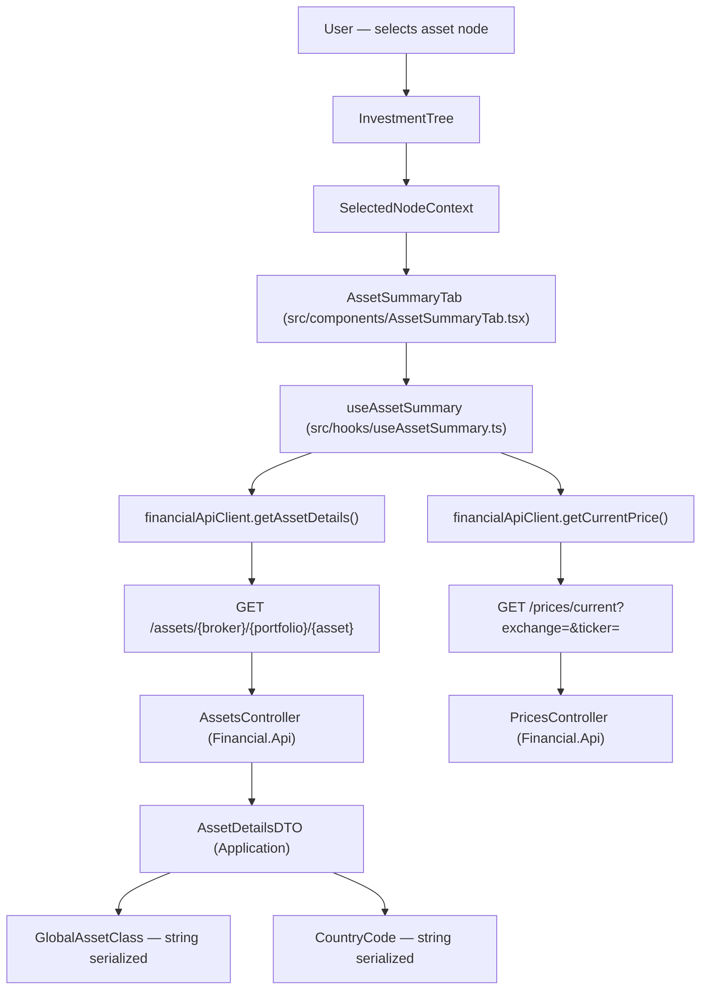

# Spec: F03 — Summary Tab — Asset View

## 1. Technical Overview

**What:** Replace the `"Summary — coming in F03 / F04"` placeholder in `DetailPanel.tsx` with a functional asset summary view. Introduces a dedicated `AssetSummaryTab` component and `useAssetSummary` hook. Includes a backend change to serialize `GlobalAssetClass` and `CountryCode` enums as strings in `AssetDetailsDTO` and `AssetNodeDTO` responses.

**Why:** `DetailPanel` currently renders the same placeholder for all node types. F03 connects the asset selection context provided by F02 to the existing `getAssetDetails` and `getCurrentPrice` API calls, renders the full set of asset metadata and performance fields, and eliminates the need for frontend enum label maps by making the API contract self-describing.

**Scope:**

Included:
- `useAssetSummary` hook managing dual-fetch (asset details + current price), price refresh trigger, and client-side computed values
- `AssetSummaryTab` component rendering a two-column grid with colour-coded fields and a Refresh button
- Backend: `[JsonConverter(typeof(JsonStringEnumConverter))]` applied to `Class` and `Country` in `AssetDetailsDTO.cs` and `AssetNodeDTO.cs`
- Frontend `types.ts`: `class` and `country` changed from `number` to `string` in `AssetDetailsDto` and `AssetNodeDto`
- `DetailPanel.tsx` updated to render `AssetSummaryTab` when `nodeType === 'Asset'`; Broker/Portfolio Summary tab retains existing placeholder for F04

Excluded:
- Broker/Portfolio summary tab content (F04)
- Global `JsonStringEnumConverter` in `Program.cs` — targeted attribute approach only, to avoid breaking `InvestmentTree` filter which reads `GlobalAssetClass` from tree metadata as a number
- Navigation tree metadata serialization changes

---

## 2. Architecture Impact

**Affected components:**



---

## 3. Technical Decisions

| Decision | Chosen Approach | Alternative Considered | Trade-off |
|----------|----------------|----------------------|-----------|
| Enum serialization strategy | Attribute-based `[JsonConverter(typeof(JsonStringEnumConverter))]` on `Class` and `Country` in `AssetDetailsDTO` and `AssetNodeDTO` | Global `JsonStringEnumConverter` in `Program.cs` `AddControllers()` | Targeted approach avoids breaking `InvestmentTree` filter which reads `GlobalAssetClass` from tree metadata as a number via `getMetaNumber()`; global approach is simpler but would require simultaneous InvestmentTree refactor |
| Hook extraction | `useAssetSummary` hook handles both fetches, refresh, and computed values | Inline state in `AssetSummaryTab` | Isolates data concerns from rendering; enables independent unit testing of computed value formulas |
| Component decomposition | Separate `AssetSummaryTab.tsx` imported into `DetailPanel.tsx` | Inline in `DetailPanel.tsx` | Keeps `DetailPanel` as a tab orchestrator; mirrors the structure F04/F05/F06 will follow for their tab content |
| Number formatting | `Intl.NumberFormat` instances created in `useMemo` within `AssetSummaryTab` | Shared utility module | Consistent with existing page components (`DividendCheckPage`, `CurrentValuesPage`); shared utils can be extracted later if formatters accumulate across features |

---

## 4. Component Overview

### Frontend

| File Path | New/Modified | Purpose | Key Responsibilities |
|-----------|--------------|---------|---------------------|
| `Financial.Web/src/hooks/useAssetSummary.ts` | New | Asset data and price loading hook | Fetch asset details on node change; fetch current price concurrently; expose refresh trigger; compute TotalCurrentValue, Result%, TotalCurrentPlusCredits, ResultWithCredits%; track separate loading and error states for both fetches; expose `showCurrentSection` flag (false when Quantity = 0 or AveragePrice = 0) |
| `Financial.Web/src/components/AssetSummaryTab.tsx` | New | Summary tab renderer for asset node | Consume `useAssetSummary`; render two-column field grid; show loading indicator and error state with Retry; apply colour classes to monetary and percentage fields; show/hide Current section; render Refresh button |
| `Financial.Web/src/components/AssetSummaryTab.css` | New | Styles for summary grid | Two-column definition list grid layout; colour value classes (`.value--green`, `.value--red`, `.value--blue`); horizontal separators; Refresh button right-alignment |
| `Financial.Web/src/components/DetailPanel.tsx` | Modified | Integrate AssetSummaryTab | Import and render `AssetSummaryTab` in the `summary` tab branch when `selectedNode.nodeType === 'Asset'`; retain placeholder text for Broker and Portfolio |
| `Financial.Web/src/api/types.ts` | Modified | Update DTO field types | Change `class: number` to `class: string` and `country: number` to `country: string` in both `AssetDetailsDto` and `AssetNodeDto` |

### Backend

| File Path | New/Modified | Purpose | Key Responsibilities |
|-----------|--------------|---------|---------------------|
| `Financial.Application/DTOs/AssetDetailsDTO.cs` | Modified | Enum string serialization | Add `[JsonConverter(typeof(JsonStringEnumConverter))]` to `Class` (`GlobalAssetClass`) and `Country` (`CountryCode`) properties |
| `Financial.Application/DTOs/AssetNodeDTO.cs` | Modified | Enum string serialization | Add `[JsonConverter(typeof(JsonStringEnumConverter))]` to `Class` and `Country` properties |

---

## 5. API Contracts

### Get Asset Details — response contract change

- **Method:** GET
- **Path:** `/api/v1/financial/assets/{brokerName}/{portfolioName}/{assetName}`

**Fields changed by F03:**

| Field | Before F03 | After F03 | Example Values |
|-------|-----------|-----------|----------------|
| `class` | `integer` | `string` | `"Equity"`, `"RealEstate"`, `"Bond"`, `"Fund"`, `"ETF"`, `"Cash"`, `"Pension"`, `"Other"`, `"Unknown"` |
| `country` | `integer` | `string` | `"BR"`, `"US"`, `"UK"`, `"Unknown"` |

**Response example (after F03):**
```json
{
  "name": "KLBN4",
  "brokerName": "XPI",
  "portfolioName": "Acoes",
  "ticker": "KLBN4",
  "isin": "BRKLBNACNOR6",
  "exchange": "BVMF",
  "country": "BR",
  "localTypeCode": "ON",
  "class": "Equity",
  "quantity": 100.00000000,
  "averagePrice": 22.50,
  "isActive": true,
  "totalBought": 2250.00,
  "totalSold": 0.00,
  "totalCredits": 45.30,
  "transactions": [],
  "credits": []
}
```

### Get Current Price — unchanged

- **Method:** GET
- **Path:** `/api/v1/financial/prices/current?exchange={exchange}&ticker={ticker}`

**Response example:**
```json
{
  "exchange": "BVMF",
  "ticker": "KLBN4",
  "name": "Klabin S.A.",
  "price": 24.10,
  "asOf": "2026-06-26T14:30:00"
}
```

`asOf` is `null` when the price source does not provide a timestamp.

### AssetNodeDto — affected by F03

Used by `GET /api/v1/financial/navigation/brokers`. Same `class` and `country` fields change from integer to string.

---

## 6. Data Model

Not applicable — no database schema changes.

---

## 7. Testing Strategy

### Test file structure

| Test File | Test Type | Target | Coverage Goal |
|-----------|-----------|--------|---------------|
| `Financial.Web/src/hooks/useAssetSummary.test.ts` | Unit | `useAssetSummary` | Hook states, fetch orchestration, computed value formulas |
| `Financial.Web/src/components/AssetSummaryTab.test.tsx` | Unit | `AssetSummaryTab` | Rendering, colour rules, section visibility, loading/error states |
| `Financial.Web/src/components/DetailPanel.test.tsx` | Integration | `DetailPanel` + `AssetSummaryTab` | Tab routing to correct component per node type |

### useAssetSummary.test.ts

| Test Function | Description | Assertions |
|---------------|-------------|------------|
| `fetches_asset_details_on_asset_selection` | Hook calls `getAssetDetails` when an asset node is set in context | `getAssetDetails` called with correct `brokerName`, `portfolioName`, `assetName` |
| `fetches_current_price_simultaneously_with_asset_details` | Price fetch starts in same render cycle | Both `getAssetDetails` and `getCurrentPrice` called; `isLoadingPrice` true |
| `returns_isLoadingAsset_true_while_fetching` | Loading state during asset details fetch | `isLoadingAsset` is `true`; transitions to `false` after resolution |
| `computes_total_current_value` | `price × quantity` | Result equals expected value within ±0.01 |
| `computes_result_percent` | `(TCV - totalBought) / totalBought` | Ratio matches expected value |
| `computes_total_current_plus_credits` | `TCV + totalCredits` | Sum is correct |
| `computes_result_percent_with_credits` | `(TCC - totalBought) / totalBought` | Ratio matches expected value |
| `sets_asset_error_on_load_failure` | `getAssetDetails` rejects | `assetError` is populated; asset data is `null` |
| `sets_price_error_on_price_fetch_failure` | `getCurrentPrice` rejects | `priceError` populated; asset data still accessible |
| `refresh_triggers_new_price_fetch` | Calling `refresh()` after first load | `getCurrentPrice` called a second time |
| `disables_refresh_while_price_is_loading` | `isLoadingPrice` is `true` | `canRefresh` is `false` |
| `resets_state_on_node_change` | Selecting a different asset | Previous asset data and computed values cleared before new fetch completes |
| `showCurrentSection_false_when_quantity_is_zero` | Asset details with `quantity: 0` | `showCurrentSection` is `false` |
| `showCurrentSection_false_when_average_price_is_zero` | Asset details with `averagePrice: 0` | `showCurrentSection` is `false` |
| `showCurrentSection_true_when_both_nonzero` | Asset with positive quantity and average price | `showCurrentSection` is `true` |

### AssetSummaryTab.test.tsx

| Test Function | Description | Assertions |
|---------------|-------------|------------|
| `renders_loading_indicator_while_asset_loads` | Asset details fetch pending | `LoadingState` component visible |
| `renders_error_state_with_retry_on_asset_failure` | Asset load returns error | Error message and Retry button rendered |
| `renders_all_metadata_fields` | Successful asset load | Quantity (N8), AveragePrice (N2), ISIN, Country, LocalType, AssetClass all in document |
| `renders_total_bought_in_green` | Colour rule | TotalBought element has `.value--green` class or equivalent |
| `renders_total_sold_in_red` | Colour rule | TotalSold element has `.value--red` class |
| `renders_total_credits_in_blue` | Colour rule | TotalCredits element has `.value--blue` class |
| `renders_current_section_when_quantity_and_price_nonzero` | Normal asset | Current section heading, CurrentValue, and AsOf visible |
| `hides_current_section_when_quantity_is_zero` | Quantity = 0 | Current section heading and computed fields absent |
| `hides_current_section_when_average_price_is_zero` | AveragePrice = 0 | Current section heading and computed fields absent |
| `renders_dash_for_current_value_while_price_loads` | Price fetch in progress | `—` displayed in CurrentValue and AsOf cells |
| `renders_positive_result_percent_in_green` | TCV > TotalBought | Result % element has green colour class |
| `renders_negative_result_percent_in_red` | TCV < TotalBought | Result % element has red colour class |
| `renders_price_error_in_status_field` | `getCurrentPrice` fails | Status field text matches error message |
| `refresh_button_enabled_after_price_load` | Price loaded | Refresh button is not disabled |
| `disables_refresh_button_while_price_is_loading` | Price fetch in progress | Refresh button has `disabled` attribute |
| `calls_refresh_on_button_click` | User clicks Refresh | `refresh` function invoked once |

### DetailPanel.test.tsx (additions)

| Test Function | Description | Assertions |
|---------------|-------------|------------|
| `renders_asset_summary_tab_when_asset_selected` | Asset node set in context | `AssetSummaryTab` output rendered in Summary tab |
| `renders_summary_placeholder_for_broker_node` | Broker node selected | Placeholder text visible in Summary tab; `AssetSummaryTab` not rendered |
| `renders_summary_placeholder_for_portfolio_node` | Portfolio node selected | Placeholder text visible in Summary tab; `AssetSummaryTab` not rendered |

### Acceptance test mapping (PRD Section 9 — F03)

| Acceptance Criterion | Covered By |
|----------------------|------------|
| Summary tab shows Quantity (N8), Average Price (N2), ISIN, Country, Local Type, Asset Class | `AssetSummaryTab: renders_all_metadata_fields` |
| Total Bought green, Total Sold red, Total Credits blue | `AssetSummaryTab: renders_total_bought_in_green / _sold_in_red / _credits_in_blue` |
| Current Value and As of populated after price fetch | `AssetSummaryTab: renders_current_section_when_quantity_and_price_nonzero` |
| Refresh button present; disabled during fetch | `AssetSummaryTab: refresh_button_enabled_after_price_load`, `disables_refresh_button_while_price_is_loading` |
| Total Current Value = Current Value × Quantity (±0.01) | `useAssetSummary: computes_total_current_value` |
| Result % = (TCV − TotalBought) / TotalBought | `useAssetSummary: computes_result_percent` |
| Positive Result % green; negative red | `AssetSummaryTab: renders_positive_result_percent_in_green / _negative_in_red` |
| Total Current + Credits = TCV + TotalCredits (±0.01) | `useAssetSummary: computes_total_current_plus_credits` |
| Current section hidden when Quantity = 0 or AveragePrice = 0 | `useAssetSummary: showCurrentSection_false_when_quantity_is_zero / _average_price_is_zero` |
| Status field shows error text on price fetch failure | `AssetSummaryTab: renders_price_error_in_status_field` |

### Cross-feature integration test (PRD Section 9)

| Integration Criterion | Covered By |
|-----------------------|------------|
| Selecting asset in F02 passes brokerName, portfolioName, assetName to F03; loaded details match selected node | `DetailPanel.test.tsx: renders_asset_summary_tab_when_asset_selected` (verifies context-to-component wiring) |
