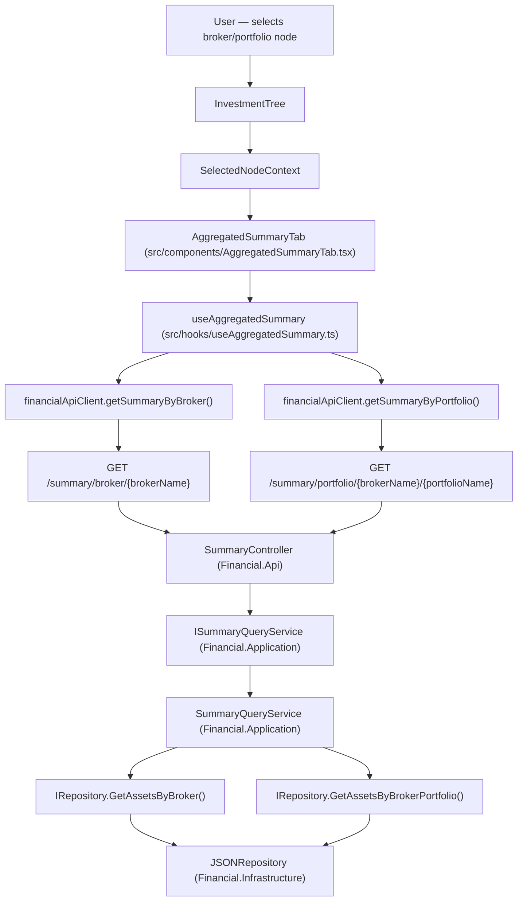

# Spec: F04 — Summary Tab — Broker/Portfolio Aggregated View

## 1. Technical Overview

**What:** Replace the `"Summary — coming in F04"` placeholder in `DetailPanel.tsx` with an aggregated financial summary for broker and portfolio nodes in the Portfolio Navigator. Introduces two new backend GET endpoints, a new Application-layer query service and DTO, a new frontend hook, a new component, and updates `DetailPanel.tsx` to render the correct content per node type.

**Why:** F02 provides selected node context (broker or portfolio), but `DetailPanel.tsx` currently renders a static placeholder for non-asset selections. F04 closes this gap by adding two aggregated summary endpoints that sum transactions and credits across all active assets within scope, and renders the three colour-coded totals (Total Bought, Total Sold, Total Credits) matching the WPF reference application's summary view at broker and portfolio level. The Transactions tab also requires its own static message for non-asset selections; this message is defined in F04 Capabilities and is included here so the tab is never blank.

**Scope:**

Included:
- `AggregatedSummaryDTO` in the Application layer
- `ISummaryQueryService` interface with `GetBrokerSummary` and `GetPortfolioSummary` methods
- `SummaryQueryService` implementation that aggregates totals from active assets only
- `SummaryController` with two GET endpoints under the `/summary` route prefix
- DI singleton registration in `ApplicationServiceCollectionExtensions`
- `AggregatedSummaryDto` TypeScript interface in `types.ts`
- `getSummaryByBroker` and `getSummaryByPortfolio` methods in `financialApiClient.ts`
- `useAggregatedSummary` hook managing fetch, loading, error, and retry state
- `AggregatedSummaryTab` component and co-located CSS
- `DetailPanel.tsx` updated to render `AggregatedSummaryTab` in the Summary tab for Broker and Portfolio nodes, and to show the static Transactions message for non-asset selections

Excluded:
- Current Value section at aggregate level (requires fetching all asset prices — not applicable per PRD)
- Full Transactions tab functionality for assets (F05)

---

## 2. Architecture Impact

**Affected components:**



---

## 3. Technical Decisions

| Decision | Chosen Approach | Alternative Considered | Trade-off |
|----------|----------------|----------------------|-----------|
| New service interface vs. extending `ICreditQueryService` | New `ISummaryQueryService` | Add summary methods to `ICreditQueryService` | Follows ISP and SRP; `ICreditQueryService` returns credit lists, not aggregate totals — mixing the two would muddy both interfaces |
| Active-asset filtering | Filter to `asset.Active` only, consistent with `CreditQueryService` | Include inactive assets | Acceptance criterion requires `totalCredits` to match `GET /credits/broker/{brokerName}`, which already filters by `Active`; applying the same filter to Buy and Sell sums yields internally consistent totals |
| Single shared DTO for both endpoints | `AggregatedSummaryDTO` used by both broker and portfolio responses | Separate `BrokerSummaryDTO` / `PortfolioSummaryDTO` | The response shape is identical (`totalBought`, `totalSold`, `totalCredits`); a shared DTO eliminates duplication without loss of clarity |
| Dedicated `SummaryController` vs. adding to an existing controller | New `SummaryController` under `/summary` route prefix | Extend `NavigationController` or `CreditsController` | These endpoints have no operational overlap with navigation tree construction or credit mutations; a dedicated controller mirrors the existing single-responsibility pattern of `CreditsController` |

---

## 4. Component Overview

### Frontend

| File Path | New/Modified | Purpose | Key Responsibilities |
|-----------|--------------|---------|---------------------|
| `Financial.Web/src/api/types.ts` | Modified | New response type | Add `AggregatedSummaryDto` interface with `totalBought`, `totalSold`, `totalCredits` as `number` |
| `Financial.Web/src/api/financialApiClient.ts` | Modified | Add summary fetch methods | Add `getSummaryByBroker(brokerName: string)` and `getSummaryByPortfolio(brokerName: string, portfolioName: string)` both returning `Promise<AggregatedSummaryDto>`; follow existing `request<T>()` pattern |
| `Financial.Web/src/hooks/useAggregatedSummary.ts` | New | Aggregated summary data loading hook | Read `selectedNode` from `SelectedNodeContext`; route to `getSummaryByBroker` or `getSummaryByPortfolio` based on `nodeType`; manage `summary`, `isLoading`, `error`, and `retryCount` state via `useReducer`; reset on node change; skip fetch when `nodeType === 'Asset'` or no node selected |
| `Financial.Web/src/components/AggregatedSummaryTab.tsx` | New | Summary tab renderer for broker and portfolio nodes | Consume `useAggregatedSummary`; show `LoadingState` while loading; show `ErrorState` with Retry on error; render Total Bought (green), Total Sold (red), Total Credits (blue) as N2 formatted values |
| `Financial.Web/src/components/AggregatedSummaryTab.css` | New | Component styles | Field label/value layout matching `AssetSummaryTab.css`; reuse `.value--green`, `.value--red`, `.value--blue` CSS class semantics |
| `Financial.Web/src/components/DetailPanel.tsx` | Modified | Route Summary and Transactions tabs per node type | Import `AggregatedSummaryTab`; render it in the `summary` branch when `nodeType` is `Broker` or `Portfolio`; update the `transactions` branch to show `"Transactions are only available for individual assets"` for non-asset nodes (retaining the coming-in-F05 placeholder for asset nodes) |

### Backend

| File Path | New/Modified | Purpose | Key Responsibilities |
|-----------|--------------|---------|---------------------|
| `Financial.Application/DTOs/AggregatedSummaryDTO.cs` | New | Response DTO | Expose `TotalBought`, `TotalSold`, `TotalCredits` as `decimal` properties |
| `Financial.Application/Interfaces/ISummaryQueryService.cs` | New | Service abstraction | Declare `GetBrokerSummary(string brokerName)` and `GetPortfolioSummary(string brokerName, string portfolioName)` returning `AggregatedSummaryDTO` |
| `Financial.Application/Services/SummaryQueryService.cs` | New | Aggregation logic | Accept `IRepository` via constructor; guard against null/whitespace inputs and return zero-filled DTO; call `GetAssetsByBroker` or `GetAssetsByBrokerPortfolio`; filter to `asset.Active`; sum Buy `TotalPrice`, Sell `TotalPrice`, and credit `Value`; return `AggregatedSummaryDTO` |
| `Financial.Application/DependencyInjection/ApplicationServiceCollectionExtensions.cs` | Modified | Register new service | Add `services.AddSingleton<ISummaryQueryService, SummaryQueryService>()` |
| `Financial.Api/Controllers/SummaryController.cs` | New | REST endpoints | Inject `ISummaryQueryService`; expose `GET broker/{brokerName}` and `GET portfolio/{brokerName}/{portfolioName}` under `[Route("summary")]`; return `Ok(dto)` for both (zeros are a valid response when broker/portfolio is empty) |

---

## 5. API Contracts

### GET Broker Aggregated Summary

- **Method:** GET
- **Path:** `/api/v1/financial/summary/broker/{brokerName}`
- **Authentication:** None

**Path Parameters:**

| Parameter | Type | Required | Description |
|-----------|------|----------|-------------|
| `brokerName` | `string` | Yes | Exact broker name |

**Response (200 OK):**

| Field | Type | Description |
|-------|------|-------------|
| `totalBought` | `decimal` | Sum of `TotalPrice` for all Buy transactions across active assets in the broker |
| `totalSold` | `decimal` | Sum of `TotalPrice` for all Sell transactions across active assets in the broker |
| `totalCredits` | `decimal` | Sum of `Value` for all credits across active assets in the broker |

**Response Example:**
```json
{
  "totalBought": 15420.50,
  "totalSold": 3200.00,
  "totalCredits": 842.30
}
```

**Error Codes:**

| HTTP Status | Condition |
|-------------|-----------|
| 200 | Always returned, including when broker has no active assets (all fields return `0.00`) |
| 400 | `brokerName` is null or whitespace |

---

### GET Portfolio Aggregated Summary

- **Method:** GET
- **Path:** `/api/v1/financial/summary/portfolio/{brokerName}/{portfolioName}`
- **Authentication:** None

**Path Parameters:**

| Parameter | Type | Required | Description |
|-----------|------|----------|-------------|
| `brokerName` | `string` | Yes | Exact broker name |
| `portfolioName` | `string` | Yes | Exact portfolio name within the broker |

**Response (200 OK):**

| Field | Type | Description |
|-------|------|-------------|
| `totalBought` | `decimal` | Sum of `TotalPrice` for all Buy transactions across active assets in the portfolio |
| `totalSold` | `decimal` | Sum of `TotalPrice` for all Sell transactions across active assets in the portfolio |
| `totalCredits` | `decimal` | Sum of `Value` for all credits across active assets in the portfolio |

**Response Example:**
```json
{
  "totalBought": 8750.25,
  "totalSold": 1100.00,
  "totalCredits": 415.60
}
```

**Error Codes:**

| HTTP Status | Condition |
|-------------|-----------|
| 200 | Always returned, including when portfolio has no active assets (all fields return `0.00`) |
| 400 | Either path parameter is null or whitespace |

---

## 6. Data Model

Not applicable — no database or persistence schema changes. Totals are computed on-the-fly from the in-memory JSON-backed repository via existing `IRepository` methods.

---

## 7. Testing Strategy

### Test file structure

| Test File | Test Type | Target | Coverage Goal |
|-----------|-----------|--------|---------------|
| `Financial.Application.Tests/Services/SummaryQueryServiceTests.cs` | Unit | `SummaryQueryService` | Aggregation logic, empty collections, active-only filtering |
| `Financial.Api.Tests/Controllers/SummaryControllerTests.cs` | Unit | `SummaryController` | HTTP response codes and DTO passthrough |
| `Financial.Web/src/hooks/useAggregatedSummary.test.ts` | Unit | `useAggregatedSummary` | Fetch dispatch, node-type routing, error and retry states |
| `Financial.Web/src/components/AggregatedSummaryTab.test.tsx` | Unit | `AggregatedSummaryTab` | Rendering, colour classes, loading/error states |
| `Financial.Web/src/components/DetailPanel.test.tsx` | Integration | `DetailPanel` + `AggregatedSummaryTab` | Summary and Transactions tab routing per node type |

### SummaryQueryServiceTests.cs

| Test Function | Description | Assertions |
|---------------|-------------|------------|
| `GetBrokerSummary_ReturnsSumOfBuyTransactions` | Broker with multiple assets with Buy transactions | `TotalBought` equals sum of Buy `TotalPrice` values across active assets |
| `GetBrokerSummary_ReturnsSumOfSellTransactions` | Broker with Sell transactions | `TotalSold` equals sum of Sell `TotalPrice` values |
| `GetBrokerSummary_ReturnsSumOfCredits` | Broker with credits | `TotalCredits` equals sum of all credit `Value` values |
| `GetBrokerSummary_ExcludesInactiveAssets` | Broker with one active and one inactive asset | Totals exclude transactions and credits of the inactive asset |
| `GetBrokerSummary_ReturnsZerosForBrokerWithNoActiveAssets` | Broker exists but has no active assets | All three fields are `0.00` |
| `GetBrokerSummary_ReturnsZerosOnNullOrWhitespaceBrokerName` | Null or whitespace input | Returns DTO with all zeros without throwing |
| `GetPortfolioSummary_ReturnsSumOfBuyTransactions` | Portfolio with Buy transactions | `TotalBought` correct |
| `GetPortfolioSummary_ReturnsSumOfSellTransactions` | Portfolio with Sell transactions | `TotalSold` correct |
| `GetPortfolioSummary_ReturnsSumOfCredits` | Portfolio with credits | `TotalCredits` correct |
| `GetPortfolioSummary_ExcludesInactiveAssets` | Portfolio with mixed active/inactive assets | Inactive asset excluded from all three totals |
| `GetPortfolioSummary_ReturnsZerosForPortfolioWithNoActiveAssets` | Portfolio has no active assets | All fields are `0.00` |
| `GetPortfolioSummary_ReturnsZerosOnNullOrWhitespaceInput` | Null or whitespace broker/portfolio name | Returns zeros without throwing |

### SummaryControllerTests.cs

| Test Function | Description | Assertions |
|---------------|-------------|------------|
| `GetBrokerSummary_Returns200WithDto` | Service returns a valid DTO | HTTP 200; response body matches the DTO returned by the service |
| `GetPortfolioSummary_Returns200WithDto` | Service returns a valid DTO | HTTP 200; response body matches the DTO returned by the service |

### useAggregatedSummary.test.ts

| Test Function | Description | Assertions |
|---------------|-------------|------------|
| `calls_getSummaryByBroker_on_broker_node_selection` | Broker node set in context | `getSummaryByBroker` called with the correct `brokerName` |
| `calls_getSummaryByPortfolio_on_portfolio_node_selection` | Portfolio node set in context | `getSummaryByPortfolio` called with the correct `brokerName` and `portfolioName` |
| `sets_isLoading_true_while_fetch_is_in_progress` | Fetch not yet resolved | `isLoading` is `true` before the promise settles |
| `populates_summary_on_successful_fetch` | API resolves with a DTO | `summary` contains correct `totalBought`, `totalSold`, `totalCredits` |
| `sets_error_on_fetch_failure` | API rejects | `error` is populated; `summary` is `null` |
| `resets_state_on_node_change` | Node changed while fetch is pending | Previous summary cleared; new fetch initiated |
| `retry_re_triggers_fetch` | Calling `retry()` after an error | The API method is called a second time |
| `does_not_fetch_when_asset_node_selected` | Asset node in context | Neither `getSummaryByBroker` nor `getSummaryByPortfolio` is called |
| `does_not_fetch_when_no_node_selected` | `selectedNode` is `null` | No API call made; `summary` remains `null` |

### AggregatedSummaryTab.test.tsx

| Test Function | Description | Assertions |
|---------------|-------------|------------|
| `renders_loading_indicator_while_data_loads` | `isLoading` is `true` | `LoadingState` component is visible |
| `renders_error_state_with_retry_on_failure` | `error` is populated | Error message and Retry button are rendered |
| `renders_total_bought_in_green` | `summary.totalBought` provided | TotalBought element carries the green colour class |
| `renders_total_sold_in_red` | `summary.totalSold` provided | TotalSold element carries the red colour class |
| `renders_total_credits_in_blue` | `summary.totalCredits` provided | TotalCredits element carries the blue colour class |
| `renders_values_formatted_to_two_decimal_places` | Values with more than two decimal places | All three fields display N2 formatted text |
| `renders_zero_values_without_error` | All three values are `0.00` | Fields render without exception or omission |

### DetailPanel.test.tsx (additions)

| Test Function | Description | Assertions |
|---------------|-------------|------------|
| `renders_aggregated_summary_tab_for_broker_node` | Broker node in context, Summary tab active | `AggregatedSummaryTab` output is visible |
| `renders_aggregated_summary_tab_for_portfolio_node` | Portfolio node in context, Summary tab active | `AggregatedSummaryTab` output is visible |
| `renders_asset_summary_tab_for_asset_node_regression` | Asset node in context | `AssetSummaryTab` rendered; `AggregatedSummaryTab` absent |
| `renders_transactions_message_for_broker_node` | Broker node, Transactions tab active | Static message "Transactions are only available for individual assets" visible |
| `renders_transactions_message_for_portfolio_node` | Portfolio node, Transactions tab active | Same static message visible |

### Acceptance test mapping (PRD Section 9 — F04)

| Acceptance Criterion | Covered By |
|----------------------|------------|
| `GET /summary/broker/{brokerName}` returns `totalBought`, `totalSold`, `totalCredits` as decimals | `SummaryControllerTests: GetBrokerSummary_Returns200WithDto` |
| `GET /summary/portfolio/{brokerName}/{portfolioName}` returns same three fields | `SummaryControllerTests: GetPortfolioSummary_Returns200WithDto` |
| Selecting broker populates Summary tab with three colour-coded totals | `AggregatedSummaryTab: renders_total_bought_in_green / _sold_in_red / _credits_in_blue` + `DetailPanel: renders_aggregated_summary_tab_for_broker_node` |
| Selecting portfolio populates Summary tab with three colour-coded totals | Same component tests + `DetailPanel: renders_aggregated_summary_tab_for_portfolio_node` |
| `totalCredits` matches sum from `GET /credits/broker/{brokerName}` | `SummaryQueryServiceTests: GetBrokerSummary_ExcludesInactiveAssets` + `GetBrokerSummary_ReturnsSumOfCredits` (active-only filter aligns both endpoints) |
| Transactions tab shows static message for broker/portfolio | `DetailPanel: renders_transactions_message_for_broker_node / _portfolio_node` |
| No Current Value section in Summary tab for broker/portfolio | `AggregatedSummaryTab` renders only three total fields — no current-value output |

### Cross-feature integration tests (PRD Section 9)

| Integration Criterion | Covered By |
|-----------------------|------------|
| Selecting broker node in F02 passes `brokerName` to F04; summary uses the exact broker name | `useAggregatedSummary: calls_getSummaryByBroker_on_broker_node_selection` |
| Selecting portfolio node in F02 passes `brokerName` and `portfolioName` to F04; summary uses both | `useAggregatedSummary: calls_getSummaryByPortfolio_on_portfolio_node_selection` |
