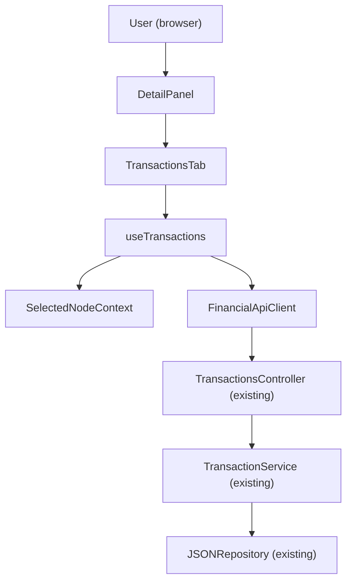

# F05 — Portfolio Navigator: Transactions Tab

## 1. Technical Overview

F05 implements the Transactions tab within the Portfolio Navigator's right-panel detail view. When an asset node is selected, the tab renders a sortable transaction history table and an inline CRUD form. When a broker or portfolio node is selected, it renders a static informational message. The Credits tab (F06) will follow the same structural pattern.

All backend infrastructure is already in place: `TransactionsController`, `TransactionService`, `AssetServiceHelper`, the `Transaction` domain entity, and all request/response DTOs exist and are wired up. The `financialApiClient` already exposes `addTransaction`, `updateTransaction`, and `deleteTransaction`. This feature is therefore a pure frontend addition — no backend changes are required.

The `TransactionsTab` component follows the same self-contained hook pattern established by `AssetSummaryTab` (F03) and `AggregatedSummaryTab` (F04): a dedicated `useTransactions` hook manages all data-fetching and mutation state via `useReducer`, and the component renders from that hook's output. The tab replaces the placeholder currently in `DetailPanel.tsx`.

**Scope — Included:**
- `useTransactions` hook: fetches `AssetDetailsDto` on asset selection, manages inline form state and CRUD mutations
- `TransactionsTab` component: table of transactions + inline add/edit form
- Loading, error, and empty states; non-asset placeholder message
- `DetailPanel.tsx` updated to import and render `TransactionsTab`

**Scope — Excluded:**
- Shared cross-tab asset state (Summary tab may show stale totals after a transaction mutation; this is acceptable at MVP and matches F03/F04 precedent)
- Backend changes (all endpoints already exist)

---

## 2. Architecture Impact

**Affected components:**



**Data flow — read path:** On asset node selection, `useTransactions` calls `getAssetDetails` and stores the returned `AssetDetailsDto`. The `transactions` array is sorted client-side by date descending and passed to the table renderer.

**Data flow — write path:** User submits the inline form → `useTransactions` validates and calls `addTransaction` or `updateTransaction` (or `deleteTransaction`) → on success the returned updated `AssetDetailsDto` replaces the current asset state → form resets and the table re-renders with fresh data.

---

## 3. Technical Decisions

| Decision | Chosen Approach | Alternative Considered | Trade-off |
|----------|----------------|----------------------|-----------|
| Data fetching | `useTransactions` fetches `AssetDetailsDto` independently, following the same pattern as `useAssetSummary` | Shared asset context providing `AssetDetailsDto` to all tabs | Independent hook keeps each tab self-contained and avoids coupling. Accept that Summary tab may show stale totals until the user re-selects the node. This matches F03/F04 precedent. |
| Form state location | Form state (visibility, field values, saving flag, error) managed inside `useTransactions` alongside asset state | Separate form hook or component-local state | Single hook owns all tab state, consistent with `useAssetSummary` which also owns derived/computed state. |
| Date input format | Store form date as `yyyy-MM-dd` string (native `<input type="date">` format); convert from ISO on edit load; send `yyyy-MM-dd` to API | Parse to `Date` object in state | Avoids double conversion; the API backend accepts `yyyy-MM-dd` date strings. |
| Numeric form fields as strings | Store `formQuantity`, `formUnitPrice`, `formFees` as strings during editing | Store as numbers | Prevents loss of partial input while the user is typing (e.g., `"1."` would become `1` prematurely). Convert to number only on submit. |

---

## 4. Component Overview

**Frontend:**

| File Path | New/Modified | Purpose | Key Responsibilities |
|-----------|--------------|---------|---------------------|
| `Financial.Web/src/hooks/useTransactions.ts` | New | All data and mutation state for the Transactions tab | Fetch asset details on node change, manage form visibility and field values, execute add/update/delete mutations, sort transactions by date |
| `Financial.Web/src/components/TransactionsTab.tsx` | New | Transactions tab UI | Render loading/error guards, non-asset placeholder, transaction table with action icons, inline add/edit form |
| `Financial.Web/src/components/TransactionsTab.css` | New | Scoped styles for the tab | BEM layout for toolbar, form, table, type colour modifiers, right-aligned amounts, error messages |
| `Financial.Web/src/components/DetailPanel.tsx` | Modified | Tab container | Replace transactions placeholder with `<TransactionsTab />`; add import |
| `Financial.Web/src/hooks/useTransactions.test.ts` | New | Unit tests for `useTransactions` | Fetch lifecycle, retry, CRUD mutations, form state transitions |
| `Financial.Web/src/components/__tests__/TransactionsTab.test.tsx` | New | Unit tests for `TransactionsTab` | Loading/error/placeholder rendering, table columns, form interaction, action icons |

**Backend:** No changes required.

---

## 5. API Contracts

All endpoints already exist. Documented here for implementation reference.

---

### Read — Asset Details (transactions included)

- **Method:** GET
- **Path:** `/api/v1/financial/assets/{brokerName}/{portfolioName}/{assetName}`

**Response (200):**

| Field | Type | Description |
|-------|------|-------------|
| `transactions` | `TransactionDto[]` | Full transaction list for the asset |
| `transactions[].id` | `string (UUID)` | Transaction identifier |
| `transactions[].date` | `string (ISO 8601)` | Transaction date |
| `transactions[].type` | `string` | `"Buy"` or `"Sell"` |
| `transactions[].quantity` | `number` | Number of units |
| `transactions[].unitPrice` | `number` | Price per unit |
| `transactions[].fees` | `number` | Brokerage fees |
| `transactions[].totalPrice` | `number` | `unitPrice × quantity + fees` (computed by backend) |

**Response Example:**
```json
{
  "name": "KLBN4",
  "transactions": [
    {
      "id": "3fa85f64-5717-4562-b3fc-2c963f66afa6",
      "date": "2024-03-15T00:00:00",
      "type": "Buy",
      "quantity": 100,
      "unitPrice": 4.20,
      "fees": 0.50,
      "totalPrice": 420.50
    }
  ]
}
```

---

### Create Transaction

- **Method:** POST
- **Path:** `/api/v1/financial/transactions`

**Request:**

| Field | Type | Required | Validation | Description |
|-------|------|----------|------------|-------------|
| `brokerName` | `string` | Yes | Non-empty | Broker identifier |
| `portfolioName` | `string` | Yes | Non-empty | Portfolio identifier |
| `assetName` | `string` | Yes | Non-empty | Asset identifier |
| `date` | `string` | Yes | ISO date | Transaction date (`yyyy-MM-dd`) |
| `type` | `string` | Yes | `"Buy"` or `"Sell"` | Transaction direction |
| `quantity` | `number` | Yes | > 0 | Number of units |
| `unitPrice` | `number` | Yes | > 0 | Price per unit |
| `fees` | `number` | Yes | ≥ 0 | Brokerage fees; `0` when not applicable |

**Request Example:**
```json
{
  "brokerName": "XPI",
  "portfolioName": "Acoes",
  "assetName": "KLBN4",
  "date": "2024-03-15",
  "type": "Buy",
  "quantity": 100,
  "unitPrice": 4.20,
  "fees": 0.50
}
```

**Response (200):** Updated `AssetDetailsDto` (same shape as GET above)

**Error Codes:**

| HTTP Status | Description |
|-------------|-------------|
| 400 | Null request, unknown type string, or missing required fields |

---

### Update Transaction

- **Method:** PUT
- **Path:** `/api/v1/financial/transactions`

**Request:** Same as Create, plus `id` (UUID of the transaction to update).

**Request Example:**
```json
{
  "brokerName": "XPI",
  "portfolioName": "Acoes",
  "assetName": "KLBN4",
  "id": "3fa85f64-5717-4562-b3fc-2c963f66afa6",
  "date": "2024-03-15",
  "type": "Sell",
  "quantity": 50,
  "unitPrice": 5.00,
  "fees": 1.00
}
```

**Response (200):** Updated `AssetDetailsDto`

**Error Codes:**

| HTTP Status | Description |
|-------------|-------------|
| 400 | Null request, transaction ID not found, or unknown type |

---

### Delete Transaction

- **Method:** DELETE
- **Path:** `/api/v1/financial/transactions`

**Request:**

| Field | Type | Required | Description |
|-------|------|----------|-------------|
| `brokerName` | `string` | Yes | Broker identifier |
| `portfolioName` | `string` | Yes | Portfolio identifier |
| `assetName` | `string` | Yes | Asset identifier |
| `id` | `string (UUID)` | Yes | Transaction to delete |

**Request Example:**
```json
{
  "brokerName": "XPI",
  "portfolioName": "Acoes",
  "assetName": "KLBN4",
  "id": "3fa85f64-5717-4562-b3fc-2c963f66afa6"
}
```

**Response (200):** Updated `AssetDetailsDto` (transaction removed)

**Error Codes:**

| HTTP Status | Description |
|-------------|-------------|
| 400 | Null request or transaction ID not found |

---

## 6. Data Model

No backend schema changes. All entities, DTOs, and repository methods are already implemented.

**Existing types used by this feature (TypeScript, `Financial.Web/src/api/types.ts`):**

| Type | Description |
|------|-------------|
| `TransactionDto` | Read model: `id`, `date`, `type`, `quantity`, `unitPrice`, `fees`, `totalPrice` |
| `TransactionCreateDto` | Write model for POST: all fields except `id` |
| `TransactionUpdateDto` | Write model for PUT: all fields including `id` |
| `TransactionDeleteDto` | Write model for DELETE: `brokerName`, `portfolioName`, `assetName`, `id` |
| `AssetDetailsDto` | Contains `transactions: TransactionDto[]`; returned by all mutation endpoints |

---

## 7. Testing Strategy

**Test File Structure:**

| Test File | Test Type | Target | Coverage Goal |
|-----------|-----------|--------|---------------|
| `Financial.Web/src/hooks/useTransactions.test.ts` | Unit | `useTransactions` hook | Fetch lifecycle, all CRUD mutations, form state |
| `Financial.Web/src/components/__tests__/TransactionsTab.test.tsx` | Unit | `TransactionsTab` component | All render states, table formatting, form interaction |

---

### `useTransactions.test.ts`

Follow the pattern from `useAssetSummary.test.ts`: mock `createFinancialApiClient`, create a context wrapper with `SelectedNodeProvider`, and use `renderHook` + `act` + `waitFor`.

| Test Function | Description | Assertions |
|---------------|-------------|------------|
| `returns_initial_empty_state` | Hook called with no node | `isLoading: false`, `asset: null`, `error: null`, `transactions: []`, `isFormVisible: false` |
| `fetches_asset_details_on_asset_selection` | Asset node set in context | `getAssetDetails` called with correct broker/portfolio/asset; `isLoading` transitions true→false; `asset` populated |
| `resets_state_when_non_asset_node_selected` | Portfolio node set after asset | `asset` set to null; `getAssetDetails` not called |
| `increments_retry_and_refetches_on_retry` | `retry()` called after error | `getAssetDetails` called a second time |
| `sorts_transactions_by_date_descending` | Asset with multiple transactions returned | `transactions[0].date` is most recent |
| `show_new_form_opens_blank_form` | `showNewForm()` called | `isFormVisible: true`, `editingId: null`, fields at defaults |
| `show_edit_form_populates_fields` | `showEditForm(transactionDto)` called | `isFormVisible: true`, `editingId` set, `formDate` in `yyyy-MM-dd` format, fields match transaction values |
| `cancel_form_hides_form_and_resets_fields` | `cancelForm()` after `showNewForm()` | `isFormVisible: false`, fields cleared |
| `save_new_transaction_calls_add_and_updates_asset` | Valid form → `saveForm()` | `addTransaction` called with correct DTO; on success `asset` updated with returned DTO; `isFormVisible: false` |
| `save_edit_transaction_calls_update` | Form pre-filled from edit → `saveForm()` | `updateTransaction` called with `id`; asset updated |
| `save_sets_error_on_api_failure` | `addTransaction` rejects → `saveForm()` | `saveError` non-null; `isFormVisible` remains true; `isSaving: false` |
| `save_defaults_fees_to_zero_when_blank` | `formFees` is `''` → `saveForm()` | `addTransaction` called with `fees: 0` |
| `save_validation_error_when_required_fields_missing` | `formDate` blank → `saveForm()` | `saveError` set; `addTransaction` not called |
| `delete_transaction_calls_api_and_updates_asset` | `deleteTransaction(id)` confirmed | `deleteTransaction` called with correct DTO; `asset` updated |
| `delete_failure_sets_delete_error` | `deleteTransaction` API rejects | `deleteError` non-null; asset unchanged |

---

### `TransactionsTab.test.tsx`

Follow the pattern from `AssetSummaryTab.test.tsx`: mock `useTransactions` at the module level and provide override helper.

| Test Function | Description | Assertions |
|---------------|-------------|------------|
| `renders_loading_state` | `isLoading: true` | `<LoadingState>` rendered |
| `renders_error_state_with_retry` | `error: 'msg'` | `<ErrorState>` rendered with message and retry callback |
| `renders_placeholder_for_non_asset` | `nodeType !== 'Asset'` | "Transactions are only available for individual assets" visible |
| `renders_table_with_correct_columns` | Asset with transactions | Columns: Date, Type, Quantity, Unit Price, Fees, Total |
| `renders_date_in_dd_MM_yyyy_format` | Transaction with date `"2024-03-15T00:00:00"` | Cell shows `15/03/2024` |
| `renders_buy_type_in_green_bold` | Buy transaction | Type cell has `transactions-tab__type--buy` class |
| `renders_sell_type_in_red_bold` | Sell transaction | Type cell has `transactions-tab__type--sell` class |
| `renders_quantity_with_8_decimal_places` | Quantity `100` | Formatted as N8 |
| `renders_total_in_bold` | Transaction with totalPrice | Total cell has bold class |
| `new_button_calls_show_new_form` | Click New | `showNewForm` called |
| `renders_form_when_form_visible` | `isFormVisible: true` | Form fields rendered; title "New transaction" |
| `renders_edit_transaction_title_when_editing` | `editingId` non-null | Form title "Edit transaction" |
| `save_button_disabled_while_saving` | `isSaving: true` | Save button `disabled`; label "Saving..." |
| `edit_icon_calls_show_edit_form` | Click edit icon on row | `showEditForm` called with that transaction |
| `delete_icon_calls_delete_transaction` | Click delete icon on row | `deleteTransaction` called with transaction id |
| `renders_save_error_below_form` | `saveError: 'Failed'` with `isFormVisible: true` | Error message visible below form |
| `renders_delete_error_below_table` | `deleteError: 'Failed'` | Error message visible below table |
| `empty_table_renders_no_rows` | `transactions: []` | Table body has no data rows |

---

### Formatting Conventions

Utility functions defined locally in `TransactionsTab.tsx`, following `AssetSummaryTab.tsx` conventions:

| Function | Format | Example Input | Example Output |
|----------|--------|---------------|----------------|
| `formatN2(value)` | 2 decimal places | `4.2` | `"4.20"` |
| `formatN8(value)` | 8 decimal places | `100` | `"100.00000000"` |
| `formatDate(iso)` | `dd/MM/yyyy` | `"2024-03-15T00:00:00"` | `"15/03/2024"` |
| `toInputDate(iso)` | `yyyy-MM-dd` | `"2024-03-15T00:00:00"` | `"2024-03-15"` |

---

### Acceptance Criteria Mapping

| AC from PRD §9 | Covered by |
|----------------|-----------|
| Transactions sorted by date descending | `sorts_transactions_by_date_descending` (hook test) |
| Table columns: Date (dd/MM/yyyy), Type, Qty (N8), Unit Price (N2), Fees (N2), Total (N2 bold) | `renders_table_with_correct_columns`, `renders_date_in_dd_MM_yyyy_format`, format tests |
| Buy green bold; Sell red bold | `renders_buy_type_in_green_bold`, `renders_sell_type_in_red_bold` |
| New shows blank form "New transaction" | `new_button_calls_show_new_form`, `renders_form_when_form_visible` |
| POST on save; list refreshes | `save_new_transaction_calls_add_and_updates_asset` |
| Edit icon populates form "Edit transaction" | `edit_icon_calls_show_edit_form`, `renders_edit_transaction_title_when_editing` |
| PUT on save; list refreshes | `save_edit_transaction_calls_update` |
| Delete icon shows `window.confirm` | `delete_icon_calls_delete_transaction` |
| DELETE on confirm; row removed | `delete_transaction_calls_api_and_updates_asset` |
| Save disabled + "Saving..." during submit | `save_button_disabled_while_saving` |
| Validation: Date, Qty, UnitPrice required; Fees defaults to 0 | `save_validation_error_when_required_fields_missing`, `save_defaults_fees_to_zero_when_blank` |
| Cross-feature: F02 passes asset context to F05 | `fetches_asset_details_on_asset_selection` |
