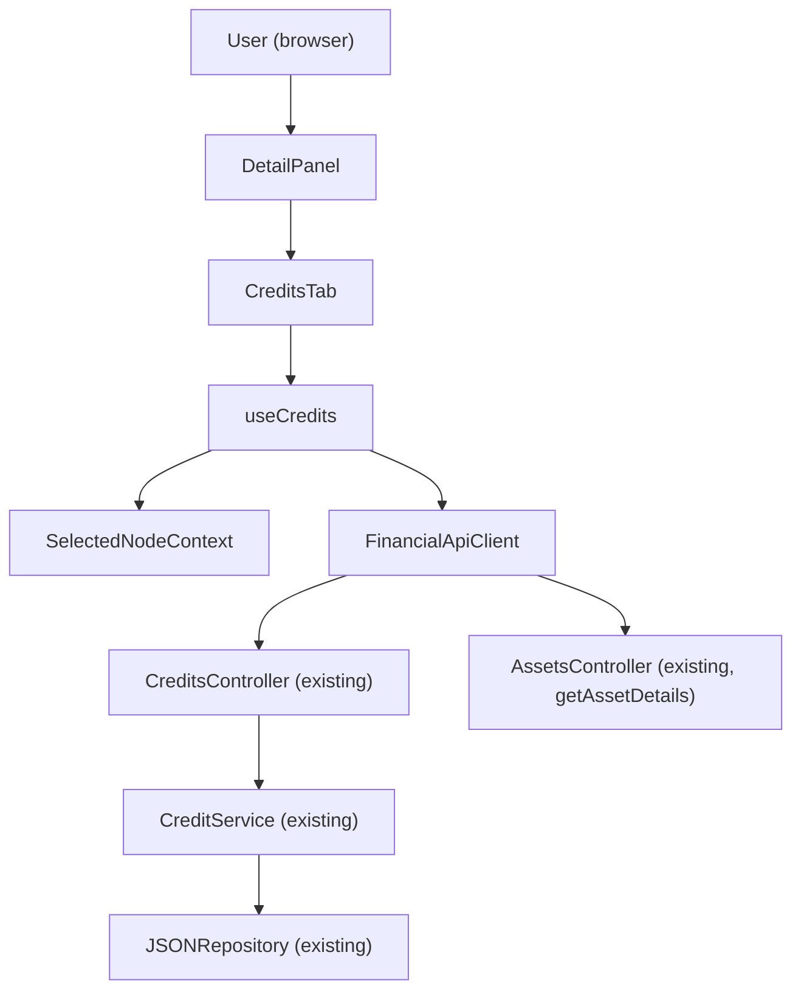

# F06 — Portfolio Navigator: Credits Tab

## 1. Technical Overview

F06 implements the Credits tab within the Portfolio Navigator's right-panel detail view. For asset
selection, the tab renders a horizontal resizable split layout: a credits table with inline CRUD on
the left and a "Credits by Month" bar chart on the right. For broker and portfolio selections, only
the chart is shown (no table, no CRUD).

Time filters (5 options) and chart view mode (Stacked/Grouped) persist per selection key and are
restored when the user navigates back to a previously visited node. Defaults on first visit are
"Last year" + Stacked.

All backend infrastructure is already in place: `CreditsController`, `CreditService`, the `Credit`
domain entity, and all request/response DTOs exist. The `financialApiClient` already exposes
`getCreditsByBroker`, `getCreditsByPortfolio`, `addCredit`, `updateCredit`, and `deleteCredit`.
All TypeScript DTOs (`CreditDto`, `CreditCreateDto`, `CreditUpdateDto`, `CreditDeleteDto`) are
defined in `api/types.ts`. This feature is a pure frontend addition — no backend changes required.

`CreditsTab` follows the self-contained hook pattern established by `TransactionsTab` (F05): a
`useCredits` hook manages all data-fetching, filter/mode persistence, chart data derivation, and
mutation state via `useReducer`. The component renders from the hook's output. The tab replaces
the existing placeholder in `DetailPanel.tsx`.

**Scope — Included:**
- `useCredits` hook: fetches credits for all 3 node types, manages inline form state, CRUD
  mutations, filter/mode state with per-key persistence
- `CreditsTab` component: inner horizontal resizable split (table + chart) for asset; chart-only
  for broker/portfolio
- "Credits by Month" bar chart via Recharts `BarChart`, with Stacked and Grouped modes
- Time filter controls: This month, Last 3 months, Last 6 months, Last year, All (client-side,
  no new API calls on filter/mode change)
- Filter/mode persistence per selection key (Map in hook state, ephemeral — resets on page reload)
- Loading, error, and empty states
- `DetailPanel.tsx` updated to render `<CreditsTab />` in place of the placeholder

**Scope — Excluded:**
- Shared cross-tab asset state (Summary tab totals remain unchanged after credits mutations;
  matches F05 precedent)
- Backend changes (all endpoints already exist)
- Cross-session persistence of filter/mode preferences

---

## 2. Architecture Impact

**Affected components:**



**Data flow — read path (asset):** On asset node selection, `useCredits` calls `getAssetDetails`
and stores `AssetDetailsDto.credits`. Credits are sorted by date descending, filtered client-side
by the active time filter, and aggregated into `MonthBucket[]` for the chart.

**Data flow — read path (broker):** On broker node selection, `useCredits` calls
`getCreditsByBroker(brokerName)` and stores the returned `CreditDto[]`. Same filter + aggregation
pipeline applies.

**Data flow — read path (portfolio):** On portfolio node selection, `useCredits` calls
`getCreditsByPortfolio(brokerName, portfolioName)`. Same pipeline.

**Data flow — write path (asset only):** User submits the inline form → `useCredits` validates
and calls `addCredit`, `updateCredit`, or `deleteCredit` → on success the returned
`AssetDetailsDto.credits` replaces stored credits → form resets, table re-renders.

**Data flow — filter/mode change:** User clicks a filter or mode toggle → hook updates
`selectedFilter`/`selectedMode` in reducer state and saves to the persistence Map keyed by
current selection key → `filteredCredits` and `chartData` recomputed via `useMemo` (no API
calls).

---

## 3. Technical Decisions

| Decision | Chosen Approach | Alternative Considered | Trade-off |
|----------|----------------|----------------------|-----------|
| Node type handling | Single `useCredits` hook handles all 3 node types by branching on node type in the fetch `useEffect` | Separate hooks per node type | Single hook keeps the tab self-contained; branching is limited to the fetch effect and one conditional in the component. |
| Chart library | Recharts `BarChart` (already in `package.json` v3.8.1) | Canvas-based alternatives (Chart.js) | No new dependency; declarative React components integrate cleanly with the existing stack. |
| Derived state | `filteredCredits` and `chartData` computed via `useMemo` in the hook body; not stored in reducer | Storing derived arrays in reducer | Avoids stale derived state and double-dispatch on every filter/mode change. Reducer only holds raw credits and filter/mode preferences. |
| Filter/mode persistence | `Map<string, { filter; mode }>` in `useReducer` state, keyed by selection key | `useRef` with Map | Storing in reducer state makes persistence changes visible to React's reconciler and testable via `renderHook`. |
| Inner horizontal split | Inline resizable split within `CreditsTab` using the same mouse-drag pattern as `SplitPanel` | Reuse `SplitPanel` component directly | Reusing `SplitPanel` would require modifying its internal `MIN_LEFT_WIDTH` constant (shared component concern). An inline split keeps `CreditsTab` self-contained. |
| Recharts in tests | Mock all Recharts components at module level (`vi.mock('recharts', ...)`) | Integration test with real SVG | JSDOM has limited SVG support; mocking Recharts is the standard pattern and sufficient to verify chart is rendered with correct data props. |
| Credit form value field | Store as `string` during editing; parse to `number` on submit | Store as `number` | Consistent with `formQuantity` in F05 — prevents loss of partial input while typing (e.g., `"2."` → `2` prematurely). |

---

## 4. Component Overview

**Frontend:**

| File Path | New/Modified | Purpose | Key Responsibilities |
|-----------|--------------|---------|---------------------|
| `Financial.Web/src/hooks/useCredits.ts` | New | All data, filter/mode, persistence, and mutation state | Fetch credits for all 3 node types; manage filter/mode with persistence Map; compute chart data; execute CRUD mutations; manage inline form state |
| `Financial.Web/src/components/CreditsTab.tsx` | New | Credits tab UI | Loading/error guards; inner resizable split (asset: table + chart; broker/portfolio: chart only); filter buttons; mode toggles; Recharts bar chart |
| `Financial.Web/src/components/CreditsTab.css` | New | Scoped styles | BEM layout for inner split, drag handle, filter/mode toolbar, table with type colour modifiers, N2 bold values, chart container, error messages |
| `Financial.Web/src/components/DetailPanel.tsx` | Modified | Tab container | Replace credits placeholder with `<CreditsTab />`; add import |
| `Financial.Web/src/hooks/useCredits.test.ts` | New | Unit tests for `useCredits` | Fetch lifecycle for all 3 node types; filter/mode state and persistence; CRUD mutations; form state |
| `Financial.Web/src/components/__tests__/CreditsTab.test.tsx` | New | Unit tests for `CreditsTab` | All render states; filter/mode controls; table formatting; chart rendered; form interaction |

**Backend:** No changes required.

---

## 5. API Contracts

All endpoints already exist. Documented here for implementation reference.

---

### Read — Asset Credits (via Asset Details)

- **Method:** GET
- **Path:** `/api/v1/financial/assets/{brokerName}/{portfolioName}/{assetName}`

**Relevant Response Fields:**

| Field | Type | Description |
|-------|------|-------------|
| `credits` | `CreditDto[]` | Full credit list for the asset |
| `credits[].id` | `string (UUID)` | Credit identifier |
| `credits[].date` | `string (ISO 8601)` | Credit date |
| `credits[].type` | `string` | `"Dividend"` or `"Rent"` |
| `credits[].value` | `number` | Credit value |

**Response Example:**
```json
{
  "name": "KLBN4",
  "credits": [
    {
      "id": "3fa85f64-5717-4562-b3fc-2c963f66afa6",
      "date": "2024-03-15T00:00:00",
      "type": "Dividend",
      "value": 120.50
    }
  ]
}
```

---

### Read — Broker Credits

- **Method:** GET
- **Path:** `/api/v1/financial/credits/broker/{brokerName}`

**Response (200):** `CreditDto[]`

**Response Example:**
```json
[
  {
    "id": "3fa85f64-5717-4562-b3fc-2c963f66afa6",
    "date": "2024-03-15T00:00:00",
    "type": "Rent",
    "value": 350.00
  }
]
```

**Error Codes:**

| HTTP Status | Description |
|-------------|-------------|
| 404 | Broker not found |

---

### Read — Portfolio Credits

- **Method:** GET
- **Path:** `/api/v1/financial/credits/portfolio/{brokerName}/{portfolioName}`

**Response (200):** `CreditDto[]`

**Error Codes:**

| HTTP Status | Description |
|-------------|-------------|
| 404 | Broker or portfolio not found |

---

### Create Credit

- **Method:** POST
- **Path:** `/api/v1/financial/credits`

**Request:**

| Field | Type | Required | Validation | Description |
|-------|------|----------|------------|-------------|
| `brokerName` | `string` | Yes | Non-empty | Broker identifier |
| `portfolioName` | `string` | Yes | Non-empty | Portfolio identifier |
| `assetName` | `string` | Yes | Non-empty | Asset identifier |
| `date` | `string` | Yes | `yyyy-MM-dd` | Credit date |
| `type` | `string` | Yes | `"Dividend"` or `"Rent"` | Credit type |
| `value` | `number` | Yes | > 0 | Credit value |

**Request Example:**
```json
{
  "brokerName": "XPI",
  "portfolioName": "Acoes",
  "assetName": "KLBN4",
  "date": "2024-03-15",
  "type": "Dividend",
  "value": 120.50
}
```

**Response (200):** Updated `AssetDetailsDto`

**Error Codes:**

| HTTP Status | Description |
|-------------|-------------|
| 400 | Null request, unknown type, or missing required fields |

---

### Update Credit

- **Method:** PUT
- **Path:** `/api/v1/financial/credits`

**Request:** Same as Create, plus `id` (UUID of the credit to update).

**Request Example:**
```json
{
  "brokerName": "XPI",
  "portfolioName": "Acoes",
  "assetName": "KLBN4",
  "id": "3fa85f64-5717-4562-b3fc-2c963f66afa6",
  "date": "2024-03-15",
  "type": "Rent",
  "value": 200.00
}
```

**Response (200):** Updated `AssetDetailsDto`

**Error Codes:**

| HTTP Status | Description |
|-------------|-------------|
| 400 | Null request, credit ID not found, or unknown type |

---

### Delete Credit

- **Method:** DELETE
- **Path:** `/api/v1/financial/credits`

**Request:**

| Field | Type | Required | Description |
|-------|------|----------|-------------|
| `brokerName` | `string` | Yes | Broker identifier |
| `portfolioName` | `string` | Yes | Portfolio identifier |
| `assetName` | `string` | Yes | Asset identifier |
| `id` | `string (UUID)` | Yes | Credit to delete |

**Request Example:**
```json
{
  "brokerName": "XPI",
  "portfolioName": "Acoes",
  "assetName": "KLBN4",
  "id": "3fa85f64-5717-4562-b3fc-2c963f66afa6"
}
```

**Response (200):** Updated `AssetDetailsDto` (credit removed)

**Error Codes:**

| HTTP Status | Description |
|-------------|-------------|
| 400 | Null request or credit ID not found |

---

## 6. Data Model

No backend schema changes. All entities, DTOs, and repository methods are already implemented.

**Existing types used by this feature (`Financial.Web/src/api/types.ts`):**

| Type | Description |
|------|-------------|
| `CreditDto` | Read model: `id`, `date`, `type`, `value` |
| `CreditCreateDto` | Write model for POST: `brokerName`, `portfolioName`, `assetName`, `date`, `type`, `value` |
| `CreditUpdateDto` | Write model for PUT: all Create fields plus `id` |
| `CreditDeleteDto` | Write model for DELETE: `brokerName`, `portfolioName`, `assetName`, `id` |
| `AssetDetailsDto` | Contains `credits: CreditDto[]`; returned by all CRUD mutation endpoints |

**New TypeScript types introduced in `useCredits.ts`:**

| Type | Description |
|------|-------------|
| `FilterOption` | `'this-month' \| 'last-3-months' \| 'last-6-months' \| 'last-year' \| 'all'` |
| `ViewMode` | `'Stacked' \| 'Grouped'` |
| `CreditType` | `'Dividend' \| 'Rent'` |
| `CreditFormField` | `'formDate' \| 'formType' \| 'formValue'` |
| `MonthBucket` | `{ month: string; Dividend: number; Rent: number }` — one chart data point per MM/yyyy |
| `PersistedPrefs` | `{ filter: FilterOption; mode: ViewMode }` — stored per selection key in the Map |
| `CreditsState` | Full hook state shape |
| `CreditsAction` | Discriminated union of all reducer actions |
| `CreditsData` | Hook return type (state flags + callbacks) |

---

## 7. Testing Strategy

**Test File Structure:**

| Test File | Test Type | Target | Coverage Goal |
|-----------|-----------|--------|---------------|
| `Financial.Web/src/hooks/useCredits.test.ts` | Unit | `useCredits` hook | Fetch lifecycle for all 3 node types; filter/mode state and persistence; CRUD mutations; form state |
| `Financial.Web/src/components/__tests__/CreditsTab.test.tsx` | Unit | `CreditsTab` component | All render states; filter/mode controls; table formatting; chart rendered; form interaction |

---

### `useCredits.test.ts`

Follow the pattern from `useTransactions.test.ts`: mock `createFinancialApiClient`, create a
context wrapper with `SelectedNodeProvider`, use `renderHook` + `act` + `waitFor`.

| Test Function | Description | Assertions |
|---------------|-------------|------------|
| `returns_initial_empty_state` | Hook with no node | `isLoading: false`, `credits: []`, `error: null`, `selectedFilter: 'last-year'`, `selectedMode: 'Stacked'` |
| `fetches_asset_credits_on_asset_selection` | Asset node in context | `getAssetDetails` called; credits from `AssetDetailsDto.credits`; `isLoading` true→false |
| `fetches_broker_credits_on_broker_selection` | Broker node in context | `getCreditsByBroker(brokerName)` called; credits populated |
| `fetches_portfolio_credits_on_portfolio_selection` | Portfolio node in context | `getCreditsByPortfolio(brokerName, portfolioName)` called; credits populated |
| `resets_credits_when_node_is_null` | Node set to null | `credits: []`, `isLoading: false` |
| `increments_retry_and_refetches` | `retry()` after error | Fetch method called a second time |
| `set_filter_updates_selected_filter` | `setFilter('last-3-months')` | `selectedFilter: 'last-3-months'` |
| `set_mode_updates_selected_mode` | `setMode('Grouped')` | `selectedMode: 'Grouped'` |
| `persists_filter_and_mode_per_selection_key` | Set filter for asset A; switch to asset B; return to A | Filter from A restored; B has default |
| `defaults_to_last_year_stacked_on_first_selection` | New node never visited before | `selectedFilter: 'last-year'`, `selectedMode: 'Stacked'` |
| `show_new_form_opens_blank_form` | `showNewForm()` | `isFormVisible: true`, `editingId: null`, `formDate: ''`, `formType: 'Dividend'`, `formValue: ''` |
| `show_edit_form_populates_fields` | `showEditForm(creditDto)` | `isFormVisible: true`, `editingId` set, `formDate` in `yyyy-MM-dd`, fields match credit |
| `cancel_form_hides_form_and_resets` | `cancelForm()` after `showNewForm()` | `isFormVisible: false`, fields cleared |
| `save_new_credit_calls_add_and_updates_asset` | Valid form → `saveForm()` | `addCredit` called with correct DTO; credits updated from `AssetDetailsDto.credits`; `isFormVisible: false` |
| `save_edit_credit_calls_update` | Form pre-filled via edit → `saveForm()` | `updateCredit` called with `id`; credits updated |
| `save_sets_error_on_api_failure` | `addCredit` rejects → `saveForm()` | `saveError` non-null; `isFormVisible` remains true; `isSaving: false` |
| `save_validates_date_required` | `formDate: ''` → `saveForm()` | `saveError` set; `addCredit` not called |
| `save_validates_value_greater_than_zero` | `formValue: '0'` → `saveForm()` | `saveError` set; `addCredit` not called |
| `delete_credit_calls_api_and_updates_asset` | `deleteCredit(id)`, `window.confirm` returns true | API `deleteCredit` called; credits updated |
| `delete_failure_sets_delete_error` | API `deleteCredit` rejects | `deleteError` non-null; credits unchanged |
| `sorts_credits_by_date_descending` | Multiple credits with different dates | `credits[0].date` is most recent |

---

### `CreditsTab.test.tsx`

Follow the pattern from `TransactionsTab.test.tsx`: mock `useCredits` at module level and provide
an override helper. Also mock `recharts` at module level:

```typescript
vi.mock('recharts', () => ({
  BarChart: ({ children }: { children: React.ReactNode }) =>
    <div data-testid="bar-chart">{children}</div>,
  Bar: () => null,
  XAxis: () => null,
  YAxis: () => null,
  CartesianGrid: () => null,
  Tooltip: () => null,
  Legend: () => null,
  ResponsiveContainer: ({ children }: { children: React.ReactNode }) =>
    <div data-testid="responsive-container">{children}</div>,
  LabelList: () => null,
}))
```

| Test Function | Description | Assertions |
|---------------|-------------|------------|
| `renders_loading_state` | `isLoading: true` | `<LoadingState>` rendered |
| `renders_error_state_with_retry` | `error: 'msg'` | `<ErrorState>` rendered with message and retry callback |
| `renders_chart_only_for_broker_node` | Broker node, no error/loading | `data-testid="responsive-container"` present; no table; no New button |
| `renders_chart_only_for_portfolio_node` | Portfolio node | Same as broker |
| `renders_table_and_chart_for_asset_node` | Asset node | Table and `data-testid="responsive-container"` both present |
| `renders_table_columns_date_type_value` | Asset with credits | Columns Date, Type, Value visible |
| `renders_date_in_dd_MM_yyyy_format` | Credit with `date: "2024-03-15T00:00:00"` | Cell shows `15/03/2024` |
| `renders_dividend_type_with_dividend_class` | Dividend credit | Type cell has `credits-tab__type--dividend` class |
| `renders_rent_type_with_rent_class` | Rent credit | Type cell has `credits-tab__type--rent` class |
| `renders_value_in_n2_bold` | Credit with value | Cell shows N2-formatted value with bold class |
| `new_button_present_for_asset_only` | Asset node: New visible; broker/portfolio: not present | |
| `new_button_calls_show_new_form` | Click New | `showNewForm` called |
| `renders_form_when_form_visible` | `isFormVisible: true` | Date, Type, Value inputs rendered |
| `form_title_is_new_credit_when_no_editing_id` | `editingId: null` | Form title "New credit" |
| `form_title_is_edit_credit_when_editing_id_set` | `editingId: 'some-id'` | Form title "Edit credit" |
| `save_button_disabled_while_saving` | `isSaving: true` | Save button `disabled`; label "Saving..." |
| `edit_icon_calls_show_edit_form` | Click edit icon on row | `showEditForm` called with that credit |
| `delete_icon_calls_delete_credit` | Click delete icon on row | `deleteCredit` called with credit id |
| `renders_save_error_below_form` | `saveError: 'Failed'`, `isFormVisible: true` | Error message below form |
| `renders_delete_error_below_table` | `deleteError: 'Failed'` | Error message below table |
| `renders_five_filter_buttons` | Default state | "This month", "Last 3 months", "Last 6 months", "Last year", "All" |
| `active_filter_has_active_class` | `selectedFilter: 'last-year'` | "Last year" button has `--active` modifier |
| `clicking_filter_calls_set_filter` | Click "Last 3 months" | `setFilter('last-3-months')` called |
| `renders_mode_toggles` | Default state | "Stacked" and "Grouped" buttons rendered |
| `active_mode_has_active_class` | `selectedMode: 'Stacked'` | "Stacked" button has `--active` modifier |
| `clicking_mode_calls_set_mode` | Click "Grouped" | `setMode('Grouped')` called |
| `empty_table_renders_no_rows` | `credits: []` | Table body has no data rows |

---

### Formatting Conventions

Utility functions defined locally in `CreditsTab.tsx`, following `TransactionsTab.tsx` conventions:

| Function | Format | Example Input | Example Output |
|----------|--------|---------------|----------------|
| `formatN2(value)` | 2 decimal places | `120.5` | `"120.50"` |
| `formatDate(iso)` | `dd/MM/yyyy` | `"2024-03-15T00:00:00"` | `"15/03/2024"` |
| `toInputDate(iso)` | `yyyy-MM-dd` | `"2024-03-15T00:00:00"` | `"2024-03-15"` |
| `buildMonthKey(date)` | `MM/yyyy` | `new Date("2024-03-15")` | `"03/2024"` |

---

### Acceptance Criteria Mapping

| AC from PRD §9 | Covered by |
|----------------|-----------|
| Asset: table with Date (dd/MM/yyyy), Type, Value (N2 bold) | `renders_table_columns_date_type_value`, `renders_date_in_dd_MM_yyyy_format`, `renders_value_in_n2_bold` |
| New button present (asset only); POST on save; list refreshes | `new_button_present_for_asset_only`, `save_new_credit_calls_add_and_updates_asset` |
| Edit → PUT; Delete → confirm → DELETE | `save_edit_credit_calls_update`, `delete_credit_calls_api_and_updates_asset` |
| Broker/portfolio: chart only (no table/New) | `renders_chart_only_for_broker_node`, `renders_chart_only_for_portfolio_node` |
| X-axis MM/yyyy, chronological | `buildMonthKey` format + chronological sort in `aggregateByMonth` |
| Stacked vs Grouped toggle | `renders_mode_toggles`, `clicking_mode_calls_set_mode` |
| Default: Last year + Stacked | `returns_initial_empty_state`, `defaults_to_last_year_stacked_on_first_selection` |
| Filter controls (5 options) | `renders_five_filter_buttons`, `clicking_filter_calls_set_filter` |
| Persistence: filter/mode restored on re-selection | `persists_filter_and_mode_per_selection_key` |
| Broker chart data: `GET /credits/broker/{brokerName}` | `fetches_broker_credits_on_broker_selection` |
| Portfolio chart data: `GET /credits/portfolio/{b}/{p}` | `fetches_portfolio_credits_on_portfolio_selection` |
| Cross-feature: F02 context passed to F06 | `fetches_asset_credits_on_asset_selection`, `fetches_broker_credits_on_broker_selection` |
