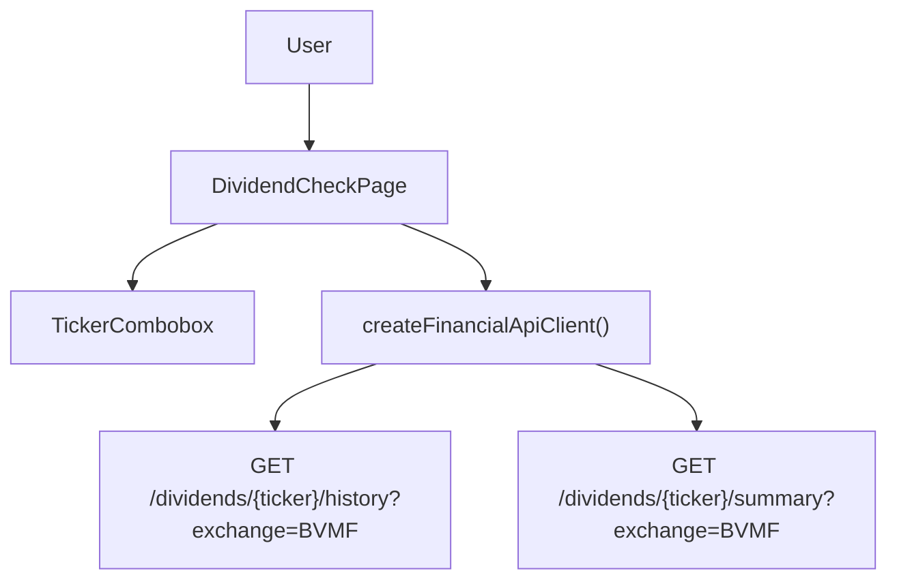

# Technical Specification: F07 — Shares Dividend Check Redesign

## 1. Technical Overview

**What:** Replace `DividendCheckPage`'s plain text ticker and exchange inputs with a grouped editable combobox component (`TickerCombobox`) pre-populated with an 8-ticker watchlist in three named groups. Fix the exchange to `BVMF` (hidden from the user). Redesign the summary card to a vertical four-line layout with colour-coded price max buy, enforce `dd/MM/yyyy` date format in the Dividend History table, and apply explicit descending sorts to both result tables.

**Why:** The current implementation provides no discovery path for supported tickers, exposes an exchange field that has only one valid value, and uses a locale-dependent date formatter. The WPF reference uses a grouped dropdown; achieving parity requires a custom combobox component (no UI library is present in the codebase) and a CSS-driven two-column table layout.

**Scope:**

Included:
- `TickerCombobox` — new controlled combobox component with grouped dropdown, freeform input, keyboard navigation, and outside-click dismissal
- `DividendCheckPage` — rewritten to use `TickerCombobox`, remove exchange input, redesign summary card and table layout
- CSS for both new/modified files
- Unit tests for `TickerCombobox`; updated tests for `DividendCheckPage`

Excluded:
- Backend API changes (existing `/dividends/{ticker}/history` and `/dividends/{ticker}/summary` endpoints are unchanged)
- Watchlist loaded from API or environment config (fixed constant in the page)
- Mobile/responsive design

---

## 2. Architecture Impact

Affected components:



---

## 3. Technical Decisions

| Decision | Chosen Approach | Alternative Considered | Trade-off |
|----------|----------------|----------------------|-----------|
| Combobox implementation | Custom `TickerCombobox` (input + controlled dropdown) | react-select or downshift | No new npm dependency; consistent with codebase no-library pattern; slightly more implementation code |
| Watchlist data location | Constant defined in `DividendCheckPage.tsx` | Separate config/constants file | Watchlist is feature-specific and small; no sharing needed; avoids extra file indirection |
| Date formatting | Manual `dd/MM/yyyy` using `Date` object parts | `toLocaleDateString()` | `toLocaleDateString()` is locale-dependent and does not guarantee the exact format the PRD specifies |
| Error state behaviour | Clear summary and history on failure | Preserve previous results | PRD explicitly states "previous results cleared" on Check failure |

---

## 4. Component Overview

**Frontend:**

| File Path | New/Modified | Purpose | Key Responsibilities |
|-----------|--------------|---------|---------------------|
| `Financial.Web/src/components/TickerCombobox.tsx` | New | Grouped editable combobox | Render grouped dropdown list; accept freeform text input; expose selected value via `onChange` callback; handle keyboard navigation (Arrow Up/Down, Enter, Escape) and outside-click dismissal |
| `Financial.Web/src/components/TickerCombobox.css` | New | Combobox visual styles | Dropdown overlay positioning, group header styling, option hover/active highlight |
| `Financial.Web/src/pages/DividendCheckPage.tsx` | Modified | Dividend check page | Define watchlist constant; orchestrate ticker state; fire simultaneous API calls on Check; render four-line summary card and two-column table layout |
| `Financial.Web/src/pages/DividendCheckPage.css` | New | Page layout styles | Summary card layout, blue average-dividend text, green/red price-max-buy colour rules, two-column table container with independent scroll areas |
| `Financial.Web/src/components/__tests__/TickerCombobox.test.tsx` | New | Unit tests for combobox | All group/option rendering, default value, option click, freeform input, keyboard dismiss, outside-click dismiss |
| `Financial.Web/src/pages/__tests__/DividendCheckPage.test.tsx` | Modified | Page-level integration tests | Check flow, fixed BVMF exchange, summary card content, colour classes, table row order, error clearing |

---

## 5. API Contracts

No new or changed endpoints. Two existing endpoints are consumed unchanged:

**GET /dividends/{ticker}/history?exchange=BVMF**

- Exchange is always `BVMF` (hardcoded; not user-configurable)
- Ticker is trimmed and uppercased before use
- Response: `DividendHistoryItemDto[]` — type defined in `src/api/types.ts` (no changes)

```json
[
  { "type": "Dividend", "date": "2024-06-15T00:00:00Z", "value": 1.23 },
  { "type": "JCP",      "date": "2023-12-10T00:00:00Z", "value": 0.87 }
]
```

**GET /dividends/{ticker}/summary?exchange=BVMF**

- Same exchange and ticker rules
- Response: `DividendSummaryDto` — type defined in `src/api/types.ts` (no changes)

```json
{
  "exchange": "BVMF",
  "ticker": "KLBN4",
  "name": "Klabin SA",
  "currentPrice": 18.50,
  "priceAsOf": "2025-06-30T10:00:00Z",
  "averageDividendLastFiveYears": 1.40,
  "priceMaxBuy": 28.00,
  "discountPercent": 33.93,
  "yearTotals": [
    { "year": 2024, "total": 1.60 },
    { "year": 2023, "total": 1.35 }
  ]
}
```

No changes to `src/api/financialApiClient.ts` or `src/api/types.ts`.

---

## 6. Data Model

Not applicable — frontend-only feature with no persistence layer changes.

---

## 7. Testing Strategy

**Test File Structure:**

| Test File | Test Type | Target | Coverage Goal |
|-----------|-----------|--------|---------------|
| `src/components/__tests__/TickerCombobox.test.tsx` | Unit | `TickerCombobox` | All rendering paths, selection via click, freeform typing, keyboard and outside-click dismissal |
| `src/pages/__tests__/DividendCheckPage.test.tsx` | Unit/Integration | `DividendCheckPage` | Check flow, API call arguments, summary card rendering, colour-coding, table row order, error clearing |

**TickerCombobox.test.tsx — test functions:**

| Test Function | Description | Assertions |
|---------------|-------------|------------|
| `renders all three group labels` | Mount with watchlist groups prop | "Ja possuidas", "Outras Barse", "Outras" all present in DOM |
| `renders all 8 tickers across groups` | Mount with watchlist groups prop | KLBN4, TASA4, TAEE3, UNIP6, CMIG4, TRPL4, BBAS3, CSAN3 all present |
| `displays the initial value in the input` | Mount with `value="KLBN4"` | Input element value is "KLBN4" |
| `clicking an option calls onChange with that ticker` | Click "TASA4" option | `onChange` called with `"TASA4"` |
| `typing into the input calls onChange with typed value` | Type "CXSE3" into input | `onChange` called with `"CXSE3"` |
| `pressing Escape closes the dropdown` | Open dropdown, press Escape | Dropdown options no longer visible in DOM |
| `clicking outside the component closes the dropdown` | Open dropdown, click document body | Dropdown options no longer visible in DOM |

**DividendCheckPage.test.tsx — test functions:**

| Test Function | Description | Assertions |
|---------------|-------------|------------|
| `shows placeholder text before first check` | Render, no interaction | "Select a ticker and click Check" present in DOM |
| `KLBN4 is selected by default on load` | Render | Input value is "KLBN4" |
| `calls API with BVMF exchange and uppercased ticker` | Set ticker to "klbn4", click Check | `getDividendSummary` and `getDividendHistory` both called with `("KLBN4", "BVMF")` |
| `populates summary card after successful check` | Mock both API methods, click Check | Ticker name, current price, average dividend, price max buy, discount % all visible |
| `price max buy line has green class when current price is below max` | `currentPrice=10`, `priceMaxBuy=20` | Green CSS class present on price max buy element |
| `price max buy line has red class when current price is above max` | `currentPrice=25`, `priceMaxBuy=20` | Red CSS class present on price max buy element |
| `dividend history rows are ordered by date descending` | Two history items with different dates | Earlier-in-DOM row has the more recent date |
| `by year rows are ordered by year descending` | `yearTotals` with years 2022 and 2024 | Year 2024 row appears before year 2022 row in DOM |
| `check button shows Checking... and is disabled during fetch` | Mock a never-resolving promise | Button text is "Checking...", button is disabled |
| `clears summary and history on check failure` | First check succeeds, second fails | Summary card absent; previous history absent; error message visible |
| `inline error message shown with re-enabled Check button after failure` | Mock rejection | `role="alert"` element visible; Check button enabled |
| `freeform ticker not in watchlist is sent to API correctly` | Set ticker to "CXSE3", click Check | `getDividendSummary` called with `"CXSE3"` |
