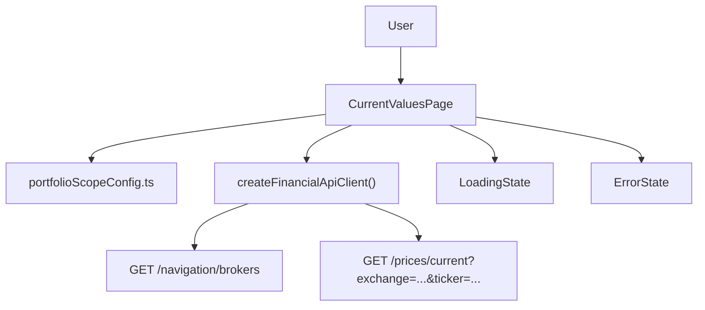

# Technical Specification: F08 — Read Assets Current Values Redesign

## 1. Technical Overview

**What:** Rewrite `CurrentValuesPage` to remove the broker and portfolio filter controls, replace the dynamic scope with a fixed portfolio list (`XPI/Default`, `XPI/Acoes`) loaded from a frontend constants module, remove the "As of" column from the results table (and its supporting state and formatter), change the section heading from "Read Assets Current Values" to "Fetch Current Prices", and introduce a dedicated `CurrentValuesPage.css` for page-specific styles.

**Why:** The existing page diverges from the WPF reference by exposing arbitrary broker/portfolio filter dropdowns and an "As of" column not present in the desktop application. Both features are unused at runtime (the WPF always targets the two fixed portfolios), and they add UI noise. The redesign aligns the web page's scope and presentation to the WPF without any backend changes.

**Scope:**

Included:
- `CurrentValuesPage.tsx` — remove filter state, fixed-scope asset resolution, heading update, "As of" column removal, button alignment with PRD label
- `CurrentValuesPage.css` — new paired CSS file for page layout and Price cell styling
- `src/config/portfolioScopeConfig.ts` — new constants module declaring the fixed `[XPI/Default, XPI/Acoes]` scope
- `CurrentValuesPage.test.tsx` — updated tests reflecting removed filter UI, fixed scope, and absent "As of" column

Excluded:
- Backend API changes (existing `GET /navigation/brokers` and `GET /prices/current` endpoints are unchanged)
- Env-var-driven scope override (scope is a fixed domain constant, not deployment configuration)
- Mobile/responsive design

---

## 2. Architecture Impact



Affected components:

| Component | Change |
|-----------|--------|
| `src/pages/CurrentValuesPage.tsx` | Modified |
| `src/pages/CurrentValuesPage.css` | New |
| `src/config/portfolioScopeConfig.ts` | New |
| `src/pages/__tests__/CurrentValuesPage.test.tsx` | Modified |

---

## 3. Technical Decisions

| Decision | Chosen Approach | Alternative Considered | Trade-off |
|----------|----------------|----------------------|-----------|
| Fixed portfolio scope storage | Named constant in `src/config/portfolioScopeConfig.ts` | Constant inline in `CurrentValuesPage.tsx` | A separate config module reflects the PRD's "loaded from frontend configuration" wording and parallels `appsettings.json` in the WPF; distinguishes domain config from component code |
| `asOf` removal | Remove `asOf` from `PriceResult` interface and delete `formatDateTime` entirely | Keep `asOf` in state but exclude from table rendering | Eliminates dead state and dead utility code; smaller diff to verify |
| CSS placement | New `CurrentValuesPage.css` imported by the page | Add rules to `App.css` | Follows the pattern established by `DividendCheckPage.css`; colocation keeps page-specific rules easy to find and remove later |
| Progress initial text | `Fetching 0 of {total}...` before first asset starts | Empty until first asset begins | Matches existing implementation behaviour; provides immediate feedback to the user that the batch has started |

---

## 4. Component Overview

**Frontend:**

| File Path | New/Modified | Purpose | Key Responsibilities |
|-----------|--------------|---------|---------------------|
| `Financial.Web/src/config/portfolioScopeConfig.ts` | New | Fixed portfolio scope constant | Export `FIXED_PORTFOLIO_SCOPE` array of `{ brokerName, portfolioName }` objects for XPI/Default and XPI/Acoes |
| `Financial.Web/src/pages/CurrentValuesPage.tsx` | Modified | Read Assets Current Values page | Remove filter state and controls; derive `assetsToCheck` by filtering `brokers` against `FIXED_PORTFOLIO_SCOPE`; remove `asOf` from `PriceResult`; remove `formatDateTime`; update section heading to "Fetch Current Prices"; keep progress bar, sequential fetch loop, and error handling behaviour |
| `Financial.Web/src/pages/CurrentValuesPage.css` | New | Page-specific styles | Layout for `.current-values` section; progress bar width; Price column right-alignment and bold weight |
| `Financial.Web/src/pages/__tests__/CurrentValuesPage.test.tsx` | Modified | Unit/integration tests for the page | Cover fixed-scope asset resolution, absence of filter controls, absence of "As of" column, progress text format, per-asset error row, and broker tree load failure path |

---

## 5. API Contracts

No new or changed endpoints. Two existing endpoints are consumed:

**GET /api/v1/financial/navigation/brokers**

- Called on page mount to load the broker tree; the page filters the response against `FIXED_PORTFOLIO_SCOPE` client-side
- Response type: `BrokerNodeDto[]` — unchanged in `src/api/types.ts`

```json
[
  {
    "name": "XPI",
    "currency": "BRL",
    "portfolioCount": 2,
    "totalAssets": 8,
    "portfolios": [
      {
        "name": "Default",
        "assetCount": 4,
        "activeAssetCount": 3,
        "assets": [
          {
            "name": "BCIA11",
            "ticker": "BCIA11",
            "exchange": "BVMF",
            "isActive": true,
            "quantity": 10,
            "averagePrice": 100,
            "country": "Brazil",
            "localTypeCode": "FII",
            "class": "RealEstateFund",
            "isin": "BRBCIA11",
            "transactionCount": 2,
            "creditCount": 5
          }
        ]
      }
    ]
  }
]
```

**GET /api/v1/financial/prices/current?exchange={exchange}&ticker={ticker}**

- Called sequentially for each active asset in scope with non-empty ticker and exchange
- Response type: `AssetPriceDto` — unchanged in `src/api/types.ts`

```json
{
  "exchange": "BVMF",
  "ticker": "BCIA11",
  "name": "BC Imobiliário FII",
  "price": 85.50,
  "asOf": "2025-06-30T10:00:00Z"
}
```

No changes to `src/api/financialApiClient.ts` or `src/api/types.ts`.

---

## 6. Data Model

Not applicable — frontend-only feature with no persistence layer changes.

---

## 7. Testing Strategy

**Test File Structure:**

| Test File | Test Type | Target | Coverage Goal |
|-----------|-----------|--------|---------------|
| `Financial.Web/src/pages/__tests__/CurrentValuesPage.test.tsx` | Unit/Integration | `CurrentValuesPage` | Fixed scope resolution, absent filter controls, absent "As of" column, progress text, per-asset error row, broker load failure |

**Test functions:**

| Test Function | Description | Assertions |
|---------------|-------------|------------|
| `fetches prices only for assets in XPI/Default and XPI/Acoes` | Broker tree returns XPI with Default and Acoes portfolios plus a third portfolio; click Check Prices | `getCurrentPrice` called only for assets in Default and Acoes; asset from the third portfolio not fetched |
| `does not render broker or portfolio filter controls` | Render; broker tree loads successfully | No `<select>` element in the DOM |
| `results table has Ticker, Name, Price columns and no As of column` | Click Check Prices; prices resolve | Table header contains "Ticker", "Name", "Price"; does not contain "As of" |
| `Price cell shows formatted N2 value` | Single asset; price = 85.5 | Cell text is "85.50" |
| `shows progress bar and progress text while fetching` | Mock a never-resolving price promise; click Check Prices | `<progress>` element present in DOM; progress text matches `Fetching 0 of N...` pattern |
| `updates progress text after each individual fetch` | Two assets; first price resolves | After first resolves, progress text contains "Fetching 1 of 2: {ticker}..." |
| `shows completion text after all fetches finish` | All prices resolve | Text "Completed! Loaded N assets." visible; `<progress>` element absent |
| `Check Prices button is disabled while running` | Never-resolving price mock; click Check Prices | Button is disabled; label shows "Checking..." |
| `shows dash in Price cell when individual asset fetch fails` | First asset price rejects; second resolves | First row Price cell contains "—"; second row has formatted price; fetch completed for both |
| `shows error state with Retry when broker tree fails to load` | `getBrokers` rejects | Error message visible; Check Prices button absent from DOM |
| `retries broker tree load on Retry click` | First `getBrokers` rejects, second resolves | After Retry click, Check Prices button appears |
| `excludes inactive assets from fetch scope` | XPI/Default contains one active and one inactive asset | `getCurrentPrice` called only once (for the active asset) |
| `excludes assets with empty ticker or exchange` | XPI/Default asset has empty ticker | `getCurrentPrice` not called for that asset |
