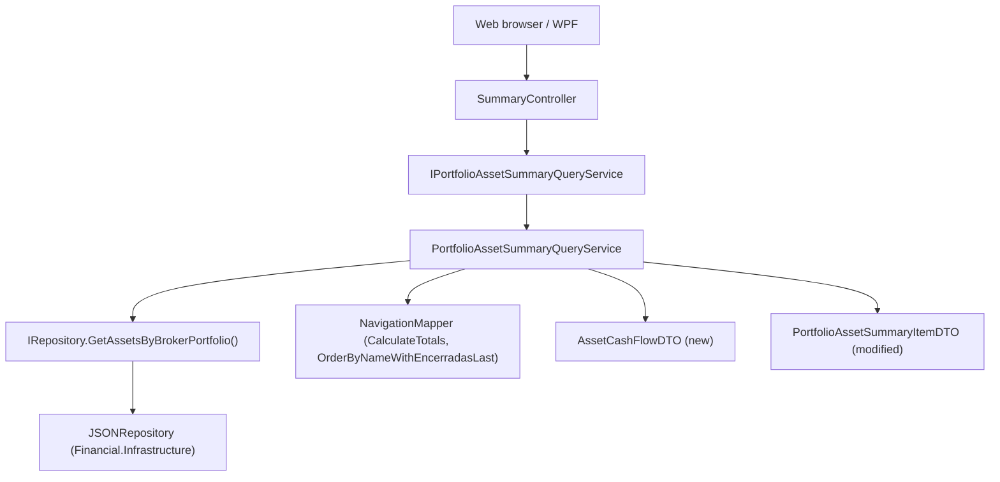

# Spec: F01 — Portfolio Assets Summary Service and Endpoint

## 1. Technical Overview

**What:** Extends the existing `PortfolioAssetSummaryItemDTO` and `PortfolioAssetSummaryQueryService` with two new computed fields — `TotalCredits` (sum of all credit values for the asset) and `CashFlows` (a dated cash-flow series combining buy/sell transactions and credit payments, sorted ascending by date). A companion DTO `AssetCashFlowDTO` is introduced to represent each entry in the series. The `SummaryController` endpoint response shape grows to include the new fields; the route, HTTP method, and status codes are unchanged.

**Why:** The frontend clients (F02 web, F03 WPF) need `TotalCredits` to render the new column and to compute `% Profit w/ Credits` client-side, and need `CashFlows` to compute XIRR client-side after fetching the live price. Centralising both computations in the Application layer avoids duplicating cash-flow assembly logic across the two UI implementations and keeps domain data access behind the repository interface.

**Scope:**

Included:
- New `AssetCashFlowDTO` in `Financial.Application/DTOs/`
- `PortfolioAssetSummaryItemDTO` — add `TotalCredits` (decimal) and `CashFlows` (`IReadOnlyList<AssetCashFlowDTO>`) properties
- `PortfolioAssetSummaryQueryService` — extend `ComputeAssetData` to capture `TotalCredits` from the already-computed `CalculateTotals` tuple and build the `CashFlows` list
- Unit tests covering `TotalCredits` computation and `CashFlows` construction (content, sign, sort order, edge cases)
- Integration test assertion that new fields appear in the HTTP response

Excluded:
- `CurrentValue`, `% Profit`, `% Profit w/ Credits`, XIRR — computed by frontends after fetching live prices
- Any changes to `SummaryController` routing, HTTP status codes, or existing `GetPortfolioAssets­Summary` action signature
- Any changes to `ISummaryQueryService`, `SummaryQueryService`, or other controller actions
- Broker-level per-asset breakdown

---

## 2. Architecture Impact

**Affected components:**



---

## 3. Technical Decisions

| Decision | Chosen Approach | Alternative Considered | Trade-off |
|----------|----------------|----------------------|-----------|
| `AssetCashFlowDTO` as a separate named DTO | New `sealed class` with `{ get; init; }` in `Financial.Application/DTOs/` | Anonymous type or `ValueTuple<DateTime, decimal>` | Follows the project's named-DTO convention; produces clean camelCase JSON serialisation without additional configuration; aligns with `PortfolioAssetSummaryItemDTO`'s sealed-class-with-init pattern |
| `TotalCredits` extraction | Stop discarding the third element of the `NavigationMapper.CalculateTotals` tuple | Iterate `asset.Credits` separately in the new code | `CalculateTotals` already computes the sum; reusing it avoids a second enumeration of the same credits collection |
| `CashFlows` sort | Sort ascending by `Date` in the service before returning | Leave unsorted; let clients sort | Clients need a sorted series for Newton-Raphson; sorting once server-side is cheaper than sorting in every client; mirrors the `OrderByNameWithEncerradasLast` pattern where sort is a service responsibility |
| Sign convention in `CashFlows` | Buy = `−TotalPrice` (negative); Sell = `+TotalPrice` (positive); Credit = `+Value` (positive) | All positive, with a `FlowType` discriminator | Standard XIRR cash-flow convention; reduces client logic to one append (terminal value) before computing the rate |
| `CashFlows` when asset has no transactions or credits | Empty `IReadOnlyList<AssetCashFlowDTO>` (not null) | Return null | Consistent with existing list-return pattern; clients check `CashFlows.Count` without null guard |
| `AssetComputedData` private record extension | Add `TotalCredits` and `CashFlows` to the existing `AssetComputedData` private record | Create a second intermediate record | Keeps the two-step pipeline (compute → sort → project to DTO) intact with a single record per asset |

---

## 4. Component Overview

### Backend

| File Path | New/Modified | Purpose | Key Responsibilities |
|-----------|--------------|---------|---------------------|
| `Financial.Application/DTOs/AssetCashFlowDTO.cs` | New | Cash-flow entry DTO | Sealed class with `init` properties: `Date` (DateTime) and `Amount` (decimal); amount is negative for outflows (Buy), positive for inflows (Sell, Credit) |
| `Financial.Application/DTOs/PortfolioAssetSummaryItemDTO.cs` | Modified | Response DTO | Add `TotalCredits` (decimal) and `CashFlows` (`IReadOnlyList<AssetCashFlowDTO>`) to the existing sealed class; both use `init` setters; `CashFlows` defaults to an empty list |
| `Financial.Application/Services/PortfolioAssetSummaryQueryService.cs` | Modified | Query and mapping logic | Extend `AssetComputedData` record with `TotalCredits` and `CashFlows`; update `ComputeAssetData` to capture `totalCredits` from the `CalculateTotals` tuple and build the cash-flow list (Buy entries with `−TotalPrice`, Sell entries with `+TotalPrice`, Credit entries with `+Value`), then sort the combined list ascending by Date; propagate both fields through `ToDTO` |

---

## 5. API Contracts

### GET Portfolio Assets Summary

- **Method:** GET
- **Path:** `/api/v1/financial/summary/portfolio/{brokerName}/{portfolioName}/assets`
- **Authentication:** None

**Path Parameters:**

| Parameter | Type | Required | Description |
|-----------|------|----------|-------------|
| `brokerName` | `string` | Yes | Exact broker name (e.g., `XPI`) |
| `portfolioName` | `string` | Yes | Exact portfolio name within the broker (e.g., `Default`) |

**Response (200 OK):**

| Field | Type | Description |
|-------|------|-------------|
| `[].assetName` | `string` | Asset name, sorted alphabetically (Encerradas-last) |
| `[].ticker` | `string` | Ticker symbol |
| `[].exchange` | `string` | Exchange code (e.g., `BVMF`, `LSE`) |
| `[].firstInvestmentDate` | `string` (ISO 8601) \| `null` | Date of earliest Buy transaction; `null` when asset has no Buy transactions |
| `[].currentQuantity` | `decimal` | Net quantity held after all Buy and Sell transactions |
| `[].totalBought` | `decimal` | Sum of `TotalPrice` for all Buy transactions |
| `[].totalSold` | `decimal` | Sum of `TotalPrice` for all Sell transactions |
| `[].totalInvested` | `decimal` | `totalBought − totalSold` |
| `[].portfolioWeight` | `decimal` | `totalInvested / portfolioTotalInvested × 100`; `0` when `portfolioTotalInvested` is `0` |
| `[].totalCredits` | `decimal` | Sum of all credit values (Dividend + Rent) for the asset; `0` when no credits exist |
| `[].cashFlows` | `array` | Dated cash-flow series; sorted ascending by `date`; empty array when asset has no transactions or credits |
| `[].cashFlows[].date` | `string` (ISO 8601) | Date of the transaction or credit event |
| `[].cashFlows[].amount` | `decimal` | Negative for Buy outflows; positive for Sell inflows and Credit receipts |

**Response Example (200):**
```json
[
  {
    "assetName": "ALZR11",
    "ticker": "ALZR11",
    "exchange": "BVMF",
    "firstInvestmentDate": "2021-03-01T00:00:00",
    "currentQuantity": 20.0,
    "totalBought": 2500.00,
    "totalSold": 550.00,
    "totalInvested": 1950.00,
    "portfolioWeight": 66.1016949152542,
    "totalCredits": 125.00,
    "cashFlows": [
      { "date": "2021-03-01T00:00:00", "amount": -1000.00 },
      { "date": "2021-05-01T00:00:00", "amount": -1500.00 },
      { "date": "2021-09-15T00:00:00", "amount": 50.00 },
      { "date": "2022-01-01T00:00:00", "amount": 550.00 },
      { "date": "2022-09-15T00:00:00", "amount": 75.00 }
    ]
  },
  {
    "assetName": "MXRF11",
    "ticker": "MXRF11",
    "exchange": "BVMF",
    "firstInvestmentDate": "2021-05-15T00:00:00",
    "currentQuantity": 0.0,
    "totalBought": 1200.00,
    "totalSold": 200.00,
    "totalInvested": 1000.00,
    "portfolioWeight": 33.8983050847458,
    "totalCredits": 0.00,
    "cashFlows": [
      { "date": "2021-05-15T00:00:00", "amount": -1200.00 },
      { "date": "2022-03-01T00:00:00", "amount": 200.00 }
    ]
  }
]
```

**Empty portfolio response (200):**
```json
[]
```

**Error Codes:**

| HTTP Status | Condition |
|-------------|-----------|
| 200 | Successful — includes empty array when portfolio has no assets |
| 400 | `brokerName` or `portfolioName` is null, empty, or whitespace |

---

## 6. Data Model

Not applicable. No persistence schema changes. All values are computed at query time from the in-memory JSON-backed repository via the existing `IRepository.GetAssetsByBrokerPortfolio` method. The `Asset` entity already tracks `Transactions` and `Credits` in memory.

---

## 7. Testing Strategy

### Test File Structure

| Test File | Test Type | Target | Coverage Goal |
|-----------|-----------|--------|---------------|
| `Tests/Financial.Application.Tests/Services/PortfolioAssetSummaryQueryServiceTests.cs` | Unit | `PortfolioAssetSummaryQueryService` | New `TotalCredits` and `CashFlows` computation paths, sign convention, sort order, edge cases |
| `Tests/Financial.Api.Tests/SummaryEndpointsTests.cs` | Integration | `SummaryController.GetPortfolioAssetsSummary` | New fields present in HTTP response |

### PortfolioAssetSummaryQueryServiceTests.cs (additions)

Follows the established pattern in the existing file: inner `StubRepository`, `FluentAssertions` with `AssertionScope`, `[Theory][InlineData]` for variants. All existing tests remain and continue to pass unchanged.

| Test Function | Description | Assertions |
|---------------|-------------|------------|
| `GetPortfolioAssetsSummary_ReturnsTotalCredits_SumOfAllCreditValues` | Asset with one Dividend credit of `30m` and one Rent credit of `15m` | `TotalCredits` equals `45m` |
| `GetPortfolioAssetsSummary_ReturnsTotalCredits_Zero_WhenNoCredits` | Asset with Buy transactions only, no credits | `TotalCredits` equals `0m` |
| `GetPortfolioAssetsSummary_ReturnsCashFlows_BuyEntriesAreNegative` | Asset with one Buy at `100m` total price | `CashFlows` has one entry; `Amount` equals `−100m` |
| `GetPortfolioAssetsSummary_ReturnsCashFlows_SellEntriesArePositive` | Asset with one Buy and one Sell at `50m` total price | `CashFlows` contains one entry with `Amount = +50m` for the Sell |
| `GetPortfolioAssetsSummary_ReturnsCashFlows_CreditEntriesArePositive` | Asset with one Buy and one Credit of value `25m` | `CashFlows` contains one entry with `Amount = +25m` for the Credit |
| `GetPortfolioAssetsSummary_ReturnsCashFlows_SortedAscendingByDate` | Asset with Buy on `2022-06-01`, Credit on `2021-09-15`, Sell on `2023-01-01` | `CashFlows` ordered: `2021-09-15`, `2022-06-01`, `2023-01-01` |
| `GetPortfolioAssetsSummary_ReturnsCashFlows_Empty_WhenNoTransactionsOrCredits` | Asset with no transactions and no credits | `CashFlows` is an empty collection (not null) |
| `GetPortfolioAssetsSummary_ReturnsCashFlows_ContainsAllThreeEventTypes` | Asset with 1 Buy, 1 Sell, and 1 Credit | `CashFlows.Count` equals `3`; one negative entry, two positive entries |
| `GetPortfolioAssetsSummary_ReturnsCashFlows_BuyAmountMatchesTotalPrice` | Asset with Buy of 10 shares at `15m` unit price + `5m` fees (`TotalPrice = 155m`) | `CashFlows` entry amount equals `−155m` |

### SummaryEndpointsTests.cs (addition)

Follows the same `ApiTestFactory` / `WebApplicationFactory<Program>` pattern as existing summary tests.

| Test Function | Description | Assertions |
|---------------|-------------|------------|
| `GetPortfolioAssetsSummary_Returns200WithNewFields` | `GET /api/v1/financial/summary/portfolio/XPI/Default/assets` against the real test data file | HTTP 200; every item has `totalCredits ≥ 0`; every item has non-null `cashFlows` array; at least one item has `cashFlows.Count > 0` |

### Acceptance Test Mapping

| PRD Acceptance Criterion (Section 9 — F01) | Covered By |
|---------------------------------------------|------------|
| Each item contains `totalCredits` and `cashFlows` | `GetPortfolioAssetsSummary_Returns200WithNewFields` |
| `totalCredits` equals sum of all credit values | `GetPortfolioAssetsSummary_ReturnsTotalCredits_SumOfAllCreditValues` |
| `totalCredits` is `0` when no credits | `GetPortfolioAssetsSummary_ReturnsTotalCredits_Zero_WhenNoCredits` |
| `cashFlows` contains Buy as negative, Sell and Credit as positive | `GetPortfolioAssetsSummary_ReturnsCashFlows_BuyEntriesAreNegative` + `_SellEntriesArePositive` + `_CreditEntriesArePositive` |
| `cashFlows` sorted ascending by date | `GetPortfolioAssetsSummary_ReturnsCashFlows_SortedAscendingByDate` |
| `cashFlows` is empty array when no transactions or credits | `GetPortfolioAssetsSummary_ReturnsCashFlows_Empty_WhenNoTransactionsOrCredits` |
| Buy amount in `cashFlows` matches `TotalPrice` | `GetPortfolioAssetsSummary_ReturnsCashFlows_BuyAmountMatchesTotalPrice` |
