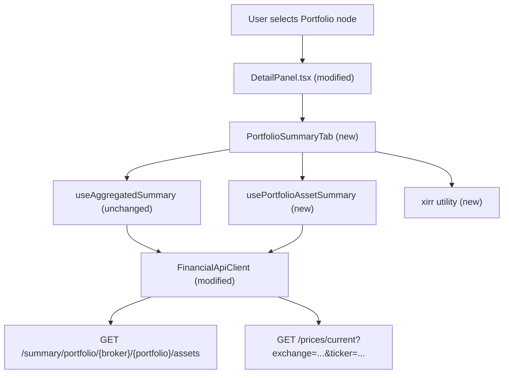

# Spec: F02 — Portfolio Summary Tab — Web Frontend

## 1. Technical Overview

**What:** Adds a `PortfolioSummaryTab` component to the React frontend that renders when a Portfolio node is selected in the investment tree. The component displays two independent sections: (1) the three aggregated totals (Total Bought, Total Sold, Total Credits) via the existing `useAggregatedSummary` hook unchanged, and (2) a per-asset breakdown table driven by a new `usePortfolioAssetSummary` hook that fetches static data from F01's endpoint and enriches each row with a live current price fetched in parallel. For each row the component computes `CurrentValue`, `% Profit`, `% Profit w/ Credits`, and `XIRR` client-side after the price arrives; a pure `xirr` utility function (Newton-Raphson) is introduced for the XIRR calculation.

**Why:** The current `DetailPanel` renders `AggregatedSummaryTab` for both Broker and Portfolio nodes — selecting a Portfolio shows only three aggregate totals with no per-asset breakdown. F01 now provides the server-side per-asset computation (including `TotalCredits` and `CashFlows`); this feature wires that data into the React frontend with automatic price enrichment, following the same pattern already used by `AssetSummaryTab` for individual assets.

**Scope:**

Included:
- `PortfolioAssetSummaryItemDto` type in `Financial.Web/src/api/types.ts` (11 fields including `totalCredits` and `cashFlows`)
- `AssetCashFlowDto` type in `Financial.Web/src/api/types.ts`
- `getPortfolioAssetsSummary` method on `FinancialApiClient` interface and implementation in `financialApiClient.ts`
- `usePortfolioAssetSummary` hook in `Financial.Web/src/hooks/`
- `xirr` utility function in `Financial.Web/src/utils/xirr.ts` (Newton-Raphson, max 100 iterations, tolerance 1e-7)
- `PortfolioSummaryTab` component and co-located CSS in `Financial.Web/src/components/`
- `DetailPanel.tsx` modification to render `PortfolioSummaryTab` for Portfolio nodes and `AggregatedSummaryTab` only for Broker nodes
- Unit tests for `usePortfolioAssetSummary`
- Unit tests for `xirr` utility
- Component tests for `PortfolioSummaryTab`

Excluded:
- Broker-level per-asset breakdown (no change to `AggregatedSummaryTab`)
- Column sorting or filtering in the table
- Manual price refresh (prices are fetched once automatically on portfolio selection)
- Any backend, API endpoint, or data model changes
- Changes to `AssetSummaryTab`, `TransactionsTab`, or `CreditsTab`

---

## 2. Architecture Impact

**Affected components:**



---

## 3. Technical Decisions

| Decision | Chosen Approach | Alternative Considered | Trade-off |
|----------|----------------|----------------------|-----------|
| Per-row price state structure | Parallel `rowPrices: RowPriceState[]` indexed by position alongside `items` | Merged `PortfolioAssetSummaryRow[]` with price fields inlined; `Map<string, RowPriceState>` keyed by ticker | Parallel arrays keep the reducer action shape simple (`ROW_PRICE_SUCCESS` / `ROW_PRICE_ERROR` carry only an `index`), avoids creating an extra merged type, and is consistent with `useAssetSummary` which keeps `asset` and `price` as separate state fields |
| Price fetch dispatch | Each price fetch dispatches independently (fire-and-forget per row) | `Promise.allSettled` collecting all prices before updating state | Independent dispatch updates each row as soon as its price arrives, satisfying the PRD requirement that "as each price resolves, the corresponding row updates in place"; `allSettled` would stall every row until the slowest fetch |
| `useAggregatedSummary` reuse in `PortfolioSummaryTab` | Call `useAggregatedSummary()` directly inside `PortfolioSummaryTab` | Lift aggregated state to a parent and pass as props | Follows the existing pattern (`AggregatedSummaryTab` owns its hook); keeps `PortfolioSummaryTab` self-contained; the hook already handles Portfolio node selection correctly without modification |
| Table HTML element | HTML `<table>` with `<thead>` / `<tbody>` | CSS grid (used by `AggregatedSummaryTab` and `AssetSummaryTab`) | The per-asset breakdown is genuinely tabular data (10 columns, variable number of rows); `<table>` provides correct semantics, accessible column headers, and natural column alignment; CSS grid is appropriate for key-value pair layouts, not multi-row columnar tables |
| XIRR computation location | Pure utility function in `xirr.ts`; called by the component per row after price resolves | Inside the hook's `ROW_PRICE_SUCCESS` action reducer | Keeps the hook responsible only for async state; the component owns derived numeric computations (consistent with how `currentValue` and `% Profit` are also computed in the component); a pure function is easier to unit-test in isolation |
| XIRR non-convergence and insufficient data | Return `null` from `xirr()`; component renders `"—"` | Throw an exception | Null return avoids try/catch in the component; the component already has a null-check path for unavailable price values; consistent with PRD which treats non-convergence as a display-only concern |

---

## 4. Component Overview

**Frontend:**

| File Path | New/Modified | Purpose | Key Responsibilities |
|-----------|--------------|---------|---------------------|
| `Financial.Web/src/api/types.ts` | Modified | API type definitions | Add `AssetCashFlowDto` interface (`date: string`, `amount: number`); add `PortfolioAssetSummaryItemDto` interface with all eleven fields from the F01 response |
| `Financial.Web/src/api/financialApiClient.ts` | Modified | API client | Add `getPortfolioAssetsSummary(brokerName, portfolioName)` to `FinancialApiClient` interface; implement it in the factory function using the path `/summary/portfolio/{brokerName}/{portfolioName}/assets` with `encodeURIComponent` on both params |
| `Financial.Web/src/hooks/usePortfolioAssetSummary.ts` | New | Hook encapsulating F01 fetch and parallel price enrichment | Manages `useReducer` with `items`, `rowPrices`, `isLoading`, `error`, and `retryCount`; triggers on Portfolio node selection; on `FETCH_SUCCESS` initialises `rowPrices` with one `{ isLoading: true, currentPrice: null, fetchFailed: false }` per item and fires one `getCurrentPrice` call per item in parallel; each price call dispatches `ROW_PRICE_SUCCESS` or `ROW_PRICE_ERROR` with the row index; exposes `items`, `rowPrices`, `isLoading`, `error`, `retry` |
| `Financial.Web/src/utils/xirr.ts` | New | Pure XIRR computation utility | Accepts a sorted `{ date: Date; amount: number }[]` cash-flow series; implements Newton-Raphson with max 100 iterations and convergence tolerance 1e-7; returns the annualised rate as a `number` or `null` when the series has fewer than 2 entries or the algorithm does not converge within the iteration limit |
| `Financial.Web/src/components/PortfolioSummaryTab.tsx` | New | Portfolio-specific Summary tab component | Renders totals section (via `useAggregatedSummary`) and per-asset table (via `usePortfolioAssetSummary`); handles loading and error states for each section independently; computes per row: `currentValue = currentPrice × currentQuantity`, `profitPercent = (currentValue − totalInvested) / totalInvested × 100`, `profitWithCreditsPercent = (currentValue + totalCredits − totalInvested) / totalInvested × 100`, and `xirr` (using `xirr.ts` with `cashFlows` plus terminal entry `{ date: today, amount: +currentValue }`); renders `"—"` for price-dependent columns when `totalInvested` is 0 or current price is unavailable; renders `"—"` for XIRR when price is unavailable, `cashFlows` plus the terminal entry yields fewer than 2 entries, or the algorithm does not converge; applies green/red CSS class to `% Profit`, `% Profit w/ Credits`, and XIRR |
| `Financial.Web/src/components/PortfolioSummaryTab.css` | New | Scoped styles for `PortfolioSummaryTab` | Table, header, and cell layout; `portfolio-summary__profit--green` / `--red` colour modifier classes (shared by `% Profit`, `% Profit w/ Credits`, and XIRR); `.portfolio-summary__loading-cell` style for the `...` per-cell indicator |
| `Financial.Web/src/components/DetailPanel.tsx` | Modified | Navigation-aware tab content dispatcher | Change summary routing: `isPortfolio` → render `PortfolioSummaryTab`; `isBroker` (i.e. `!isAsset && !isPortfolio`) → render `AggregatedSummaryTab`; `isAsset` → render `AssetSummaryTab`; import `PortfolioSummaryTab` |

---

## 5. API Contracts

### New API client method: `getPortfolioAssetsSummary`

Consumes the F01 endpoint. No backend changes are made in this feature.

- **Method:** GET
- **Path:** `/summary/portfolio/{brokerName}/{portfolioName}/assets`
- **Caller:** `usePortfolioAssetSummary` hook, triggered on Portfolio node selection

**Client method signature:**

```typescript
getPortfolioAssetsSummary: (brokerName: string, portfolioName: string) => Promise<PortfolioAssetSummaryItemDto[]>
```

**New types (in `api/types.ts`):**

`AssetCashFlowDto`:

| Field | Type | Description |
|-------|------|-------------|
| `date` | `string` | ISO 8601 date string of the transaction or credit event |
| `amount` | `number` | Negative for Buy outflows; positive for Sell inflows and Credit receipts |

`PortfolioAssetSummaryItemDto`:

| Field | Type | Description |
|-------|------|-------------|
| `assetName` | `string` | Asset name, sorted alphabetically |
| `ticker` | `string` | Ticker symbol |
| `exchange` | `string` | Exchange code (e.g., `BVMF`, `LSE`) |
| `firstInvestmentDate` | `string \| null` | ISO 8601 date string; `null` when asset has no Buy transactions |
| `currentQuantity` | `number` | Net quantity held after all Buy and Sell transactions |
| `totalBought` | `number` | Sum of all Buy transaction totals |
| `totalSold` | `number` | Sum of all Sell transaction totals |
| `totalInvested` | `number` | `totalBought − totalSold` |
| `portfolioWeight` | `number` | Asset's share of total portfolio invested capital × 100 |
| `totalCredits` | `number` | Sum of all credit values (Dividend + Rent) for the asset; `0` when the asset has no credits |
| `cashFlows` | `AssetCashFlowDto[]` | Sorted ascending by date; empty array when asset has no transactions or credits |

**Response example:**
```json
[
  {
    "assetName": "ALZR11",
    "ticker": "ALZR11",
    "exchange": "BVMF",
    "firstInvestmentDate": "2021-03-01T00:00:00",
    "currentQuantity": 20.0,
    "totalBought": 2500.00,
    "totalSold": 550.00,
    "totalInvested": 1950.00,
    "portfolioWeight": 66.1016949152542,
    "totalCredits": 125.00,
    "cashFlows": [
      { "date": "2021-03-01T00:00:00", "amount": -1000.00 },
      { "date": "2021-05-01T00:00:00", "amount": -1500.00 },
      { "date": "2021-09-15T00:00:00", "amount": 50.00 },
      { "date": "2022-01-01T00:00:00", "amount": 550.00 },
      { "date": "2022-09-15T00:00:00", "amount": 75.00 }
    ]
  },
  {
    "assetName": "MXRF11",
    "ticker": "MXRF11",
    "exchange": "BVMF",
    "firstInvestmentDate": "2021-05-15T00:00:00",
    "currentQuantity": 0.0,
    "totalBought": 1200.00,
    "totalSold": 200.00,
    "totalInvested": 1000.00,
    "portfolioWeight": 33.8983050847458,
    "totalCredits": 0.00,
    "cashFlows": [
      { "date": "2021-05-15T00:00:00", "amount": -1200.00 },
      { "date": "2022-03-01T00:00:00", "amount": 200.00 }
    ]
  }
]
```

**Price fetch per row (existing endpoint, no changes):**
- **Method:** GET
- **Path:** `/prices/current?exchange={exchange}&ticker={ticker}`
- Used by `usePortfolioAssetSummary` in parallel after items are loaded; one call per asset row using the `ticker` and `exchange` values from the F01 response without transformation.

---

## 6. Data Model

Not applicable. No persistence or schema changes. All state is in-memory within the React component lifecycle.

---

## 7. Testing Strategy

### Test File Structure

| Test File | Test Type | Target | Coverage Goal |
|-----------|-----------|--------|---------------|
| `Financial.Web/src/utils/xirr.test.ts` | Unit | `xirr` utility | Correct rate for known inputs, null on insufficient data, null on non-convergence |
| `Financial.Web/src/hooks/usePortfolioAssetSummary.test.ts` | Unit | `usePortfolioAssetSummary` | All state transitions, parallel price dispatch, retry, node-change reset |
| `Financial.Web/src/components/__tests__/PortfolioSummaryTab.test.tsx` | Unit | `PortfolioSummaryTab` | All render states, value formatting, profit and XIRR colour coding, regression for other node types |

### xirr.test.ts

Pure function tests — no React context needed.

| Test Function | Description | Assertions |
|---------------|-------------|------------|
| `xirr_returns_correct_annualised_rate_for_known_inputs` | Known cash-flow series with a calculable rate (e.g. buy 1000 on day 0, receive 1100 one year later) | Returned rate is within 1e-4 of the expected Excel-equivalent XIRR value |
| `xirr_returns_null_when_fewer_than_two_cash_flows` | Series with one entry | Returns `null` |
| `xirr_returns_null_when_series_is_empty` | Empty array | Returns `null` |
| `xirr_returns_null_when_algorithm_does_not_converge` | Degenerate series that cannot converge (e.g. all identical amounts on the same date) | Returns `null` within the max iteration limit |

### usePortfolioAssetSummary.test.ts

Follows the `createWrapper()` / `SelectedNodeProvider` / `vi.mock('../api/financialApiClient')` pattern from `useAggregatedSummary.test.ts`. Mock both `getPortfolioAssetsSummaryMock` and `getCurrentPriceMock`.

| Test Function | Description | Assertions |
|---------------|-------------|------------|
| `calls_getPortfolioAssetsSummary_on_portfolio_node_selection` | Portfolio node selected | `getPortfolioAssetsSummaryMock` called with correct `brokerName` and `portfolioName` |
| `does_not_fetch_when_broker_node_selected` | Broker node selected | `getPortfolioAssetsSummaryMock` not called |
| `does_not_fetch_when_asset_node_selected` | Asset node selected | `getPortfolioAssetsSummaryMock` not called |
| `sets_isLoading_true_while_fetch_in_progress` | Never-resolving promise | `isLoading` is `true` after Portfolio node selection |
| `populates_items_on_successful_fetch` | Resolves with 2 items including `totalCredits` and `cashFlows` | `items` length is 2; `items[0].assetName`, `items[0].totalCredits`, and `items[0].cashFlows` match expected values |
| `sets_error_on_fetch_failure` | Rejects with error message | `error` equals the error message; `items` is `null` |
| `resets_state_on_node_change` | Select Portfolio, then select Broker | After second selection, `items` is `null` and `isLoading` reflects current fetch state |
| `retry_re_triggers_fetch` | First call rejects, second resolves | After `retry()`, `getPortfolioAssetsSummaryMock` called twice; `items` populated after second call |
| `fires_getCurrentPrice_for_each_item_after_fetch` | Fetch resolves with 2 items | `getCurrentPriceMock` called twice with correct `exchange` and `ticker` pairs from the items |
| `sets_row_price_loading_true_after_items_arrive` | Price fetch never resolves | `rowPrices[0].isLoading` is `true` after items arrive |
| `populates_row_price_on_price_success` | Price resolves for first item | `rowPrices[0].currentPrice` equals returned price; `rowPrices[0].isLoading` is `false`; `rowPrices[0].fetchFailed` is `false` |
| `sets_row_fetch_failed_on_price_error` | Price rejects for first item | `rowPrices[0].fetchFailed` is `true`; `rowPrices[0].currentPrice` is `null`; `rowPrices[0].isLoading` is `false` |
| `failed_price_for_one_row_does_not_affect_other_rows` | First price fails, second price resolves | `rowPrices[0].fetchFailed` is `true`; `rowPrices[1].currentPrice` is populated and `rowPrices[1].fetchFailed` is `false` |

### PortfolioSummaryTab.test.tsx

Follows the `vi.mock` / `setMock` / `Object.assign` pattern from `AggregatedSummaryTab.test.tsx`. Mocks `useAggregatedSummary`, `usePortfolioAssetSummary`, and `xirr` utility.

| Test Function | Description | Assertions |
|---------------|-------------|------------|
| `renders_loading_state_in_totals_section_while_aggregated_summary_loads` | `useAggregatedSummary` returns `isLoading: true` | Loading indicator rendered in totals section |
| `renders_error_state_in_totals_section_on_aggregated_summary_failure` | `useAggregatedSummary` returns `error` | ErrorState with Retry button rendered in totals area |
| `renders_loading_state_in_table_section_while_items_load` | `usePortfolioAssetSummary` returns `isLoading: true` | Loading indicator rendered in table section |
| `renders_error_state_in_table_section_on_items_fetch_failure` | `usePortfolioAssetSummary` returns `error` | ErrorState with Retry button rendered in table section; totals section still visible above |
| `renders_table_with_correct_column_headers` | Both hooks return data | `<th>` elements with text: Asset Name, First Investment, Quantity, Total Invested, % Portfolio, Total Credits, Current Value, % Profit, % Profit w/ Credits, XIRR |
| `renders_asset_row_with_correctly_formatted_values` | Known item (first date, N8 quantity, N2 invested, one-decimal weight, N2 totalCredits) | `assetName`, `firstInvestmentDate` as `DD/MM/YYYY`, `currentQuantity` N8, `totalInvested` N2, `portfolioWeight` as `23.4%`, `totalCredits` N2 |
| `renders_total_credits_immediately_before_price_resolves` | `rowPrices[0].isLoading: true`, item has `totalCredits: 75.50` | Total Credits cell shows `75.50`; Current Value cell shows `...` |
| `renders_per_cell_loading_indicator_while_price_loads` | `rowPrices[0].isLoading: true` | Current Value, % Profit, % Profit w/ Credits, and XIRR cells each show `...` |
| `renders_current_value_when_price_resolves` | `rowPrices[0].currentPrice: 10.50`, item `currentQuantity: 25` | Current Value cell contains formatted `262.50` |
| `renders_correct_profit_percent` | `currentValue: 262.50`, `totalInvested: 250.00` | `% Profit` cell shows formatted `5.00%` |
| `renders_correct_profit_with_credits_percent` | `currentValue: 262.50`, `totalInvested: 250.00`, `totalCredits: 12.50` | `% Profit w/ Credits` cell shows formatted `10.00%` |
| `renders_xirr_when_price_resolves` | Price resolves; `xirr` mock returns `0.1234` | XIRR cell shows `12.34%` |
| `renders_dash_in_current_value_and_price_dependent_columns_on_price_failure` | `rowPrices[0].fetchFailed: true` | Current Value, % Profit, % Profit w/ Credits, and XIRR cells each show `—` |
| `renders_dash_in_profit_when_total_invested_is_zero` | `totalInvested: 0`, price available | `% Profit` and `% Profit w/ Credits` cells show `—`; Current Value cell shows computed value |
| `renders_dash_in_xirr_when_cash_flows_fewer_than_two_entries` | `cashFlows: []`, one terminal entry appended → 1 entry total | XIRR cell shows `—`; `xirr` utility not called (or called and returns `null`) |
| `renders_dash_in_xirr_on_non_convergence` | `xirr` mock returns `null` | XIRR cell shows `—` |
| `applies_green_class_to_positive_profit` | `currentValue > totalInvested` | `% Profit` element has `portfolio-summary__profit--green` class |
| `applies_red_class_to_negative_profit` | `currentValue < totalInvested` | `% Profit` element has `portfolio-summary__profit--red` class |
| `applies_green_class_to_positive_profit_with_credits` | `currentValue + totalCredits > totalInvested` | `% Profit w/ Credits` element has `portfolio-summary__profit--green` class |
| `applies_red_class_to_negative_profit_with_credits` | `currentValue + totalCredits < totalInvested` | `% Profit w/ Credits` element has `portfolio-summary__profit--red` class |
| `applies_green_class_to_positive_xirr` | `xirr` mock returns positive value | XIRR element has `portfolio-summary__profit--green` class |
| `applies_red_class_to_negative_xirr` | `xirr` mock returns negative value | XIRR element has `portfolio-summary__profit--red` class |
| `renders_empty_string_for_null_first_investment_date` | `firstInvestmentDate: null` | First Investment cell content is empty |
| `totals_section_is_unaffected_when_table_section_errors` | Table error, aggregated summary resolves with data | Three totals (Total Bought, Total Sold, Total Credits) rendered; ErrorState present in table section |

### Acceptance Test Mapping

| PRD Acceptance Criterion (Section 9 — F02) | Covered By |
|---------------------------------------------|------------|
| Selecting a Portfolio node renders `PortfolioSummaryTab` | `renders_table_with_correct_column_headers` + `DetailPanel.test.tsx` (regression) |
| Selecting a Broker node still renders `AggregatedSummaryTab` (regression) | `DetailPanel.test.tsx` existing tests |
| Selecting an Asset node still renders `AssetSummaryTab` (regression) | `DetailPanel.test.tsx` existing tests |
| Three totals (green/red/blue) at top | `totals_section_is_unaffected_when_table_section_errors`; colour coverage in existing `AggregatedSummaryTab` tests |
| Per-asset table with 10 correct columns | `renders_table_with_correct_column_headers` |
| Total Credits column populated immediately from F01 response | `renders_total_credits_immediately_before_price_resolves` |
| Current Value, % Profit, % Profit w/ Credits, and XIRR populate automatically | `renders_current_value_when_price_resolves` + `renders_correct_profit_percent` + `renders_correct_profit_with_credits_percent` + `renders_xirr_when_price_resolves` + `fires_getCurrentPrice_for_each_item_after_fetch` |
| Failed price fetch shows `"—"` in four cells; other rows unaffected | `renders_dash_in_current_value_and_price_dependent_columns_on_price_failure` + `failed_price_for_one_row_does_not_affect_other_rows` |
| `% Profit` green when positive, red when negative | `applies_green_class_to_positive_profit` + `applies_red_class_to_negative_profit` |
| `% Profit w/ Credits` green when positive, red when negative | `applies_green_class_to_positive_profit_with_credits` + `applies_red_class_to_negative_profit_with_credits` |
| `XIRR` green when positive, red when negative; `"—"` when price unavailable or non-convergent | `applies_green_class_to_positive_xirr` + `applies_red_class_to_negative_xirr` + `renders_dash_in_xirr_on_non_convergence` + `renders_dash_in_current_value_and_price_dependent_columns_on_price_failure` |
| F01 failure shows ErrorState with Retry; totals unaffected | `renders_error_state_in_table_section_on_items_fetch_failure` + `totals_section_is_unaffected_when_table_section_errors` |
| `CurrentValue = CurrentPrice × CurrentQuantity` | `renders_current_value_when_price_resolves` |
| `% Profit = (CurrentValue − TotalInvested) / TotalInvested × 100` | `renders_correct_profit_percent` |
| `% Profit w/ Credits = (CurrentValue + TotalCredits − TotalInvested) / TotalInvested × 100` | `renders_correct_profit_with_credits_percent` |
| `XIRR` computed using CashFlows from F01 plus terminal entry `(today, +CurrentValue)` | `renders_xirr_when_price_resolves` (mock asserts correct call); `xirr_returns_correct_annualised_rate_for_known_inputs` |
| `"—"` in `% Profit` and `% Profit w/ Credits` when `TotalInvested` is 0 | `renders_dash_in_profit_when_total_invested_is_zero` |
| `"—"` in XIRR when CashFlows has fewer than 2 entries after appending terminal entry | `renders_dash_in_xirr_when_cash_flows_fewer_than_two_entries` |

### Cross-Feature Integration Tests

| PRD Section 9 — Cross-Feature Criterion | Covered By |
|------------------------------------------|------------|
| `ticker` and `exchange` from F01 used without modification in `GET /prices/current` calls | `fires_getCurrentPrice_for_each_item_after_fetch` — asserts exact `exchange` and `ticker` values passed to `getCurrentPrice` |
| `totalInvested` and `currentQuantity` from F01 used without transformation in `CurrentValue`, `% Profit`, and `% Profit w/ Credits` computation | `renders_current_value_when_price_resolves` + `renders_correct_profit_percent` + `renders_correct_profit_with_credits_percent` — use known F01 field values and verify exact output |
| `cashFlows` array from F01 used without transformation in XIRR computation; appending terminal entry produces the complete series | `renders_xirr_when_price_resolves` — verifies `xirr` is called with `cashFlows` entries plus the terminal entry `(today, +currentValue)` |
