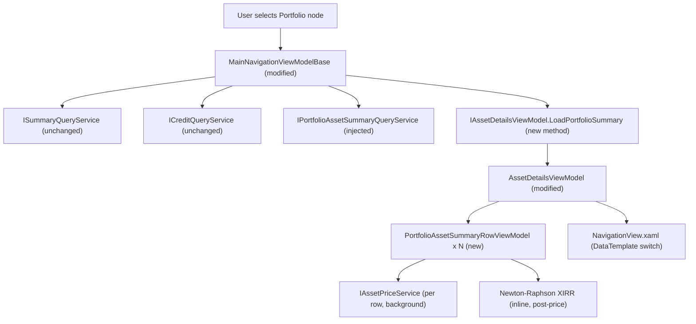

# Spec: F03 — Portfolio Summary Tab — WPF

## 1. Technical Overview

**What:** Modifies the WPF desktop application's Summary tab to show a portfolio-specific layout when a Portfolio node is selected. The new layout hides all asset-only fields (Quantity, Average Price, ISIN, Country, Local Type, Asset Class, Current Value section, Status) and renders instead: (1) three colour-coded aggregate totals (Total Bought in green, Total Sold in red, Total Credits in blue) and (2) a read-only DataGrid listing every asset in the portfolio alongside its key performance metrics — including Total Credits, % Profit w/ Credits, and XIRR — with current prices fetched asynchronously per row from the existing `IAssetPriceService`.

**Why:** The current `AssetDetailsViewModel.LoadPortfolioCredits` sets up the three aggregated totals but drives the same XAML layout as an individual asset, showing meaningless Quantity, Average Price, and ISIN fields. F01 now provides per-asset summary data (including `TotalCredits` and `CashFlows`) via `IPortfolioAssetSummaryQueryService`; this feature wires that data into the WPF presentation layer with automatic background price enrichment per row, following the same MVVM and async patterns already established in `TodayInfoTracker` and `AssetDetailsViewModel`.

**Scope:**

Included:
- `PortfolioAssetSummaryRowViewModel` in `Financial.App/ViewModels/` — per-row state with `INotifyPropertyChanged` for incremental price updates, including `TotalCredits`, `ProfitWithCreditsPercent`, and `Xirr`
- `IAssetDetailsViewModel` modification — new `LoadPortfolioSummary` method and `IsPortfolioView` property
- `AssetDetailsViewModel` modification — `LoadPortfolioSummary` implementation, `ObservableCollection<PortfolioAssetSummaryRowViewModel>`, per-row background price fetch with cancellation, XIRR computation via Newton-Raphson
- `MainNavigationViewModelBase<T>` modification — inject `IPortfolioAssetSummaryQueryService`, call `LoadPortfolioSummary` instead of `LoadPortfolioCredits` for Portfolio nodes
- `MainNavigationViewModel` modification — pass `IPortfolioAssetSummaryQueryService` to base constructor
- `NavigationView.xaml` modification — Summary tab DataTemplate switching via `ContentControl` and `DataTrigger` on `IsPortfolioView`
- Unit tests for `PortfolioAssetSummaryRowViewModel` and for `AssetDetailsViewModel` portfolio behaviour

Excluded:
- Broker-level per-asset breakdown (no change to the three-totals layout for Broker nodes)
- Credits tab layout (unchanged for all node types)
- Transactions tab layout (unchanged for all node types)
- Column sorting or filtering in the DataGrid
- Row click or double-click actions (DataGrid is read-only)
- Currency conversion
- Server-side XIRR computation (computed entirely client-side after live price fetch)

---

## 2. Architecture Impact

**Affected components:**

---

## 3. Technical Decisions

| Decision | Chosen Approach | Alternative Considered | Trade-off |
|----------|----------------|----------------------|-----------|
| Summary tab layout switching | `ContentControl` with two named `DataTemplate` resources (`PortfolioSummaryTemplate` / `AssetSummaryTemplate`), switched via `DataTrigger` on `AssetDetails.IsPortfolioView` | Visibility converters per-element (collapse/show individual rows) | DataTemplate swap is already the pattern used by the Credits tab for aggregate vs asset view; keeps asset and portfolio layouts independently editable with no tangled visibility conditions |
| `LoadPortfolioSummary` data flow | `MainNavigationViewModelBase` fetches items from `IPortfolioAssetSummaryQueryService` and passes them as `IReadOnlyList<PortfolioAssetSummaryItemDTO>` into the new `IAssetDetailsViewModel.LoadPortfolioSummary` method | Inject `IPortfolioAssetSummaryQueryService` into `AssetDetailsViewModel` and let it fetch internally | Follows the existing pattern where the base class fetches data and passes DTOs down; `AssetDetailsViewModel` stays free of service dependencies beyond price and transaction/credit services |
| Per-row async price fetch | Fire-and-forget `Task.Run` per row inside `FetchRowPricesAsync`, gated by a `CancellationToken` captured at the start of each `LoadPortfolioSummary` call; previous token cancelled before new rows are set | `Task.WhenAll` collecting all prices before updating any row | Independent per-row dispatch mirrors the web frontend's behaviour and the PRD requirement that "as each price resolves, the row updates in place"; cancellation prevents stale updates when the user selects a different node before prices arrive |
| XIRR computation placement | Inside `PortfolioAssetSummaryRowViewModel.ApplyPrice` — once the price is known the terminal cash-flow entry is appended and Newton-Raphson is applied synchronously | Separate `IXirrService` injected into the row VM | The computation is pure arithmetic with no I/O; placing it in the row VM keeps it unit-testable without DI overhead and avoids a service dependency on a class that is already presentation-only |
| Newton-Raphson parameters | Max 100 iterations, convergence tolerance 1e-7 | Fixed 50 iterations | Matches the web frontend (F02) for consistent results; documented in PRD F03 capabilities |
| Profit colour | `ProfitIsPositive` / `ProfitIsNegative` (bool) and `ProfitWithCreditsIsPositive` / `ProfitWithCreditsIsNegative` (bool) properties on the row VM, bound via `DataTrigger` in XAML to set `Foreground` | `SignedValueToBrushConverter` on a non-nullable `decimal` property | The profit values can be null (when unavailable), so a nullable decimal does not work with the existing converter; bool properties are unit-testable without XAML and avoid a new converter |
| XIRR colour | `XirrIsPositive` / `XirrIsNegative` (bool) on the row VM; default foreground when null or non-convergent | Same `SignedValueToBrushConverter` | Same rationale as profit colour — XIRR can be null (non-convergent or price unavailable) |

---

## 4. Component Overview

**WPF Presentation Layer:**

| File Path | New/Modified | Purpose | Key Responsibilities |
|-----------|--------------|---------|---------------------|
| `Financial.App/ViewModels/PortfolioAssetSummaryRowViewModel.cs` | New | Per-row DataGrid ViewModel | Holds static DTO values including `TotalCredits` and `CashFlows`; exposes `IsLoadingPrice`, `PriceFetchFailed`, `CurrentValue?`, `ProfitPercent?`, `ProfitWithCreditsPercent?`, `Xirr?`; provides display strings `DisplayCurrentValue`, `DisplayProfitPercent`, `DisplayProfitWithCreditsPercent`, `DisplayXirr`, `DisplayTotalCredits`, `DisplayFirstInvestmentDate`, `DisplayCurrentQuantity`, `DisplayTotalInvested`, `DisplayPortfolioWeight`; exposes colour flags `ProfitIsPositive`, `ProfitIsNegative`, `ProfitWithCreditsIsPositive`, `ProfitWithCreditsIsNegative`, `XirrIsPositive`, `XirrIsNegative`; exposes `ApplyPrice(decimal)` (computes CurrentValue, ProfitPercent, ProfitWithCreditsPercent, and Xirr; raises `PropertyChanged`) and `MarkPriceFailed()` |
| `Financial.App/ViewModels/IAssetDetailsViewModel.cs` | Modified | ViewModel interface | Add `IsPortfolioView` (bool, read-only); add `LoadPortfolioSummary(string brokerName, string portfolioName, AggregatedSummaryDTO summary, IReadOnlyList<CreditDTO> credits, IReadOnlyList<PortfolioAssetSummaryItemDTO> assetItems)` |
| `Financial.App/ViewModels/AssetDetailsViewModel.cs` | Modified | Core details ViewModel | Add `IsPortfolioView` backing property; add `PortfolioAssetSummaryRows` (`ObservableCollection<PortfolioAssetSummaryRowViewModel>`); implement `LoadPortfolioSummary`; add `FetchRowPricesAsync` using `CancellationTokenSource`; reset rows and cancel on `Clear()` |
| `Financial.App/ViewModels/MainNavigationViewModelBase.cs` | Modified | Navigation orchestration | Add `IPortfolioAssetSummaryQueryService` constructor parameter; update `LoadPortfolioCredits` (private) to also call `GetPortfolioAssetsSummary` and invoke `AssetDetails.LoadPortfolioSummary` instead of `LoadPortfolioCredits` |
| `Financial.App/ViewModels/MainNavigationViewModel.cs` | Modified | Concrete navigation ViewModel | Add `IPortfolioAssetSummaryQueryService` constructor parameter; forward it to base |
| `Financial.App/Components/NavigationView.xaml` | Modified | Main layout XAML | Move existing Summary tab grid content into `AssetSummaryTemplate` DataTemplate; add `PortfolioSummaryTemplate` DataTemplate with three colour-coded totals and DataGrid; wrap Summary tab in `ContentControl` with `DataTrigger` on `AssetDetails.IsPortfolioView = True` |

**`PortfolioAssetSummaryRowViewModel` — property and method reference:**

| Member | Type | Description |
|--------|------|-------------|
| `AssetName` | `string` | From DTO |
| `Ticker` | `string` | From DTO; used in `IAssetPriceService` call |
| `Exchange` | `string` | From DTO; used in `IAssetPriceService` call |
| `FirstInvestmentDate` | `DateTime?` | From DTO |
| `CurrentQuantity` | `decimal` | From DTO |
| `TotalInvested` | `decimal` | From DTO |
| `PortfolioWeight` | `decimal` | From DTO |
| `TotalCredits` | `decimal` | From DTO |
| `CashFlows` | `IReadOnlyList<AssetCashFlowDTO>` | From DTO; used in XIRR computation |
| `IsLoadingPrice` | `bool` | `true` on construction; `false` after `ApplyPrice` or `MarkPriceFailed` |
| `PriceFetchFailed` | `bool` | `false` on construction; `true` after `MarkPriceFailed` |
| `CurrentValue` | `decimal?` | `null` until `ApplyPrice`; set to `CurrentPrice × CurrentQuantity` |
| `ProfitPercent` | `decimal?` | `null` until `ApplyPrice`; `(CurrentValue − TotalInvested) / TotalInvested × 100`; remains `null` when `TotalInvested = 0` |
| `ProfitWithCreditsPercent` | `decimal?` | `null` until `ApplyPrice`; `(CurrentValue + TotalCredits − TotalInvested) / TotalInvested × 100`; remains `null` when `TotalInvested = 0` |
| `Xirr` | `decimal?` | `null` until `ApplyPrice`; Newton-Raphson on `CashFlows` + terminal entry `(today, +CurrentValue)`; `null` when fewer than 2 entries or non-convergent |
| `DisplayCurrentValue` | `string` | `"—"` when `IsLoadingPrice` or `PriceFetchFailed`; N2 formatted value otherwise |
| `DisplayProfitPercent` | `string` | `"—"` when `IsLoadingPrice`, `PriceFetchFailed`, or `ProfitPercent = null`; N2 with `%` suffix otherwise |
| `DisplayProfitWithCreditsPercent` | `string` | `"—"` when `IsLoadingPrice`, `PriceFetchFailed`, or `ProfitWithCreditsPercent = null`; N2 with `%` suffix otherwise |
| `DisplayXirr` | `string` | `"—"` when `IsLoadingPrice`, `PriceFetchFailed`, or `Xirr = null`; N2 with `%` suffix otherwise |
| `DisplayTotalCredits` | `string` | N2 formatted `TotalCredits` |
| `DisplayFirstInvestmentDate` | `string` | Short date string (`dd/MM/yyyy`) or `string.Empty` when null |
| `DisplayCurrentQuantity` | `string` | N8 formatted `CurrentQuantity` |
| `DisplayTotalInvested` | `string` | N2 formatted `TotalInvested` |
| `DisplayPortfolioWeight` | `string` | One decimal `%` suffix (e.g. `"23.5%"`) |
| `ProfitIsPositive` | `bool` | `true` when `ProfitPercent > 0` |
| `ProfitIsNegative` | `bool` | `true` when `ProfitPercent < 0` |
| `ProfitWithCreditsIsPositive` | `bool` | `true` when `ProfitWithCreditsPercent > 0` |
| `ProfitWithCreditsIsNegative` | `bool` | `true` when `ProfitWithCreditsPercent < 0` |
| `XirrIsPositive` | `bool` | `true` when `Xirr > 0` |
| `XirrIsNegative` | `bool` | `true` when `Xirr < 0` |
| `ApplyPrice(decimal price)` | `void` | Sets `CurrentValue`, computes `ProfitPercent`, `ProfitWithCreditsPercent`, `Xirr`; sets `IsLoadingPrice = false`; raises `PropertyChanged` for all affected display and colour properties |
| `MarkPriceFailed()` | `void` | Sets `PriceFetchFailed = true`, `IsLoadingPrice = false`; raises `PropertyChanged` for all display properties |

**XIRR algorithm (Newton-Raphson) — inline in `ApplyPrice`:**
1. Build cash-flow series: start from `CashFlows` (already sorted ascending by date from F01), append terminal entry `(DateTime.Today, +CurrentValue)`
2. If the series has fewer than 2 entries, leave `Xirr = null` and return
3. Use `rate₀ = 0.1` as the initial guess
4. Each iteration: compute `f(rate)` and `f'(rate)` using the standard XIRR formula: `f(r) = Σ [Cᵢ / (1+r)^((tᵢ−t₀)/365)]`; `f'(r) = −Σ [(tᵢ−t₀)/365 × Cᵢ / (1+r)^((tᵢ−t₀)/365+1)]`
5. Update: `rate = rate − f(rate) / f'(rate)`
6. Stop when `|f(rate)| < 1e-7` (convergence) or after 100 iterations (non-convergence → `Xirr = null`)
7. On convergence: `Xirr = rate × 100` (store as percentage, consistent with the `%` display suffix)

**Tests:**

| File Path | New/Modified | Purpose | Key Responsibilities |
|-----------|--------------|---------|---------------------|
| `Tests/Financial.Presentation.Tests/ViewModels/PortfolioAssetSummaryRowViewModelTests.cs` | New | Unit tests for row VM | Cover display formatting for all fields including `DisplayTotalCredits`, `DisplayProfitWithCreditsPercent`, `DisplayXirr`; `ApplyPrice`/`MarkPriceFailed` state transitions; colour flag values for profit, profit-with-credits, and XIRR; zero `TotalInvested` edge case; `PropertyChanged` raised on state-changing methods |
| `Tests/Financial.Presentation.Tests/ViewModels/AssetDetailsViewModelPortfolioSummaryTests.cs` | New | Unit tests for portfolio summary in AssetDetailsViewModel | Cover `LoadPortfolioSummary` populating rows, `IsPortfolioView` true/false toggle, `Clear()` resetting rows |
| `Tests/Financial.Presentation.Tests/ViewModels/MainNavigationViewModelBaseTests.cs` | Modified | Extend existing test file | Add tests for `LoadPortfolioSummary` called on portfolio node selection, correct broker/portfolio names passed to service, regression for broker node still calling `LoadBrokerCredits` |

---

## 5. API Contracts

Not applicable. F03 consumes the existing `IPortfolioAssetSummaryQueryService.GetPortfolioAssetsSummary(string, string)` (already implemented in F01) and the existing `IAssetPriceService.GetCurrentPrice(AssetPriceRequestDTO)` — both are internal Application layer calls. No new HTTP endpoints are added or modified in this feature.

---

## 6. Data Model

Not applicable. No persistence changes. All new state is in-memory within the WPF ViewModel lifecycle.

---

## 7. Testing Strategy

### Test File Structure

| Test File | Test Type | Target | Coverage Goal |
|-----------|-----------|--------|---------------|
| `Tests/Financial.Presentation.Tests/ViewModels/PortfolioAssetSummaryRowViewModelTests.cs` | Unit | `PortfolioAssetSummaryRowViewModel` | Display formatting for all fields, price-state transitions, colour flags for profit/profit-with-credits/XIRR, null/zero edge cases, XIRR convergence and non-convergence |
| `Tests/Financial.Presentation.Tests/ViewModels/AssetDetailsViewModelPortfolioSummaryTests.cs` | Unit | `AssetDetailsViewModel` (portfolio path) | `LoadPortfolioSummary` population, `IsPortfolioView` toggle, `Clear()` reset, row count |
| `Tests/Financial.Presentation.Tests/ViewModels/MainNavigationViewModelBaseTests.cs` | Unit (extended) | `MainNavigationViewModelBase<T>` | Portfolio node routes to `LoadPortfolioSummary`; correct names forwarded to service; broker node unaffected |

---

### PortfolioAssetSummaryRowViewModelTests.cs

| Test Function | Description | Assertions |
|---------------|-------------|------------|
| `DisplayFirstInvestmentDate_WhenDateIsSet_ReturnsShortDateString` | DTO has `FirstInvestmentDate = new DateTime(2021, 3, 1)` | Returns `"01/03/2021"` |
| `DisplayFirstInvestmentDate_WhenDateIsNull_ReturnsEmptyString` | DTO has `FirstInvestmentDate = null` | Returns `string.Empty` |
| `DisplayCurrentQuantity_FormatsN8` | `CurrentQuantity = 25.0m` | Returns `"25.00000000"` |
| `DisplayTotalInvested_FormatsN2` | `TotalInvested = 2500.5m` | Returns `"2,500.50"` |
| `DisplayPortfolioWeight_FormatsOneDecimalPercent` | `PortfolioWeight = 23.4567m` | Returns `"23.5%"` |
| `DisplayTotalCredits_FormatsN2` | `TotalCredits = 150.75m` | Returns `"150.75"` |
| `DisplayCurrentValue_WhenIsLoadingPrice_ReturnsDash` | `IsLoadingPrice = true` (initial state) | `DisplayCurrentValue` returns `"—"` |
| `DisplayCurrentValue_WhenPriceFetchFailed_ReturnsDash` | After `MarkPriceFailed()` | `DisplayCurrentValue` returns `"—"` |
| `DisplayCurrentValue_AfterApplyPrice_ReturnsComputedValueN2` | `ApplyPrice(10.50m)`, `CurrentQuantity = 25m` | `DisplayCurrentValue` returns `"262.50"` |
| `DisplayProfitPercent_WhenIsLoadingPrice_ReturnsDash` | `IsLoadingPrice = true` (initial state) | `DisplayProfitPercent` returns `"—"` |
| `DisplayProfitPercent_WhenPriceFetchFailed_ReturnsDash` | After `MarkPriceFailed()` | `DisplayProfitPercent` returns `"—"` |
| `DisplayProfitPercent_WhenTotalInvestedIsZero_ReturnsDash` | `TotalInvested = 0`, `ApplyPrice(10.50m)` | `DisplayProfitPercent` returns `"—"` |
| `DisplayProfitPercent_AfterApplyPrice_ReturnsFormattedPercent` | `ApplyPrice(10.50m)`, `CurrentQuantity = 25m`, `TotalInvested = 250m` | Returns `"5.00%"` |
| `DisplayProfitWithCreditsPercent_WhenIsLoadingPrice_ReturnsDash` | `IsLoadingPrice = true` (initial state) | `DisplayProfitWithCreditsPercent` returns `"—"` |
| `DisplayProfitWithCreditsPercent_WhenPriceFetchFailed_ReturnsDash` | After `MarkPriceFailed()` | `DisplayProfitWithCreditsPercent` returns `"—"` |
| `DisplayProfitWithCreditsPercent_WhenTotalInvestedIsZero_ReturnsDash` | `TotalInvested = 0`, `ApplyPrice(10.50m)` | `DisplayProfitWithCreditsPercent` returns `"—"` |
| `DisplayProfitWithCreditsPercent_AfterApplyPrice_ReturnsFormattedPercent` | `ApplyPrice(10.50m)`, `CurrentQuantity = 25m`, `TotalInvested = 250m`, `TotalCredits = 12.5m` | Returns `"10.00%"` (`(262.50 + 12.5 − 250) / 250 × 100`) |
| `DisplayXirr_WhenIsLoadingPrice_ReturnsDash` | `IsLoadingPrice = true` (initial state) | `DisplayXirr` returns `"—"` |
| `DisplayXirr_WhenPriceFetchFailed_ReturnsDash` | After `MarkPriceFailed()` | `DisplayXirr` returns `"—"` |
| `DisplayXirr_WhenCashFlowsEmpty_ReturnsDash` | `CashFlows = []`, `ApplyPrice(any)` | `DisplayXirr` returns `"—"` (fewer than 2 entries after terminal) |
| `DisplayXirr_WhenSingleCashFlow_ReturnsDash` | `CashFlows = [one entry]`, `ApplyPrice(any)` — terminal entry makes 2 total; verify convergence produces a value | `DisplayXirr` returns a non-dash value (series with one buy + terminal converges) |
| `DisplayXirr_AfterApplyPrice_ReturnsConvergedValueN2Percent` | Known series: one buy at `−1000m` two years ago, `ApplyPrice` producing `CurrentValue = 1210m` | `DisplayXirr` returns `"10.00%"` (≈10% annual return) |
| `ProfitIsPositive_WhenCurrentValueExceedsTotalInvested_IsTrue` | `CurrentValue > TotalInvested` after `ApplyPrice` | `ProfitIsPositive = true`; `ProfitIsNegative = false` |
| `ProfitIsNegative_WhenCurrentValueBelowTotalInvested_IsTrue` | `CurrentValue < TotalInvested` after `ApplyPrice` | `ProfitIsNegative = true`; `ProfitIsPositive = false` |
| `ProfitIsPositive_WhenPriceUnavailable_IsFalse` | `MarkPriceFailed()` | `ProfitIsPositive = false`; `ProfitIsNegative = false` |
| `ProfitWithCreditsIsPositive_WhenProfitWithCreditsExceedsZero_IsTrue` | `TotalCredits = 50m`, `CurrentValue < TotalInvested` but `CurrentValue + TotalCredits > TotalInvested` after `ApplyPrice` | `ProfitWithCreditsIsPositive = true`; `ProfitWithCreditsIsNegative = false` |
| `ProfitWithCreditsIsNegative_WhenProfitWithCreditsBelowZero_IsTrue` | `TotalCredits = 0m`, `CurrentValue < TotalInvested` after `ApplyPrice` | `ProfitWithCreditsIsNegative = true`; `ProfitWithCreditsIsPositive = false` |
| `ProfitWithCreditsIsPositive_WhenPriceUnavailable_IsFalse` | `MarkPriceFailed()` | `ProfitWithCreditsIsPositive = false`; `ProfitWithCreditsIsNegative = false` |
| `XirrIsPositive_WhenXirrConvergesPositive_IsTrue` | `ApplyPrice` with series producing positive XIRR | `XirrIsPositive = true`; `XirrIsNegative = false` |
| `XirrIsNegative_WhenXirrConvergesNegative_IsTrue` | `ApplyPrice` with series producing negative XIRR (buy high, sell low) | `XirrIsNegative = true`; `XirrIsPositive = false` |
| `XirrIsPositive_WhenPriceUnavailable_IsFalse` | `MarkPriceFailed()` | `XirrIsPositive = false`; `XirrIsNegative = false` |
| `ApplyPrice_RaisesPropertyChangedForDisplayProperties` | Subscribe to `PropertyChanged`, call `ApplyPrice` | `PropertyChanged` raised for `DisplayCurrentValue`, `DisplayProfitPercent`, `DisplayProfitWithCreditsPercent`, `DisplayXirr`, `IsLoadingPrice`, `ProfitIsPositive`, `ProfitIsNegative`, `ProfitWithCreditsIsPositive`, `ProfitWithCreditsIsNegative`, `XirrIsPositive`, `XirrIsNegative` |
| `MarkPriceFailed_RaisesPropertyChangedForDisplayProperties` | Subscribe to `PropertyChanged`, call `MarkPriceFailed` | `PropertyChanged` raised for `DisplayCurrentValue`, `DisplayProfitPercent`, `DisplayProfitWithCreditsPercent`, `DisplayXirr`, `PriceFetchFailed`, `IsLoadingPrice` |

---

### AssetDetailsViewModelPortfolioSummaryTests.cs

Uses a stub `IPortfolioAssetSummaryQueryService` (returns a canned list) and a stub `IAssetPriceService` (never resolves) to avoid async price-fetch side effects in synchronous test setup.

| Test Function | Description | Assertions |
|---------------|-------------|------------|
| `LoadPortfolioSummary_SetsIsPortfolioViewTrue` | Call `LoadPortfolioSummary` with items | `IsPortfolioView` is `true` |
| `LoadPortfolioSummary_PopulatesPortfolioAssetSummaryRows` | Two-item list passed | `PortfolioAssetSummaryRows.Count` equals 2 |
| `LoadPortfolioSummary_RowsAreInCorrectOrder` | Items passed in given order | Row 0 `AssetName` matches first item; row 1 matches second |
| `LoadPortfolioSummary_SetsAggregatedTotals` | `AggregatedSummaryDTO` with `TotalBought = 10000m` | `TotalBought` equals 10000m |
| `LoadPortfolioSummary_LoadsCreditsForCreditsTab` | Credits list with two entries | `Credits.Count` equals 2 |
| `LoadPortfolioSummary_RowsInitiallyShowLoadingPrice` | Price service never resolves | All rows have `IsLoadingPrice = true` after `LoadPortfolioSummary` |
| `Clear_AfterLoadPortfolioSummary_ClearsRows` | Load then `Clear()` | `PortfolioAssetSummaryRows.Count` equals 0 |
| `Clear_AfterLoadPortfolioSummary_SetsIsPortfolioViewFalse` | Load then `Clear()` | `IsPortfolioView` is `false` |
| `LoadAssetDetails_AfterPortfolioSummary_SetsIsPortfolioViewFalse` | Load portfolio then load asset | `IsPortfolioView` is `false` |

---

### MainNavigationViewModelBaseTests.cs — new tests

| Test Function | Description | Assertions |
|---------------|-------------|------------|
| `SelectingPortfolioNode_CallsLoadPortfolioSummaryOnDetailsViewModel` | Portfolio node selected | `spy.WasPortfolioSummaryLoaded` is `true`; `spy.LastPortfolioSummary` is not null |
| `SelectingPortfolioNode_PassesCorrectAssetItemsFromService` | Stub returns 2 items | `spy.LastPortfolioAssetItems` has 2 elements |
| `SelectingPortfolioNode_PassesCorrectBrokerAndPortfolioNameToAssetSummaryService` | Portfolio node selected | stub `LastBrokerName` and `LastPortfolioName` match node metadata |
| `SelectingBrokerNode_DoesNotCallLoadPortfolioSummary` | Broker node selected | `spy.WasPortfolioSummaryLoaded` is `false` |

---

### Acceptance Test Mapping

| PRD Acceptance Criterion (Section 9 — F03) | Covered By |
|---------------------------------------------|------------|
| Portfolio node shows three colour-coded totals and per-asset DataGrid | `LoadPortfolioSummary_SetsIsPortfolioViewTrue` + XAML DataTemplate (visual) |
| Portfolio node shows no Quantity, Average Price, ISIN, Country, Local Type, Asset Class, Current section | Verified by `IsPortfolioView` switching in XAML — separate DataTemplate has no such fields |
| Asset node still shows all asset-specific Summary fields (regression) | `LoadAssetDetails_AfterPortfolioSummary_SetsIsPortfolioViewFalse` |
| DataGrid columns: Asset Name, First Investment, Quantity, Total Invested, % Portfolio, Total Credits, Current Value, % Profit, % Profit w/ Credits, XIRR | Defined in `PortfolioSummaryTemplate` DataGrid column specification |
| Total Credits column populated immediately from Application service, before price fetches | `DisplayTotalCredits_FormatsN2` (static property set at construction); `LoadPortfolioSummary_RowsInitiallyShowLoadingPrice` (price not yet fetched) |
| Current Value, % Profit, % Profit w/ Credits, and XIRR populate automatically; no Refresh button | `LoadPortfolioSummary_RowsInitiallyShowLoadingPrice` (fetch starts immediately); no Refresh button in `PortfolioSummaryTemplate` |
| Failed price fetch shows `"—"` in affected row; others update normally | `DisplayCurrentValue_WhenPriceFetchFailed_ReturnsDash` + `DisplayProfitPercent_WhenPriceFetchFailed_ReturnsDash` + `DisplayProfitWithCreditsPercent_WhenPriceFetchFailed_ReturnsDash` + `DisplayXirr_WhenPriceFetchFailed_ReturnsDash` + `MarkPriceFailed_RaisesPropertyChangedForDisplayProperties` |
| `% Profit` green when positive, red when negative, default when null | `ProfitIsPositive_WhenCurrentValueExceedsTotalInvested_IsTrue` + `ProfitIsNegative_WhenCurrentValueBelowTotalInvested_IsTrue` + `ProfitIsPositive_WhenPriceUnavailable_IsFalse` |
| `% Profit w/ Credits` green when positive, red when negative, default when null | `ProfitWithCreditsIsPositive_WhenProfitWithCreditsExceedsZero_IsTrue` + `ProfitWithCreditsIsNegative_WhenProfitWithCreditsBelowZero_IsTrue` + `ProfitWithCreditsIsPositive_WhenPriceUnavailable_IsFalse` |
| `XIRR` green when positive, red when negative, default when null or non-convergent | `XirrIsPositive_WhenXirrConvergesPositive_IsTrue` + `XirrIsNegative_WhenXirrConvergesNegative_IsTrue` + `XirrIsPositive_WhenPriceUnavailable_IsFalse` + `DisplayXirr_WhenCashFlowsEmpty_ReturnsDash` |
| DataGrid rows are read-only; no double-click or selection action | XAML `IsReadOnly="True"`, no `InputBindings` on portfolio DataGrid |
| Credits tab unchanged when Portfolio node selected | `LoadPortfolioSummary_LoadsCreditsForCreditsTab` |
| Transactions tab unchanged when Portfolio node selected | Transactions collection not touched by `LoadPortfolioSummary` (regression) |

### Cross-Feature Integration Tests

| PRD Section 9 — Cross-Feature Criterion | Covered By |
|------------------------------------------|------------|
| `ticker` and `exchange` values from F01 service used without modification in `IAssetPriceService` calls | `SelectingPortfolioNode_PassesCorrectAssetItemsFromService` (verifies items reach ViewModel); price fetch verified via `PortfolioAssetSummaryRowViewModel` `Exchange`/`Ticker` properties sourced directly from DTO |
| `totalInvested`, `currentQuantity`, and `totalCredits` from F01 service used without transformation in WPF CurrentValue, % Profit, and % Profit w/ Credits | `DisplayCurrentValue_AfterApplyPrice_ReturnsComputedValueN2` + `DisplayProfitPercent_AfterApplyPrice_ReturnsFormattedPercent` + `DisplayProfitWithCreditsPercent_AfterApplyPrice_ReturnsFormattedPercent` use known DTO values and verify exact output |
| `CashFlows` from F01 service used without transformation in WPF XIRR computation; appending terminal entry produces the complete series | `DisplayXirr_AfterApplyPrice_ReturnsConvergedValueN2Percent` uses a known `CashFlows` series and verifies the computed XIRR matches the expected value |
