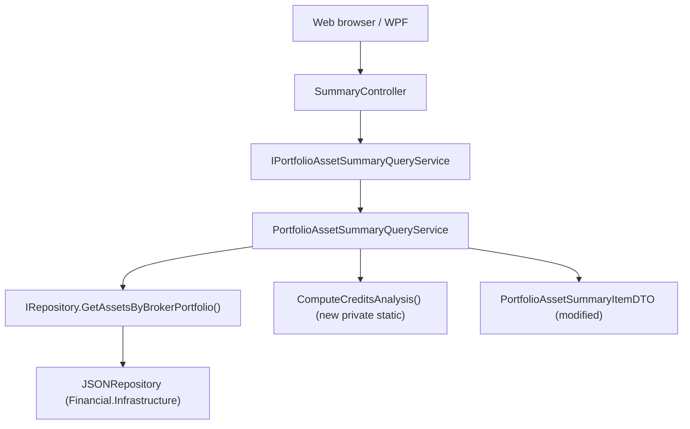

# Spec: P03-F01 — Credits Analysis — Service Enhancement

## 1. Technical Overview

**What:** Extends `PortfolioAssetSummaryItemDTO` with seven new fields — `LastMonthCredits`, `LastCreditMonth`, `LastMonthCreditsPercent`, `CreditFrequencyPerYear`, `EstimatedAnnualCredits`, `EstimatedAnnualPercent`, and `CurrentMonthCredits` — and extends `PortfolioAssetSummaryQueryService` with the corresponding computation logic, including a payment-frequency detection algorithm derived from each asset's credit history. No new endpoint or route is introduced; the existing `GET /api/v1/financial/summary/portfolio/{brokerName}/{portfolioName}/assets` response grows additively with no breaking change to existing fields.

**Why:** F02 (web) and F03 (WPF) need per-asset last-month credit data, frequency-derived annual income estimates, and current-month credits (for the portfolio footer total) without re-fetching credit history or duplicating the frequency algorithm across two UI implementations. Centralising the computation in the Application layer keeps domain data access behind `IRepository` and avoids repeating the detection logic in each frontend.

**Scope:**

Included:
- `PortfolioAssetSummaryItemDTO` — seven new nullable/zero-default properties, all `{ get; init; }`, following the existing sealed-class pattern
- `PortfolioAssetSummaryQueryService` — extend private `AssetComputedData` record with the seven new fields; add private static `ComputeCreditsAnalysis` method encapsulating all seven computations; capture `DateTime.Today` once per call and propagate it; update `ComputeAssetData` and `ToDTO` to include the new fields
- Unit tests covering all new computation paths (frequency detection variants, null paths, future-date exclusion, current-month matching)
- Integration test verifying the seven new fields appear in the HTTP response

Excluded:
- Any changes to `SummaryController` routing, HTTP method, or status codes
- Any changes to `ISummaryQueryService`, `SummaryQueryService`, or other controller actions
- Broker-level per-asset breakdown
- Timezone-aware "today" abstraction (`DateTime.Today` is sufficient for a personal app)
- Manual frequency override per asset (out of scope per PRD Section 7)

---

## 2. Architecture Impact

**Affected components:**



---

## 3. Technical Decisions

| Decision | Chosen Approach | Alternative Considered | Trade-off |
|----------|----------------|----------------------|-----------|
| Credits analysis computation location | Private static method `ComputeCreditsAnalysis` in `PortfolioAssetSummaryQueryService`, accepting `Asset` and `DateTime today` | Separate domain service or helper class | Consistent with `BuildCashFlows` already being a private static in the same class; avoids a new abstraction for logic that is only consumed here |
| "Today" capture strategy | `DateTime today` captured once at the top of `GetPortfolioAssetsSummary` and passed through `ComputeAssetData` to `ComputeCreditsAnalysis` | Call `DateTime.Today` inline inside the method | All assets in a single call share the same logical "today", eliminating a day-boundary edge case; tests set up data relative to `DateTime.Today` without needing an injectable clock |
| `AssetComputedData` extension | Add all seven new fields to the existing private record | Create a second intermediate record for credits-analysis fields | Keeps the two-step pipeline intact (compute → project to DTO) with a single record per asset; follows the P02-F01 pattern |
| Frequency detection scope | Use all credits (past and future) for distinct-month enumeration | Filter to `Date ≤ today` before computing frequency | PRD algorithm step 1 specifies "all distinct (Year, Month) combinations from the asset's credit history"; the future-date exclusion rule is stated only for `lastCreditMonth` and `lastMonthCredits` |
| Null handling for JSON serialisation | `null` values serialise as JSON `null` (ASP.NET Core default; no custom `JsonSerializerOptions` needed) | Omit null fields (`DefaultIgnoreCondition = WhenWritingNull`) | PRD Section 6 explicitly requires null fields to serialise as `null`, not to be omitted; the existing endpoint already serialises nulls this way |

---

## 4. Component Overview

### Backend

| File Path | New/Modified | Purpose | Key Responsibilities |
|-----------|--------------|---------|---------------------|
| `Financial.Application/DTOs/PortfolioAssetSummaryItemDTO.cs` | Modified | Response DTO per asset | Add `LastMonthCredits` (decimal), `LastCreditMonth` (string?), `LastMonthCreditsPercent` (decimal?), `CreditFrequencyPerYear` (int?), `EstimatedAnnualCredits` (decimal?), `EstimatedAnnualPercent` (decimal?), `CurrentMonthCredits` (decimal); all use `{ get; init; }`; non-nullable fields default to `0` |
| `Financial.Application/Services/PortfolioAssetSummaryQueryService.cs` | Modified | Query and mapping logic | Capture `DateTime.Today` once per call; add `ComputeCreditsAnalysis(Asset, DateTime)` private static method; extend `AssetComputedData` sealed record with seven new fields; update `ComputeAssetData` to call `ComputeCreditsAnalysis`; update `ToDTO` to propagate all seven fields |

---

## 5. API Contracts

### GET Portfolio Assets Summary (additive change to existing endpoint)

- **Method:** GET
- **Path:** `/api/v1/financial/summary/portfolio/{brokerName}/{portfolioName}/assets`
- **Authentication:** None

**Response (200 OK) — seven new fields added to each item:**

| Field | Type | Description |
|-------|------|-------------|
| `[].lastMonthCredits` | `decimal` | Sum of Credit `Value` for all credits with `Date ≤ today` whose (Year, Month) matches the most recent such credit month; `0` when the asset has no credits |
| `[].lastCreditMonth` | `string` \| `null` | Most recent credit month with `Date ≤ today`, formatted `"YYYY-MM"` (e.g., `"2026-06"`); `null` when no credits exist with `Date ≤ today` |
| `[].lastMonthCreditsPercent` | `decimal` \| `null` | `lastMonthCredits / totalInvested × 100`; `null` when `totalInvested` is `0` or `lastCreditMonth` is `null` |
| `[].creditFrequencyPerYear` | `integer` \| `null` | Detected payment periods per year from all distinct credit months: `12` (avg gap ≤ 1.5 mo), `4` (1.6–3.5 mo), `3` (3.6–5.0 mo); `null` when fewer than 2 distinct credit months exist or avg gap is outside all recognised ranges |
| `[].estimatedAnnualCredits` | `decimal` \| `null` | `lastMonthCredits × creditFrequencyPerYear`; `null` when `creditFrequencyPerYear` is `null` |
| `[].estimatedAnnualPercent` | `decimal` \| `null` | `estimatedAnnualCredits / totalInvested × 100`; `null` when `estimatedAnnualCredits` is `null` or `totalInvested` is `0` |
| `[].currentMonthCredits` | `decimal` | Sum of Credit `Value` for all credits whose `Date.Year` and `Date.Month` match today (no `≤ today` constraint); `0` when none exist in the current calendar month |

All existing fields (`assetName`, `ticker`, `exchange`, `firstInvestmentDate`, `currentQuantity`, `totalBought`, `totalSold`, `totalInvested`, `portfolioWeight`, `totalCredits`, `cashFlows`) are unchanged and unaffected.

**Response Example (200):**

```json
[
  {
    "assetName": "ALZR11",
    "ticker": "ALZR11",
    "exchange": "BVMF",
    "firstInvestmentDate": "2021-03-01T00:00:00",
    "currentQuantity": 20.0,
    "totalBought": 2500.00,
    "totalSold": 0.00,
    "totalInvested": 2500.00,
    "portfolioWeight": 100.0,
    "totalCredits": 125.00,
    "cashFlows": [
      { "date": "2021-03-01T00:00:00", "amount": -2500.00 },
      { "date": "2026-06-10T00:00:00", "amount": 12.50 }
    ],
    "lastMonthCredits": 12.50,
    "lastCreditMonth": "2026-06",
    "lastMonthCreditsPercent": 0.50,
    "creditFrequencyPerYear": 12,
    "estimatedAnnualCredits": 150.00,
    "estimatedAnnualPercent": 6.00,
    "currentMonthCredits": 0.00
  },
  {
    "assetName": "MXRF11",
    "ticker": "MXRF11",
    "exchange": "BVMF",
    "firstInvestmentDate": "2021-05-15T00:00:00",
    "currentQuantity": 0.0,
    "totalBought": 1200.00,
    "totalSold": 1200.00,
    "totalInvested": 0.00,
    "portfolioWeight": 0.0,
    "totalCredits": 0.00,
    "cashFlows": [
      { "date": "2021-05-15T00:00:00", "amount": -1200.00 },
      { "date": "2022-03-01T00:00:00", "amount": 1200.00 }
    ],
    "lastMonthCredits": 0.00,
    "lastCreditMonth": null,
    "lastMonthCreditsPercent": null,
    "creditFrequencyPerYear": null,
    "estimatedAnnualCredits": null,
    "estimatedAnnualPercent": null,
    "currentMonthCredits": 0.00
  }
]
```

**Error Codes:** Unchanged — `200` on success (including empty array), `400` when `brokerName` or `portfolioName` is null/empty/whitespace. No new error conditions.

---

## 6. Data Model

Not applicable. No persistence schema changes. All new values are computed at query time from `Asset.Credits` (`Credit.Date` and `Credit.Value`) already loaded in memory by `IRepository.GetAssetsByBrokerPortfolio`. No infrastructure changes required.

---

## 7. Testing Strategy

### Test File Structure

| Test File | Test Type | Target | Coverage Goal |
|-----------|-----------|--------|---------------|
| `Tests/Financial.Application.Tests/Services/PortfolioAssetSummaryQueryServiceTests.cs` | Unit | `PortfolioAssetSummaryQueryService` | All seven new fields, four frequency-detection scenarios, null paths, future-date exclusion, current-month matching |
| `Tests/Financial.Api.Tests/SummaryEndpointsTests.cs` | Integration | `SummaryController.GetPortfolioAssetsSummary` | Seven new fields present and valid in HTTP response |

### PortfolioAssetSummaryQueryServiceTests.cs (additions)

Follows the established pattern: inner `StubRepository`, `FluentAssertions` with `AssertionScope`, `[Theory][InlineData]` for variants. All existing tests remain and pass unchanged.

| Test Function | Description | Assertions |
|---|---|---|
| `GetPortfolioAssetsSummary_ReturnsLastMonthCredits_SumOfMostRecentMonthCredits` | Asset with two credits in a more-recent past month (10m + 8m) and one credit in an earlier month (20m) | `LastMonthCredits` equals `18m` |
| `GetPortfolioAssetsSummary_ReturnsLastMonthCredits_Zero_WhenNoCredits` | Asset with Buy transactions only, no credits | `LastMonthCredits` equals `0m` |
| `GetPortfolioAssetsSummary_ReturnsLastCreditMonth_FormattedYYYYMM` | Asset with a single past credit | `LastCreditMonth` formatted `"YYYY-MM"` matching the credit's year and month |
| `GetPortfolioAssetsSummary_ReturnsLastCreditMonth_Null_WhenNoCredits` | Asset with no credits | `LastCreditMonth` is `null` |
| `GetPortfolioAssetsSummary_ExcludesFutureCreditDatesFromLastMonthCalculation` | Asset with one past credit (value 10m) and one future-dated credit (value 99m) | `LastCreditMonth` reflects the past credit's month; `LastMonthCredits` equals `10m` (excludes the future credit) |
| `GetPortfolioAssetsSummary_ReturnsLastMonthCreditsPercent_Computed` | Asset with `LastMonthCredits = 10m`, `TotalInvested = 1000m` | `LastMonthCreditsPercent` equals `1m` |
| `GetPortfolioAssetsSummary_ReturnsLastMonthCreditsPercent_Null_WhenTotalInvestedIsZero` | Asset with equal `TotalBought` and `TotalSold` (net zero invested) and one past credit | `LastMonthCreditsPercent` is `null` |
| `GetPortfolioAssetsSummary_ReturnsLastMonthCreditsPercent_Null_WhenNoCredits` | Asset with no credits | `LastMonthCreditsPercent` is `null` |
| `GetPortfolioAssetsSummary_DetectsMonthlyFrequency` | Asset with credits in Jan, Feb, Mar of the same year (average gap 1.0 months) | `CreditFrequencyPerYear` equals `12` |
| `GetPortfolioAssetsSummary_DetectsQuarterlyFrequency` | Asset with credits in Jan, Apr, Jul of the same year (average gap 3.0 months) | `CreditFrequencyPerYear` equals `4` |
| `GetPortfolioAssetsSummary_DetectsFourMonthFrequency` | Asset with credits in Jan, May, Sep of the same year (average gap 4.0 months) | `CreditFrequencyPerYear` equals `3` |
| `GetPortfolioAssetsSummary_ReturnsNullFrequency_WhenOnlyOneDistinctCreditMonth` | Asset with multiple credits all falling in the same calendar month | `CreditFrequencyPerYear` is `null` |
| `GetPortfolioAssetsSummary_ReturnsNullFrequency_WhenGapOutsideKnownRanges` | Asset with credits in Jan and Sep of the same year (average gap 8.0 months) | `CreditFrequencyPerYear` is `null` |
| `GetPortfolioAssetsSummary_ReturnsEstimatedAnnualCredits_Computed` | Asset where `LastMonthCredits = 50m` and detected `CreditFrequencyPerYear = 12` | `EstimatedAnnualCredits` equals `600m` |
| `GetPortfolioAssetsSummary_ReturnsEstimatedAnnualCredits_Null_WhenFrequencyNull` | Asset with only one distinct credit month | `EstimatedAnnualCredits` is `null` |
| `GetPortfolioAssetsSummary_ReturnsEstimatedAnnualPercent_Computed` | Asset with `EstimatedAnnualCredits = 600m`, `TotalInvested = 10000m` | `EstimatedAnnualPercent` equals `6m` |
| `GetPortfolioAssetsSummary_ReturnsEstimatedAnnualPercent_Null_WhenEstimatedCreditsNull` | Asset with one distinct credit month | `EstimatedAnnualPercent` is `null` |
| `GetPortfolioAssetsSummary_ReturnsEstimatedAnnualPercent_Null_WhenTotalInvestedIsZero` | Asset with detectable frequency but equal `TotalBought`/`TotalSold` | `EstimatedAnnualPercent` is `null` |
| `GetPortfolioAssetsSummary_ReturnsCurrentMonthCredits_SumOfCurrentMonthCredits` | Asset with credits in the current calendar month and in a prior month | `CurrentMonthCredits` equals the sum of current-month credits only |
| `GetPortfolioAssetsSummary_ReturnsCurrentMonthCredits_Zero_WhenNoneInCurrentMonth` | Asset with credits only in months prior to the current month | `CurrentMonthCredits` equals `0m` |

### SummaryEndpointsTests.cs (addition)

Follows the same `ApiTestFactory` / `WebApplicationFactory<Program>` pattern as existing summary tests.

| Test Function | Description | Assertions |
|---|---|---|
| `GetPortfolioAssetsSummary_Returns200WithCreditsAnalysisFields` | `GET /api/v1/financial/summary/portfolio/XPI/Default/assets` against the real test data file | HTTP 200; every item has `LastMonthCredits ≥ 0`; every item has `CurrentMonthCredits ≥ 0`; every item where `LastCreditMonth != null` has a non-null `LastMonthCreditsPercent` or `TotalInvested == 0`; every item where `CreditFrequencyPerYear != null` has a non-null `EstimatedAnnualCredits` |

### Acceptance Test Mapping

| PRD Acceptance Criterion (Section 9 — F01) | Covered By |
|---|---|
| Response includes all 7 new fields for every item | `GetPortfolioAssetsSummary_Returns200WithCreditsAnalysisFields` |
| `lastMonthCredits` equals sum of credits in most recent credit month ≤ today | `GetPortfolioAssetsSummary_ReturnsLastMonthCredits_SumOfMostRecentMonthCredits` |
| `lastMonthCredits` is `0` when no credits | `GetPortfolioAssetsSummary_ReturnsLastMonthCredits_Zero_WhenNoCredits` |
| `lastCreditMonth` formatted `"YYYY-MM"`; `null` when no credits | `GetPortfolioAssetsSummary_ReturnsLastCreditMonth_FormattedYYYYMM` + `_Null_WhenNoCredits` |
| `lastMonthCreditsPercent` formula; `null` when `totalInvested = 0` or `lastCreditMonth` null | `GetPortfolioAssetsSummary_ReturnsLastMonthCreditsPercent_Computed` + `_Null_WhenTotalInvestedIsZero` + `_Null_WhenNoCredits` |
| `currentMonthCredits` equals sum of credits in current calendar month; `0` when none | `GetPortfolioAssetsSummary_ReturnsCurrentMonthCredits_SumOfCurrentMonthCredits` + `_Zero_WhenNoneInCurrentMonth` |
| Frequency detection — monthly (avg gap ≤ 1.5 mo → 12) | `GetPortfolioAssetsSummary_DetectsMonthlyFrequency` |
| Frequency detection — quarterly (avg gap 1.6–3.5 mo → 4) | `GetPortfolioAssetsSummary_DetectsQuarterlyFrequency` |
| Frequency detection — four-month (avg gap 3.6–5.0 mo → 3) | `GetPortfolioAssetsSummary_DetectsFourMonthFrequency` |
| Frequency detection — undetectable (< 2 distinct months) | `GetPortfolioAssetsSummary_ReturnsNullFrequency_WhenOnlyOneDistinctCreditMonth` |
| Frequency detection — undetectable (avg gap outside 0–5 mo) | `GetPortfolioAssetsSummary_ReturnsNullFrequency_WhenGapOutsideKnownRanges` |
| `estimatedAnnualCredits = lastMonthCredits × creditFrequencyPerYear`; `null` when frequency null | `GetPortfolioAssetsSummary_ReturnsEstimatedAnnualCredits_Computed` + `_Null_WhenFrequencyNull` |
| `estimatedAnnualPercent` formula; `null` when credits null or invested `0` | `GetPortfolioAssetsSummary_ReturnsEstimatedAnnualPercent_Computed` + `_Null_WhenEstimatedCreditsNull` + `_Null_WhenTotalInvestedIsZero` |
| Future-dated credits excluded from `lastCreditMonth` and `lastMonthCredits` | `GetPortfolioAssetsSummary_ExcludesFutureCreditDatesFromLastMonthCalculation` |
| Existing fields unchanged — P02 regression | All existing tests in `PortfolioAssetSummaryQueryServiceTests.cs` pass |
