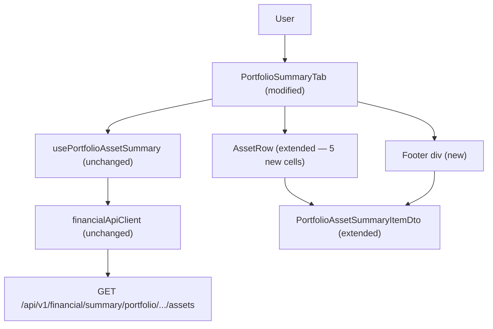

# Spec: P03-F02 — Credits Analysis Columns and Footer — Web Frontend

## 1. Technical Overview

**What:** Extends the existing `PortfolioSummaryTab` React component with five new credit-analysis columns appended after XIRR, a 3 px accent-colour left border on the first credit column as a visual group separator, and a footer `<div>` panel rendered below the table showing portfolio-level aggregates including a dynamically labelled current-month credits total. Also extends `PortfolioAssetSummaryItemDto` in `api/types.ts` to consume the seven new fields already returned by F01's endpoint.

**Why:** F01 extended the API response with seven credit-analysis fields, but the web table ignores them — they are transmitted and discarded. Extending the existing component and TypeScript type surfaces per-asset income metrics and a portfolio summary that users cannot currently see anywhere in the web interface, without requiring any backend change.

**Scope:**

Included:
- `api/types.ts` — extend `PortfolioAssetSummaryItemDto` with 7 new fields matching the F01 JSON response
- `PortfolioSummaryTab.tsx` — file-scoped `formatCreditMonth` helper (locale `'en-GB'`); 5 new `<th>` headers after XIRR; 5 new `<td>` cells in `AssetRow` with "—" null fallbacks; footer `<div>` with 5 aggregate items and three-state Current Value logic; dynamic "Credits [Mon YYYY]" label computed from `new Date()` at render time
- `PortfolioSummaryTab.css` — `.portfolio-summary__credits-separator` class for 3 px accent left border; `.portfolio-summary__footer` container; `.portfolio-summary__footer-item` label/value pair layout; `.portfolio-summary__footer-footnote` for asterisk footnote text
- `PortfolioSummaryTab.test.tsx` — extend `ITEM_1` fixture with 7 new fields; add 21 new test cases covering column rendering, null/"—" fallbacks, footer totals, Current Value three states, and separator class

Excluded:
- No separate footer component — all logic stays in `PortfolioSummaryTab.tsx`
- No changes to `usePortfolioAssetSummary`, `financialApiClient`, or `config.ts`
- No shared formatting module — `formatCreditMonth` follows the file-scoped helper pattern
- No interactive sorting or filtering on new columns
- No cross-currency conversion in footer totals

---

## 2. Architecture Impact

**Affected components:**



---

## 3. Technical Decisions

| Decision | Chosen Approach | Alternative Considered | Trade-off |
|----------|----------------|----------------------|-----------|
| Month locale for `formatCreditMonth` | `'en-GB'` explicit locale — always produces "Jun 2026" in English | `undefined` (system locale) matching other helpers | System locale produces "jun." on Portuguese-locale OS; English month abbreviations are conventional for financial column headers; personal app — one explicit choice is simpler than a locale-aware system |
| Visual separator implementation | CSS class `portfolio-summary__credits-separator` with `border-left: 3px solid var(--accent)` applied to the first credit `<th>` and each corresponding `<td>` via className | Empty separator column in the DOM | PRD explicitly prohibits inserting an extra column; a left-border CSS class achieves the same visual effect with zero DOM change |
| Current Value footer state machine | Three states: "Calculating…" (all prices pending), partial N2 sum + ` *` suffix + footnote (some resolved), clean N2 sum (all resolved) | Two states: "Calculating…" until all done (simpler; matches WPF) | PRD Capabilities explicitly describe the partial-sum-with-asterisk pattern for the web frontend; three states gives better incremental feedback as prices resolve row-by-row |
| Footer panel positioning | Sibling `<div>` in the `.portfolio-summary` flex column, rendered after `.portfolio-summary__table-section` | `<tfoot>` inside the `<table>` element | PRD explicitly requires a separate DOM element not inside the table; `<tfoot>` scrolls with the table; a sibling flex child stays anchored below the scroll area |
| Footer background colour | `var(--code-bg, #f4f3ec)` | New dedicated `--footer-bg` CSS variable | Reuses an existing subtle background already defined for both light and dark modes; avoids introducing a new variable in a personal app |

---

## 4. Component Overview

### Frontend

| File Path | New/Modified | Purpose | Key Responsibilities |
|-----------|--------------|---------|---------------------|
| `Financial.Web/src/api/types.ts` | Modified | API type definitions | Add 7 new fields to `PortfolioAssetSummaryItemDto`: `lastMonthCredits` (number), `lastCreditMonth` (string \| null), `lastMonthCreditsPercent` (number \| null), `creditFrequencyPerYear` (number \| null), `estimatedAnnualCredits` (number \| null), `estimatedAnnualPercent` (number \| null), `currentMonthCredits` (number) |
| `Financial.Web/src/components/PortfolioSummaryTab.tsx` | Modified | Portfolio asset table with credits columns and footer | Add `formatCreditMonth` file-scoped helper using `'en-GB'` locale; extend `<thead>` with 5 new column headers; extend `AssetRow` with 5 new `<td>` cells and "—" null fallbacks; add footer `<div>` with aggregated totals and three-state Current Value |
| `Financial.Web/src/components/PortfolioSummaryTab.css` | Modified | Table and footer styles | Add `.portfolio-summary__credits-separator` (3 px `var(--accent)` left border, applied to header and cells); add `.portfolio-summary__footer` flex container with `var(--code-bg)` background; add `.portfolio-summary__footer-item` label/value pair; add `.portfolio-summary__footer-footnote` for asterisk footnote |
| `Financial.Web/src/components/__tests__/PortfolioSummaryTab.test.tsx` | Modified | Component tests | Extend `ITEM_1` and any other fixtures with 7 new DTO fields; add 21 test cases covering new column rendering, null fallbacks, footer aggregates, Current Value states, and separator class presence |

---

## 5. API Contracts

No new endpoint. F01's `GET /api/v1/financial/summary/portfolio/{brokerName}/{portfolioName}/assets` already returns all seven fields. F02 only adds the TypeScript type declarations to consume them.

**TypeScript type additions to `PortfolioAssetSummaryItemDto`:**

| Field | Type | Notes |
|-------|------|-------|
| `lastMonthCredits` | `number` | Always present; `0` when the asset has no credits |
| `lastCreditMonth` | `string \| null` | `"YYYY-MM"` format (e.g., `"2026-06"`); `null` when no credits |
| `lastMonthCreditsPercent` | `number \| null` | `null` when `totalInvested` is `0` or `lastCreditMonth` is `null` |
| `creditFrequencyPerYear` | `number \| null` | `12`, `4`, or `3`; `null` when fewer than 2 distinct credit months or gap outside known ranges |
| `estimatedAnnualCredits` | `number \| null` | `null` when `creditFrequencyPerYear` is `null` |
| `estimatedAnnualPercent` | `number \| null` | `null` when `estimatedAnnualCredits` is `null` or `totalInvested` is `0` |
| `currentMonthCredits` | `number` | Always present; `0` when no credits in the current calendar month |

**Example response item (already produced by F01):**

```json
{
  "assetName": "ALZR11",
  "ticker": "ALZR11",
  "exchange": "BVMF",
  "firstInvestmentDate": "2021-03-01T00:00:00",
  "currentQuantity": 20.0,
  "totalBought": 2500.00,
  "totalSold": 0.00,
  "totalInvested": 2500.00,
  "portfolioWeight": 60.0,
  "totalCredits": 125.00,
  "cashFlows": [
    { "date": "2021-03-01T00:00:00", "amount": -2500.00 },
    { "date": "2026-06-10T00:00:00", "amount": 12.50 }
  ],
  "lastMonthCredits": 12.50,
  "lastCreditMonth": "2026-06",
  "lastMonthCreditsPercent": 0.50,
  "creditFrequencyPerYear": 12,
  "estimatedAnnualCredits": 150.00,
  "estimatedAnnualPercent": 6.00,
  "currentMonthCredits": 0.00
}
```

---

## 6. Data Model

Not applicable. F02 is a pure frontend change consuming an existing API response. No persistence changes, no migrations, no infrastructure changes required.

---

## 7. Testing Strategy

### Test File Structure

| Test File | Test Type | Target | Coverage Goal |
|-----------|-----------|--------|---------------|
| `Financial.Web/src/components/__tests__/PortfolioSummaryTab.test.tsx` | Unit | `PortfolioSummaryTab` | New column rendering, null/"—" fallbacks, footer aggregates, Current Value three states, separator class, footer DOM structure |

### PortfolioSummaryTab.test.tsx (additions)

Follows established patterns: `vi.mock` on `usePortfolioAssetSummary`, `Object.assign` to mutate mock state in `beforeEach`, `describe` blocks, snake_case test names, `@testing-library/react` queries. All 22 existing tests remain unchanged.

**Fixture extension:** `ITEM_1` (and any additional items) must be updated to include all 7 new fields; TypeScript will error otherwise once `PortfolioAssetSummaryItemDto` is extended.

| Test Function | Description | Assertions |
|---|---|---|
| `renders_five_new_column_headers_after_xirr` | Default render with items | `<th>` cells exist for "Last Month Credits", "Last Credit Month", "Last Month %", "Est. Annual Credits", "Est. Annual %" |
| `renders_last_month_credits_with_formatted_value` | `ITEM_1` has `lastMonthCredits = 12.50`, `lastCreditMonth = "2026-06"` | Cell shows "12.50" |
| `renders_last_month_credits_as_dash_when_no_credits` | `ITEM_1` has `lastMonthCredits = 0`, `lastCreditMonth = null` | Last Month Credits cell shows "—" |
| `renders_last_credit_month_in_mmm_yyyy_format` | `ITEM_1` has `lastCreditMonth = "2026-06"` | Cell shows "Jun 2026" |
| `renders_last_credit_month_as_dash_when_null` | `ITEM_1` has `lastCreditMonth = null` | Last Credit Month cell shows "—" |
| `renders_last_month_percent_with_percent_suffix` | `ITEM_1` has `lastMonthCreditsPercent = 1.25` | Cell shows "1.25%" |
| `renders_last_month_percent_as_dash_when_null` | `ITEM_1` has `lastMonthCreditsPercent = null` | Last Month % cell shows "—" |
| `renders_estimated_annual_credits_with_formatted_value` | `ITEM_1` has `estimatedAnnualCredits = 150.00` | Cell shows "150.00" |
| `renders_estimated_annual_credits_as_dash_when_null` | `ITEM_1` has `estimatedAnnualCredits = null` | Est. Annual Credits cell shows "—" |
| `renders_estimated_annual_percent_with_percent_suffix` | `ITEM_1` has `estimatedAnnualPercent = 6.00` | Cell shows "6.00%" |
| `renders_estimated_annual_percent_as_dash_when_null` | `ITEM_1` has `estimatedAnnualPercent = null` | Est. Annual % cell shows "—" |
| `renders_credits_separator_class_on_last_month_credits_header` | Default render with items | The "Last Month Credits" `<th>` has class `portfolio-summary__credits-separator` |
| `renders_footer_with_total_invested_sum` | Two items: `totalInvested` 1000 and 2000 | Footer Total Invested shows "3,000.00" |
| `renders_footer_with_total_credits_sum` | Two items: `totalCredits` 50 and 75 | Footer Total Credits shows "125.00" |
| `renders_footer_credits_label_with_current_month_and_year` | Render in July 2026 (vi.setSystemTime) | Footer label reads "Credits Jul 2026" |
| `renders_footer_current_month_credits_sum` | Two items: `currentMonthCredits` 10 and 20 | Footer credits value shows "30.00" |
| `renders_footer_estimated_annual_credits_sum_of_non_null` | Two items: `estimatedAnnualCredits` 600 and null | Footer Est. Annual Credits shows "600.00" |
| `renders_footer_estimated_annual_credits_as_dash_when_all_null` | All items have `estimatedAnnualCredits = null` | Footer Est. Annual Credits shows "—" |
| `renders_footer_current_value_as_calculating_when_all_prices_pending` | All row price states: `isLoading = true` | Footer Current Value shows "Calculating…" |
| `renders_footer_current_value_as_partial_sum_with_asterisk_while_prices_loading` | Two rows: one resolved (price 10, qty 5), one `isLoading = true` | Footer shows "50.00 *" and footnote "excludes assets with pending prices" |
| `renders_footer_current_value_as_clean_sum_when_all_prices_resolved` | All rows resolved with known prices | Footer shows clean N2 sum with no asterisk and no footnote |
| `footer_panel_is_not_inside_table_element` | Default render with items | The footer `<div>` exists in the DOM; no `<tfoot>` is present inside the `<table>` |

### Acceptance Test Mapping

| PRD Acceptance Criterion (Section 9 — F02) | Covered By |
|---|---|
| Five new columns after XIRR | `renders_five_new_column_headers_after_xirr` |
| Thick left border on "Last Month Credits" (no extra column) | `renders_credits_separator_class_on_last_month_credits_header` |
| New columns populated before price fetches complete | All column tests use DTO data only (no price state dependency) |
| No credits → "—" in Last Month Credits, Last Credit Month, Last Month % | `renders_last_month_credits_as_dash_when_no_credits`, `renders_last_credit_month_as_dash_when_null`, `renders_last_month_percent_as_dash_when_null` |
| < 2 distinct credit months → "—" in Est. Annual Credits and Est. Annual % | `renders_estimated_annual_credits_as_dash_when_null`, `renders_estimated_annual_percent_as_dash_when_null` |
| Last Credit Month in "MMM YYYY" format | `renders_last_credit_month_in_mmm_yyyy_format` |
| Last Month % as N2 + "%" suffix | `renders_last_month_percent_with_percent_suffix` |
| Est. Annual % as N2 + "%" suffix | `renders_estimated_annual_percent_with_percent_suffix` |
| Footer visible once data loaded | All footer tests render with loaded items |
| Footer items: Total Invested, Total Credits, Current Value, Credits [Mon YYYY], Est. Annual Credits | `renders_footer_with_total_invested_sum`, `renders_footer_with_total_credits_sum`, `renders_footer_current_value_*`, `renders_footer_credits_label_with_current_month_and_year`, `renders_footer_estimated_annual_credits_*` |
| Credits label includes current month/year | `renders_footer_credits_label_with_current_month_and_year` |
| Current Value three states | `renders_footer_current_value_as_calculating_*`, `_as_partial_sum_with_asterisk_*`, `_as_clean_sum_when_all_prices_resolved` |
| Footer is not a `<tr>` inside the table | `footer_panel_is_not_inside_table_element` |
| P02 regression check | All 22 existing tests remain and pass unchanged |

### Cross-Feature Integration (Section 9)

| PRD Cross-Feature Criterion | Covered By |
|---|---|
| F01 values used without transformation in F02 column rendering | `renders_last_month_credits_with_formatted_value` — DTO value maps 1:1 to displayed cell |
| `currentMonthCredits` summed by F02 for footer "Credits [Mon YYYY]" | `renders_footer_current_month_credits_sum` |
