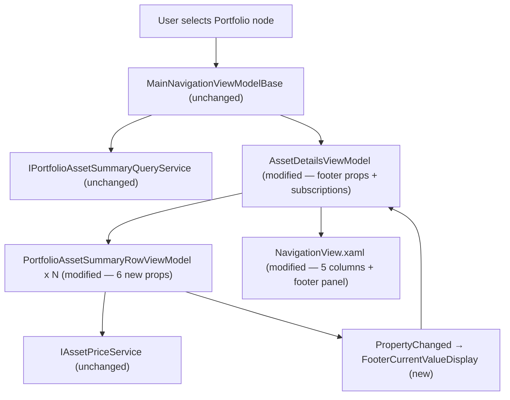

# Spec: P03-F03 — Credits Analysis Columns and Footer — WPF

## 1. Technical Overview

**What:** Extends the WPF desktop application's `PortfolioSummaryTemplate` DataGrid (established in P02-F03) with five new credit-analysis columns appended after XIRR, a 3 px accent-colour left border on the first credit column as a visual group separator, and a footer panel rendered as a separate XAML element below the DataGrid showing portfolio-level aggregates including a dynamically labelled current-month credits total.

**Why:** P03-F01 extended `PortfolioAssetSummaryItemDTO` with seven credit-analysis fields that are already passed through `IPortfolioAssetSummaryQueryService` and available in the WPF layer, but `PortfolioAssetSummaryRowViewModel` only reads up to `TotalCredits` and `CashFlows`. F03 surfaces the remaining fields in the row VM (for column binding) and in `AssetDetailsViewModel` (for footer aggregation), providing income-focused metrics consistent with the F02 web implementation.

**Scope:**

Included:
- `PortfolioAssetSummaryRowViewModel` — six new DTO-sourced properties + five new computed display string properties
- `AssetDetailsViewModel` — six new footer properties + per-row subscription logic for reactive `FooterCurrentValueDisplay`
- `NavigationView.xaml` — five new `DataGridTextColumn` entries after XIRR in `PortfolioSummaryTemplate`; `CellStyle` and `HeaderStyle` on "Last Month Credits" for 3 px left border; footer `Border` + `WrapPanel` added as a third Grid row

Excluded:
- No changes to `IAssetDetailsViewModel` — footer properties are consumed only by XAML (duck-typed) and unit tests that reference the concrete class directly
- No changes to `IPortfolioAssetSummaryQueryService`, `PortfolioAssetSummaryQueryService`, or any Application/Domain layer
- Broker node path is unaffected — only the Portfolio node `PortfolioSummaryTemplate` is modified
- No colour coding on credit-analysis columns (neutral foreground throughout)
- No interactive sorting or filtering on new columns

---

## 2. Architecture Impact

**Affected components:**

---

## 3. Technical Decisions

| Decision | Chosen Approach | Alternative Considered | Trade-off |
|----------|----------------|----------------------|-----------|
| Column group separator | `CellStyle` + `HeaderStyle` with `BorderThickness="3,0,0,0"` and `BorderBrush="#007ACC"` on the "Last Month Credits" `DataGridTextColumn` | Empty separator column | PRD explicitly prohibits an extra column; per-column style override achieves the same visual effect without changing the DataGrid column count |
| `FooterCurrentValueDisplay` reactivity | `AssetDetailsViewModel` subscribes to each row's `PropertyChanged` in `LoadPortfolioSummary`; subscription pairs stored in `_rowSubscriptions`; unsubscribed in `CancelAndResetRowPriceFetch` (the existing cleanup point that also cancels price fetches) | Polling or MultiBinding on `ObservableCollection` | Follows the existing `INotifyPropertyChanged` pattern in the VM layer; no polling overhead; deterministic cleanup prevents memory leaks via the same lifecycle hook that already cancels the price-fetch `CancellationTokenSource` |
| Footer property placement | On concrete `AssetDetailsViewModel` only — not added to `IAssetDetailsViewModel` | Add all footer properties to the interface | Footer properties are bound only in XAML (WPF binding is duck-typed, not interface-constrained) and accessed in unit tests that already construct `AssetDetailsViewModel` directly; the interface remains minimal |
| `LastCreditMonthDisplay` locale | `CultureInfo.InvariantCulture` for `DateTime.ParseExact` and `ToString("MMM yyyy")` | `CultureInfo.CurrentCulture` | Guarantees English month abbreviations ("Jun 2026") regardless of the OS locale; consistent with the web frontend's explicit `en-GB` locale choice in F02 |
| `DisplayLastMonthCredits` null condition | "—" when `LastCreditMonth` is null (the exact indicator per F01 spec that the asset has no credits ≤ today) | "—" when `LastMonthCredits == 0` | `LastMonthCredits` can be `0` for assets whose credits are in earlier months; `LastCreditMonth == null` is the precise signal that no credits exist |

---

## 4. Component Overview

### WPF Presentation Layer

| File Path | New/Modified | Purpose | Key Responsibilities |
|-----------|--------------|---------|---------------------|
| `Financial.App/ViewModels/PortfolioAssetSummaryRowViewModel.cs` | Modified | Per-row DataGrid ViewModel | Add six DTO-sourced properties from constructor; add five computed display strings with "—" null guards; all new display properties are static (computed at construction — not price-dependent, no `PropertyChanged` notification needed) |
| `Financial.App/ViewModels/AssetDetailsViewModel.cs` | Modified | Parent ViewModel orchestration | Add five `SetProperty`-backed footer fields; add computed `FooterCurrentValueDisplay`; add `_rowSubscriptions` list with `SubscribeToRowPriceChanges` / `UnsubscribeFromRowPriceChanges` helpers; update `LoadPortfolioSummary` to populate footer and subscribe; update `CancelAndResetRowPriceFetch` to call `UnsubscribeFromRowPriceChanges`; update `Clear()` to reset footer backing fields |
| `Financial.App/Components/NavigationView.xaml` | Modified | Main layout XAML | Add five `DataGridTextColumn` definitions after XIRR in `PortfolioSummaryTemplate`; apply `CellStyle`/`HeaderStyle` on "Last Month Credits"; add `RowDefinition Height="Auto"` as Grid Row 2; add footer `Border` + `WrapPanel` at `Grid.Row="2"` |

**`PortfolioAssetSummaryRowViewModel` — new properties and display strings:**

| Member | Type | Source / Formula |
|--------|------|-----------------|
| `LastMonthCredits` | `decimal` | `dto.LastMonthCredits` |
| `LastCreditMonth` | `string?` | `dto.LastCreditMonth` |
| `LastMonthCreditsPercent` | `decimal?` | `dto.LastMonthCreditsPercent` |
| `EstimatedAnnualCredits` | `decimal?` | `dto.EstimatedAnnualCredits` |
| `EstimatedAnnualPercent` | `decimal?` | `dto.EstimatedAnnualPercent` |
| `CurrentMonthCredits` | `decimal` | `dto.CurrentMonthCredits` |
| `DisplayLastMonthCredits` | `string` | `"—"` when `LastCreditMonth` is null; else `LastMonthCredits.ToString("N2")` |
| `LastCreditMonthDisplay` | `string` | `"—"` when `LastCreditMonth` is null; else `DateTime.ParseExact(LastCreditMonth, "yyyy-MM", CultureInfo.InvariantCulture).ToString("MMM yyyy", CultureInfo.InvariantCulture)` (e.g., `"Jun 2026"`) |
| `DisplayLastMonthCreditsPercent` | `string` | `"—"` when null; else `$"{LastMonthCreditsPercent.Value:F2}%"` |
| `DisplayEstimatedAnnualCredits` | `string` | `"—"` when null; else `EstimatedAnnualCredits.Value.ToString("N2")` |
| `DisplayEstimatedAnnualPercent` | `string` | `"—"` when null; else `$"{EstimatedAnnualPercent.Value:F2}%"` |

**`AssetDetailsViewModel` — new footer members:**

| Member | Type | Description |
|--------|------|-------------|
| `FooterTotalInvested` | `decimal` | `SetProperty`-backed; sum of `TotalInvested` across all rows; set in `LoadPortfolioSummary`, reset to `0m` in `Clear()` |
| `FooterTotalCredits` | `decimal` | `SetProperty`-backed; sum of `TotalCredits` across all rows; set in `LoadPortfolioSummary`, reset to `0m` in `Clear()` |
| `FooterCurrentMonthCredits` | `decimal` | `SetProperty`-backed; sum of `CurrentMonthCredits` across all rows; set in `LoadPortfolioSummary`, reset to `0m` in `Clear()` |
| `FooterCurrentMonthLabel` | `string` | `SetProperty`-backed; `"Credits " + DateTime.Today.ToString("MMM yyyy", CultureInfo.InvariantCulture)` (e.g., `"Credits Jul 2026"`); set in `LoadPortfolioSummary`, reset to `string.Empty` in `Clear()` |
| `FooterEstimatedAnnualCreditsDisplay` | `string` | `SetProperty`-backed; `"—"` when no row has a non-null `EstimatedAnnualCredits`; else N2 sum of non-null values; set in `LoadPortfolioSummary`, reset to `"—"` in `Clear()` |
| `FooterCurrentValueDisplay` | `string` | Computed property (no backing field); `"Calculating…"` when `PortfolioAssetSummaryRows` is empty or any row has `IsLoadingPrice = true`; else N2 sum of `CurrentValue ?? 0m`; `OnPropertyChanged` triggered by per-row subscription handler |
| `_rowSubscriptions` | `List<(PortfolioAssetSummaryRowViewModel Row, PropertyChangedEventHandler Handler)>` | Stores subscription pairs for deterministic unsubscription; unsubscribed and cleared in `UnsubscribeFromRowPriceChanges()` |

**Row subscription lifecycle:**

- `LoadPortfolioSummary`: after adding each row to `PortfolioAssetSummaryRows`, call `SubscribeToRowPriceChanges(row)`. The handler fires `OnPropertyChanged(nameof(FooterCurrentValueDisplay))` whenever the row raises `PropertyChanged` for `IsLoadingPrice` or `CurrentValue`.
- `CancelAndResetRowPriceFetch`: call `UnsubscribeFromRowPriceChanges()` before the existing CTS cancellation and disposal. This ensures subscriptions are removed before rows are cleared on the next `LoadPortfolioSummary` call.
- `Clear()`: footer backing fields reset after `CancelAndResetRowPriceFetch()` (which already unsubscribes).

### Tests

| File Path | New/Modified | Purpose | Key Responsibilities |
|-----------|--------------|---------|---------------------|
| `Tests/Financial.Presentation.Tests/ViewModels/PortfolioAssetSummaryRowViewModelTests.cs` | Modified | Unit tests for row VM | Extend `BuildRow` factory to accept the six F01 credit-analysis fields with sensible defaults; add 10 tests for all five new Display* properties and their null "—" guards |
| `Tests/Financial.Presentation.Tests/ViewModels/AssetDetailsViewModelPortfolioSummaryTests.cs` | Modified | Unit tests for parent VM footer | Extend DTO builder for F01 credit fields; add 9 tests covering footer population, two-state `FooterCurrentValueDisplay`, and `Clear()` reset |

---

## 5. API Contracts

Not applicable. F03 consumes the existing `IPortfolioAssetSummaryQueryService.GetPortfolioAssetsSummary` (already implemented and returning all seven F01 fields) and the existing `IAssetPriceService`. No HTTP endpoints are added or modified.

---

## 6. Data Model

Not applicable. No persistence changes. All new state is in-memory within the WPF ViewModel lifecycle.

---

## 7. Testing Strategy

### Test File Structure

| Test File | Test Type | Target | Coverage Goal |
|-----------|-----------|--------|---------------|
| `Tests/Financial.Presentation.Tests/ViewModels/PortfolioAssetSummaryRowViewModelTests.cs` | Unit | `PortfolioAssetSummaryRowViewModel` | All five new Display* properties, null/"—" guard conditions per property |
| `Tests/Financial.Presentation.Tests/ViewModels/AssetDetailsViewModelPortfolioSummaryTests.cs` | Unit | `AssetDetailsViewModel` | Footer property population from row data, `FooterCurrentValueDisplay` two-state reactivity, `Clear()` reset |

### PortfolioAssetSummaryRowViewModelTests.cs (additions)

Extend the existing private `BuildRow` factory to accept six new optional parameters (`lastMonthCredits`, `lastCreditMonth`, `lastMonthCreditsPercent`, `estimatedAnnualCredits`, `estimatedAnnualPercent`, `currentMonthCredits`) with defaults matching "no credits" state (`0m`, `null`, `null`, `null`, `null`, `0m`). The factory passes these values into `PortfolioAssetSummaryItemDTO` so the constructor can map them to the new row VM properties.

| Test Function | Description | Assertions |
|---------------|-------------|------------|
| `DisplayLastMonthCredits_WhenLastCreditMonthIsNotNull_FormatsN2` | `lastMonthCredits = 12.50m`, `lastCreditMonth = "2026-06"` | `DisplayLastMonthCredits` equals `"12.50"` |
| `DisplayLastMonthCredits_WhenLastCreditMonthIsNull_ReturnsDash` | `lastCreditMonth = null` (default) | `DisplayLastMonthCredits` equals `"—"` |
| `LastCreditMonthDisplay_WhenNotNull_FormatsAsMMMYyyy` | `lastCreditMonth = "2026-06"` | `LastCreditMonthDisplay` equals `"Jun 2026"` |
| `LastCreditMonthDisplay_WhenNull_ReturnsDash` | `lastCreditMonth = null` | `LastCreditMonthDisplay` equals `"—"` |
| `DisplayLastMonthCreditsPercent_WhenNotNull_FormatsF2Percent` | `lastMonthCreditsPercent = 1.25m` | `DisplayLastMonthCreditsPercent` equals `"1.25%"` |
| `DisplayLastMonthCreditsPercent_WhenNull_ReturnsDash` | `lastMonthCreditsPercent = null` | `DisplayLastMonthCreditsPercent` equals `"—"` |
| `DisplayEstimatedAnnualCredits_WhenNotNull_FormatsN2` | `estimatedAnnualCredits = 150.00m` | `DisplayEstimatedAnnualCredits` equals `"150.00"` |
| `DisplayEstimatedAnnualCredits_WhenNull_ReturnsDash` | `estimatedAnnualCredits = null` | `DisplayEstimatedAnnualCredits` equals `"—"` |
| `DisplayEstimatedAnnualPercent_WhenNotNull_FormatsF2Percent` | `estimatedAnnualPercent = 6.00m` | `DisplayEstimatedAnnualPercent` equals `"6.00%"` |
| `DisplayEstimatedAnnualPercent_WhenNull_ReturnsDash` | `estimatedAnnualPercent = null` | `DisplayEstimatedAnnualPercent` equals `"—"` |

### AssetDetailsViewModelPortfolioSummaryTests.cs (additions)

Reuses the existing `BuildViewModel` factory, `NeverResolvingPriceService` (keeps rows in `IsLoadingPrice = true`), and stub services. Extend the local DTO builder for the six F01 credit-analysis fields. For `FooterCurrentValueDisplay_WhenAllPricesResolved_ReturnsSumN2`, call `ApplyPrice` directly on each row VM after `LoadPortfolioSummary` returns (bypassing the async price fetch), simulating resolved price state in a synchronous test.

| Test Function | Description | Assertions |
|---------------|-------------|------------|
| `LoadPortfolioSummary_SetsFooterTotalInvested_SumOfRows` | Two rows: `TotalInvested` 1000m and 2000m | `FooterTotalInvested` equals `3000m` |
| `LoadPortfolioSummary_SetsFooterTotalCredits_SumOfRows` | Two rows: `TotalCredits` 50m and 75m | `FooterTotalCredits` equals `125m` |
| `LoadPortfolioSummary_SetsFooterCurrentMonthCredits_SumOfRows` | Two rows: `CurrentMonthCredits` 10m and 20m | `FooterCurrentMonthCredits` equals `30m` |
| `LoadPortfolioSummary_SetsFooterCurrentMonthLabel_IncludesCreditsAndMonthYear` | Rows loaded (any data) | `FooterCurrentMonthLabel` starts with `"Credits "` and contains a 3-letter month abbreviation followed by a 4-digit year (regex `"Credits [A-Z][a-z]{2} \d{4}"`) |
| `LoadPortfolioSummary_SetsFooterEstimatedAnnualCreditsDisplay_SumOfNonNull` | Two rows: `EstimatedAnnualCredits` 600m and null | `FooterEstimatedAnnualCreditsDisplay` equals `"600.00"` |
| `LoadPortfolioSummary_SetsFooterEstimatedAnnualCreditsDisplay_DashWhenAllNull` | All rows have `EstimatedAnnualCredits = null` | `FooterEstimatedAnnualCreditsDisplay` equals `"—"` |
| `FooterCurrentValueDisplay_WhenAnyRowIsLoading_ReturnsCalculating` | `NeverResolvingPriceService` — all rows remain `IsLoadingPrice = true` | `FooterCurrentValueDisplay` equals `"Calculating…"` |
| `FooterCurrentValueDisplay_WhenAllPricesResolved_ReturnsSumN2` | Two rows; `ApplyPrice(10m)` called on first (qty 5 → CV 50m), `ApplyPrice(20m)` on second (qty 2 → CV 40m) | `FooterCurrentValueDisplay` equals `"90.00"` |
| `Clear_AfterLoadPortfolioSummary_ResetsFooterProperties` | Load then `Clear()` | `FooterTotalInvested` equals `0m`; `FooterTotalCredits` equals `0m`; `FooterCurrentMonthCredits` equals `0m`; `FooterCurrentMonthLabel` equals `string.Empty`; `FooterEstimatedAnnualCreditsDisplay` equals `"—"` |

### Acceptance Test Mapping

| PRD Acceptance Criterion (Section 9 — F03) | Covered By |
|--------------------------------------------|------------|
| Five new DataGrid columns after XIRR | `PortfolioSummaryTemplate` DataGrid column definitions in `NavigationView.xaml` (visual) |
| "Last Month Credits" has thick left border separating it from XIRR | `CellStyle`/`HeaderStyle` on that column in `NavigationView.xaml` |
| New columns populated before price fetches complete | All new `Display*` props are set at construction time; `LoadPortfolioSummary_RowsInitiallyShowLoadingPrice` (existing) confirms price is still loading |
| No credits → "—" in Last Month Credits, Last Credit Month, Last Month % | `DisplayLastMonthCredits_WhenLastCreditMonthIsNull_ReturnsDash` + `LastCreditMonthDisplay_WhenNull_ReturnsDash` + `DisplayLastMonthCreditsPercent_WhenNull_ReturnsDash` |
| < 2 distinct credit months → "—" in Est. Annual Credits and Est. Annual % | `DisplayEstimatedAnnualCredits_WhenNull_ReturnsDash` + `DisplayEstimatedAnnualPercent_WhenNull_ReturnsDash` |
| Last Credit Month in "MMM yyyy" format (e.g., "Jun 2026") | `LastCreditMonthDisplay_WhenNotNull_FormatsAsMMMYyyy` |
| Footer panel is a separate XAML element below the DataGrid (not a DataGrid row) | `Border` at `Grid.Row="2"` outside the `DataGrid` in `NavigationView.xaml` |
| Footer shows: Total Invested, Total Credits, Current Value, Credits [Mon yyyy], Est. Annual Credits | `LoadPortfolioSummary_SetsFooterTotalInvested_SumOfRows` + `_SetsFooterTotalCredits_SumOfRows` + `FooterCurrentValueDisplay_*` + `_SetsFooterCurrentMonthCredits_SumOfRows` + `_SetsFooterEstimatedAnnualCreditsDisplay_*` |
| Footer "Credits" label includes current month and year | `LoadPortfolioSummary_SetsFooterCurrentMonthLabel_IncludesCreditsAndMonthYear` |
| Current Value shows "Calculating…" while loading; updates as prices resolve | `FooterCurrentValueDisplay_WhenAnyRowIsLoading_ReturnsCalculating` + `_WhenAllPricesResolved_ReturnsSumN2` |
| P02 regression: all existing DataGrid columns and three colour-coded totals unaffected | All existing `PortfolioAssetSummaryRowViewModelTests.cs` and `AssetDetailsViewModelPortfolioSummaryTests.cs` tests pass unchanged |

### Cross-Feature Integration (Section 9)

| PRD Cross-Feature Criterion | Covered By |
|-----------------------------|------------|
| F01 fields used without transformation in F03 row VM properties | `DisplayLastMonthCredits_WhenLastCreditMonthIsNotNull_FormatsN2` — DTO value maps 1:1 to row VM property |
| `currentMonthCredits` from F01 summed by F03 for WPF footer "Credits [Mon yyyy]" total | `LoadPortfolioSummary_SetsFooterCurrentMonthCredits_SumOfRows` |
