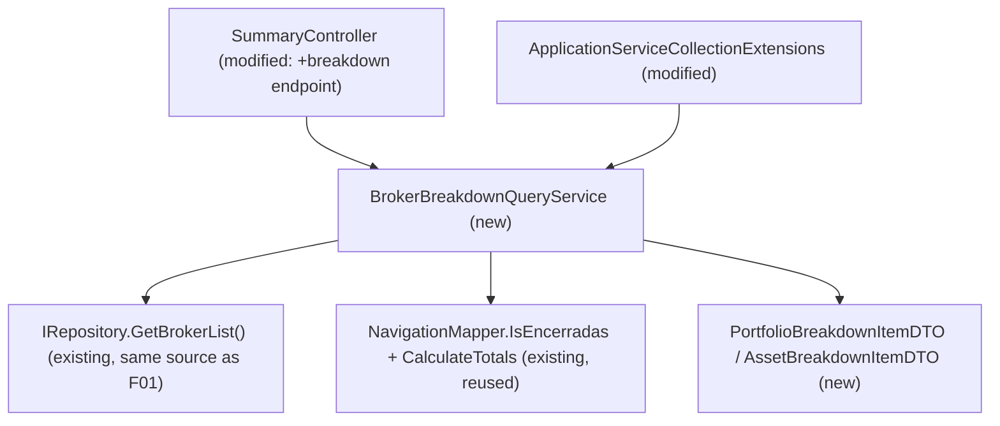

# Spec: F02 — Broker Portfolio & Asset Breakdown Service — Application Layer

## 1. Technical Overview

**What:** Adds a new read-only query, `IBrokerBreakdownQueryService.GetBrokerBreakdown(brokerName)`, exposed via `GET /summary/broker/{brokerName}/breakdown`, that returns a nested list of a broker's eligible portfolios, each with its Total Invested value and its own list of eligible assets with their individual Total Invested values. This is the data source for the pie charts introduced in F07 (Web) and F08 (WPF).

**Why:** F07/F08 need chart-ready, pre-filtered data — portfolios and assets with meaningless or zero-sized slices already removed — rather than raw totals the frontend would have to filter and normalize itself. The PRD's F02 Consumes block references "the same active-asset and Encerradas-exclusion rules" as F01; in practice this is not a data dependency on F01's DTO or endpoint output, but a code-level reuse of the same domain rules F01 already established: `Asset.Active` (`Quantity > 0`) and `NavigationMapper.IsEncerradas`, the latter widened from `private` to `internal` in F01 specifically so other Application-layer services could reuse it instead of duplicating the comparison.

**Scope:**

Included:
- `IBrokerBreakdownQueryService` interface and `BrokerBreakdownQueryService` implementation in the Application layer
- `PortfolioBreakdownItemDTO` and `AssetBreakdownItemDTO` in `Financial.Application/DTOs/`
- New endpoint `GET /summary/broker/{brokerName}/breakdown` on the existing `SummaryController`
- DI registration in `ApplicationServiceCollectionExtensions`
- Unit tests for `BrokerBreakdownQueryService`
- Integration tests for the new endpoint

Excluded:
- Any Presentation-layer (Web or WPF) chart rendering — covered by F07 and F08
- Percentage computation (slice ÷ sum of sibling slices) — left to the frontend, consistent with how `PortfolioWeight` is computed client-side elsewhere; this service returns raw `TotalInvested` values only
- Any change to `SummaryQueryService`, `PortfolioAssetSummaryQueryService`, or their existing endpoints
- Current market value or live price data — breakdown slices are sized by historical cost basis (`TotalInvested`), not current value

---

## 2. Architecture Impact

**Affected components:**



---

## 3. Technical Decisions

| Decision | Chosen Approach | Alternative Considered | Trade-off |
|----------|----------------|----------------------|-----------|
| Service shape | New `IBrokerBreakdownQueryService` / `BrokerBreakdownQueryService`, registered as its own singleton | Add `GetBrokerBreakdown` to the existing `ISummaryQueryService` | Matches the established one-interface-per-query-concern pattern (`ISummaryQueryService` for flat totals, `IPortfolioAssetSummaryQueryService` for per-asset breakdown); keeps `ISummaryQueryService` focused on its existing flat-DTO shape instead of mixing in a nested response type |
| Portfolio/asset data source | Reuse `IRepository.GetBrokerList()`, identical to F01's `SummaryQueryService.GetBrokerSummary` | Add a new repository method scoped to this feature | Same broker/portfolio/asset tree F01 already uses for the same Encerradas-exclusion need; no new `IRepository` surface required |
| Where "eligible" is decided | A portfolio's slice = sum of its own eligible assets' `TotalInvested` (assets with `Active == true` and individual `TotalInvested > 0`); a portfolio is included only if it has at least one eligible asset | Portfolio slice = raw net `TotalInvested` across all active assets (including negative-`TotalInvested` ones) | Per PRD Capabilities, this keeps a portfolio's top-level slice exactly equal to the sum of its own per-asset pie's slices, so the two charts (F07/F08) never show inconsistent totals for the same portfolio |

---

## 4. Component Overview

**Backend:**

| File Path | New/Modified | Purpose | Key Responsibilities |
|-----------|--------------|---------|---------------------|
| `Financial.Application/DTOs/PortfolioBreakdownItemDTO.cs` | New | Portfolio-level breakdown entry | `PortfolioName` (`string`), `TotalInvested` (`decimal`), `Assets` (`IReadOnlyList<AssetBreakdownItemDTO>`) |
| `Financial.Application/DTOs/AssetBreakdownItemDTO.cs` | New | Asset-level breakdown entry | `AssetName` (`string`), `TotalInvested` (`decimal`) |
| `Financial.Application/Interfaces/IBrokerBreakdownQueryService.cs` | New | Service contract | `IReadOnlyList<PortfolioBreakdownItemDTO> GetBrokerBreakdown(string brokerName)` |
| `Financial.Application/Services/BrokerBreakdownQueryService.cs` | New | Breakdown computation | Guards null/whitespace `brokerName` (returns `[]`); looks up the broker via `GetBrokerList()`, returns `[]` if not found; excludes the Encerradas portfolio via `NavigationMapper.IsEncerradas`; per remaining portfolio, computes each active asset's `TotalInvested` via `NavigationMapper.CalculateTotals`, keeps only assets with `TotalInvested > 0`; keeps only portfolios with at least one qualifying asset; sorts portfolios and assets alphabetically (`StringComparer.CurrentCultureIgnoreCase`) |
| `Financial.Api/Controllers/SummaryController.cs` | Modified | HTTP endpoint | Add `GET summary/broker/{brokerName}/breakdown`, injecting `IBrokerBreakdownQueryService`; returns `BadRequest()` when `brokerName` is null/whitespace, otherwise `Ok(result)` |
| `Financial.Application/DependencyInjection/ApplicationServiceCollectionExtensions.cs` | Modified | DI registration | `services.AddSingleton<IBrokerBreakdownQueryService, BrokerBreakdownQueryService>();`, following the existing registration style |
| `Tests/Financial.Application.Tests/Services/BrokerBreakdownQueryServiceTests.cs` | New | Unit tests | Covers exclusion rules, slice omission, sorting, and empty-result edge cases |
| `Tests/Financial.Api.Tests/SummaryEndpointsTests.cs` | Modified | Integration tests | Adds coverage for the new breakdown endpoint's 200 and 400 responses |

---

## 5. API Contracts

### `GET /summary/broker/{brokerName}/breakdown` (new endpoint)

- **Method:** GET
- **Path:** `/api/v1/financial/summary/broker/{brokerName}/breakdown`
- **Authentication:** None (matches existing summary endpoints)

**Response (Success - 200):**

| Field | Type | Description |
|-------|------|-------------|
| `portfolioName` | `string` | Portfolio name; the Encerradas portfolio never appears |
| `totalInvested` | `decimal` | Sum of this portfolio's included assets' `totalInvested`; always `> 0` |
| `assets` | `array` | This portfolio's eligible assets (`Active == true` and individual `totalInvested > 0`) |
| `assets[].assetName` | `string` | Asset name |
| `assets[].totalInvested` | `decimal` | `TotalBought − TotalSold` for that asset; always `> 0` (assets with `<= 0` are omitted, not included with a non-positive value) |

**Response Example:**
```json
[
  {
    "portfolioName": "Default",
    "totalInvested": 12500.00,
    "assets": [
      { "assetName": "ALZR11", "totalInvested": 8000.00 },
      { "assetName": "MXRF11", "totalInvested": 4500.00 }
    ]
  },
  {
    "portfolioName": "Growth",
    "totalInvested": 3000.00,
    "assets": [
      { "assetName": "VALE3", "totalInvested": 3000.00 }
    ]
  }
]
```

**Response (empty broker/no eligible portfolios - 200):**
```json
[]
```

**Error Codes:**

| Code | HTTP Status | Description |
|------|-------------|-------------|
| N/A | 400 | `brokerName` is null or whitespace (matches the existing `/summary/portfolio/{brokerName}/{portfolioName}/assets` endpoint's validation style) |

---

## 6. Data Model

Not applicable. No persistence schema changes; the breakdown is computed at query time from `Asset.Transactions`, identical in nature to F01's totals computation.

---

## 7. Testing Strategy

### Test File Structure

| Test File | Test Type | Target | Coverage Goal |
|-----------|-----------|--------|---------------|
| `Tests/Financial.Application.Tests/Services/BrokerBreakdownQueryServiceTests.cs` | Unit | `BrokerBreakdownQueryService` | Exclusion rules (Encerradas, inactive assets, non-positive slices), portfolio-level omission, sorting, empty/unknown-broker edge cases |
| `Tests/Financial.Api.Tests/SummaryEndpointsTests.cs` | Integration | `GET /summary/broker/{brokerName}/breakdown` | Live HTTP 200/400 responses and response shape |

### BrokerBreakdownQueryServiceTests.cs

Follows the `StubRepository` pattern established in `SummaryQueryServiceTests.cs` (a `Brokers` property backing `GetBrokerList()`), built with `Broker.Create(...)`, `broker.AddPortfolio(...)`, `portfolio.AddAsset(...)`.

| Test Function | Description | Assertions |
|---------------|-------------|------------|
| `GetBrokerBreakdown_ReturnsPortfolioWithTotalInvested` | One portfolio, one asset bought 500, sold 100 | Result has one portfolio entry with `TotalInvested = 400` |
| `GetBrokerBreakdown_ReturnsAssetsWithinPortfolio` | Portfolio with two assets, both `TotalInvested > 0` | Portfolio's `Assets` contains both, each with correct `TotalInvested` |
| `GetBrokerBreakdown_PortfolioTotalInvested_EqualsSumOfIncludedAssets` | Portfolio with three assets, one of which is excluded (see next test) | Portfolio `TotalInvested` equals the sum of only the two included assets, not all three |
| `GetBrokerBreakdown_ExcludesAssetsWithNonPositiveTotalInvested` | One asset bought 100 (positive), one asset bought 50/sold 80 (negative) | Only the positive asset appears in `Assets` |
| `GetBrokerBreakdown_ExcludesInactiveAssets` | One active asset, one fully-sold (`Quantity == 0`) asset | Only the active asset appears |
| `GetBrokerBreakdown_ExcludesEncerradasPortfolio` | Broker has "Default" and "Encerradas" portfolios, both with qualifying assets | Result contains only "Default" |
| `GetBrokerBreakdown_ExcludesEncerradasPortfolio_CaseInsensitive` | Portfolio named `"encerradas"` | Still excluded |
| `GetBrokerBreakdown_OmitsPortfolioWithNoQualifyingAssets` | Portfolio where every asset is inactive or has non-positive `TotalInvested` | That portfolio does not appear in the result at all (not an empty-`Assets` entry) |
| `GetBrokerBreakdown_SortsPortfoliosAlphabetically` | Portfolios "Zeta" and "Alpha", both qualifying | Result order is "Alpha", "Zeta" |
| `GetBrokerBreakdown_SortsAssetsAlphabeticallyWithinPortfolio` | Portfolio with assets "ZZZZ3" and "AAAA3" | `Assets` order is "AAAA3", "ZZZZ3" |
| `GetBrokerBreakdown_ReturnsEmptyForUnknownBroker` | `Brokers` has entries, none matching requested name | Returns `[]` |
| `GetBrokerBreakdown_ReturnsEmptyWhenNoEligiblePortfolios` | Broker exists but every portfolio is Encerradas or has no qualifying assets | Returns `[]` |
| `GetBrokerBreakdown_ReturnsEmptyOnNullOrWhitespaceBrokerName` (`Theory`: `null`, `""`, `"   "`) | Invalid input | Returns `[]`; `GetBrokerList()` never queried |

### SummaryEndpointsTests.cs — new tests

| Test Function | Description | Assertions |
|---------------|-------------|------------|
| `GetBrokerBreakdown_Returns200WithList` | Call `/summary/broker/XPI/breakdown` | 200 OK; deserializes to a list; each portfolio's `TotalInvested` is `> 0` and equals the sum of its `Assets[].TotalInvested`; every `Assets[].TotalInvested` is `> 0` |
| `GetBrokerBreakdown_Returns400ForWhitespaceBrokerName` | Call `/summary/broker/%20/breakdown` | 400 Bad Request |

### Acceptance Test Mapping

| PRD Acceptance Criterion (Section 9 — F02) | Covered By |
|---------------------------------------------|------------|
| `GET /summary/broker/{brokerName}/breakdown` returns HTTP 200 with a list of portfolios, each with `portfolioName`, `totalInvested`, and an `assets` array | `GetBrokerBreakdown_Returns200WithList` + `GetBrokerBreakdown_ReturnsPortfolioWithTotalInvested` + `GetBrokerBreakdown_ReturnsAssetsWithinPortfolio` |
| The Encerradas portfolio never appears in the response | `GetBrokerBreakdown_ExcludesEncerradasPortfolio` + `GetBrokerBreakdown_ExcludesEncerradasPortfolio_CaseInsensitive` |
| Assets with `Quantity == 0` or `totalInvested <= 0` never appear in a portfolio's `assets` array | `GetBrokerBreakdown_ExcludesInactiveAssets` + `GetBrokerBreakdown_ExcludesAssetsWithNonPositiveTotalInvested` |
| A portfolio's `totalInvested` equals the sum of its included assets' `totalInvested` | `GetBrokerBreakdown_PortfolioTotalInvested_EqualsSumOfIncludedAssets` |
| A portfolio with zero qualifying assets is omitted entirely from the response | `GetBrokerBreakdown_OmitsPortfolioWithNoQualifyingAssets` |
| Portfolios and assets are sorted alphabetically by name | `GetBrokerBreakdown_SortsPortfoliosAlphabetically` + `GetBrokerBreakdown_SortsAssetsAlphabeticallyWithinPortfolio` |
| Returns `[]` with HTTP 200 when the broker has no eligible portfolios | `GetBrokerBreakdown_ReturnsEmptyForUnknownBroker` + `GetBrokerBreakdown_ReturnsEmptyWhenNoEligiblePortfolios` |
| Returns HTTP 400 when `brokerName` is null or whitespace | `GetBrokerBreakdown_Returns400ForWhitespaceBrokerName` + `GetBrokerBreakdown_ReturnsEmptyOnNullOrWhitespaceBrokerName` |

### Cross-Feature Integration Tests

| PRD Section 9 — Cross-Feature Criterion | Covered By |
|------------------------------------------|------------|
| Portfolio and asset `totalInvested` values from F02's breakdown endpoint are used without transformation to size and label slices in F07 and F08 | Not directly testable from F02 (F07/F08 do not exist yet); `GetBrokerBreakdown_Returns200WithList`'s exact-shape assertion is the contract F07/F08 will consume unmodified |
| The Encerradas exclusion and non-positive-slice omission rules defined in F02 are reflected exactly in what F07 and F08 render | Same as above — the unit tests enumerated for exclusion/omission rules define the exact contract F07/F08 must render faithfully |
