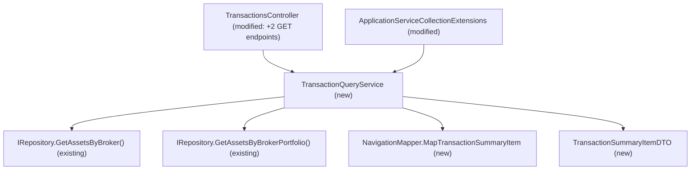

# Spec: F03 — Broker & Portfolio Transactions Aggregation Service — Application Layer

## 1. Technical Overview

**What:** Adds a new read-only query service, `ITransactionQueryService.GetTransactionsByBroker(brokerName)` / `GetTransactionsByPortfolio(brokerName, portfolioName)`, exposed via two new GET endpoints on the existing `TransactionsController`, that return the full, flat, date-ascending list of every Buy/Sell transaction across every asset in the given broker or portfolio scope. This is the raw data source the monthly investment chart introduced in F09 (Web) and F10 (WPF) aggregates client-side.

**Why:** F09/F10 need one combined transaction list per scope to compute a per-month Bought-minus-Sold series; today `ITransactionService` only exposes single-transaction Add/Update/Delete operations scoped to one asset, and no query returns a cross-asset transaction list. The PRD explicitly models this as raw historical data ("including Encerradas — no exclusion is applied here, since this is raw historical transaction history, not a live-capital total"), which is a deliberately different rule set from F01/F02's live-capital totals (no Encerradas exclusion, no active-asset filter).

**Scope:**

Included:
- `ITransactionQueryService` interface and `TransactionQueryService` implementation in the Application layer
- `TransactionSummaryItemDTO` in `Financial.Application/DTOs/`
- Two new endpoints on the existing `TransactionsController`: `GET /transactions/broker/{brokerName}` and `GET /transactions/portfolio/{brokerName}/{portfolioName}`
- DI registration in `ApplicationServiceCollectionExtensions`
- Unit tests for `TransactionQueryService`
- Integration tests for the two new endpoints

Excluded:
- Any Presentation-layer (Web or WPF) chart rendering, monthly aggregation, or period filtering — covered by F09 and F10
- The period filter option set and date-range rules — covered by F04
- Any change to `ITransactionService` (Add/Update/Delete) or `SummaryQueryService`/`BrokerBreakdownQueryService`
- Server-side date-range filtering — the full history is always returned in one call, consistent with the existing Credits tab pattern

---

## 2. Architecture Impact

**Affected components:**



---

## 3. Technical Decisions

| Decision | Chosen Approach | Alternative Considered | Trade-off |
|----------|----------------|----------------------|-----------|
| Service shape | New `ITransactionQueryService` / `TransactionQueryService`, registered as its own singleton | Add the two methods to the existing `ITransactionService` | Mirrors the established command/query split already used for Credits (`ICreditService` for mutations, `ICreditQueryService` for reads); keeps `ITransactionService` focused on its existing single-asset mutation shape |
| Data source | Reuse `IRepository.GetAssetsByBroker(name)` / `GetAssetsByBrokerPortfolio(broker, portfolio)`, identical to `CreditQueryService` | Add a new repository method scoped to this feature | Same asset enumeration `CreditQueryService` already uses for its own broker/portfolio combined-list endpoints; no new `IRepository` surface required |
| Filtering | None — every asset's transactions are included, regardless of `Active` or Encerradas membership | Reuse the `Active`-only filter `CreditQueryService` applies | PRD Capabilities explicitly calls this out as raw historical transaction history, not a live-capital total; F01/F02's exclusion rules intentionally do not apply here |
| Sort order | `OrderBy(Date)`, then `ThenBy(AssetName, StringComparer.CurrentCultureIgnoreCase)` for same-date ties | No secondary sort (rely on enumeration order for ties) | Confirmed with the user: consistent with the alphabetical tie-break convention already used elsewhere (e.g. F02's portfolio/asset sorting), and makes the ordering deterministic and independent of the underlying asset tree's iteration order |
| Mapping | New `NavigationMapper.MapTransactionSummaryItem(Asset asset, Transaction transaction)` internal method | Reuse existing `MapTransaction` | `MapTransaction` produces `TransactionDTO` (`Id`, `Quantity`, `UnitPrice`, `Fees` — single-asset shape used by `TransactionDialogViewModel`); the PRD's `TransactionSummaryItemDTO` is a distinct, narrower cross-asset shape (`AssetName`, `Date`, `Type`, `TotalPrice`) and must not be conflated with it |
| Route validation | Controller returns `BadRequest()` for null/whitespace route parameters before calling the service | Let the service silently return `[]` for invalid input, as `CreditQueryService`'s GET endpoints currently do | PRD Section 9 acceptance criteria explicitly require HTTP 400 for missing/whitespace route parameters, matching the stricter validation style already used by `SummaryController`'s endpoints rather than `CreditsController`'s |

---

## 4. Component Overview

**Backend:**

| File Path | New/Modified | Purpose | Key Responsibilities |
|-----------|--------------|---------|---------------------|
| `Financial.Application/DTOs/TransactionSummaryItemDTO.cs` | New | Cross-asset transaction entry | `AssetName` (`string`), `Date` (`DateTime`), `Type` (`string`, `"Buy"`\|`"Sell"`), `TotalPrice` (`decimal`) |
| `Financial.Application/Interfaces/ITransactionQueryService.cs` | New | Service contract | `IReadOnlyList<TransactionSummaryItemDTO> GetTransactionsByBroker(string brokerName)`, `IReadOnlyList<TransactionSummaryItemDTO> GetTransactionsByPortfolio(string brokerName, string portfolioName)` |
| `Financial.Application/Services/TransactionQueryService.cs` | New | Combined transaction retrieval | Guards null/whitespace scope parameters (returns `[]`); enumerates assets via `IRepository.GetAssetsByBroker`/`GetAssetsByBrokerPortfolio` with no filtering; flattens each asset's `Transactions` via `NavigationMapper.MapTransactionSummaryItem`; sorts by `Date` ascending, then `AssetName` (`StringComparer.CurrentCultureIgnoreCase`) |
| `Financial.Application/Services/NavigationMapper.cs` | Modified | Mapping helper | Add internal `MapTransactionSummaryItem(Asset asset, Transaction transaction)` returning a populated `TransactionSummaryItemDTO` |
| `Financial.Api/Controllers/TransactionsController.cs` | Modified | HTTP endpoints | Add `GET transactions/broker/{brokerName}` and `GET transactions/portfolio/{brokerName}/{portfolioName}`, injecting `ITransactionQueryService`; both return `BadRequest()` for null/whitespace route parameters, otherwise `Ok(result)` |
| `Financial.Application/DependencyInjection/ApplicationServiceCollectionExtensions.cs` | Modified | DI registration | `services.AddSingleton<ITransactionQueryService, TransactionQueryService>();`, following the existing registration style |
| `Tests/Financial.Application.Tests/Services/TransactionQueryServiceTests.cs` | New | Unit tests | Covers combined retrieval, no-filtering behaviour (Encerradas + inactive assets included), sort order, and empty/unknown-scope edge cases |
| `Tests/Financial.Api.Tests/TransactionEndpointsTests.cs` | Modified | Integration tests | Adds coverage for the two new GET endpoints' 200 and 400 responses |

---

## 5. API Contracts

### `GET /transactions/broker/{brokerName}` (new endpoint)

- **Method:** GET
- **Path:** `/api/v1/financial/transactions/broker/{brokerName}`
- **Authentication:** None (matches existing transaction endpoints)

**Response (Success - 200):**

| Field | Type | Description |
|-------|------|-------------|
| `assetName` | `string` | Name of the asset the transaction belongs to |
| `date` | `string` (ISO 8601) | Transaction date |
| `type` | `string` | `"Buy"` or `"Sell"` |
| `totalPrice` | `decimal` | `UnitPrice * Quantity + Fees` for that transaction |

**Response Example:**
```json
[
  { "assetName": "ALZR11", "date": "2026-01-05T00:00:00", "type": "Buy", "totalPrice": 1000.00 },
  { "assetName": "MXRF11", "date": "2026-01-05T00:00:00", "type": "Sell", "totalPrice": 500.00 },
  { "assetName": "ALZR11", "date": "2026-02-12T00:00:00", "type": "Buy", "totalPrice": 200.00 }
]
```

**Response (no transactions in scope - 200):**
```json
[]
```

**Error Codes:**

| Code | HTTP Status | Description |
|------|-------------|-------------|
| N/A | 400 | `brokerName` is null or whitespace |

### `GET /transactions/portfolio/{brokerName}/{portfolioName}` (new endpoint)

- **Method:** GET
- **Path:** `/api/v1/financial/transactions/portfolio/{brokerName}/{portfolioName}`
- **Authentication:** None

Same response shape as above, scoped to a single portfolio's assets.

**Error Codes:**

| Code | HTTP Status | Description |
|------|-------------|-------------|
| N/A | 400 | `brokerName` or `portfolioName` is null or whitespace |

---

## 6. Data Model

Not applicable. No persistence schema changes; the combined list is computed at query time from each asset's existing `Transactions` collection, identical in nature to `CreditQueryService`'s combined credit list.

---

## 7. Testing Strategy

### Test File Structure

| Test File | Test Type | Target | Coverage Goal |
|-----------|-----------|--------|---------------|
| `Tests/Financial.Application.Tests/Services/TransactionQueryServiceTests.cs` | Unit | `TransactionQueryService` | Combined retrieval across assets/portfolios, no-exclusion behaviour, sort order, empty/unknown-scope edge cases |
| `Tests/Financial.Api.Tests/TransactionEndpointsTests.cs` | Integration | `GET /transactions/broker/{brokerName}`, `GET /transactions/portfolio/{brokerName}/{portfolioName}` | Live HTTP 200/400 responses and response shape |

### TransactionQueryServiceTests.cs

Follows the `StubRepository` pattern established in `SummaryQueryServiceTests.cs` (a `Brokers` property backing `GetBrokerList()`, plus `GetAssetsByBroker`/`GetAssetsByBrokerPortfolio` delegating to the same broker tree), built with `Broker.Create(...)`, `broker.AddPortfolio(...)`, `portfolio.AddAsset(...)`.

| Test Function | Description | Assertions |
|---------------|-------------|------------|
| `Constructor_WithNullRepository_Throws` | `new TransactionQueryService(null!)` | Throws `ArgumentNullException` with parameter name `repository` |
| `GetTransactionsByBroker_ReturnsAllTransactionsAcrossAssets` | Broker with two assets, each with one Buy transaction | Result has 2 items, one per asset, correct `AssetName`/`Type`/`TotalPrice` |
| `GetTransactionsByBroker_IncludesEncerradasPortfolio` | Broker has "Default" and "Encerradas" portfolios, both with transactions | Result includes transactions from both portfolios (no exclusion, unlike `SummaryQueryService`) |
| `GetTransactionsByBroker_IncludesInactiveAssets` | One active asset, one fully-sold (`Quantity == 0`) asset, both with transaction history | Result includes transactions from both assets |
| `GetTransactionsByBroker_SortsByDateAscending` | Three transactions across assets with distinct dates, added out of order | Result is ordered oldest to newest |
| `GetTransactionsByBroker_SortsByAssetNameOnDateTie` | Two assets "ZZZZ3" and "AAAA3", each with one transaction on the same date | Result orders "AAAA3" before "ZZZZ3" for that date |
| `GetTransactionsByBroker_ReturnsEmptyForUnknownBroker` | `Brokers` has entries, none matching requested name | Returns `[]` |
| `GetTransactionsByBroker_ReturnsEmptyOnNullOrWhitespaceBrokerName` (`Theory`: `null`, `""`, `"   "`) | Invalid input | Returns `[]`; repository never queried |
| `GetTransactionsByPortfolio_ReturnsOnlyThatPortfoliosTransactions` | Broker with two portfolios, each with one asset/transaction | Result contains only the requested portfolio's transaction |
| `GetTransactionsByPortfolio_ReturnsEmptyOnNullOrWhitespaceParameters` (`Theory`: covers null/whitespace `brokerName` and `portfolioName`) | Invalid input | Returns `[]` |
| `GetTransactionsByPortfolio_ReturnsEmptyForUnknownPortfolio` | Portfolio name does not match any in the broker | Returns `[]` |

### TransactionEndpointsTests.cs — new tests

| Test Function | Description | Assertions |
|---------------|-------------|------------|
| `GetTransactionsByBroker_Returns200WithList` | Call `/transactions/broker/XPI` | 200 OK; deserializes to a list; items are ordered by `date` ascending |
| `GetTransactionsByBroker_Returns400ForWhitespaceBrokerName` | Call `/transactions/broker/%20` | 400 Bad Request |
| `GetTransactionsByPortfolio_Returns200WithList` | Call `/transactions/portfolio/XPI/Default` | 200 OK; deserializes to a list |
| `GetTransactionsByPortfolio_Returns400ForWhitespacePortfolioName` | Call `/transactions/portfolio/XPI/%20` | 400 Bad Request |

### Acceptance Test Mapping

| PRD Acceptance Criterion (Section 9 — F03) | Covered By |
|---------------------------------------------|------------|
| `GET /transactions/broker/{brokerName}` returns every transaction (Buy and Sell) for every asset under the broker, across all portfolios including Encerradas | `GetTransactionsByBroker_ReturnsAllTransactionsAcrossAssets` + `GetTransactionsByBroker_IncludesEncerradasPortfolio` + `GetTransactionsByBroker_IncludesInactiveAssets` |
| `GET /transactions/portfolio/{brokerName}/{portfolioName}` returns every transaction for every asset under that portfolio only | `GetTransactionsByPortfolio_ReturnsOnlyThatPortfoliosTransactions` |
| Both endpoints return results sorted ascending by date | `GetTransactionsByBroker_SortsByDateAscending` + `GetTransactionsByBroker_SortsByAssetNameOnDateTie` + `GetTransactionsByBroker_Returns200WithList` |
| Returns `[]` with HTTP 200 when the scope has no transactions | `GetTransactionsByBroker_ReturnsEmptyForUnknownBroker` + `GetTransactionsByPortfolio_ReturnsEmptyForUnknownPortfolio` |
| Returns HTTP 400 when required route parameters are null or whitespace | `GetTransactionsByBroker_ReturnsEmptyOnNullOrWhitespaceBrokerName` + `GetTransactionsByPortfolio_ReturnsEmptyOnNullOrWhitespaceParameters` + `GetTransactionsByBroker_Returns400ForWhitespaceBrokerName` + `GetTransactionsByPortfolio_Returns400ForWhitespacePortfolioName` |

### Cross-Feature Integration Tests

| PRD Section 9 — Cross-Feature Criterion | Covered By |
|------------------------------------------|------------|
| The transaction list returned by F03 for a Broker or Portfolio scope is used without transformation by F09 and F10 to compute each month's net-invested value | Not directly testable from F03 (F09/F10 do not exist yet); `GetTransactionsByBroker_Returns200WithList`'s exact-shape assertion is the contract F09/F10 will consume unmodified |
