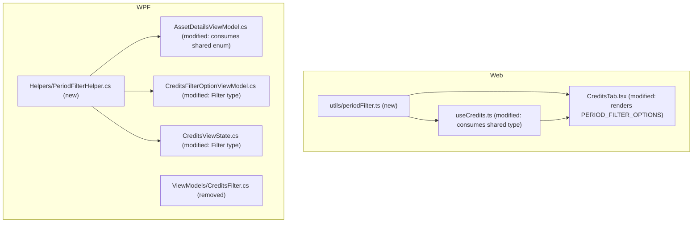

# Spec: F04 — Chart Period Filter — YTD Extension

## 1. Technical Overview

**What:** Extends the Credits tab's period filter from 5 to 6 options on both the Web frontend and WPF, adding a "YTD" (Year to Date) option and relabelling "Last Year" → "Last 12 Months" and "All" → "All Time" (unchanged date-range behaviour for both relabelled options). The filter option set and its date-range computation rules are extracted out of the Credits-specific code they currently live in and promoted to a shared, per-platform canonical definition, so the upcoming Transactions monthly chart (F09 Web, F10 WPF) can consume the same six options and rules without reimplementing them.

**Why:** Today each platform's period filter is defined and computed entirely inside its Credits-specific code (Web: `FilterOption` type + `getFilterStartDate` inside `useCredits.ts`; WPF: `CreditsFilter` enum in `Financial.App/ViewModels/CreditsFilter.cs` + `FilterCredits` inside `AssetDetailsViewModel.cs`). The PRD explicitly requires F09/F10 to reuse "one canonical definition per platform" rather than reimplement it, so this feature performs that extraction now — while implementing the one feature (F04) that currently needs it — instead of deferring a wider rename to whenever F09/F10 lands.

**Scope:**

Included:
- New shared Web utility `Financial.Web/src/utils/periodFilter.ts`: `PeriodFilterOption` type (6 values), `PERIOD_FILTER_OPTIONS` label list, `getPeriodFilterStartDate` date-range function
- New shared WPF helper `Financial.App/Helpers/PeriodFilterHelper.cs`: `PeriodFilter` enum (6 values), `Options` label list, `GetDateRange` date-range function
- Rewiring `useCredits.ts` / `CreditsTab.tsx` (Web) and `AssetDetailsViewModel.cs` / `CreditsFilterOptionViewModel.cs` / `CreditsViewState.cs` (WPF) to consume the shared definitions instead of owning them
- Removal of the superseded `Financial.App/ViewModels/CreditsFilter.cs`
- Unit tests for both new shared modules, plus updates to existing Credits tests for the renamed values/labels

Excluded:
- Any Transactions tab UI or chart — covered by F09 (Web) and F10 (WPF), which will import these same shared modules once built
- Any change to Credits chart type (Stacked/Grouped), colours, or the underlying `/credits` API — unaffected by this feature
- Renaming the Credits-specific wrapper types (`CreditsFilterOptionViewModel`, `CreditsViewState`, the `useCredits` hook, `FILTER_OPTIONS` rendering in `CreditsTab.tsx`) — these remain Credits-scoped and simply source their labels/values from the shared definition; only the underlying enum/type and date-range logic are promoted

---

## 2. Architecture Impact

**Affected components:**

---

## 3. Technical Decisions

| Decision | Chosen Approach | Alternative Considered | Trade-off |
|----------|----------------|----------------------|-----------|
| Extraction scope | Full extraction now: rename and relocate the core type/enum and date-range function to shared, platform-appropriate locations (`utils/periodFilter.ts`, `Helpers/PeriodFilterHelper.cs`); enum/value members renamed to match new labels (`LastYear`/`'last-year'` → `Last12Months`/`'last-12-months'`, `All`/`'all'` → `AllTime`/`'all-time'`) | Minimal footprint: keep `CreditsFilter`/`FilterOption` names/locations as-is, add `Ytd` in place, extract only the date-range function under a new name | Confirmed with the user. PRD Capabilities explicitly frames this as establishing the canonical shared definition now, not later; renaming while there is exactly one consumer (Credits) is a mechanical, low-risk change, versus a wider rename later that would touch both Credits and Transactions call sites simultaneously once F09/F10 exist |
| Option-list ownership | The six `(label, value)` pairs live once in the shared module (`PERIOD_FILTER_OPTIONS` / `PeriodFilterHelper.Options`); `CreditsTab.tsx` and `AssetDetailsViewModel.InitializeCreditsFilters()` iterate that shared list instead of hard-coding their own | Keep each platform's Credits UI defining its own label list, only sharing the date-range function | PRD explicitly says "the same six-option set... [is] reused, not reimplemented" — the option/label set itself, not just the date math, is part of the canonical definition |
| WPF date-range shape | `PeriodFilterHelper.GetDateRange` returns `(DateTime? Start, DateTime? EndExclusive)`, preserving the existing `FilterCredits` behaviour of bounding every non-`AllTime` filter to `< currentMonthStart.AddMonths(1)` | Drop the upper bound and filter only on `Start`, matching the Web hook's simpler lower-bound-only filtering | The acceptance criteria require the relabelled options to produce identical date ranges to before; changing WPF's existing upper-bound behaviour (which allows same-month future-dated entries) is out of scope for this feature, so it is preserved exactly, applied uniformly to the new `Ytd` option too |
| Web date-range shape | `getPeriodFilterStartDate` keeps the existing lower-bound-only signature (`Date \| null`), matching `useCredits.ts`'s existing filtering (`credits.filter(c => date >= start)`, no upper bound) | Add an explicit upper bound to Web too, for symmetry with WPF | No behaviour change requested by the PRD for Web's existing filtering approach; Web already has no upper bound today, so none is introduced |
| YTD date-range computation | Web: `new Date(referenceDate.getFullYear(), 0, 1)`. WPF: reuses the existing `monthsBack`-from-current-month-start pattern with `monthsBack = referenceDate.Month - 1`, which algebraically resolves to January 1st of the current year, so no new code path is needed beyond one more `switch` arm | Add a dedicated non-monthsBack code path for WPF's YTD case | The existing `monthsBack` pattern already generalizes correctly to YTD (e.g. July → `monthsBack = 6` → Jan 1), so reusing it keeps the WPF implementation uniform across all five non-`AllTime` filters |
| Testability | Both `getPeriodFilterStartDate` and `PeriodFilterHelper.GetDateRange` take an explicit reference date parameter (defaulting to "now"/`DateTime.Today` at call sites) rather than reading the clock internally | Keep reading `DateTime.Today` / `new Date()` internally, as the current code does | Makes the date-range rules (including the new YTD boundary) directly unit-testable without mocking the system clock; existing call sites (`useCredits.ts`, `AssetDetailsViewModel.FilterCredits`) pass today's date explicitly, so behaviour is unchanged in production |

---

## 4. Component Overview

**Web frontend:**

| File Path | New/Modified | Purpose | Key Responsibilities |
|-----------|--------------|---------|---------------------|
| `Financial.Web/src/utils/periodFilter.ts` | New | Shared canonical period filter definition | `PeriodFilterOption` type (`'this-month' \| 'last-3-months' \| 'last-6-months' \| 'last-12-months' \| 'ytd' \| 'all-time'`); `PERIOD_FILTER_OPTIONS: { value, label }[]` (labels: "This month", "Last 3 months", "Last 6 months", "Last 12 months", "YTD", "All time"); `getPeriodFilterStartDate(filter, referenceDate = new Date()): Date \| null` |
| `Financial.Web/src/hooks/useCredits.ts` | Modified | Credits data/state hook | Removes local `FilterOption` type and `getFilterStartDate`; imports `PeriodFilterOption` (re-exported as `FilterOption` is NOT kept — call sites import the shared type directly); `DEFAULT_FILTER` updated to `'last-12-months'`; `filteredCredits` memo calls `getPeriodFilterStartDate(state.selectedFilter, new Date())` |
| `Financial.Web/src/components/CreditsTab.tsx` | Modified | Credits tab UI | Removes local `FILTER_OPTIONS` constant; imports `PERIOD_FILTER_OPTIONS` and `PeriodFilterOption` from `utils/periodFilter`; filter buttons render from the shared list |
| `Financial.Web/src/utils/periodFilter.test.ts` | New | Unit tests | Covers all 6 options' start-date computation, including YTD, against fixed reference dates |
| `Financial.Web/src/hooks/useCredits.test.ts` | Modified | Existing hook tests | Updates 3 assertions from `'last-year'` to `'last-12-months'` |
| `Financial.Web/src/components/__tests__/CreditsTab.test.tsx` | Modified | Existing component tests | Updates `selectedFilter: 'last-year'` mocks to `'last-12-months'`; updates button-label assertions ("Last year" → "Last 12 months", "All" → "All time"); adds assertion for the new "YTD" button |

**WPF:**

| File Path | New/Modified | Purpose | Key Responsibilities |
|-----------|--------------|---------|---------------------|
| `Financial.App/Helpers/PeriodFilterHelper.cs` | New | Shared canonical period filter definition | `PeriodFilter` enum (`ThisMonth, Last3Months, Last6Months, Last12Months, Ytd, AllTime`); `Options: IReadOnlyList<(string Label, PeriodFilter Filter)>` (same 6 labels as Web); `GetDateRange(PeriodFilter filter, DateTime referenceDate): (DateTime? Start, DateTime? EndExclusive)` |
| `Financial.App/ViewModels/CreditsFilter.cs` | Removed | Superseded by `PeriodFilter` in `Helpers/PeriodFilterHelper.cs` | — |
| `Financial.App/ViewModels/CreditsFilterOptionViewModel.cs` | Modified | Credits filter button view model | `Filter` property type changes from `CreditsFilter` to `PeriodFilter` |
| `Financial.App/ViewModels/CreditsViewState.cs` | Modified | Persisted per-selection Credits view state | `Filter` field type changes from `CreditsFilter` to `PeriodFilter` |
| `Financial.App/ViewModels/AssetDetailsViewModel.cs` | Modified | Asset/Broker/Portfolio details view model | `_selectedCreditsFilter` field retyped to `PeriodFilter`, default `PeriodFilter.Last12Months`; `InitializeCreditsFilters()` iterates `PeriodFilterHelper.Options` instead of hard-coding 5 `Add` calls; `SelectCreditsFilter`, `SetCreditsFilter` signatures updated to `PeriodFilter`; `FilterCredits` delegates its date-range computation to `PeriodFilterHelper.GetDateRange(filter, DateTime.Today)` |
| `Tests/Financial.Presentation.Tests/Helpers/PeriodFilterHelperTests.cs` | New | Unit tests | Covers all 6 filters' `GetDateRange` output, including YTD, against fixed reference dates |

---

## 5. API Contracts

Not applicable. This feature is entirely Presentation-layer (Web + WPF); it does not add, modify, or consume any HTTP endpoint. The existing `/credits/broker/{brokerName}` and `/credits/portfolio/{brokerName}/{portfolioName}` endpoints are unchanged — filtering continues to happen client-side on already-fetched data, per the PRD's Experience note ("no new network request is triggered by a filter change").

---

## 6. Data Model

Not applicable. No persistence schema changes; this feature only changes how already-fetched, in-memory data is labelled and filtered.

---

## 7. Testing Strategy

### Test File Structure

| Test File | Test Type | Target | Coverage Goal |
|-----------|-----------|--------|---------------|
| `Financial.Web/src/utils/periodFilter.test.ts` | Unit | `getPeriodFilterStartDate` | All 6 options' date-range computation against fixed reference dates, including YTD and the `all-time` no-lower-bound case |
| `Financial.Web/src/hooks/useCredits.test.ts` | Unit (modified) | `useCredits` | Existing coverage, updated for the renamed default filter value |
| `Financial.Web/src/components/__tests__/CreditsTab.test.tsx` | Component (modified) | `CreditsTab` | Existing coverage, updated for relabelled buttons; new YTD button assertion |
| `Tests/Financial.Presentation.Tests/Helpers/PeriodFilterHelperTests.cs` | Unit | `PeriodFilterHelper.GetDateRange` | All 6 filters' date-range computation against fixed reference dates, including YTD and the `AllTime` no-bound case |

### periodFilter.test.ts

| Test Function | Description | Assertions |
|---------------|-------------|------------|
| `getPeriodFilterStartDate_ThisMonth_ReturnsFirstDayOfCurrentMonth` | `referenceDate = 2026-07-15` | Returns `2026-07-01` |
| `getPeriodFilterStartDate_Last3Months_ReturnsRollingWindow` | `referenceDate = 2026-07-15` | Returns `2026-05-01` |
| `getPeriodFilterStartDate_Last6Months_ReturnsRollingWindow` | `referenceDate = 2026-07-15` | Returns `2026-02-01` |
| `getPeriodFilterStartDate_Last12Months_ReturnsRollingWindow` | `referenceDate = 2026-07-15` | Returns `2025-08-01` |
| `getPeriodFilterStartDate_Ytd_ReturnsJanuaryFirstOfCurrentYear` | `referenceDate = 2026-07-15` | Returns `2026-01-01` |
| `getPeriodFilterStartDate_Ytd_WhenReferenceDateIsJanuary_ReturnsSameMonth` | `referenceDate = 2026-01-15` | Returns `2026-01-01` |
| `getPeriodFilterStartDate_AllTime_ReturnsNull` | any `referenceDate` | Returns `null` |
| `PERIOD_FILTER_OPTIONS_HasExactlySixOptionsInOrder` | — | Values are, in order: `this-month, last-3-months, last-6-months, last-12-months, ytd, all-time` |

### useCredits.test.ts — updated assertions

| Test Function | Change |
|---------------|--------|
| `returns_last_year_as_default_filter` (and 2 similar) | Assertion updated from `'last-year'` to `'last-12-months'` |

### CreditsTab.test.tsx — updated/new assertions

| Test Function | Change |
|---------------|--------|
| `renders_all_filter_buttons` | Button-name assertions updated: `'Last year'` → `'Last 12 months'`, `'All'` → `'All time'`; new assertion `getByRole('button', { name: 'YTD' })` |
| Existing filter-click tests referencing `'Last year'` | Updated to `'Last 12 months'` |

### PeriodFilterHelperTests.cs

| Test Function | Description | Assertions |
|---------------|-------------|------------|
| `GetDateRange_ThisMonth_ReturnsFirstDayOfCurrentMonthThroughNextMonth` | `referenceDate = 2026-07-15` | `Start == 2026-07-01`, `EndExclusive == 2026-08-01` |
| `GetDateRange_Last3Months_ReturnsRollingWindow` | `referenceDate = 2026-07-15` | `Start == 2026-05-01` |
| `GetDateRange_Last6Months_ReturnsRollingWindow` | `referenceDate = 2026-07-15` | `Start == 2026-02-01` |
| `GetDateRange_Last12Months_ReturnsRollingWindow` | `referenceDate = 2026-07-15` | `Start == 2025-08-01` |
| `GetDateRange_Ytd_ReturnsJanuaryFirstOfCurrentYear` | `referenceDate = 2026-07-15` | `Start == 2026-01-01`, `EndExclusive == 2026-08-01` |
| `GetDateRange_Ytd_WhenReferenceDateIsJanuary_ReturnsSameMonth` | `referenceDate = 2026-01-15` | `Start == 2026-01-01` |
| `GetDateRange_AllTime_ReturnsNullBounds` | any `referenceDate` | `Start == null`, `EndExclusive == null` |
| `Options_HasExactlySixOptionsInOrder` | — | Labels/filters are, in order: `("This month", ThisMonth), ("Last 3 months", Last3Months), ("Last 6 months", Last6Months), ("Last 12 months", Last12Months), ("YTD", Ytd), ("All time", AllTime)` |

### Acceptance Test Mapping

| PRD Acceptance Criterion (Section 9 — F04) | Covered By |
|---------------------------------------------|------------|
| Credits tab (web and WPF) offers exactly 6 period options: This Month, Last 3 Months, Last 6 Months, Last 12 Months, YTD, All Time | `PERIOD_FILTER_OPTIONS_HasExactlySixOptionsInOrder` + `Options_HasExactlySixOptionsInOrder` + `renders_all_filter_buttons` |
| Selecting YTD filters to transactions/credits dated January 1st of the current year through today | `getPeriodFilterStartDate_Ytd_ReturnsJanuaryFirstOfCurrentYear` + `GetDateRange_Ytd_ReturnsJanuaryFirstOfCurrentYear` (+ the two January-edge-case variants) |
| The relabelled "Last 12 Months" and "All Time" options produce identical date ranges to the previous "Last Year" and "All" options | `getPeriodFilterStartDate_Last12Months_ReturnsRollingWindow` + `GetDateRange_ThisMonth_...` family (same `monthsBack`/window math as before, only the label/identifier changed) + `getPeriodFilterStartDate_AllTime_ReturnsNull` + `GetDateRange_AllTime_ReturnsNullBounds` |
| Changing the period filter does not trigger a new network request (filtering happens on already-fetched data) | Not independently tested by this feature — `useCredits.ts`'s `filteredCredits` memo and `AssetDetailsViewModel.ApplyCreditsFilter` already operate on already-loaded in-memory data with no fetch call, unchanged by this feature; existing `useCredits.test.ts` fetch-call-count coverage (if any) is unaffected by this change |

### Cross-Feature Integration Tests

| PRD Section 9 — Cross-Feature Criterion | Covered By |
|------------------------------------------|------------|
| The period options and date-range rules defined by F04 are applied identically by F09 and F10 when filtering the monthly chart, and continue to be applied identically by the existing Credits chart | Not directly testable from F04 (F09/F10 do not exist yet); the shared-module extraction itself (`utils/periodFilter.ts`, `Helpers/PeriodFilterHelper.cs`) is the mechanism that guarantees this — F09/F10 will import and reuse these exact functions rather than redefining them |
