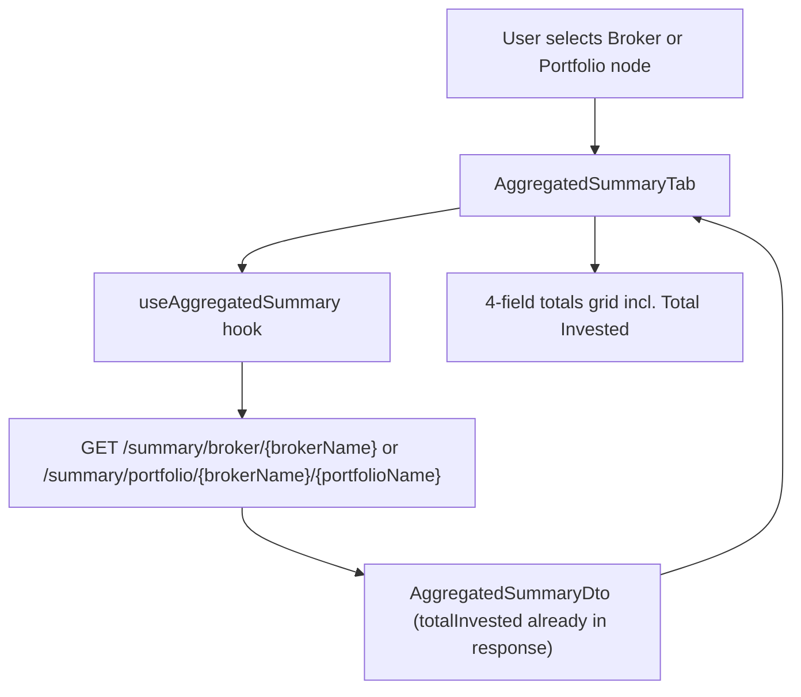

# F05. Broker & Portfolio Totals Display — Web Frontend

## 1. Technical Overview

**What:** Add a fourth total, **Total Invested**, to the existing totals grid rendered by `AggregatedSummaryTab` — the component shown when a Broker node is selected and reused unmodified inside `PortfolioSummaryTab` for Portfolio node selection. The value is colour-coded green when `>= 0` and red when `< 0`.

**Why:** The backend (F01, already merged to `main`) already computes and returns `TotalInvested` (`TotalBought − TotalSold`) in the `AggregatedSummaryDTO` for both `GET /summary/broker/{brokerName}` and `GET /summary/portfolio/{brokerName}/{portfolioName}`. The frontend's `AggregatedSummaryDto` TypeScript type does not yet declare this field, and no UI renders it — the value is being fetched and discarded today. This is a frontend-only catch-up: no new endpoint, no new fetch, no hook logic change.

**Scope:**
- Included: add `totalInvested` to the frontend `AggregatedSummaryDto` type; render it as a fourth field in `AggregatedSummaryTab`'s totals grid, after Total Bought/Sold/Credits; apply conditional green/red colour; update the grid layout to accommodate 4 fields; update existing unit/integration tests and fixtures.
- Excluded: any backend change (F01 already complete); any change to `useAggregatedSummary`'s fetch/reducer logic (it already passes the full API response through untouched); currency symbols on any of the 4 totals (see Assumptions); pie charts (F07) and the Transactions chart (F09) — out of scope for this feature.

## 2. Architecture Impact

**Affected components:**
- `Financial.Web/src/api/types.ts` — `AggregatedSummaryDto` interface
- `Financial.Web/src/components/AggregatedSummaryTab.tsx` — totals rendering
- `Financial.Web/src/components/AggregatedSummaryTab.css` — grid layout
- `Financial.Web/src/components/__tests__/AggregatedSummaryTab.test.tsx` — unit tests
- `Financial.Web/src/hooks/useAggregatedSummary.test.ts` — fixture
- `Financial.Web/src/components/__tests__/PortfolioSummaryTab.test.tsx` — fixture + integration test

`PortfolioSummaryTab.tsx` itself requires no changes — it renders `<AggregatedSummaryTab />` directly and `useAggregatedSummary` already branches on the selected node type to call the broker or portfolio summary endpoint, so the same component change applies to both scopes automatically.

## 3. Technical Decisions

| Decision | Chosen Approach | Alternative Considered | Trade-off |
|----------|------------------|-------------------------|-----------|
| Currency symbol on totals | No currency symbol on any of the 4 totals — plain N2 formatting, matching what Total Bought/Sold/Credits already do today | Add a currency symbol (broker's `currency`, already available via `SelectedNode`) to all 4 totals | The PRD wording ("consistent with the other three totals") implies a currency symbol, but the codebase shows the other three have none. Matching actual current behaviour keeps this feature scoped to adding one total, rather than a wider currency-formatting change affecting the other three totals |
| Grid layout for the 4th field | 2×2 grid: Row 1 = Total Bought / Total Sold, Row 2 = Total Credits / Total Invested. Drop `aggregated-summary__field--full` from Total Credits since it is no longer the odd one out | Keep Total Credits full-width and add Total Invested as a new full-width row below (3 rows total) | 2×2 is more compact and reads as a natural 4-item grid; the full-width alternative preserves Credits' current visual weight but adds unnecessary vertical space |
| Conditional colour styling | Reuse the existing `aggregated-summary__value--green` / `--red` modifier classes (hex values already match `PortfolioSummaryTab`'s green/red), applied conditionally via a new `getInvestedClass(value)` helper mirroring `PortfolioSummaryTab`'s existing `getProfitClass` pattern | Introduce new dedicated classes (e.g. `--invested-positive` / `--invested-negative`) | Reusing the existing modifiers avoids duplicate CSS; they are already generic sign-colour modifiers, not semantically tied to "Bought"/"Sold" |

## 4. Component Overview

**Frontend:**

| File Path | New/Modified | Purpose | Key Responsibilities |
|-----------|---------------|---------|------------------------|
| `Financial.Web/src/api/types.ts` | Modified | Type contract | Add required `totalInvested: number` to `AggregatedSummaryDto` |
| `Financial.Web/src/components/AggregatedSummaryTab.tsx` | Modified | Totals rendering | Add `getInvestedClass(value)` helper; render Total Invested as the 4th grid field, after Total Credits, using conditional green/red class |
| `Financial.Web/src/components/AggregatedSummaryTab.css` | Modified | Layout | Remove full-width span from `.aggregated-summary__field--full` usage on Total Credits; result is a natural 2×2 grid with the existing `1fr 1fr` columns |
| `Financial.Web/src/components/__tests__/AggregatedSummaryTab.test.tsx` | Modified | Unit tests | Add `totalInvested` to the shared `SUMMARY` fixture; add tests for green/red colour and DOM order; update the "formatted to two decimals" test to also cover Total Invested |
| `Financial.Web/src/hooks/useAggregatedSummary.test.ts` | Modified | Fixture | Add `totalInvested` to the mock `AggregatedSummaryDto` fixture so it satisfies the updated type |
| `Financial.Web/src/components/__tests__/PortfolioSummaryTab.test.tsx` | Modified | Integration test | Add `totalInvested` to the local `SUMMARY` fixture; add a test confirming Portfolio node selection renders all 4 totals in order via the reused `AggregatedSummaryTab` |

**Backend:** None — `TotalInvested` is already implemented and returned by F01 (merged to `main`, commit `b473baa`). No API contract or data model changes are required for this feature.

## 5. API Contracts

Not applicable — no new or modified endpoint. `GET /summary/broker/{brokerName}` and `GET /summary/portfolio/{brokerName}/{portfolioName}` already return `totalInvested` in their JSON response (delivered by F01); this feature only adds the field to the frontend's TypeScript type so existing consumers type-check, and renders it.

## 6. Data Model

Not applicable — no database changes.

## 7. Testing Strategy

**Test File Structure:**

| Test File | Test Type | Target | Coverage Goal |
|-----------|-----------|--------|-----------------|
| `Financial.Web/src/components/__tests__/AggregatedSummaryTab.test.tsx` | Unit | `AggregatedSummaryTab` | All 4 totals, both colour branches, formatting, zero-value handling |
| `Financial.Web/src/hooks/useAggregatedSummary.test.ts` | Unit | `useAggregatedSummary` | Fixture compiles with the updated `AggregatedSummaryDto`; existing pass-through behaviour unchanged |
| `Financial.Web/src/components/__tests__/PortfolioSummaryTab.test.tsx` | Integration | `PortfolioSummaryTab` → `AggregatedSummaryTab` | Portfolio node selection renders the same 4 totals, in the same order, as Broker node selection |

**Test Functions:**

| Test Function | Description | Assertions |
|----------------|--------------|-------------|
| `renders_total_invested_after_total_credits` | Total Invested appears as the 4th field, after Total Credits | `screen.getByText('Total Invested')` exists; DOM order places it after the `Total Credits` field |
| `renders_total_invested_in_green_when_non_negative` | Non-negative `totalInvested` (including `0`) | Value element has class `aggregated-summary__value--green` |
| `renders_total_invested_in_red_when_negative` | Negative `totalInvested` | Value element has class `aggregated-summary__value--red` |
| `renders_values_formatted_to_two_decimal_places` (updated) | Existing test extended to also assert Total Invested's formatting | `Total Invested` text matches `/\d+[.,]\d{2}$/` |
| `renders_zero_values_without_error` (updated) | Existing test extended with `totalInvested: 0` | All 4 labels render without throwing |
| `renders_total_invested_for_portfolio_node_selection` (new, in `PortfolioSummaryTab.test.tsx`) | Selecting a Portfolio node shows the same 4 totals in the same order | All 4 labels present in DOM order: Total Bought, Total Sold, Total Credits, Total Invested |

## Assumptions and Decisions (from interview)

- **No currency symbol** is added to any of the 4 totals. The PRD states Total Invested should be "consistent with the other three totals," and the codebase shows those three currently render plain N2 numbers with no currency symbol — this feature preserves that actual behaviour rather than the PRD's (inaccurate) implication that a symbol already exists.
- **2×2 grid layout**: Total Credits' current full-width span is removed so the 4 totals form a balanced 2×2 grid (Bought/Sold on row 1, Credits/Invested on row 2).
- **Colour classes are reused, not duplicated**: `aggregated-summary__value--green` / `--red` are applied conditionally to Total Invested via a new `getInvestedClass` helper, mirroring the `getProfitClass` pattern already used in `PortfolioSummaryTab` for % Profit / % Profit w/ Credits / XIRR.
- `totalInvested` is added as a **required** `number` field on `AggregatedSummaryDto` (not optional), since the backend always returns it as of F01.
