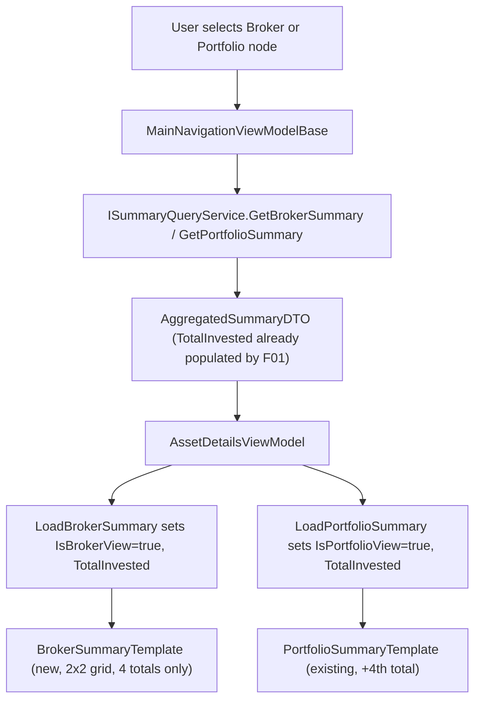

# F06. Broker & Portfolio Totals Display — WPF

## 1. Technical Overview

**What:** Fix the WPF Broker-node display bug (it currently falls back to `AssetSummaryTemplate`, showing meaningless zeroed asset fields) by introducing a dedicated `BrokerSummaryTemplate` with only four colour-coded totals: Total Bought, Total Sold, Total Credits, Total Invested. Also extend the existing `PortfolioSummaryTemplate` with the same fourth total, **Total Invested**.

**Why:** The backend (F01, already merged to `main`) already computes and returns `TotalInvested` in `AggregatedSummaryDTO` for both broker and portfolio scope via `ISummaryQueryService`. The WPF desktop app never adopted a dedicated Broker template — `AssetDetailsViewModel`'s Broker-loading path (`LoadBrokerCredits` → `LoadAggregateCredits`) only ever set `IsPortfolioView = false`, leaving `AssetSummaryTemplate` as the active (wrong) template for Broker selection. This is the same display-layer catch-up already done for the web frontend in F05, now mirrored for WPF.

**Scope:**
- Included: new `BrokerSummaryTemplate` DataTemplate; new `IsBrokerView` and `TotalInvested` properties on `AssetDetailsViewModel`; new `LoadBrokerSummary` method replacing `LoadBrokerCredits`; extending `PortfolioSummaryTemplate` and `LoadPortfolioSummary` with `TotalInvested`; updating `MainNavigationViewModelBase`'s Broker dispatch; unit test coverage.
- Excluded: any backend change (F01 already complete); Credits tab and Transactions tab behaviour for Broker/Portfolio selection (unchanged, addressed by other features in this PRD); pie charts (F08) and the Transactions monthly chart (F10) — out of scope for this feature.

## 2. Architecture Impact

**Affected components:**
- `Financial.App/Components/NavigationView.xaml` — new `BrokerSummaryTemplate`, extended `PortfolioSummaryTemplate`, new `DataTrigger`
- `Financial.App/ViewModels/AssetDetailsViewModel.cs` — new properties, new/modified methods
- `Financial.App/ViewModels/IAssetDetailsViewModel.cs` — interface update
- `Financial.App/ViewModels/MainNavigationViewModelBase.cs` — Broker dispatch call site
- `Tests/Financial.Presentation.Tests/ViewModels/AssetDetailsViewModelBrokerSummaryTests.cs` — new
- `Tests/Financial.Presentation.Tests/ViewModels/AssetDetailsViewModelPortfolioSummaryTests.cs` — extended
- `Tests/Financial.Presentation.Tests/ViewModels/MainNavigationViewModelBaseTests.cs` — `SpyAssetDetailsViewModel` updated

## 3. Technical Decisions

| Decision | Chosen Approach | Alternative Considered | Trade-off |
|----------|------------------|-------------------------|-----------|
| `BrokerSummaryTemplate` layout | 2×2 `Grid` (Total Bought/Total Sold on row 0, Total Credits/Total Invested on row 1), mirroring `AssetSummaryTemplate`'s existing Grid.Row/Grid.Column label-value pair pattern | Single horizontal `StackPanel` row (extending `PortfolioSummaryTemplate`'s 3-item row pattern to 4 items) | The StackPanel approach is less code (copy an existing row), but the Broker tab has nothing else below it (no DataGrid), so a single thin horizontal line would look sparse as the tab's only content. The 2×2 grid also keeps the WPF and Web (F05) implementations visually consistent for the same screen |
| `LoadBrokerCredits` interface method | Removed from `IAssetDetailsViewModel` and `AssetDetailsViewModel`, replaced by `LoadBrokerSummary` | Keep `LoadBrokerCredits` as dead code, add `LoadBrokerSummary` alongside it | The PRD explicitly says the broker-loading path "is replaced with" a new method. Its only production call site (`MainNavigationViewModelBase`'s Broker dispatch) is being updated to call the new method, so nothing else references the old one. (Note: `LoadPortfolioCredits` is a pre-existing, already-unused interface method left over from before `LoadPortfolioSummary` existed — this feature does not touch it, since cleaning up unrelated dead code is out of scope) |
| `IsBrokerView` on the interface | Added to `IAssetDetailsViewModel` alongside `LoadBrokerSummary`, mirroring how `IsPortfolioView` is already exposed there | Keep it only on the concrete `AssetDetailsViewModel` (like `TotalBought`/`TotalCredits`/etc., which XAML binds to via runtime reflection without needing the interface) | `IsPortfolioView` is already on the interface even though only XAML binds to it, establishing the precedent that view-state booleans (not raw totals) are interface members. Following it keeps `IsBrokerView` discoverable and testable the same way |
| `TotalInvested` on the interface | NOT added to `IAssetDetailsViewModel` — stays a concrete `AssetDetailsViewModel` property only | Add it to the interface for symmetry with `IsBrokerView` | Matches the existing precedent: `TotalBought`, `TotalSold`, `TotalCredits` are not on the interface either (XAML binds to the concrete instance via `{Binding AssetDetails.TotalBought}` at runtime; tests construct the concrete `AssetDetailsViewModel` directly, never through the interface, to assert on totals) |

## 4. Component Overview

**Frontend (WPF):**

| File Path | New/Modified | Purpose | Key Responsibilities |
|-----------|---------------|---------|------------------------|
| `Financial.App/Components/NavigationView.xaml` | Modified | Template selection + rendering | Add `BrokerSummaryTemplate` (`x:Key`, sibling of `AssetSummaryTemplate`/`PortfolioSummaryTemplate` in `TabItem.Resources`) with a 2×2 `Grid` of 4 colour-coded totals; append a 4th `TextBlock` pair (Total Invested) to `PortfolioSummaryTemplate`'s existing totals `StackPanel`; add a second `DataTrigger` on `AssetDetails.IsBrokerView` to the `ContentControl.Style.Triggers` block, selecting `BrokerSummaryTemplate` |
| `Financial.App/ViewModels/AssetDetailsViewModel.cs` | Modified | View state | Add `_isBrokerView`/`IsBrokerView` (mirrors `_isPortfolioView`/`IsPortfolioView`) and `_totalInvested`/`TotalInvested` backing field + property; add `LoadBrokerSummary(string brokerName, AggregatedSummaryDTO summary, IReadOnlyList<CreditDTO> credits)` calling `LoadAggregateCredits` then setting `IsBrokerView = true` and `TotalInvested = summary.TotalInvested`; remove `LoadBrokerCredits`; extend `LoadPortfolioSummary` to set `TotalInvested = summary.TotalInvested`; extend `LoadAggregateCredits` to reset `IsBrokerView = false` at its start (mirroring its existing `IsPortfolioView = false` reset); extend `LoadAssetDetails` and `Clear()` to reset `IsBrokerView = false` and `TotalInvested = 0m` |
| `Financial.App/ViewModels/IAssetDetailsViewModel.cs` | Modified | Contract | Add `bool IsBrokerView { get; }` and `void LoadBrokerSummary(string brokerName, AggregatedSummaryDTO summary, IReadOnlyList<CreditDTO> credits)`; remove `void LoadBrokerCredits(...)` |
| `Financial.App/ViewModels/MainNavigationViewModelBase.cs` | Modified | Node-selection routing | In the private `LoadBrokerCredits(TreeNodeViewModel brokerNode)` method (Broker dispatch, called from `LoadSelectionDetails`), change the call from `AssetDetails.LoadBrokerCredits(brokerName, summary, credits)` to `AssetDetails.LoadBrokerSummary(brokerName, summary, credits)`. No change to how `summary`/`credits` are fetched |

**Backend:** None — `TotalInvested` is already implemented and returned by F01 (merged to `main`). No API contract, service, or data model changes required.

## 5. API Contracts

Not applicable — no new or modified endpoint. `ISummaryQueryService.GetBrokerSummary`/`GetPortfolioSummary` already return `TotalInvested` on `AggregatedSummaryDTO` (delivered by F01); this feature only adds the WPF display layer that consumes the value already present in the DTO.

## 6. Data Model

Not applicable — no database changes.

## 7. Testing Strategy

**Test File Structure:**

| Test File | Test Type | Target | Coverage Goal |
|-----------|-----------|--------|-----------------|
| `Tests/Financial.Presentation.Tests/ViewModels/AssetDetailsViewModelBrokerSummaryTests.cs` (new) | Unit | `AssetDetailsViewModel.LoadBrokerSummary` | Sets `IsBrokerView`, totals (incl. `TotalInvested`), populates Credits-tab state, clears asset-specific fields, resets correctly on `Clear()`/`LoadAssetDetails`/`LoadPortfolioSummary` |
| `Tests/Financial.Presentation.Tests/ViewModels/AssetDetailsViewModelPortfolioSummaryTests.cs` (extended) | Unit | `AssetDetailsViewModel.LoadPortfolioSummary` | `TotalInvested` set from `summary.TotalInvested`; reset to 0 on `Clear()` |
| `Tests/Financial.Presentation.Tests/ViewModels/MainNavigationViewModelBaseTests.cs` (extended) | Unit | `MainNavigationViewModelBase` Broker dispatch | `SpyAssetDetailsViewModel` implements `LoadBrokerSummary` instead of `LoadBrokerCredits`; existing Broker-selection routing tests continue to pass unchanged |

**Test Functions:**

| Test Function | Description | Assertions |
|----------------|--------------|-------------|
| `LoadBrokerSummary_SetsIsBrokerViewTrue` | Calling `LoadBrokerSummary` | `vm.IsBrokerView` is `true` |
| `LoadBrokerSummary_SetsAggregatedTotals` | `TotalBought`/`TotalSold` from `summary` | Match the DTO's values |
| `LoadBrokerSummary_SetsTotalInvested` | `TotalInvested` from `summary.TotalInvested` | Matches the DTO's value, including a negative value case |
| `LoadBrokerSummary_LoadsCreditsForCreditsTab` | Credits-tab state still populated (regression: Credits tab must keep working) | `vm.Credits.Count` matches input |
| `LoadBrokerSummary_ClearsAssetSpecificFields` | Asset-specific fields (Quantity, ISIN, etc.) are zeroed/empty | Mirrors `ClearAssetContext` behaviour already exercised by the Portfolio path |
| `Clear_AfterLoadBrokerSummary_SetsIsBrokerViewFalse` | `Clear()` resets Broker view state | `vm.IsBrokerView` is `false` |
| `Clear_AfterLoadBrokerSummary_ResetsTotalInvested` | `Clear()` resets `TotalInvested` | `vm.TotalInvested` is `0m` |
| `LoadAssetDetails_AfterBrokerSummary_SetsIsBrokerViewFalse` | Selecting an Asset node after a Broker node (regression: Asset view unaffected) | `vm.IsBrokerView` is `false` |
| `LoadPortfolioSummary_AfterBrokerSummary_SetsIsBrokerViewFalse` | Selecting a Portfolio node after a Broker node (mutual exclusivity) | `vm.IsBrokerView` is `false`, `vm.IsPortfolioView` is `true` |
| `LoadPortfolioSummary_SetsTotalInvested` (added to existing file) | `TotalInvested` from `summary.TotalInvested` for Portfolio scope | Matches the DTO's value |
| `Clear_AfterLoadPortfolioSummary_ResetsTotalInvested` (added to existing file) | `Clear()` resets Portfolio `TotalInvested` | `vm.TotalInvested` is `0m` |

**Acceptance tests (PRD Section 9, F06):**
- Selecting a Broker node in WPF shows only 4 colour-coded totals and no asset-specific fields → covered by `LoadBrokerSummary_SetsIsBrokerViewTrue` + `LoadBrokerSummary_ClearsAssetSpecificFields` (template selection itself is XAML `DataTrigger`, not directly unit-testable — verified via manual/smoke check)
- Selecting a Portfolio node in WPF shows the existing per-asset DataGrid plus 4 totals including Total Invested → covered by `LoadPortfolioSummary_SetsTotalInvested`
- Selecting an Asset node in WPF is unaffected (regression) → covered by `LoadAssetDetails_AfterBrokerSummary_SetsIsBrokerViewFalse`
- Total Invested is styled green when `>= 0` and red when `< 0` → XAML-level (`SignedValueToBrushConverter` binding), verified via manual/smoke check, not unit-testable

**Cross-feature integration tests (PRD Section 9):**
- `totalInvested` computed by F01 for Broker scope is displayed without transformation in F06's fourth total → covered by `LoadBrokerSummary_SetsTotalInvested`
- `totalInvested` computed by F01 for Portfolio scope is displayed without transformation in F06's fourth total for Portfolio selection → covered by `LoadPortfolioSummary_SetsTotalInvested`

## Assumptions and Decisions (from interview)

- **2×2 Grid layout** for `BrokerSummaryTemplate`, matching the layout just chosen for the equivalent Web feature (F05), rather than extending the simpler horizontal `StackPanel` pattern — confirmed with the user since the Broker tab has no other content below the totals.
- **`LoadBrokerCredits` is removed**, not left as dead code, since the PRD explicitly describes it as "replaced" and its only production caller is updated in this same feature.
- **`IsBrokerView` is added to `IAssetDetailsViewModel`** (mirroring `IsPortfolioView`); **`TotalInvested` is not** (mirroring `TotalBought`/`TotalSold`/`TotalCredits`, which are also absent from the interface).
