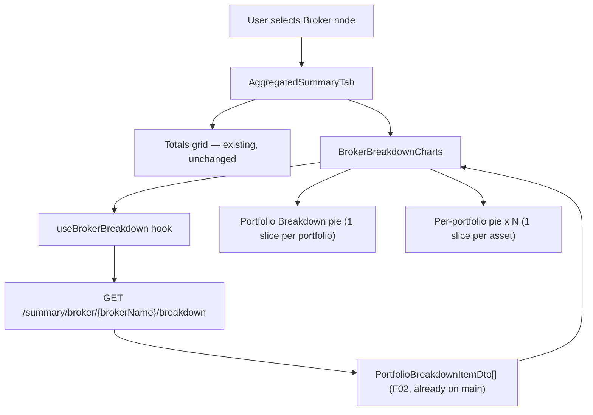

# F07. Broker Breakdown Pie Charts — Web Frontend

## 1. Technical Overview

**What:** Add a new `BrokerBreakdownCharts` component, rendered below the four totals in `AggregatedSummaryTab`, shown only for Broker node selection. It independently fetches `GET /summary/broker/{brokerName}/breakdown` (already implemented by F02, merged to `main`) and renders one `recharts` pie chart titled "Portfolio Breakdown" (one slice per eligible portfolio) plus one additional pie chart per eligible portfolio (one slice per eligible asset in that portfolio).

**Why:** F02 already computes and returns the Encerradas-and-inactive-asset-excluded breakdown data (`IReadOnlyList<PortfolioBreakdownItemDTO>`) via `GET /summary/broker/{brokerName}/breakdown`, but nothing in the frontend consumes it yet. This feature is the display layer that turns that already-available data into the visual capital-allocation breakdown described in the PRD.

**Scope:**
- Included: new `BrokerBreakdownCharts` component and its own independent loading/error/empty states; new `useBrokerBreakdown` hook; new `getBrokerBreakdown` API client method and `PortfolioBreakdownItemDto`/`AssetBreakdownItemDto` types; hover tooltips (name, N2 value, 1-decimal percentage); a categorical colour palette; per-chart legend; unit test coverage.
- Excluded: any backend change (F02 already complete); the WPF equivalent (F08, separate feature); the Transactions monthly chart (F09) — out of scope for this feature.

## 2. Architecture Impact

**Affected components:**
- `Financial.Web/src/api/types.ts` — new `PortfolioBreakdownItemDto`/`AssetBreakdownItemDto` types
- `Financial.Web/src/api/financialApiClient.ts` — new `getBrokerBreakdown` method
- `Financial.Web/src/hooks/useBrokerBreakdown.ts` — new hook, mirrors `useAggregatedSummary`'s reducer/fetch pattern but only fetches for Broker selection
- `Financial.Web/src/components/BrokerBreakdownCharts.tsx` — new component
- `Financial.Web/src/components/BrokerBreakdownCharts.css` — new stylesheet
- `Financial.Web/src/components/AggregatedSummaryTab.tsx` — conditionally renders `BrokerBreakdownCharts` for Broker selection
- `Financial.Web/src/hooks/useBrokerBreakdown.test.ts` — new
- `Financial.Web/src/components/__tests__/BrokerBreakdownCharts.test.tsx` — new
- `Financial.Web/src/components/__tests__/AggregatedSummaryTab.test.tsx` — extended



## 3. Technical Decisions

| Decision | Chosen Approach | Alternative Considered | Trade-off |
|----------|------------------|-------------------------|-----------|
| Categorical palette | Adopt the 8-hue validated reference palette from the project's dataviz methodology (`#2a78d6` blue, `#1baf7a` aqua, `#eda100` yellow, `#008300` green, `#4a3aa7` violet, `#e34948` red, `#e87ba4` magenta, `#eb6834` orange), assigned by slice index and cycling (`palette[i % palette.length]`) per the PRD's "repeating if the slice count exceeds the palette size" | Hand-pick colours matching the app's existing green/red/blue financial semantics | The existing green/red/blue are reserved for signed financial meaning (bought/sold/credits) — reusing them as arbitrary categorical identity would create false meaning. The reference palette is pre-validated for CVD-safe adjacency (worst adjacent ΔE 24.2, well clear of the ≥12 target), so no ad-hoc colour picking is needed. **Known trade-off:** the PRD's explicit "repeat when slices exceed the palette" (some portfolios have 9+ assets, confirmed live in F06) means colour identity alone is not reliable past 8 slices — the legend (below) and hover tooltip are the required relief channels, not an optional nicety |
| Legend | Every pie chart renders its own legend (portfolio/asset name + colour swatch), confirmed with the user | Tooltip-only, no legend | The reference palette's own guidance requires a legend for ≥2 categorical series so identity isn't hover-only; given some portfolios have many assets, a legend is the accessible default over relying solely on hover |
| Tooltip content | Custom `content` render function passed to recharts' `Tooltip` (not the stock `formatter` prop used by `CreditsTab`), computing `percentage = slice.totalInvested / sum(siblings' totalInvested) × 100` per slice and rendering name + N2 value + 1-decimal percentage together | Stock `Tooltip formatter` prop (as used in `CreditsTab`) | `formatter` only reformats a single value; the PRD requires three related figures (name, value, percentage) shown together per slice, which needs a custom content renderer, not a single-value formatter |
| Colour assignment stability | Index-based (`palette[i % palette.length]`) per chart, independently for each pie — no shared name→colour map across charts | Deterministic colour per portfolio/asset name (e.g. hash-based), stable across all charts on the page | The PRD explicitly states "the same palette instance is not required to assign identical colours to the same portfolio/asset across separate pies," so the simpler index-based approach is sufficient and avoids an unnecessary hashing/mapping layer |
| Percentage computation location | Computed client-side per chart from the already-fetched `totalInvested` values (matches F02's own design: "Percentage calculation... is left to the frontend, consistent with how `PortfolioWeight` is computed client-side elsewhere") | Have the backend return a pre-computed percentage field | Explicitly directed by F02's spec; no endpoint change needed |
| Palette location | Defined as a local `const` array directly in `BrokerBreakdownCharts.tsx`, mirroring `CreditsTab.tsx`'s existing `DIVIDEND_COLOR`/`RENT_COLOR` local-constant convention | A shared `utils/categoricalPalette.ts` module | Only one component uses it today; extracting a shared module before a second consumer exists is premature abstraction |

## 4. Component Overview

**Frontend:**

| File Path | New/Modified | Purpose | Key Responsibilities |
|-----------|---------------|---------|------------------------|
| `Financial.Web/src/api/types.ts` | Modified | Type contracts | Add `AssetBreakdownItemDto { assetName: string; totalInvested: number }` and `PortfolioBreakdownItemDto { portfolioName: string; totalInvested: number; assets: AssetBreakdownItemDto[] }`, mirroring `AssetBreakdownItemDTO`/`PortfolioBreakdownItemDTO` field-for-field |
| `Financial.Web/src/api/financialApiClient.ts` | Modified | API client | Add `getBrokerBreakdown: (brokerName: string) => Promise<PortfolioBreakdownItemDto[]>` to the interface and its `request<PortfolioBreakdownItemDto[]>(\`/summary/broker/${encodeURIComponent(brokerName)}/breakdown\`)` implementation, mirroring `getSummaryByBroker`'s pattern |
| `Financial.Web/src/hooks/useBrokerBreakdown.ts` | New | Data fetching | Reducer with `RESET \| FETCH_START \| FETCH_SUCCESS \| FETCH_ERROR \| RETRY` actions, mirroring `useAggregatedSummary`'s shape; fetches only when `selectedNode?.nodeType === 'Broker'` (unlike `useAggregatedSummary`, does NOT fetch for Portfolio); resets to empty state for any other node type; exposes `{ breakdown: PortfolioBreakdownItemDto[] | null; isLoading; error; retry }` |
| `Financial.Web/src/components/BrokerBreakdownCharts.tsx` | New | Rendering | Renders `LoadingState`/`ErrorState` (with retry) from `useBrokerBreakdown()`; when `breakdown` is an empty array, renders the text empty-state "No active portfolios to display"; otherwise renders the "Portfolio Breakdown" `PieChart` (one slice per portfolio, sized by `totalInvested`) followed by one `PieChart` per portfolio (titled with the portfolio's name, one slice per asset), in the array's existing order (already alphabetical per F02); each pie has its own custom tooltip content and legend; defines the local categorical palette constant |
| `Financial.Web/src/components/BrokerBreakdownCharts.css` | New | Layout | Stacks the overview pie and per-portfolio pies vertically with spacing; each pie section gets a title (portfolio name, or "Portfolio Breakdown" for the overview) above the chart |
| `Financial.Web/src/components/AggregatedSummaryTab.tsx` | Modified | Integration | Add `const { selectedNode } = useSelectedNode()` and render `{selectedNode?.nodeType === 'Broker' && <BrokerBreakdownCharts />}` after the existing totals grid, inside the same outer `<div className="aggregated-summary">` |

**Backend:** None — `GET /summary/broker/{brokerName}/breakdown` is already implemented and returns the fully Encerradas-and-inactive-excluded, alphabetically-sorted breakdown (F02, merged to `main`). No API contract, service, or data model changes required.

## 5. API Contracts

Not applicable — no new or modified endpoint. `GET /summary/broker/{brokerName}/breakdown` (implemented by F02) already returns the shape this feature consumes:

**Response Example (200 OK):**
```json
[
  {
    "portfolioName": "Acoes",
    "totalInvested": 38639.49,
    "assets": [
      { "assetName": "BBAS3", "totalInvested": 9850.40 },
      { "assetName": "KLBN4", "totalInvested": 3737.48 },
      { "assetName": "TAEE3", "totalInvested": 21914.97 },
      { "assetName": "TASA4", "totalInvested": 3136.64 }
    ]
  }
]
```

Empty response (`[]`, HTTP 200) is a valid, expected shape (broker with zero eligible portfolios) — not an error.

## 6. Data Model

Not applicable — no database changes.

## 7. Testing Strategy

**Test File Structure:**

| Test File | Test Type | Target | Coverage Goal |
|-----------|-----------|--------|-----------------|
| `Financial.Web/src/hooks/useBrokerBreakdown.test.ts` | Unit | `useBrokerBreakdown` | Fetches only for Broker node selection, loading/success/error/retry states, resets on node change to non-Broker |
| `Financial.Web/src/components/__tests__/BrokerBreakdownCharts.test.tsx` | Unit | `BrokerBreakdownCharts` | Renders overview + per-portfolio pies, empty state, error+retry state, loading state, correct slice/percentage data passed to recharts (mocked) |
| `Financial.Web/src/components/__tests__/AggregatedSummaryTab.test.tsx` (extended) | Unit | `AggregatedSummaryTab` | Renders `BrokerBreakdownCharts` only for Broker node selection, not for Portfolio |

**Test Functions:**

| Test Function | Description | Assertions |
|----------------|--------------|-------------|
| `calls_getBrokerBreakdown_on_broker_node_selection` | Broker node selected | `getBrokerBreakdown` called with the broker name |
| `does_not_fetch_on_portfolio_node_selection` | Portfolio node selected | `getBrokerBreakdown` never called |
| `does_not_fetch_on_asset_node_selection` | Asset node selected | `getBrokerBreakdown` never called |
| `sets_isLoading_true_while_fetch_is_in_progress` | Fetch pending | `isLoading` is `true` |
| `populates_breakdown_on_successful_fetch` | Fetch resolves | `breakdown` matches the resolved array |
| `sets_error_on_fetch_failure` | Fetch rejects | `error` is set, `breakdown` stays `null` |
| `retry_re_triggers_fetch` | `retry()` called after failure | `getBrokerBreakdown` called again, success clears the error |
| `resets_state_on_node_change_to_non_broker` | Node changes from Broker to Portfolio/Asset/null | `breakdown` resets to `null` |
| `renders_portfolio_breakdown_pie_with_one_slice_per_portfolio` | 2+ portfolios in response | Pie chart (mocked) receives one data entry per portfolio |
| `renders_one_additional_pie_per_portfolio` | 2 portfolios, each with assets | 2 additional per-portfolio pie charts render, titled with each portfolio's name |
| `computes_correct_percentage_per_slice` | Known `totalInvested` values | Tooltip content receives `percentage` computed as `slice / sum(siblings) × 100`, matching PRD's formula |
| `renders_empty_state_when_breakdown_is_empty_array` | `breakdown: []` | Text "No active portfolios to display" renders; no chart elements render |
| `renders_error_state_with_retry_on_failure` | `error` set | `ErrorState` renders with retry button; totals section (parent) is unaffected (verified in the `AggregatedSummaryTab` test) |
| `renders_loading_state_independently_of_totals` | `isLoading: true` on the breakdown hook while totals hook is idle | Loading indicator shows only in the breakdown section |

**Acceptance tests (PRD Section 9, F07):**
- Selecting a Broker node renders a "Portfolio Breakdown" pie chart below the 4 totals, one slice per eligible portfolio → `renders_portfolio_breakdown_pie_with_one_slice_per_portfolio`
- One additional pie chart renders per eligible portfolio → `renders_one_additional_pie_per_portfolio`
- Hovering a slice shows its name, Total Invested value, and percentage → `computes_correct_percentage_per_slice` (percentage logic; tooltip rendering itself is recharts-internal, verified by passing the correct computed data into the mocked `Tooltip`/`content` prop)
- The Encerradas portfolio and any asset with `totalInvested <= 0` never appear as a slice → not re-tested here; already covered by F02's own test suite (this feature renders F02's response verbatim, per the Technical Decisions table — no client-side filtering is applied or needed)
- Selecting a Portfolio or Asset node does not render this component (regression check) → covered by the extended `AggregatedSummaryTab.test.tsx`
- Zero eligible portfolios renders an empty-state message → `renders_empty_state_when_breakdown_is_empty_array`
- A failed breakdown fetch shows an `ErrorState` with Retry; the 4 totals above remain visible and functional → `renders_error_state_with_retry_on_failure` (breakdown fetch failure is isolated to `useBrokerBreakdown`, entirely independent of `useAggregatedSummary`)

**Cross-feature integration tests (PRD Section 9):**
- Portfolio and asset `totalInvested` values from F02's breakdown endpoint are used without transformation to size and label slices → `renders_portfolio_breakdown_pie_with_one_slice_per_portfolio` + `renders_one_additional_pie_per_portfolio`
- The Encerradas exclusion and non-positive-slice omission rules defined in F02 are reflected exactly in what F07 renders (no additional or missing slices) → satisfied by construction: F07 renders the F02 response array directly with no client-side filtering

## Assumptions and Decisions (from interview)

- **Legend per chart**: every pie (overview and per-portfolio) renders its own legend, confirmed with the user over a tooltip-only alternative, given some portfolios have many assets (9+ observed live) and the palette repeats past 8 slices.
- **Categorical palette**: the 8-hue validated reference palette (see Technical Decisions) is adopted directly since the app has no existing categorical palette and its existing green/red/blue colours are reserved for signed financial totals, not generic category identity.
- **Custom tooltip content** (not the stock `formatter` prop `CreditsTab` uses) is required because the PRD's tooltip must show three related figures (name, N2 value, 1-decimal percentage) together, not a single reformatted value.
- **No client-side re-filtering or re-sorting**: F07 trusts F02's response as-is (already Encerradas-excluded, non-positive-slice-omitted, alphabetically sorted) — this is a decision, not just an assumption, since it keeps the exclusion/sorting rules defined in exactly one place (F02).
