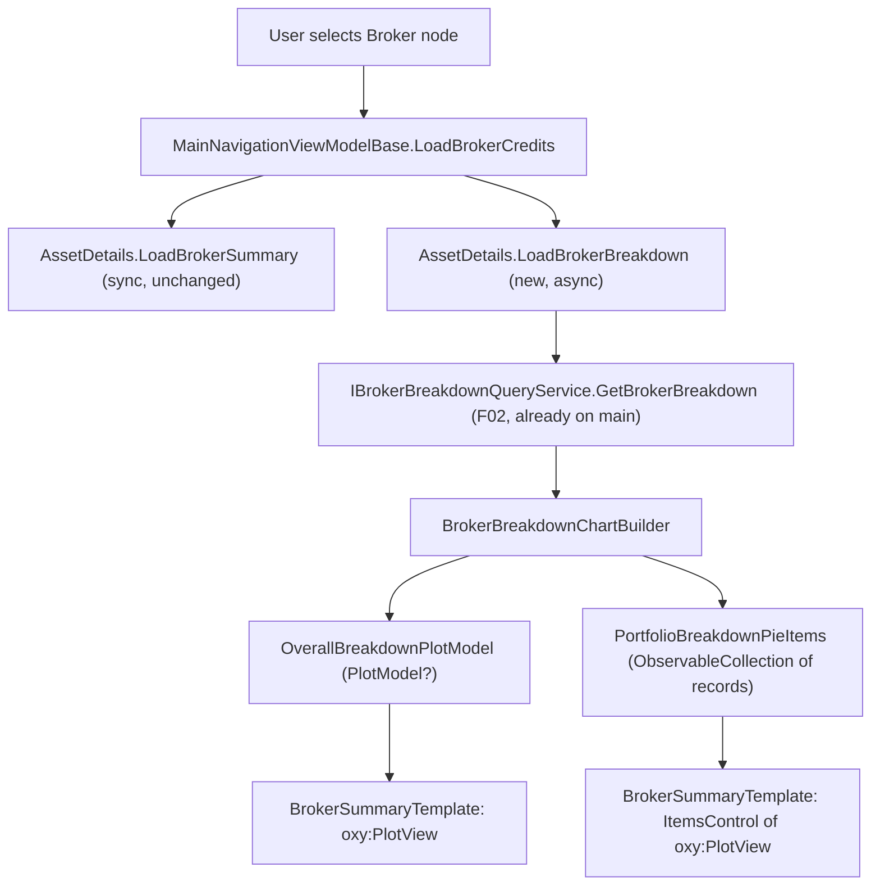

# F08. Broker Breakdown Pie Charts — WPF

## 1. Technical Overview

**What:** Extend the existing `BrokerSummaryTemplate` (added by F06, already merged) with the same portfolio/asset capital-allocation pie charts already delivered on the web (F07, already merged): one overall "Portfolio Breakdown" pie (one slice per eligible portfolio) plus one additional pie per eligible portfolio (one slice per eligible asset), using `OxyPlot.Wpf`'s `PieSeries`.

**Why:** F02 already computes and returns the Encerradas-and-inactive-excluded breakdown (`IBrokerBreakdownQueryService.GetBrokerBreakdown`), and F07 already proved the visual design (validated categorical palette, tooltip content, empty/error/loading states) on the web. This feature is the WPF display layer consuming the same already-available data, so both platforms show consistent visual information as the PRD requires.

**Scope:**
- Included: a new static `BrokerBreakdownChartBuilder` producing `OxyPlot.PlotModel`s from breakdown DTOs; new async-loading state and pie data on `AssetDetailsViewModel`; wiring into `BrokerSummaryTemplate` (overall pie + `ItemsControl` of per-portfolio pies); loading/empty/inline-error states; unit test coverage.
- Excluded: any backend change (F02 already complete); the web equivalent (F07, already merged); the Transactions monthly chart (F10) — out of scope for this feature.

## 2. Architecture Impact

**Affected components:**
- `Financial.App/ViewModels/BrokerBreakdownChartBuilder.cs` — new static class
- `Financial.App/ViewModels/PortfolioBreakdownPieItem.cs` — new immutable record
- `Financial.App/ViewModels/AssetDetailsViewModel.cs` — new constructor dependency, properties, and `LoadBrokerBreakdown` method
- `Financial.App/ViewModels/IAssetDetailsViewModel.cs` — interface update
- `Financial.App/ViewModels/MainNavigationViewModelBase.cs` — dispatch calls the new method
- `Financial.App/ViewModels/MainNavigationViewModel.cs` — new constructor parameter, passed directly into `AssetDetailsViewModel` (see Technical Decisions)
- `Financial.App/Components/NavigationView.xaml` — `BrokerSummaryTemplate` extended with the pie charts
- `Tests/Financial.Presentation.Tests/ViewModels/AssetDetailsViewModelBrokerSummaryTests.cs` — extended
- `Tests/Financial.Presentation.Tests/ViewModels/MainNavigationViewModelBaseTests.cs` — `SpyAssetDetailsViewModel`/stub updated

## 3. Technical Decisions

| Decision | Chosen Approach | Alternative Considered | Trade-off |
|----------|------------------|-------------------------|-----------|
| `IBrokerBreakdownQueryService` ownership | Injected directly into `AssetDetailsViewModel`'s constructor (4th parameter), exactly like `IAssetPriceService` already is — not threaded through `MainNavigationViewModelBase` like `ISummaryQueryService`/`ICreditQueryService`/`IPortfolioAssetSummaryQueryService` | Inject into `MainNavigationViewModelBase`, fetch synchronously in `LoadBrokerCredits` like the other three services, then pass the DTO into a sync `Load*` method | `MainNavigationViewModelBase`'s three existing services are all used for *synchronous* pre-fetch-then-pass-DTO calls. `IAssetPriceService` is the only existing precedent for a service that `AssetDetailsViewModel` owns and calls *asynchronously in the background* (see `FetchRowPricesAsync`) — since the PRD explicitly wants the breakdown fetched asynchronously with its own independent loading state (unlike the synchronous totals/credits fetch), it belongs with the async-service precedent, not the sync one |
| Async fetch mechanics | `Task.Run(() => _brokerBreakdownQueryService.GetBrokerBreakdown(brokerName))` wrapped in a `CancellationTokenSource` (new `_breakdownCts` field), mirroring `FetchRowPricesAsync`'s exact pattern (`Task.Run` + cancellation check before applying results) | `async`/`await` with `Task.Run` only at the service-call boundary | `GetBrokerBreakdown` is a synchronous method (no async overload exists); `Task.Run` is the same mechanism already used for `_assetPriceService.GetCurrentPrice` (also synchronous), so this keeps the codebase's one async-wrapping idiom consistent rather than introducing a second one |
| Per-portfolio pie data shape | `PortfolioBreakdownPieItem` — an immutable `sealed record(string PortfolioName, PlotModel PlotModel)`, held in an `ObservableCollection<PortfolioBreakdownPieItem>`, confirmed with the user | Two new `ObservableObject`-derived view-model classes (`OverallBreakdownPieViewModel`, `PortfolioBreakdownPieViewModel`) as the PRD's wording literally names them | Neither the overall pie nor any per-portfolio pie mutates after the initial load (unlike `PortfolioAssetSummaryRowViewModel`, which genuinely needs property-change notification for its async per-row price fetch) — an `ObservableObject` wrapper would add `INotifyPropertyChanged` machinery with nothing to notify. A record is the leaner, equally-bindable choice for static, build-once-per-load data |
| Overall pie property shape | A single nullable `PlotModel? OverallBreakdownPlotModel` property (private setter), mirroring the existing `CreditsPlotModel` pattern exactly | A dedicated `OverallBreakdownPieViewModel` wrapper class | Same reasoning as above — `CreditsPlotModel` already establishes "bare nullable `PlotModel?` property" as this ViewModel's convention for a single chart; no wrapper is needed when there's only one chart and nothing else to bind alongside it |
| Categorical palette | The same 8 validated hex values used by F07's web pie charts (`OxyColor.FromRgb`/`OxyColor.Parse` equivalents of `#2a78d6`, `#1baf7a`, `#eda100`, `#008300`, `#4a3aa7`, `#e34948`, `#e87ba4`, `#eb6834`), assigned by slice index and cycling | A WPF-specific palette (e.g. reusing `CreditsChartBuilder`'s blue gradient approach) | The PRD's own goal is visual consistency between web and WPF for the *same* screen; reusing F07's exact validated hues (rather than deriving new ones) is the only way to actually achieve that |
| Tooltip content | OxyPlot's built-in tracker via `PieSeries.TrackerFormatString = "{1}\n{2:N2}\n{3:P1}"` (label, N2 value, 1-decimal percentage — `{3}` is OxyPlot's own built-in fraction-of-total, unlike recharts which required manual computation in F07) | A custom `TrackerFormatString` matching F07's tooltip layout more literally | `PieSeries` already computes and exposes the slice's fraction of the series total to its own tracker format string (unlike recharts' Tooltip payload, which does not carry it) — no manual percentage computation is needed on the WPF side, unlike the fix that was required for F07 |
| Error retry | No retry button — an inline error message only, matching the PRD's WPF Experience wording ("shows an inline error message") which, unlike F07's Web spec, does not mention a retry action for this platform | Add a retry button/command for parity with F07's web `ErrorState` + Retry | The PRD is specific and different between the two platforms here (F07's Experience explicitly says "with a Retry button"; F08's Experience does not) — treated as an intentional platform difference, not an oversight, and documented as an assumption below |

## 4. Component Overview

**Frontend (WPF):**

| File Path | New/Modified | Purpose | Key Responsibilities |
|-----------|---------------|---------|------------------------|
| `Financial.App/ViewModels/BrokerBreakdownChartBuilder.cs` | New | Chart construction | `internal static class` with `Build(IReadOnlyList<(string Name, decimal Value)> slices) : PlotModel`, mirroring `CreditsChartBuilder`'s static-builder shape; constructs a `PieSeries` with one `PieSlice` per input, assigns colours from the shared palette by index, sets `TrackerFormatString`; returns an empty `PlotModel` (no series) when `slices` is empty, letting the empty-state check happen at the ViewModel/XAML level |
| `Financial.App/ViewModels/PortfolioBreakdownPieItem.cs` | New | Per-portfolio pie data | `public sealed record PortfolioBreakdownPieItem(string PortfolioName, PlotModel PlotModel)` |
| `Financial.App/ViewModels/AssetDetailsViewModel.cs` | Modified | View state + async load | Add 4th constructor parameter `IBrokerBreakdownQueryService brokerBreakdownQueryService`; add `PlotModel? OverallBreakdownPlotModel`, `ObservableCollection<PortfolioBreakdownPieItem> PortfolioBreakdownPieItems`, `bool IsBreakdownLoading`, `string? BreakdownError` properties; add `public void LoadBrokerBreakdown(string brokerName)` following `FetchRowPricesAsync`'s `Task.Run`+`CancellationTokenSource` pattern (new `_breakdownCts` field); reset all breakdown state (cancel pending fetch, clear collection/plot/error, `IsBreakdownLoading = false`) in `Clear()` and in `LoadAggregateCredits`/`LoadAssetDetails` (i.e., whenever switching away from Broker view) |
| `Financial.App/ViewModels/IAssetDetailsViewModel.cs` | Modified | Contract | Add `void LoadBrokerBreakdown(string brokerName)` (state properties are read-only outputs, not called via the interface by any C# caller, so — mirroring `TotalInvested`'s precedent from F06 — they are not added to the interface, only the method is) |
| `Financial.App/ViewModels/MainNavigationViewModelBase.cs` | Modified | Dispatch | In the private `LoadBrokerCredits(TreeNodeViewModel brokerNode)` method, add `AssetDetails.LoadBrokerBreakdown(brokerName);` immediately after the existing `AssetDetails.LoadBrokerSummary(...)` call. No constructor change needed here (see Technical Decisions) |
| `Financial.App/ViewModels/MainNavigationViewModel.cs` | Modified | DI wiring | Add `IBrokerBreakdownQueryService brokerBreakdownQueryService` constructor parameter, passed directly into `new AssetDetailsViewModel(...)`. No DI registration change needed — `IBrokerBreakdownQueryService` is already registered by `AddFinancialApplication()` (F02), and `MainNavigationViewModel` is already resolved via `services.AddTransient<MainNavigationViewModel>()`, which resolves new constructor parameters automatically |
| `Financial.App/Components/NavigationView.xaml` | Modified | Rendering | Wrap `BrokerSummaryTemplate`'s content in a `ScrollViewer` (it currently isn't scrollable, unlike `AssetSummaryTemplate`, and a broker with several portfolios could exceed viewport height); add, below the existing 2-row totals grid: a loading `TextBlock` (`Visibility` bound to `IsBreakdownLoading` via `BoolToVisibilityConverter`), an inline error `TextBlock` (bound to `BreakdownError`, visible when non-null), an empty-state `TextBlock` ("No active portfolios to display", visible when not loading, no error, and `PortfolioBreakdownPieItems.Count == 0`), an `oxy:PlotView Model="{Binding AssetDetails.OverallBreakdownPlotModel}"`, and an `ItemsControl ItemsSource="{Binding AssetDetails.PortfolioBreakdownPieItems}"` whose `ItemTemplate` shows the portfolio name (`TextBlock Text="{Binding PortfolioName}"`) above an `oxy:PlotView Model="{Binding PlotModel}"` |

**Backend:** None — `IBrokerBreakdownQueryService.GetBrokerBreakdown` is already implemented and registered (F02, merged to `main`). No API contract, service, or data model changes required.

## 5. API Contracts

Not applicable — no new or modified endpoint or service interface. `IBrokerBreakdownQueryService.GetBrokerBreakdown(string brokerName) : IReadOnlyList<PortfolioBreakdownItemDTO>` (F02) is called directly in-process (no HTTP boundary in the WPF app); this feature only adds the async-loading wrapper and chart construction that consume its already-defined return shape (`PortfolioName`, `TotalInvested`, `Assets: IReadOnlyList<AssetBreakdownItemDTO> { AssetName, TotalInvested }`).

## 6. Data Model

Not applicable — no database changes.

## 7. Testing Strategy

**Test File Structure:**

| Test File | Test Type | Target | Coverage Goal |
|-----------|-----------|--------|-----------------|
| `Tests/Financial.Presentation.Tests/ViewModels/AssetDetailsViewModelBrokerSummaryTests.cs` (extended) | Unit | `AssetDetailsViewModel.LoadBrokerBreakdown` | Sets loading state, populates overall/per-portfolio pie data on success, sets error on failure, resets on `Clear()`/node switching, cancels a stale in-flight fetch on rapid re-load |
| `Tests/Financial.Presentation.Tests/ViewModels/MainNavigationViewModelBaseTests.cs` (extended) | Unit | `MainNavigationViewModelBase` Broker dispatch | `LoadBrokerBreakdown` is called with the correct broker name alongside `LoadBrokerSummary` on Broker node selection |

**Test Functions:**

| Test Function | Description | Assertions |
|----------------|--------------|-------------|
| `LoadBrokerBreakdown_SetsIsBreakdownLoadingTrue_Synchronously` | Calling `LoadBrokerBreakdown` before the background task completes | `vm.IsBreakdownLoading` is `true` immediately (synchronous state change, before any `await`/poll) |
| `LoadBrokerBreakdown_PopulatesOverallBreakdownPlotModel_OnSuccess` | Stub service returns 2+ portfolios | After the background task completes, `vm.OverallBreakdownPlotModel` is non-null with one series |
| `LoadBrokerBreakdown_PopulatesPortfolioBreakdownPieItems_OnSuccess` | Stub service returns 2 portfolios with assets | `vm.PortfolioBreakdownPieItems.Count` equals 2, each item's `PortfolioName` matches, each `PlotModel` is non-null |
| `LoadBrokerBreakdown_SetsIsBreakdownLoadingFalse_OnSuccess` | After successful completion | `vm.IsBreakdownLoading` is `false` |
| `LoadBrokerBreakdown_SetsBreakdownError_OnFailure` | Stub service throws | `vm.BreakdownError` is non-null, `vm.IsBreakdownLoading` is `false` |
| `Clear_AfterLoadBrokerBreakdown_ResetsBreakdownState` | `Clear()` called after a successful load | `OverallBreakdownPlotModel` is `null`, `PortfolioBreakdownPieItems` is empty, `IsBreakdownLoading` is `false`, `BreakdownError` is `null` |
| `LoadAssetDetails_AfterLoadBrokerBreakdown_ResetsBreakdownState` | Selecting an Asset node after a Broker node (regression check) | Breakdown state resets the same way as `Clear()` |
| `SelectingBrokerNode_CallsLoadBrokerBreakdownOnDetailsViewModel` (in `MainNavigationViewModelBaseTests.cs`) | Broker node selected via the routing dispatch | Spy's `LastBrokerBreakdownName` (or equivalent) equals the selected broker's name |

**Acceptance tests (PRD Section 9, F08):**
- Selecting a Broker node in WPF renders the overall portfolio breakdown pie and one pie per eligible portfolio → covered by `LoadBrokerBreakdown_PopulatesOverallBreakdownPlotModel_OnSuccess` + `LoadBrokerBreakdown_PopulatesPortfolioBreakdownPieItems_OnSuccess` (template/`ItemsControl` rendering itself is XAML data-binding, not directly unit-testable — verified via manual/smoke check)
- Hovering a slice in WPF shows its name, value, and percentage via OxyPlot's tracker → `TrackerFormatString` is set on every constructed `PieSeries`; OxyPlot's own tracker rendering is a third-party concern, verified via manual/smoke check
- Zero eligible portfolios shows an empty-state message → the empty-state `TextBlock`'s visibility binding is XAML-level; the underlying condition (`PortfolioBreakdownPieItems.Count == 0`) is exercised by a success test with an empty stub result, verified via manual/smoke check for the visual empty-state itself
- A failed breakdown fetch shows an inline error; the 4 totals remain visible and unaffected → `LoadBrokerBreakdown_SetsBreakdownError_OnFailure` (isolation from totals is by construction: separate method, separate state, `LoadBrokerSummary` is unaffected by `LoadBrokerBreakdown`'s outcome)

**Cross-feature integration tests (PRD Section 9):**
- Portfolio and asset `totalInvested` values from F02's breakdown endpoint are used without transformation to size and label slices in F07 and F08 → covered by `LoadBrokerBreakdown_PopulatesPortfolioBreakdownPieItems_OnSuccess` (values passed straight into `BrokerBreakdownChartBuilder.Build`, no transformation)
- The Encerradas exclusion and non-positive-slice omission rules defined in F02 are reflected exactly in what F07 and F08 render → satisfied by construction: F08 renders `IBrokerBreakdownQueryService`'s response verbatim, with no client-side re-filtering (same principle already established in F07's spec)

## Assumptions and Decisions (from interview)

- **Simplified pie data shape**: confirmed with the user — the overall pie reuses the existing bare-`PlotModel?`-property convention (`CreditsPlotModel`'s precedent), and per-portfolio pies use a lightweight immutable record rather than the two `ObservableObject`-derived classes the PRD's wording literally names, since none of this data mutates after the initial load.
- **`IBrokerBreakdownQueryService` is injected directly into `AssetDetailsViewModel`**, not threaded through `MainNavigationViewModelBase`, following the `IAssetPriceService`/`FetchRowPricesAsync` async-ownership precedent rather than the synchronous three-service precedent.
- **No retry button for the WPF error state** — the PRD's Experience wording differs between F07 (Web, explicit "Retry button") and F08 (WPF, "inline error message" only); treated as an intentional platform difference rather than applying web parity by default.
- **Colour palette reused verbatim from F07** (same 8 hex values) to achieve the PRD's stated cross-platform visual-consistency goal.
