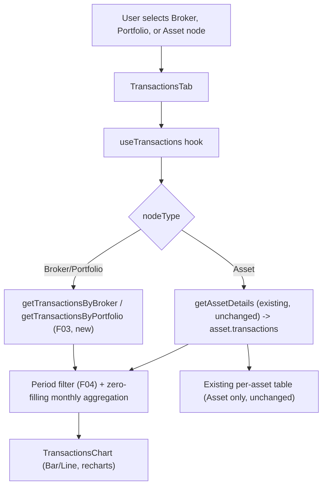

# F09. Transactions Monthly Investment Chart — Web Frontend

## 1. Technical Overview

**What:** Extend `TransactionsTab` to render a monthly net-invested chart (`sum(Buy.totalPrice) − sum(Sell.totalPrice)` per calendar month, zero-filled for gap months) for Broker, Portfolio, and Asset node selection. For Broker/Portfolio (currently a placeholder message), the chart becomes the *only* content — no transaction table. For Asset, the existing transaction table is unchanged and the chart is added above it, computed from the asset's already-loaded transaction list. A Bar/Line toggle (default Bar) and the six F04 period-filter buttons (default Last 12 Months) control the chart, both persisted per node selection, mirroring `CreditsTab`'s existing UX.

**Why:** F03 already exposes the combined Buy/Sell transaction list for Broker and Portfolio scope (`GET /transactions/broker/{brokerName}`, `GET /transactions/portfolio/{brokerName}/{portfolioName}`), and F04 already defines the canonical six-option period filter shared with the Credits chart. This feature is the display layer wiring both together into `TransactionsTab`, following the exact architectural pattern `useCredits`/`CreditsTab` already established for "fetch by node type + period-filter + monthly-aggregate + persist per node."

**Scope:**
- Included: extending `useTransactions` with Broker/Portfolio fetch branches, period-filter and chart-mode state (persisted per node selection), a zero-filling monthly aggregation function; a new `TransactionsChart` rendering (Bar/Line toggle, recharts `BarChart`/`LineChart`); replacing the Broker/Portfolio placeholder; adding the chart above the existing Asset table; new API client method and DTO type; unit test coverage.
- Excluded: any backend change (F03/F04 already complete); the WPF equivalent (F10, separate feature) — out of scope for this feature.

## 2. Architecture Impact

**Affected components:**
- `Financial.Web/src/api/types.ts` — new `TransactionSummaryItemDto` type
- `Financial.Web/src/api/financialApiClient.ts` — new `getTransactionsByBroker`/`getTransactionsByPortfolio` methods
- `Financial.Web/src/hooks/useTransactions.ts` — extended with Broker/Portfolio fetch, chart-mode/filter state, zero-filling aggregation
- `Financial.Web/src/components/TransactionsTab.tsx` — renders the chart for all three node types; replaces the placeholder
- `Financial.Web/src/components/TransactionsTab.css` — new chart/filter/mode-toggle styles
- `Financial.Web/src/hooks/useTransactions.test.ts` — extended
- `Financial.Web/src/components/__tests__/TransactionsTab.test.tsx` — extended



## 3. Technical Decisions

| Decision | Chosen Approach | Alternative Considered | Trade-off |
|----------|------------------|-------------------------|-----------|
| Hook architecture | Extend the existing `useTransactions` hook with Broker/Portfolio fetch branches and chart state, mirroring `useCredits`'s already-established "one hook, one `nodeType`-branched fetch, per-node-persisted filter/mode" shape | A separate `useTransactionsChart` hook composed alongside `useTransactions` | `useCredits` is the proven precedent for exactly this shape (fetch-by-node-type + period-filter + monthly-aggregate + per-node persistence) in this codebase. A second hook would duplicate the `nodeType` branching and selection-key logic `useCredits`/`useTransactions` already have, and would need its own subscription to `selectedNode` |
| Asset chart data source | Reuses `state.asset.transactions` — the same `AssetDetailsDto` already fetched by `useTransactions`'s existing `getAssetDetails` call for the table. No new fetch for Asset scope | Fetch transactions separately for the chart even on Asset scope | Matches the PRD's explicit requirement ("computed client-side from the asset's already-loaded transaction list, no new fetch for this case") exactly, and avoids a redundant network call |
| Shared aggregation input type | The zero-filling aggregation function accepts a minimal structural type `{ date: string; type: string; totalPrice: number }`, satisfied by both `TransactionDto` (Asset, has more fields) and `TransactionSummaryItemDto` (Broker/Portfolio) without any mapping/conversion step | Convert both DTOs to a common shape before aggregating | TypeScript's structural typing already makes both DTOs assignable to the narrower aggregation input type as-is; an explicit conversion step would be redundant code |
| Zero-fill algorithm | Iterate every calendar month from the period's start (per `getPeriodFilterStartDate`) through the current month, creating a `netInvested: 0` bucket for any month with no matching transactions; for "All Time" (`getPeriodFilterStartDate` returns `null`), iterate from the earliest transaction's month instead | Only fill gaps between the earliest and latest transaction, ignoring the selected period's actual start | The PRD requires gap-free months specifically *within the selected period range*, not just within the data's own span — for "This Month" with zero transactions, the chart must still show one zero-value month, not an empty chart |
| Bar/Line toggle naming | `ChartDisplayMode = 'Bar' \| 'Line'`, distinct from `useCredits`'s existing `ViewMode = 'Stacked' \| 'Grouped'` | Reuse the `ViewMode` name for both | The two toggles control conceptually different things (chart *type* vs. stacking behavior) and both hooks are imported independently — a shared name would be confusing even though there's no actual TypeScript collision (different modules) |
| Neutral bar/line colour | A single muted slate colour (`#6b7280`) for every month's bar/point regardless of sign, distinct from the green/red/blue already used elsewhere for Bought/Sold/Credits | Reuse `SignedValueToBrushConverter`-equivalent green/red logic like Total Invested does | The PRD explicitly says no sign colouring here ("the bar's position below/above zero already conveys sign") — this is a deliberate contrast with Total Invested's colour-by-sign treatment elsewhere in the app |
| Filter/mode persistence | Confirmed with the user: persisted per node selection via the same `Map<selectionKey, prefs>` pattern `useCredits` already uses, keyed by `buildSelectionKey`-equivalent logic (already exported from `useCredits.ts` and reusable directly, since it takes a `SelectedNode` and doesn't depend on credits-specific state) | Reset to defaults (Last 12 Months, Bar) on every node change | Confirmed for UX consistency with the already-shipped Credits tab behavior |

## 4. Component Overview

**Frontend:**

| File Path | New/Modified | Purpose | Key Responsibilities |
|-----------|---------------|---------|------------------------|
| `Financial.Web/src/api/types.ts` | Modified | Type contract | Add `TransactionSummaryItemDto { assetName: string; date: string; type: string; totalPrice: number }`, mirroring `TransactionSummaryItemDTO` field-for-field |
| `Financial.Web/src/api/financialApiClient.ts` | Modified | API client | Add `getTransactionsByBroker`/`getTransactionsByPortfolio`, mirroring `getCreditsByBroker`/`getCreditsByPortfolio`'s exact pattern (`/transactions/broker/{brokerName}`, `/transactions/portfolio/{brokerName}/{portfolioName}`) |
| `Financial.Web/src/hooks/useTransactions.ts` | Modified | Data + chart state | Add `brokerPortfolioTransactions: TransactionSummaryItemDto[]` to state; add Broker/Portfolio fetch branches to the existing effect (mirroring `useCredits`'s `nodeType` branching), reusing the existing `FETCH_START`/`FETCH_ERROR` actions and a new `FETCH_TRANSACTIONS_SUCCESS` action (distinct from the existing `FETCH_SUCCESS` which sets `asset`); add `selectedFilter`/`selectedChartMode`/`filterPersistence` state and `setFilter`/`setChartMode` actions, mirroring `useCredits`'s `SET_FILTER`/`SET_MODE`/persistence Map; add a `chartData` memo selecting `state.asset?.transactions ?? []` (Asset) or `state.brokerPortfolioTransactions` (Broker/Portfolio) as the aggregation input, applying the period filter and the new zero-filling monthly aggregation function |
| `Financial.Web/src/components/TransactionsTab.tsx` | Modified | Rendering | Add a `TransactionsChart` sub-component (period-filter buttons + Bar/Line toggle + recharts `BarChart`/`LineChart`, mirroring `CreditsTab`'s `ChartPanel`/toolbar structure); for Broker/Portfolio, render only `TransactionsChart` in place of the current placeholder text; for Asset, render `TransactionsChart` above the existing (unchanged) table |
| `Financial.Web/src/components/TransactionsTab.css` | Modified | Styling | Add `transactions-tab__filters`/`__filter-btn`/`__filter-btn--active`, `__modes`/`__mode-btn`/`__mode-btn--active` (copied from `CreditsTab.css`'s equivalent rules), `__chart-panel`/`__chart-title`/`__chart-container` (copied from `CreditsTab.css`) |

**Backend:** None — `GET /transactions/broker/{brokerName}` and `GET /transactions/portfolio/{brokerName}/{portfolioName}` are already implemented (F03, merged to `main`). No API contract, service, or data model changes required.

## 5. API Contracts

Not applicable — no new or modified endpoint. Both endpoints (F03) already return the shape this feature consumes:

**Response Example (200 OK), `GET /transactions/broker/{brokerName}`:**
```json
[
  { "assetName": "BBAS3", "date": "2025-03-20T00:00:00", "type": "Buy", "totalPrice": 9850.40 },
  { "assetName": "KLBN4", "date": "2025-04-15T00:00:00", "type": "Sell", "totalPrice": 500.00 }
]
```

Empty response (`[]`, HTTP 200) is a valid, expected shape (scope with no transactions) — not an error.

## 6. Data Model

Not applicable — no database changes.

## 7. Testing Strategy

**Test File Structure:**

| Test File | Test Type | Target | Coverage Goal |
|-----------|-----------|--------|-----------------|
| `Financial.Web/src/hooks/useTransactions.test.ts` (extended) | Unit | `useTransactions` | Broker/Portfolio fetch branching, chart-mode/filter state and persistence, zero-filling aggregation correctness, Asset scope reusing the existing fetch |
| `Financial.Web/src/components/__tests__/TransactionsTab.test.tsx` (extended) | Unit | `TransactionsTab` | Chart renders (no table) for Broker/Portfolio; chart + table both render for Asset; filter buttons, Bar/Line toggle, loading/error states |

**Test Functions:**

| Test Function | Description | Assertions |
|----------------|--------------|-------------|
| `calls_getTransactionsByBroker_on_broker_node_selection` | Broker node selected | Client method called with the broker name |
| `calls_getTransactionsByPortfolio_on_portfolio_node_selection` | Portfolio node selected | Client method called with broker + portfolio names |
| `does_not_call_broker_or_portfolio_endpoints_on_asset_node_selection` | Asset node selected | Neither new client method called (reuses `getAssetDetails`) |
| `chartData_zero_fills_months_with_no_transactions_within_selected_period` | Fixture with a gap month, `Last 3 Months` filter | Every month in the 3-month range appears, gap month has `netInvested: 0` |
| `chartData_computes_net_invested_as_buy_minus_sell_per_month` | Fixture with Buy 1000 + Sell 300 in the same month | That month's bucket is `700` |
| `chartData_uses_asset_transactions_for_asset_scope` | Asset node, `state.asset.transactions` populated | `chartData` derived from those transactions, not from `brokerPortfolioTransactions` |
| `setFilter_persists_selection_per_node` | Set filter on Broker A, switch to Broker B, switch back to Broker A | Broker A's filter selection is remembered (mirrors `useCredits`'s equivalent persistence test) |
| `setChartMode_persists_selection_per_node` | Same persistence pattern for Bar/Line | Mirrors the filter persistence test |
| `renders_chart_only_for_broker_node_selection` (TransactionsTab) | Broker node, mocked hook returns chart data | Chart renders; no `<table>` element present |
| `renders_chart_only_for_portfolio_node_selection` (TransactionsTab) | Portfolio node | Same as above |
| `renders_chart_above_table_for_asset_node_selection` (TransactionsTab) | Asset node | Both chart and the existing table render; table content unchanged from current behaviour |
| `renders_six_period_filter_buttons` (TransactionsTab) | Any scope | All 6 F04 labels present (mirrors `CreditsTab`'s equivalent test) |
| `renders_bar_line_toggle_defaulting_to_bar` (TransactionsTab) | Fresh selection | `Bar` toggle button has the active class |
| `clicking_line_toggle_calls_setChartMode` (TransactionsTab) | User clicks `Line` | `setChartMode('Line')` called |
| `renders_error_state_with_retry_on_broker_portfolio_fetch_failure` (TransactionsTab) | Fetch fails for Broker/Portfolio | `ErrorState` with Retry renders in place of the chart |

**Acceptance tests (PRD Section 9, F09):**
- Selecting a Broker or Portfolio node shows the monthly chart instead of the placeholder, with no transaction table → `renders_chart_only_for_broker_node_selection` + `renders_chart_only_for_portfolio_node_selection`
- Selecting an Asset node shows the existing table plus the new chart above it → `renders_chart_above_table_for_asset_node_selection`
- Each month's plotted value equals `sum(Buy.totalPrice) − sum(Sell.totalPrice)` → `chartData_computes_net_invested_as_buy_minus_sell_per_month`
- Months with no transactions within the selected period still appear with a value of 0 → `chartData_zero_fills_months_with_no_transactions_within_selected_period`
- Chart defaults to Bar; toggling to Line re-renders the same data as a line → `renders_bar_line_toggle_defaulting_to_bar` + `clicking_line_toggle_calls_setChartMode`
- The 6 period filter buttons correctly narrow the plotted months; default period on load is Last 12 Months → `renders_six_period_filter_buttons` + covered by the hook's default state
- A failed Broker/Portfolio transaction fetch shows an `ErrorState` with Retry → `renders_error_state_with_retry_on_broker_portfolio_fetch_failure`

**Cross-feature integration tests (PRD Section 9):**
- The transaction list returned by F03 for a Broker or Portfolio scope is used without transformation by F09 to compute each month's net-invested value → `chartData_computes_net_invested_as_buy_minus_sell_per_month` (uses the F03 DTO shape directly, no mapping)
- The period options and date-range rules defined by F04 are applied identically by F09 and continue to be applied identically by the existing Credits chart → satisfied by construction: F09 imports `PERIOD_FILTER_OPTIONS`/`getPeriodFilterStartDate` from the same `utils/periodFilter.ts` module F04 already established, with no F09-local reimplementation

## Assumptions and Decisions (from interview)

- **Filter and chart-mode selections persist per node selection**, confirmed with the user, mirroring `CreditsTab`'s existing per-node persistence UX rather than resetting to defaults on every node change.
- **Hook extension over a new hook**: `useTransactions` is extended in place rather than adding a parallel `useTransactionsChart` hook, since `useCredits` already proves this exact shape works for the analogous Credits feature.
- **Zero-fill spans the selected period's actual date range** (not just the data's own min/max), so a period with zero transactions still renders a fully gap-free (all-zero) chart rather than an empty one.
- **Neutral colour (`#6b7280`)** for all bars/points regardless of sign, per the PRD's explicit "no sign colouring" requirement — a deliberate contrast with how Total Invested is coloured elsewhere in the app.
