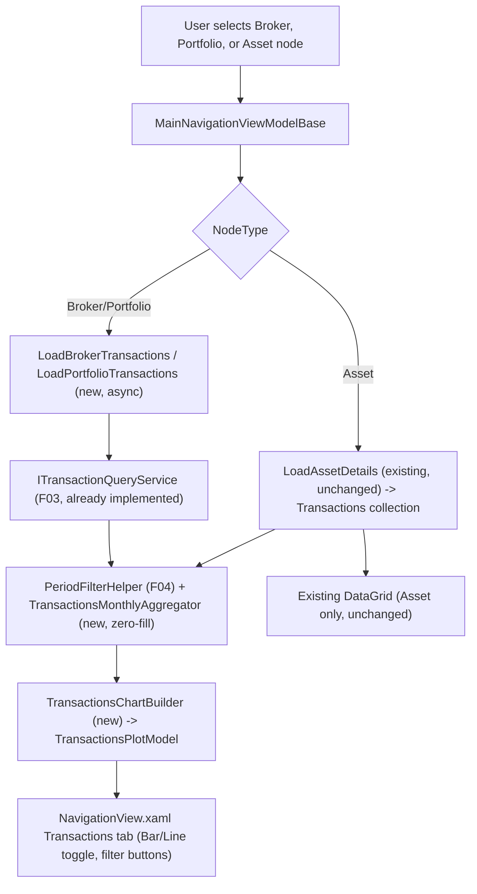

# F10. Transactions Monthly Investment Chart — WPF

## 1. Technical Overview

**What:** Extend the WPF desktop app's Transactions tab to render a monthly net-invested chart (`sum(Buy.TotalPrice) − sum(Sell.TotalPrice)` per calendar month, zero-filled for gap months) for Broker, Portfolio, and Asset node selection — the exact desktop counterpart of F09 (Web). For Broker/Portfolio selection (currently an empty `DataGrid` bound to an always-empty `Transactions` collection, with no dedicated message), the chart becomes the *only* content — no `DataGrid`. For Asset selection, the existing `DataGrid` is unchanged and the chart is added above it in a resizable split, computed from the asset's already-loaded `Transactions` collection. A Bar/Line toggle (default Bar) and the same six F04 period-filter buttons (default Last 12 Months) control the chart, both persisted per node selection, mirroring the existing Credits tab's `CreditsFilters`/`CreditsTypeModes` UX exactly.

**Why:** F03 already exposes `ITransactionQueryService.GetTransactionsByBroker`/`GetTransactionsByPortfolio` in-process (no HTTP hop needed — WPF calls Application-layer services directly via DI, unlike the web client), and F04 already provides `PeriodFilterHelper` with the canonical six-option period set. F08 already established the exact async-fetch-with-loading/error-state pattern this feature needs (`LoadBrokerBreakdown`, `IsBreakdownLoading`, `BreakdownError`, `CancellationTokenSource`-based cancel-on-reselect), and the existing Credits tab (`CreditsChartBuilder`, `CreditsFilters`, `CreditsTypeModes`, per-node `_creditsViewStateByKey` persistence) already established the exact chart/filter/mode/persistence pattern. This feature wires these three already-proven patterns together for the Transactions tab, mirroring F09's web implementation so both platforms compute and display identical chart data.

**Scope:**
- Included: a new pure `TransactionsMonthlyAggregator` (zero-filling monthly net-invested calculation, unit-testable independent of OxyPlot/ViewModel wiring); a new `TransactionsChartBuilder` (OxyPlot `PlotModel` construction for Bar and Line modes, single neutral series colour); `AssetDetailsViewModel` extended with `LoadBrokerTransactions`/`LoadPortfolioTransactions` async methods, filter/mode state, and per-node persistence; `MainNavigationViewModelBase` wiring the two new load calls on Broker/Portfolio selection; `NavigationView.xaml` Transactions tab split into an Asset template (existing `DataGrid` + new chart above it, resizable) and an Aggregate template (chart only); unit test coverage.
- Excluded: any backend change (F03/F04 already complete, merged to `main`); the Web implementation (F09, already complete, merged to `main` via PR #126) — this feature only covers the WPF (`Financial.App`) side.

## 2. Architecture Impact

**Affected components:**
- `Financial.App/ViewModels/TransactionsMonthlyAggregator.cs` (new) — pure zero-filling monthly aggregation
- `Financial.App/ViewModels/TransactionsChartBuilder.cs` (new) — OxyPlot `PlotModel` construction for Bar/Line
- `Financial.App/ViewModels/ChartTypeMode.cs` (new) — `Bar`/`Line` enum
- `Financial.App/ViewModels/ChartTypeModeOptionViewModel.cs` (new) — mirrors `CreditsTypeModeOptionViewModel`
- `Financial.App/ViewModels/TransactionsFilterOptionViewModel.cs` (new) — mirrors `CreditsFilterOptionViewModel`
- `Financial.App/ViewModels/TransactionsViewState.cs` (new) — mirrors `CreditsViewState`
- `Financial.App/ViewModels/IAssetDetailsViewModel.cs` (modified) — two new async load methods on the interface
- `Financial.App/ViewModels/AssetDetailsViewModel.cs` (modified) — chart state, async fetch, filter/mode persistence, DI constructor change
- `Financial.App/ViewModels/MainNavigationViewModel.cs` (modified) — DI constructor change (new `ITransactionQueryService` parameter)
- `Financial.App/ViewModels/MainNavigationViewModelBase.cs` (modified) — dispatch the two new load calls on Broker/Portfolio node selection
- `Financial.App/Components/NavigationView.xaml` (modified) — Transactions tab split into Asset/Aggregate `DataTemplate`s
- `Financial.App/Components/NavigationView.xaml.cs` (modified) — new `PlotView.SizeChanged` handler for label-density
- Test files: `Tests/Financial.Presentation.Tests/ViewModels/TransactionsMonthlyAggregatorTests.cs` (new), `Tests/Financial.Presentation.Tests/ViewModels/AssetDetailsViewModelTransactionsChartTests.cs` (new), `Tests/Financial.Presentation.Tests/ViewModels/MainNavigationViewModelBaseTests.cs` (modified)

## 3. Technical Decisions

| Decision | Chosen Approach | Alternative Considered | Trade-off |
|----------|------------------|-------------------------|-----------|
| Aggregation extraction | A separate, independently testable static `TransactionsMonthlyAggregator` class, mirroring F09 web's exported `buildMonthlyNetInvested` function | Inline grouping inside `AssetDetailsViewModel`, mirroring how the existing Credits chart's `RefreshCreditsByMonthChart` does its own grouping inline | Confirmed with the user: the zero-fill math gets its own dedicated unit tests (gap months, Buy-minus-Sell per month) independent of ViewModel/OxyPlot wiring, and both `LoadBrokerTransactions` and `LoadPortfolioTransactions` reuse the same pure function without duplicating the grouping loop |
| Asset-scope chart layout | Resizable `GridSplitter` layout in a new `TransactionsAssetTemplate`, exactly mirroring `CreditsAssetTemplate`'s `Grid` row structure (`DataGrid` → `GridSplitter` → `oxy:PlotView` → mode toggle → filter buttons) | A simpler fixed-height chart panel above a scrollable `DataGrid`, with no drag handle | Confirmed with the user: matches the Credits tab's already-familiar resizable interaction, reusing the same XAML structure and a new `OnTransactionsPlotSizeChanged` handler mirroring `OnCreditsPlotSizeChanged` |
| Shared aggregation input shape | `TransactionsMonthlyAggregator.BuildMonthlyNetInvested` accepts `IEnumerable<(DateTime Date, string Type, decimal TotalPrice)>`; call sites project `TransactionDTO` (Asset) or `TransactionSummaryItemDTO` (Broker/Portfolio) into that tuple shape with a one-line `.Select(...)` | Define a shared marker interface implemented by both DTOs | C# has no structural typing (unlike TypeScript, where F09 accepted both DTOs directly via a minimal structural interface); a tuple projection is the idiomatic C# equivalent — one line per call site, no new interface, no risk of coupling `TransactionDTO`/`TransactionSummaryItemDTO` to a Presentation-layer contract |
| Where `ITransactionQueryService` is injected | Into `AssetDetailsViewModel`'s constructor, exactly mirroring how `IBrokerBreakdownQueryService` (F08) is injected there rather than into `MainNavigationViewModelBase` | Inject into `MainNavigationViewModelBase` and pass the fetched data down as method parameters, mirroring `LoadBrokerCredits`/`LoadPortfolioCredits`'s synchronous pattern | `LoadBrokerBreakdown` is the closer precedent (an async, cancellable, per-node fetch triggered by `MainNavigationViewModelBase` but owned end-to-end by `AssetDetailsViewModel`), and keeps `MainNavigationViewModelBase`'s constructor from growing a fourth query-service parameter for a fetch it doesn't otherwise need to know about |
| Async fetch/loading/error pattern | Mirrors `LoadBrokerBreakdown` exactly: `CancellationTokenSource`-based cancel-on-reselect, `IsTransactionsLoading`/`TransactionsError` properties, `Task.Run` background fetch, `RunOnUIThread` for any `ObservableCollection` mutation | A simpler fire-and-forget `async void` with no cancellation | Reuses a pattern already proven correct in this codebase (F08); avoids reintroducing the exact WPF `ObservableCollection`-cross-thread-mutation bug class this app has hit before |
| Per-node filter/mode persistence | A second `Dictionary<string, TransactionsViewState>` (`_transactionsViewStateByKey`), independent of `_creditsViewStateByKey`, but reusing the same `BuildBrokerKey`/`BuildPortfolioKey`/`BuildCreditsAssetKey` private key-builder methods already used by the Credits tab | Share a single per-node dictionary keyed by node identity, storing both Credits and Transactions state in one record | The PRD explicitly requires the Transactions chart's period selection to be "independent from the Credits tab's currently-selected period" for the same node — a shared dictionary would couple the two features' state; reusing the existing key-builder methods (identical node-identity string format) avoids duplicating that logic while keeping the two dictionaries independent |
| Bar/Line neutral colour | `OxyColor.FromRgb(107, 114, 128)` (`#6b7280`), the exact hex F09 (Web) uses, for every month's bar/point regardless of sign | Reuse `CreditsChartBuilder`'s blue palette or a red/green sign-based colour | Matches F09 web exactly (cross-platform consistency is an explicit PRD goal) and the PRD's explicit "no sign colouring" requirement — the bar's position below/above zero already conveys sign |
| "New transaction" button visibility for Broker/Portfolio | Omitted entirely from the new `TransactionsAggregateTemplate`, mirroring how `CreditsAggregateTemplate` already omits its "New credit" button | Keep the button visible but disabled | Direct precedent already established by the Credits tab; `CanEditTransactions()` already gates on `HasAssetContext`, but hiding the control entirely (rather than showing a button that does nothing) is the pattern this codebase already uses |

## 4. Component Overview

**WPF (`Financial.App`):**

| File Path | New/Modified | Purpose | Key Responsibilities |
|-----------|---------------|---------|------------------------|
| `Financial.App/ViewModels/TransactionsMonthlyAggregator.cs` | New | Pure aggregation | Static `BuildMonthlyNetInvested(IEnumerable<(DateTime Date, string Type, decimal TotalPrice)> transactions, PeriodFilter filter, DateTime referenceDate)` returning `IReadOnlyList<TransactionMonthNet>` (a small `Month`/`NetInvested` record); groups by calendar month (`Buy` positive, `Sell` negative), then zero-fills every month across the selected period's actual range (via `PeriodFilterHelper.GetDateRange`) through the current month — for `AllTime`, starts from the earliest transaction's month instead, mirroring F09's exact zero-fill algorithm |
| `Financial.App/ViewModels/TransactionsChartBuilder.cs` | New | Chart rendering | `internal static class` mirroring `CreditsChartBuilder`'s structure; `Build(IReadOnlyList<TransactionMonthNet> months, ChartTypeMode mode)` returns a `PlotModel` with one `RectangleBarSeries` (Bar mode) or one `LineSeries` (Line mode), both using the single neutral colour; `ApplyLabelDensity(...)` mirrors `CreditsChartBuilder.ApplyLabelDensity` for month-label thinning on narrow plot widths |
| `Financial.App/ViewModels/ChartTypeMode.cs` | New | Chart type enum | `public enum ChartTypeMode { Bar, Line }`, mirroring `CreditsTypeChartMode` |
| `Financial.App/ViewModels/ChartTypeModeOptionViewModel.cs` | New | Toggle button binding | `Label`, `Mode` (`ChartTypeMode`), `IsSelected`, mirroring `CreditsTypeModeOptionViewModel` field-for-field |
| `Financial.App/ViewModels/TransactionsFilterOptionViewModel.cs` | New | Filter button binding | `Label`, `Filter` (`PeriodFilter`), `IsSelected`, mirroring `CreditsFilterOptionViewModel` field-for-field |
| `Financial.App/ViewModels/TransactionsViewState.cs` | New | Per-node persisted state | `internal readonly record struct TransactionsViewState(PeriodFilter Filter, ChartTypeMode Mode)`, mirroring `CreditsViewState` |
| `Financial.App/ViewModels/IAssetDetailsViewModel.cs` | Modified | Interface contract | Add `Task LoadBrokerTransactions(string brokerName)` and `Task LoadPortfolioTransactions(string brokerName, string portfolioName)`, mirroring the existing `Task LoadBrokerBreakdown(string brokerName)` entry |
| `Financial.App/ViewModels/AssetDetailsViewModel.cs` | Modified | Chart state + async fetch | Inject `ITransactionQueryService` via constructor; add `IsTransactionsAggregateView`, `TransactionsPlotModel`, `IsTransactionsLoading`, `TransactionsError`, `HasTransactionsError`, `TransactionsFilters` (`ObservableCollection<TransactionsFilterOptionViewModel>`), `ChartTypeModes` (`ObservableCollection<ChartTypeModeOptionViewModel>`), `SelectTransactionsFilterCommand`, `SelectTransactionsChartModeCommand`; implement `LoadBrokerTransactions`/`LoadPortfolioTransactions` mirroring `LoadBrokerBreakdown`'s `CancellationTokenSource`/`Task.Run`/`RunOnUIThread` pattern, storing the raw fetched `IReadOnlyList<TransactionSummaryItemDTO>` for client-side re-filtering; extend `LoadAssetDetails` to rebuild the chart from the already-loaded `Transactions` collection (no new fetch) and set `IsTransactionsAggregateView = false`; extend `LoadBrokerSummary`/`LoadPortfolioSummary`(via the shared `LoadAggregateCredits` helper) to set `IsTransactionsAggregateView = true`; extend `Clear()` to reset all new state, mirroring `CancelAndResetBreakdownFetch` |
| `Financial.App/ViewModels/MainNavigationViewModel.cs` | Modified | DI wiring | Add `ITransactionQueryService transactionQueryService` constructor parameter, passed through to `AssetDetailsViewModel`'s constructor (already registered in DI via `AddFinancialApplication()`, no new registration needed) |
| `Financial.App/ViewModels/MainNavigationViewModelBase.cs` | Modified | Dispatch | In `LoadBrokerCredits`/`LoadPortfolioCredits`, add a fire-and-forget call to `AssetDetails.LoadBrokerTransactions(brokerName)` / `AssetDetails.LoadPortfolioTransactions(brokerName, portfolioName)`, mirroring the existing `_ = AssetDetails.LoadBrokerBreakdown(brokerName);` call |
| `Financial.App/Components/NavigationView.xaml` | Modified | Rendering | Split the Transactions `TabItem` into `TransactionsAssetTemplate` (existing `DataGrid` + `GridSplitter` + new `oxy:PlotView` + mode toggle + filter buttons, mirroring `CreditsAssetTemplate`'s `Grid` row structure) and `TransactionsAggregateTemplate` (chart, toggle, and filters only — no `DataGrid`, no "New" button, mirroring `CreditsAggregateTemplate`); select between them via a `ContentControl` + `DataTrigger` on a new `AssetDetails.IsTransactionsAggregateView` binding, mirroring the existing `IsCreditsAggregateView` trigger |
| `Financial.App/Components/NavigationView.xaml.cs` | Modified | Label density | Add `OnTransactionsPlotSizeChanged`, mirroring `OnCreditsPlotSizeChanged`, calling a new `AssetDetails.UpdateTransactionsPlotWidth(double)` method |

**Backend:** None — `ITransactionQueryService.GetTransactionsByBroker`/`GetTransactionsByPortfolio` (F03) and `PeriodFilterHelper` (F04) are already implemented and merged to `main`.

## 5. API Contracts

Not applicable — WPF calls `ITransactionQueryService` directly in-process via dependency injection (already registered by `AddFinancialApplication()`); there is no HTTP contract on this side, unlike the web frontend's F09.

## 6. Data Model

Not applicable — no database changes.

## 7. Testing Strategy

**Test File Structure:**

| Test File | Test Type | Target | Coverage Goal |
|-----------|-----------|--------|-----------------|
| `Tests/Financial.Presentation.Tests/ViewModels/TransactionsMonthlyAggregatorTests.cs` (new) | Unit | `TransactionsMonthlyAggregator` | Zero-fill correctness, Buy-minus-Sell per-month math, `AllTime` earliest-transaction fallback, empty-input handling |
| `Tests/Financial.Presentation.Tests/ViewModels/AssetDetailsViewModelTransactionsChartTests.cs` (new) | Unit | `AssetDetailsViewModel` | `LoadBrokerTransactions`/`LoadPortfolioTransactions` loading/error/success state, `TransactionsPlotModel` population, Asset-scope reusing `Transactions` with no new fetch, filter/mode persistence per node, `Clear()` resetting state |
| `Tests/Financial.Presentation.Tests/ViewModels/MainNavigationViewModelBaseTests.cs` (modified) | Unit | `MainNavigationViewModelBase` | Broker/Portfolio node selection dispatches `LoadBrokerTransactions`/`LoadPortfolioTransactions` with correct arguments; Asset node selection does not |

**Test Functions:**

| Test Function | Description | Assertions |
|----------------|--------------|-------------|
| `BuildMonthlyNetInvested_ZeroFillsMonthsWithNoTransactions` | Fixture with a gap month, `Last3Months` filter | Every month in the 3-month range appears; gap month has `NetInvested == 0` |
| `BuildMonthlyNetInvested_ComputesBuyMinusSellPerMonth` | Fixture with Buy 1000 + Sell 300 in the same month | That month's bucket is `700` |
| `BuildMonthlyNetInvested_AllTime_StartsFromEarliestTransaction` | `AllTime` filter, transactions spanning several years | Result starts at the earliest transaction's month, not an arbitrary lower bound |
| `BuildMonthlyNetInvested_EmptyInput_ReturnsSingleZeroMonth` | No transactions, `ThisMonth` filter | Returns one bucket (the current month) with `NetInvested == 0`, mirroring F09's "period with zero transactions still renders a gap-free chart" requirement |
| `LoadBrokerTransactions_SetsIsTransactionsLoadingTrue_Synchronously` | Fetch in flight | `IsTransactionsLoading` is `true` immediately after calling, before the awaited `Task` completes |
| `LoadBrokerTransactions_PopulatesTransactionsPlotModel_OnSuccess` | Stub service returns transactions | `TransactionsPlotModel` is non-null with one series after await |
| `LoadBrokerTransactions_SetsTransactionsError_OnFailure` | Stub service throws | `TransactionsError` is non-null, `IsTransactionsLoading` is `false` |
| `LoadPortfolioTransactions_PassesCorrectBrokerAndPortfolioName` | Stub service records last call args | Stub received the exact broker/portfolio name passed |
| `LoadAssetDetails_BuildsTransactionsPlotModel_FromAlreadyLoadedTransactions_NoNewFetch` | Asset node with transactions | `TransactionsPlotModel` populated; the injected `ITransactionQueryService` stub records zero calls |
| `LoadAssetDetails_SetsIsTransactionsAggregateViewFalse` | Asset node selection | `IsTransactionsAggregateView` is `false` |
| `LoadBrokerTransactions_SetsIsTransactionsAggregateViewTrue` | Broker node selection | `IsTransactionsAggregateView` is `true` |
| `SetTransactionsFilter_PersistsSelectionPerNode` | Set filter on Broker A, switch to Broker B, switch back to Broker A | Broker A's filter selection is remembered (mirrors the Credits tab's equivalent persistence behaviour) |
| `SetTransactionsChartMode_PersistsSelectionPerNode` | Same persistence pattern for Bar/Line | Mirrors the filter persistence test |
| `SetTransactionsFilter_DoesNotAffectCreditsFilter_ForSameNode` | Set Transactions filter to `Ytd` on a node whose Credits filter is `Last12Months` | `CreditsFilters`' selected option is unchanged — confirms the two per-node dictionaries are independent |
| `Clear_AfterLoadBrokerTransactions_ResetsTransactionsState` | Broker selected, then cleared | `TransactionsPlotModel` is `null`, `IsTransactionsLoading` is `false`, `TransactionsError` is `null` |
| `SelectingBrokerNode_CallsLoadBrokerTransactionsOnDetailsViewModel` (MainNavigationViewModelBase) | Broker node selected | Spy records the call with the correct broker name |
| `SelectingPortfolioNode_CallsLoadPortfolioTransactionsOnDetailsViewModel` (MainNavigationViewModelBase) | Portfolio node selected | Spy records the call with the correct broker/portfolio names |
| `SelectingAssetNode_DoesNotCallLoadBrokerOrPortfolioTransactions` (MainNavigationViewModelBase) | Asset node selected | Spy records zero calls to either new method (reuses `LoadAssetDetails`) |

**Acceptance tests (PRD Section 9, F10):**
- Selecting a Broker or Portfolio node in WPF's Transactions tab shows the monthly chart with no `DataGrid` → covered by the `TransactionsAggregateTemplate` binding (verified via the ViewModel's `IsTransactionsAggregateView` tests; XAML template selection itself is exercised via manual/live smoke check per the `implement-feature` skill's Step 6.4, since WPF `DataTemplate` selection is not unit-testable without a running visual tree)
- Selecting an Asset node shows the existing `DataGrid` plus the new chart above it → `LoadAssetDetails_BuildsTransactionsPlotModel_FromAlreadyLoadedTransactions_NoNewFetch` + `LoadAssetDetails_SetsIsTransactionsAggregateViewFalse`
- Chart values and zero-fill behaviour match the web frontend's computation for the same underlying data → `BuildMonthlyNetInvested_ComputesBuyMinusSellPerMonth` + `BuildMonthlyNetInvested_ZeroFillsMonthsWithNoTransactions` (same algorithm as F09's `buildMonthlyNetInvested`, verified independently in C#)
- Bar is the default chart type; toggling to Line updates the `PlotModel` accordingly → `SetTransactionsChartMode_PersistsSelectionPerNode` + default-state assertion in the aggregator/chart-builder tests
- All 6 period filters are available and correctly filter the plotted months → `BuildMonthlyNetInvested_ZeroFillsMonthsWithNoTransactions` (parametrized across filters) + `SetTransactionsFilter_PersistsSelectionPerNode`

**Cross-feature integration tests (PRD Section 9):**
- The transaction list returned by F03 for a Broker or Portfolio scope is used without transformation by F10 to compute each month's net-invested value → `LoadPortfolioTransactions_PassesCorrectBrokerAndPortfolioName` (the stub `ITransactionQueryService` returns raw `TransactionSummaryItemDTO` records, consumed directly by the tuple-projection call site with no mapping)
- The period options and date-range rules defined by F04 are applied identically by F10 and continue to be applied identically by the existing Credits chart → satisfied by construction: `TransactionsMonthlyAggregator` calls the same `PeriodFilterHelper.GetDateRange` F04 already established, with no F10-local reimplementation
- Chart values and zero-fill behaviour match F09's (Web) computation for the same underlying data → `BuildMonthlyNetInvested_ComputesBuyMinusSellPerMonth` and `BuildMonthlyNetInvested_ZeroFillsMonthsWithNoTransactions` assert the same month-grouping/zero-fill semantics as F09's `buildMonthlyNetInvested` test suite (same inputs, same expected outputs, expressed in C# against the WPF DTOs)

## Assumptions and Decisions (from interview)

- **Aggregation extracted as a separate static `TransactionsMonthlyAggregator`** rather than embedded inline in `AssetDetailsViewModel`, confirmed with the user, for independent, focused unit testability of the zero-fill math — mirrors F09 (Web)'s exported `buildMonthlyNetInvested`.
- **Asset-scope chart layout uses a resizable `GridSplitter`**, confirmed with the user, exactly mirroring the existing Credits tab's `CreditsAssetTemplate` structure, rather than a simpler fixed-height panel.
- **Default period filter is Last 12 Months and default chart mode is Bar**, matching F09 (Web) exactly for cross-platform consistency — the PRD does not explicitly restate this default for F10, but F09's explicit "default selected period on load is Last 12 Months" and the PRD's repeated cross-platform-consistency goal make this the only reasonable choice.
- **No Retry button on a failed Broker/Portfolio transaction fetch**, matching F08 (WPF)'s existing breakdown-fetch error UX exactly ("A failed breakdown fetch shows an inline error; the four totals remain visible" — no Retry button in WPF's established pattern, unlike Web's `ErrorState`-with-Retry component). Re-selecting the node (or selecting a different node and back) re-triggers the fetch, consistent with how the existing breakdown fetch already behaves.
- **Per-node filter/mode persistence uses a second, independent dictionary** (`_transactionsViewStateByKey`), confirmed by the PRD's explicit "independent from the Credits tab's currently-selected period" requirement — not ambiguous, directly stated.
