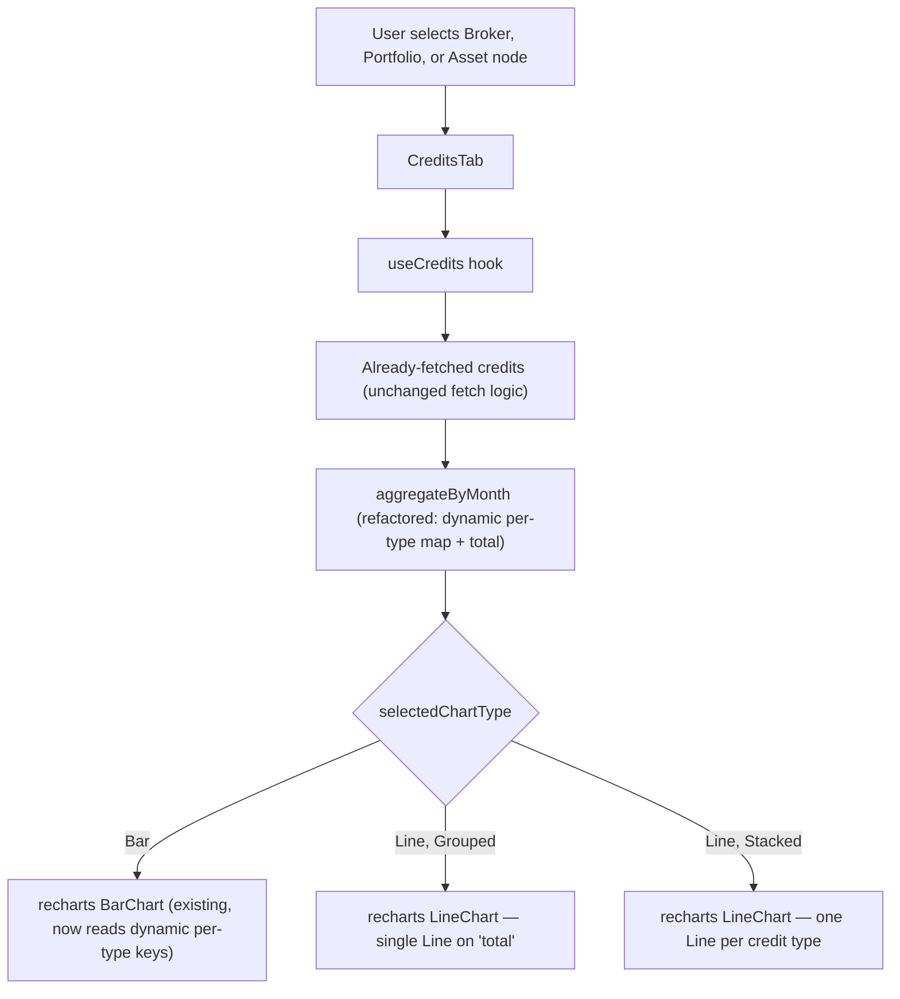

# F11. Credits Chart Bar/Line Toggle — Web Frontend

## 1. Technical Overview

**What:** Add a second, independent toggle to the Credits tab's chart — chart display mode (`Bar`/`Line`) — alongside the existing Stacked/Grouped grouping toggle, at all three node levels (Broker, Portfolio, Asset). Grouped + Line renders a single line for the combined monthly total; Stacked + Line renders one line per credit type (not cumulative). As part of this change, the web's credit-type aggregation is refactored from a hardcoded two-field shape (`{ month, Dividend, Rent }`) into a dynamic per-type structure, mirroring the pattern the WPF app's `CreditsMonthTypeTotals`/`TotalsByType` already uses, so a future third credit type requires no chart code changes on either platform.

**Why:** The Transactions chart (F09) already shipped a Bar/Line toggle; the Credits chart — a conceptually identical "monthly trend" chart — was missed from that pass and only offers Bar. This feature closes that gap and, per the confirmed requirement, also fixes the underlying data-shape mismatch between web (hardcoded fields) and WPF (dynamic dictionary) so the "any number of credit types" intent is actually realized on both platforms, not just described in the PRD.

**Scope:**
- Included: refactor `useCredits`'s `MonthBucket`/`aggregateByMonth` to a dynamic per-type shape; new `ChartType` state (`'Bar' | 'Line'`, default `Bar`) with its own `setChartType` action, persisted per node selection alongside the existing filter/mode persistence; a dynamic blue-gradient colour palette (replacing the two hardcoded `DIVIDEND_COLOR`/`RENT_COLOR` constants) reused by both Bar and Line rendering; `CreditsTab`'s `ChartPanel` extended to render `recharts` `LineChart`/`Line` for Line mode; a second toolbar toggle row ("View: Bar / Line", with the existing toggle relabelled "Group: Stacked / Grouped"); unit test coverage.
- Excluded: any backend change (none needed — this is purely a client-side rendering/aggregation change over already-fetched credit data); the WPF equivalent (F12, separate feature); any change to the Transactions chart (F09/F10, already shipped, untouched by this feature).

## 2. Architecture Impact

**Affected components:**
- `Financial.Web/src/hooks/useCredits.ts` — `MonthBucket` shape, `aggregateByMonth`, new `ChartType` state/persistence/action
- `Financial.Web/src/components/CreditsTab.tsx` — `ChartPanel` Line rendering, dynamic colour palette, second toggle row
- `Financial.Web/src/components/CreditsTab.css` — no new classes required (existing `.credits-tab__modes`/`.credits-tab__mode-btn` rules are reused for the second toggle row)
- `Financial.Web/src/hooks/useCredits.test.ts` — extended
- `Financial.Web/src/components/__tests__/CreditsTab.test.tsx` — extended

## 3. Technical Decisions

| Decision | Chosen Approach | Alternative Considered | Trade-off |
|----------|------------------|-------------------------|-----------|
| Credit-type data shape | Refactor `MonthBucket` from hardcoded `{ month, Dividend, Rent }` fields to a dynamic shape (`{ month, total, byType: Record<string, number> }`), with the set of type keys computed at aggregation time from the actual credit data present, mirroring WPF's already-dynamic `CreditsMonthTypeTotals.TotalsByType` | Keep the hardcoded two-field shape and only make the new Line path dynamic | Confirmed with the user: only the full refactor genuinely satisfies "this can change in the future" on both platforms; the partial option would leave Bar (existing) and Line (new) reading different, inconsistent data shapes for the same underlying aggregation |
| Stacked + Line rendering | One `Line` series per credit type, each plotting that type's own independent monthly value — not a cumulative stacked line/area | Cumulative stacked lines (each line's height = running sum of itself + all types below it) | Confirmed with the user: separate, non-cumulative lines are simpler to read and match the mental model of "the same per-type breakdown as Stacked bars, just drawn as lines" |
| Grouped + Line rendering | A single `Line` series plotting `total` (sum across all credit types) per month | One line per type, unstacked (same as Stacked+Line) | Directly specified by the PRD: "when Grouped should have one line and use the total" — Grouped's defining characteristic (one measure per month, not broken out by type) carries over to Line mode |
| Toggle labelling | New row: "View: Bar / Line" (reuses the exact label the Transactions chart's own Bar/Line toggle already uses). Existing row relabelled: "Group: Stacked / Grouped" (was "View:") | Keep "View:" on the existing Stacked/Grouped row and label the new row "Chart Type:" | Confirmed with the user: reusing "View:" for Bar/Line keeps the label consistent with the Transactions chart's identical toggle, and "Group:" unambiguously names what Stacked/Grouped actually controls now that two toggle rows exist |
| New toggle type naming | A `ChartType = 'Bar' \| 'Line'` type defined locally in `useCredits.ts`, distinct from `useTransactions.ts`'s existing `ChartDisplayMode` (same shape, different module) | Import and reuse `ChartDisplayMode` from `useTransactions.ts` | Mirrors F09's own established precedent (documented in its spec's Technical Decisions) of keeping Bar/Line toggle types feature-local even without an actual TypeScript collision, so `useCredits` and `useTransactions` remain independent of each other |
| Colour palette | A computed blue-gradient palette function (light → dark blue, one shade per credit type index), replacing the two hardcoded `DIVIDEND_COLOR`/`RENT_COLOR` hex constants; reused identically by Bar and Line rendering so a type's colour doesn't change when toggling chart type | Keep the two hardcoded constants and add a fallback grey for any 3rd+ type | Mirrors WPF's existing `CreditsChartBuilder.BuildBluePalette` gradient-interpolation approach exactly, giving both platforms the same colour-scaling behaviour as credit types are added in the future |
| Persistence | Extend the existing per-node `PersistedPrefs` record (already storing `{ filter, mode }` in one `Map<selectionKey, prefs>` entry) with a third field, `chartType`, rather than adding a second `Map` | A separate `Map<selectionKey, ChartType>` dedicated to chart type | Minimal, consistent extension of the proven single-record-per-node pattern; mirrors F12 (WPF)'s equivalent decision to extend the single `CreditsViewState` struct rather than add a second dictionary |

## 4. Component Overview

**Frontend:**

| File Path | New/Modified | Purpose | Key Responsibilities |
|-----------|---------------|---------|------------------------|
| `Financial.Web/src/hooks/useCredits.ts` | Modified | Data + chart state | Replace `MonthBucket { month, Dividend, Rent }` with `MonthBucket { month, total, byType }`; rewrite `aggregateByMonth` to compute `byType` dynamically from the credit types actually present in the filtered credits (mirroring `_creditsChartTypes` on WPF) and `total` as the sum of `byType`'s values; add `ChartType` type, `selectedChartType` state (default `'Bar'`), `SET_CHART_TYPE` reducer action, `setChartType` callback, and extend `PersistedPrefs`/`filterPersistence` with the third `chartType` field, mirroring the existing `filter`/`mode` persistence exactly |
| `Financial.Web/src/components/CreditsTab.tsx` | Modified | Rendering | Add a dynamic blue-gradient palette function (replacing `DIVIDEND_COLOR`/`RENT_COLOR`); extend `ChartPanel` to branch on `selectedChartType`: Bar mode renders the existing `BarChart` (now iterating `creditTypes` dynamically instead of two hardcoded `<Bar>` elements), Line mode renders a `LineChart` with either one `Line` (`dataKey="total"`, Grouped) or one `Line` per type (`dataKey={type}`, Stacked); add the second toolbar toggle row ("View: Bar / Line") next to the existing (relabelled "Group:") row |
| `Financial.Web/src/components/CreditsTab.css` | Unmodified | — | Existing `.credits-tab__modes`/`.credits-tab__mode-label`/`.credits-tab__mode-btn`/`.credits-tab__mode-btn--active` rules are reused as-is for the second toggle row; `.credits-tab__controls` already has `flex-wrap: wrap`, so no layout changes are needed |
| `Financial.Web/src/hooks/useCredits.test.ts` | Modified | Test coverage | Extend with tests for dynamic per-type aggregation, `total` computation, `setChartType`/persistence, and persistence independence from `setMode` |
| `Financial.Web/src/components/__tests__/CreditsTab.test.tsx` | Modified | Test coverage | Extend with tests for Bar/Line toggle rendering, Grouped+Line single-total-line behaviour, Stacked+Line per-type-lines behaviour, and the relabelled toggle rows |

**Backend:** None — this feature operates entirely on already-fetched `CreditDto[]` data; no API contract changes.

## 5. API Contracts

Not applicable — no new or modified endpoint. This feature is a client-side aggregation and rendering change only.

## 6. Data Model

Not applicable — no database or DTO changes.

## 7. Testing Strategy

**Test File Structure:**

| Test File | Test Type | Target | Coverage Goal |
|-----------|-----------|--------|-----------------|
| `Financial.Web/src/hooks/useCredits.test.ts` (extended) | Unit | `useCredits` | Dynamic per-type aggregation correctness, `total` computation, chart type default/persistence, independence from Stacked/Grouped persistence |
| `Financial.Web/src/components/__tests__/CreditsTab.test.tsx` (extended) | Unit | `CreditsTab` | Bar/Line toggle rendering and default, Grouped+Line single line, Stacked+Line one line per type, relabelled toggle rows, click handlers |

**Test Functions:**

| Test Function | Description | Assertions |
|----------------|--------------|-------------|
| `aggregateByMonth_computesByTypeDynamically` | Fixture with Dividend + Rent credits in the same month | Bucket's `byType` has both `Dividend` and `Rent` keys with correct summed values |
| `aggregateByMonth_computesTotalAsSumOfByType` | Fixture with Dividend 100 + Rent 50 in the same month | Bucket's `total` is `150` |
| `aggregateByMonth_supportsAThirdCreditType` | Fixture with a credit of a hypothetical third type (e.g. `'Interest'`) | Bucket's `byType` includes the third type without any hardcoded-field limitation |
| `setChartType_defaultsToBar` | Fresh node selection | `selectedChartType` is `'Bar'` |
| `setChartType_persistsSelectionPerNode` | Set chart type on Broker A, switch to Broker B, switch back to Broker A | Broker A's chart type selection is remembered (mirrors the existing `setMode`/`setFilter` persistence test pattern) |
| `setChartType_doesNotAffectSelectedMode_forSameNode` | Set chart type to `Line` on a node whose mode is `Stacked` | `selectedMode` remains `Stacked`, confirming the two toggles persist independently |
| `renders_bar_line_toggle_defaulting_to_bar` (CreditsTab) | Fresh render | "Bar" toggle button has the active class; "Line" does not |
| `clicking_line_toggle_calls_setChartType` (CreditsTab) | User clicks "Line" | `setChartType('Line')` called |
| `renders_relabelled_group_toggle` (CreditsTab) | Any render | Label text "Group:" is present (not "View:") for the Stacked/Grouped row, and "View:" is present for the new Bar/Line row |
| `renders_single_total_line_when_grouped_and_line` (CreditsTab) | `selectedMode: 'Grouped'`, `selectedChartType: 'Line'`, chart data with `total` values | Exactly one `Line` element renders, keyed on `total` |
| `renders_one_line_per_type_when_stacked_and_line` (CreditsTab) | `selectedMode: 'Stacked'`, `selectedChartType: 'Line'`, chart data with 2 credit types | Exactly two `Line` elements render, one per type present in the data |
| `renders_bar_chart_unchanged_when_bar_selected` (CreditsTab) | `selectedChartType: 'Bar'` (default) | `BarChart` renders (not `LineChart`), preserving existing Stacked/Grouped bar behaviour |

**Acceptance tests (PRD Section 9, F11):**
- The Credits chart offers a Bar/Line toggle independent from the existing Stacked/Grouped toggle, at Broker, Portfolio, and Asset levels → `renders_bar_line_toggle_defaulting_to_bar` (mocked hook covers all three scopes identically since `CreditsTab` renders the same toolbar regardless of `nodeType`)
- Default chart display mode is Bar; existing Stacked/Grouped bar rendering is visually unchanged when Bar is selected → `setChartType_defaultsToBar` + `renders_bar_chart_unchanged_when_bar_selected`
- Selecting Line with Grouped selected renders a single line representing the combined total → `renders_single_total_line_when_grouped_and_line`
- Selecting Line with Stacked selected renders one line per credit type, not cumulative → `renders_one_line_per_type_when_stacked_and_line`
- Changing either toggle does not trigger a new network request → satisfied by construction: `setChartType`/`setMode` only dispatch reducer actions over already-fetched `state.credits`, no `apiClient` call in either action creator (consistent with the existing `setMode`/`setFilter` behaviour, unchanged by this feature)
- The Bar/Line selection persists per node selection, independent from the Stacked/Grouped selection's own persistence → `setChartType_persistsSelectionPerNode` + `setChartType_doesNotAffectSelectedMode_forSameNode`

**Cross-feature integration tests (PRD Section 9):**
- F11 has no `Consumes` block (it operates on already-fetched Credits data, not on output from another Section 6 feature) — no cross-feature integration criteria apply, consistent with the PRD's rule that features without Consumes generate none.

## Assumptions and Decisions (from interview)

- **Web's credit-type aggregation is refactored to a dynamic per-type shape**, confirmed with the user, rather than keeping the hardcoded `Dividend`/`Rent` fields and only making the new Line path dynamic — this is the only option that genuinely satisfies the PRD's "this can change in the future" requirement on the web platform, matching WPF's already-dynamic approach.
- **Stacked + Line renders separate, non-cumulative lines** (one per credit type), confirmed with the user, rather than a cumulative stacked line/area.
- **Toggle labels are "View: Bar / Line" (new) and "Group: Stacked / Grouped" (relabelled from "View:")**, confirmed with the user.
- **The new `ChartType` type is defined locally in `useCredits.ts`**, not imported from `useTransactions.ts`'s `ChartDisplayMode`, following F09's own documented precedent of keeping Bar/Line toggle types feature-local.
- **Colour palette is a computed blue gradient (one shade per type index)**, mirroring WPF's `BuildBluePalette`, replacing the two hardcoded hex constants — not explicitly specified in the PRD, inferred from the dynamic-types decision (a fixed two-constant palette cannot cover an arbitrary type count) and from cross-platform consistency with WPF's existing approach.
- **Persistence extends the existing single per-node `PersistedPrefs` record** with a third field rather than adding a second `Map`, matching the minimal-extension approach and F12 (WPF)'s equivalent decision for `CreditsViewState`.
