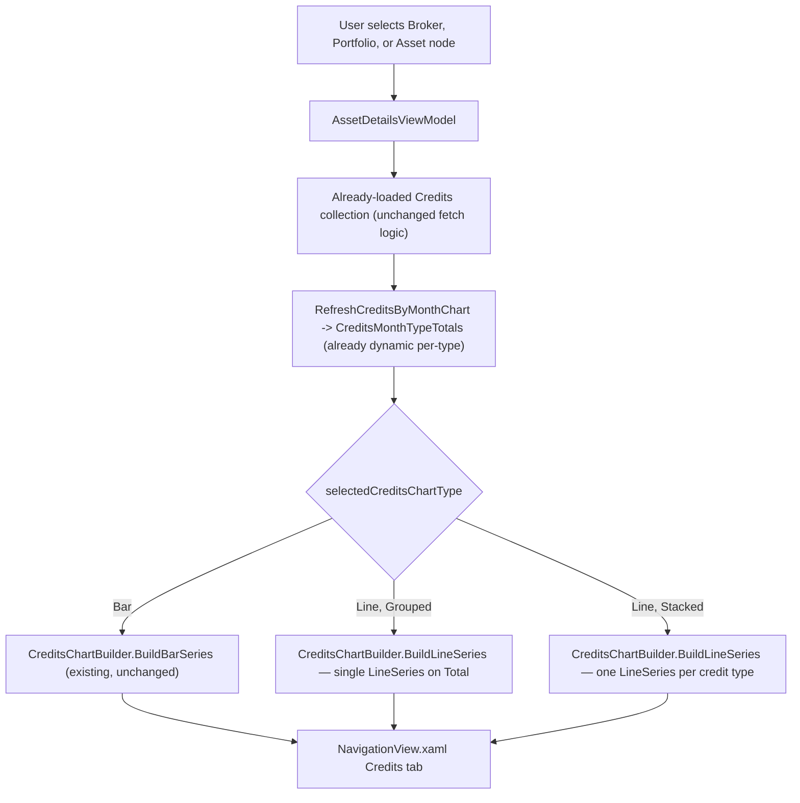

# F12. Credits Chart Bar/Line Toggle — WPF

## 1. Technical Overview

**What:** Add a second, independent toggle to the WPF Credits tab's chart — chart display mode (`Bar`/`Line`) — alongside the existing Stacked/Grouped grouping toggle, at all three node levels (Broker, Portfolio, Asset). Grouped + Line renders a single line for the combined monthly total; Stacked + Line renders one line per credit type (not cumulative). Unlike F11 (Web), WPF's credit-type aggregation (`CreditsMonthTypeTotals.TotalsByType`) is already dynamic — no data-shape refactor is needed here, only the chart-building and toggle-wiring work.

**Why:** F11 shipped this toggle on the web frontend; this feature brings the same capability to WPF for cross-platform parity, mirroring the exact architectural pattern F10 (Transactions chart) already established for a Bar/Line toggle on this platform (`TransactionsChartBuilder`'s `ChartTypeMode`, `RectangleBarSeries`/`LineSeries` branching, and per-node-persisted mode state).

**Scope:**
- Included: a new `CreditsChartType` enum (`Bar`/`Line`, distinct from F10's `ChartTypeMode`, since a WPF enum name cannot be reused across two unrelated toggles in the same namespace) with its own `CreditsChartTypeOptionViewModel`, `CreditsChartTypes` collection, and `SelectCreditsChartTypeCommand`; `CreditsChartBuilder` extended with `LineSeries` construction (one line per type when Stacked, one line on the combined total when Grouped) and value-label annotations that follow the same one-series-one-Total-label / many-series-one-label-per-type rule Bar mode already uses, now applied across both toggle dimensions; `CreditsViewState` extended with the new chart type field so all three selections (period filter, Stacked/Grouped, Bar/Line) persist together per node; a new "View: Bar / Line" toggle row added to both Credits `DataTemplate`s (`CreditsAssetTemplate`, `CreditsAggregateTemplate`), with the existing Stacked/Grouped row relabelled "Group:"; unit test coverage.
- Excluded: any backend change (none needed); the web equivalent (F11, already complete, merged to `main`) — this feature only covers the WPF (`Financial.App`) side; any change to the Transactions chart (F10, already shipped, untouched by this feature).

## 2. Architecture Impact

**Affected components:**
- `Financial.App/ViewModels/CreditsChartType.cs` (new) — `Bar`/`Line` enum
- `Financial.App/ViewModels/CreditsChartTypeOptionViewModel.cs` (new) — mirrors `CreditsTypeModeOptionViewModel`
- `Financial.App/ViewModels/CreditsViewState.cs` (modified) — third field added
- `Financial.App/ViewModels/CreditsChartBuilder.cs` (modified) — Line rendering, cross-dimension label rule
- `Financial.App/ViewModels/AssetDetailsViewModel.cs` (modified) — chart type state, persistence, wiring
- `Financial.App/Components/NavigationView.xaml` (modified) — new toggle row in both Credits templates
- Test files: `Tests/Financial.Presentation.Tests/ViewModels/CreditsChartBuilderTests.cs` (new), `Tests/Financial.Presentation.Tests/ViewModels/AssetDetailsViewModelCreditsChartTests.cs` (new)

## 3. Technical Decisions

| Decision | Chosen Approach | Alternative Considered | Trade-off |
|----------|------------------|-------------------------|-----------|
| New enum naming | `CreditsChartType { Bar, Line }`, a new WPF enum distinct from F10's existing `ChartTypeMode` | Reuse F10's `ChartTypeMode` directly for Credits too | Reuse is not even possible without an alias, since `ChartTypeMode` already exists in the same `Financial.Presentation.App.ViewModels` namespace (unlike TypeScript modules, C# enums collide at the namespace level); a distinct name also mirrors F11 (Web)'s own precedent of keeping each chart's Bar/Line type feature-local |
| Stacked + Line rendering | One `LineSeries` per credit type, each plotting that type's own independent monthly value — not cumulative | Cumulative stacked lines | Mirrors F11 (Web)'s confirmed decision exactly, for cross-platform consistency |
| Grouped + Line rendering | A single `LineSeries` plotting each month's `Total` (sum across all credit types) | One line per type, unstacked (same as Stacked+Line) | Mirrors F11 (Web)'s confirmed decision exactly |
| Value-label annotations in Line mode | Extend the existing `UpdateValueLabels`/`AddValueLabel` machinery to Line mode too, using the same rule Bar mode already follows: whichever combination renders a single visual series gets one `Total` label per month, whichever renders per-type series gets one label per type per month. Concretely: `Bar+Stacked` and `Line+Grouped` (both single-series-per-month) show the `Total` label; `Bar+Grouped` and `Line+Stacked` (both multi-series-per-month) show one label per type | Skip value-label annotations for Line mode entirely, matching F11 (Web)'s choice to rely on hover only for Line | Confirmed with the user: matches this WPF app's own established convention (F10's Transactions chart already keeps value labels for both Bar and Line) rather than the web platform's choice, since OxyPlot users in this app rely less on hover-only discovery than the web's recharts tooltips |
| Toggle labelling | New row: "View: Bar / Line" (matches F11 Web's label exactly). Existing row relabelled: "Group: Stacked / Grouped" (was "View:") | Keep "View:" on the Stacked/Grouped row and label the new row "Chart Type:" | Matches F11 (Web)'s confirmed labelling exactly, for cross-platform UI consistency |
| Persistence | Extend the existing `CreditsViewState` record struct (already storing `Filter` + `Mode` per node in `_creditsViewStateByKey`) with a third field, `ChartType`, rather than a second dictionary | A separate `Dictionary<string, CreditsChartType>` | Mirrors F11 (Web)'s equivalent decision to extend the single `PersistedPrefs` record rather than add a second map; minimal, consistent extension of the proven per-node-record pattern |
| Line series colour | Reuse `CreditsChartBuilder`'s existing `BuildBluePalette` gradient (already used for Bar's per-type fill colours) for Line's per-type stroke colours, and `OxyColors.SteelBlue` (the palette's existing single-count fallback) for the Grouped+Line Total line | A new, separate colour scheme for Line mode | `BuildBluePalette` already produces exactly the colours needed (already dynamic per type count); reusing it means a type's colour doesn't change when toggling Bar/Line, consistent with F11 (Web)'s equivalent choice |

## 4. Component Overview

**WPF (`Financial.App`):**

| File Path | New/Modified | Purpose | Key Responsibilities |
|-----------|---------------|---------|------------------------|
| `Financial.App/ViewModels/CreditsChartType.cs` | New | Chart type enum | `public enum CreditsChartType { Bar, Line }` |
| `Financial.App/ViewModels/CreditsChartTypeOptionViewModel.cs` | New | Toggle button binding | `Label`, `ChartType` (`CreditsChartType`), `IsSelected`, mirroring `CreditsTypeModeOptionViewModel` field-for-field |
| `Financial.App/ViewModels/CreditsViewState.cs` | Modified | Per-node persisted state | Extend `internal readonly record struct CreditsViewState(PeriodFilter Filter, CreditsTypeChartMode Mode)` with a third field, `CreditsChartType ChartType` |
| `Financial.App/ViewModels/CreditsChartBuilder.cs` | Modified | Chart rendering | `Build` gains a `CreditsChartType mode` parameter (Bar builds the existing `RectangleBarSeries` set unchanged; Line builds one `LineSeries` per type when `CreditsTypeChartMode.Stacked`, or a single `LineSeries` on `Total` when `Grouped`, reusing `BuildBluePalette`); `ApplyLabelDensity`/`UpdateValueLabels`/`AddValueLabel` extended to apply the single-series-vs-per-type labelling rule across both the Stacked/Grouped and Bar/Line dimensions, per the Technical Decisions table |
| `Financial.App/ViewModels/AssetDetailsViewModel.cs` | Modified | Chart type state | Add `_selectedCreditsChartType` field (default `Bar`), `CreditsChartTypes` (`ObservableCollection<CreditsChartTypeOptionViewModel>`), `SelectCreditsChartTypeCommand`, `InitializeCreditsChartTypes()`, `SetCreditsChartType(CreditsChartType, bool rebuild)`, `UpdateCreditsChartTypeSelection()`; extend `GetCreditsViewState`/`ApplyCreditsViewState`/`UpdateCreditsViewState`/`SetCreditsContext` to carry the third `ChartType` field alongside the existing `Filter`/`Mode`; extend the `CreditsChartBuilder.Build`/`ApplyLabelDensity` call sites (`RefreshCreditsByMonthChart`, `UpdateCreditsPlotWidth`) to pass `_selectedCreditsChartType` |
| `Financial.App/Components/NavigationView.xaml` | Modified | Rendering | Add a new `RowDefinition` and a "View: Bar / Line" `ItemsControl` toggle row (bound to `AssetDetails.CreditsChartTypes` / `AssetDetails.SelectCreditsChartTypeCommand`, mirroring the existing Stacked/Grouped row's exact XAML structure) to both `CreditsAssetTemplate` and `CreditsAggregateTemplate`; relabel the existing Stacked/Grouped row's `TextBlock` from "View:" to "Group:" in both templates |

**Backend:** None — this feature operates entirely on already-loaded `CreditDTO[]` data via the existing `Credits` collection; no service or DTO changes.

## 5. API Contracts

Not applicable — no new or modified endpoint, and no HTTP call at all (WPF renders from already-loaded in-memory data).

## 6. Data Model

Not applicable — no database or DTO changes.

## 7. Testing Strategy

**Test File Structure:**

| Test File | Test Type | Target | Coverage Goal |
|-----------|-----------|--------|-----------------|
| `Tests/Financial.Presentation.Tests/ViewModels/CreditsChartBuilderTests.cs` (new) | Unit | `CreditsChartBuilder` | Bar/Line series construction, Grouped+Line single-series vs Stacked+Line per-type-series counts, empty-input handling |
| `Tests/Financial.Presentation.Tests/ViewModels/AssetDetailsViewModelCreditsChartTests.cs` (new) | Unit | `AssetDetailsViewModel` | Chart type default/persistence, independence from Stacked/Grouped and period-filter persistence, rebuild on toggle |

**Test Functions:**

| Test Function | Description | Assertions |
|----------------|--------------|-------------|
| `Build_BarMode_ProducesOneSeriesPerCreditType` | 2 credit types, `Bar` mode | `PlotModel.Series` has one `RectangleBarSeries` per type (existing behaviour, regression check) |
| `Build_LineMode_Grouped_ProducesSingleSeriesOnTotal` | 2 credit types, `Line` mode, `CreditsTypeChartMode.Grouped` | `PlotModel.Series` has exactly one `LineSeries`, with point values matching each month's `Total` |
| `Build_LineMode_Stacked_ProducesOneSeriesPerCreditType` | 2 credit types, `Line` mode, `CreditsTypeChartMode.Stacked` | `PlotModel.Series` has one `LineSeries` per type, each with point values matching that type's own monthly total (not cumulative) |
| `Build_EmptyMonths_ProducesNoSeries` | Empty input | `PlotModel.Series` is empty, regardless of mode |
| `SetCreditsChartType_DefaultsToBar` | Fresh node selection | `AssetDetailsViewModel`'s chart type is `Bar` |
| `SetCreditsChartType_PersistsSelectionPerNode` | Set chart type on Broker A, switch to Broker B, switch back to Broker A | Broker A's chart type selection is remembered, mirroring the existing Stacked/Grouped and period-filter persistence tests |
| `SetCreditsChartType_DoesNotAffectSelectedTypeMode_ForSameNode` | Set chart type to `Line` on a node whose grouping is `Stacked` | The Stacked/Grouped selection is unchanged, confirming the two toggles persist independently |
| `SetCreditsChartType_RebuildsCreditsPlotModel` | Credits already loaded, then chart type changed | `CreditsPlotModel` is rebuilt (non-null, reflects the new mode) without any new data fetch |

**Acceptance tests (PRD Section 9, F12):**
- The Credits chart offers a Bar/Line toggle independent from the existing Stacked/Grouped toggle, at Broker, Portfolio, and Asset levels → covered by `SetCreditsChartType_DefaultsToBar` at the ViewModel level; the `DataTemplate` toggle-row wiring itself is verified via a manual/live smoke check per the `implement-feature` skill's Step 6.4, since WPF `ItemsControl`/`DataTemplate` rendering is not unit-testable without a running visual tree
- Default chart display mode is Bar; existing Stacked/Grouped bar rendering is visually unchanged when Bar is selected → `SetCreditsChartType_DefaultsToBar` + `Build_BarMode_ProducesOneSeriesPerCreditType`
- Selecting Line with Grouped selected renders a single line representing the combined total across all credit types per month → `Build_LineMode_Grouped_ProducesSingleSeriesOnTotal`
- Selecting Line with Stacked selected renders one line per credit type, not cumulative → `Build_LineMode_Stacked_ProducesOneSeriesPerCreditType`
- Chart values in Line mode match the Bar mode's underlying data exactly → satisfied by construction: both series types are built from the same `CreditsMonthTypeTotals` list produced by the existing (unmodified) `RefreshCreditsByMonthChart` grouping logic
- The Bar/Line selection persists per node selection, independent from the Stacked/Grouped selection's own persistence → `SetCreditsChartType_PersistsSelectionPerNode` + `SetCreditsChartType_DoesNotAffectSelectedTypeMode_ForSameNode`

**Cross-feature integration tests (PRD Section 9):**
- F12 has no `Consumes` block (it operates on already-loaded Credits data, not on output from another Section 6 feature) — no cross-feature integration criteria apply, consistent with the PRD's rule that features without Consumes generate none.

## Assumptions and Decisions (from interview)

- **Line mode shows value-label annotations**, confirmed with the user, matching this WPF app's own established convention (F10's Transactions chart keeps labels for both Bar and Line) rather than F11 (Web)'s choice to rely on hover only for Line — the labelling rule is generalized from Bar mode's existing Stacked/Grouped split to also account for the new Bar/Line dimension: single-visual-series combinations (`Bar+Stacked`, `Line+Grouped`) get one `Total` label per month; multi-series combinations (`Bar+Grouped`, `Line+Stacked`) get one label per type per month.
- **`CreditsChartType` is a new, distinct enum** rather than reusing F10's `ChartTypeMode`, both because C# namespace rules make direct reuse impossible without an alias and because it mirrors F11 (Web)'s precedent of keeping each chart's Bar/Line type feature-local.
- **No data-shape refactor needed**, unlike F11 (Web): WPF's `CreditsMonthTypeTotals.TotalsByType` dictionary is already dynamic per credit type, so this feature is scoped to chart-building and toggle-wiring only.
- **Stacked+Line renders separate, non-cumulative lines** (one per credit type) and **Grouped+Line renders a single Total line**, and **toggle labels are "View: Bar / Line" (new) / "Group: Stacked / Grouped" (relabelled)** — all three directly mirror F11 (Web)'s already-confirmed decisions, applied here for cross-platform consistency.
