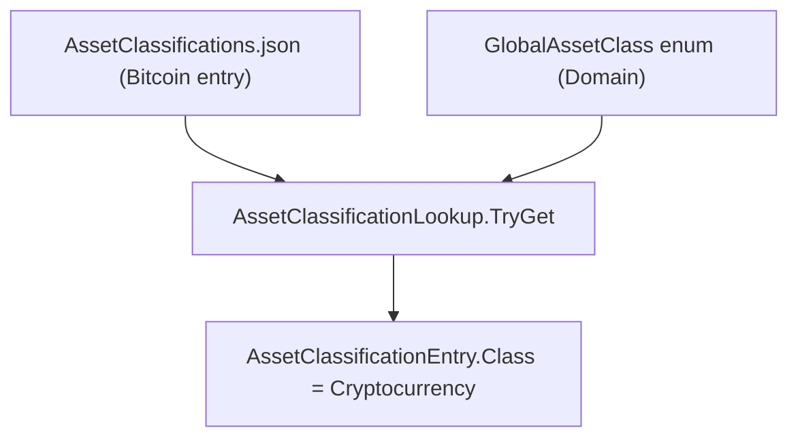

## Technical Overview

**What:** Add `Cryptocurrency` as a new value to the `GlobalAssetClass` enum, and update the existing "Bitcoin" entry in the embedded `AssetClassifications.json` classification data so it resolves to this new value instead of `Unknown`.

**Why:** `AssetClassificationLookup` already loads classification data by asset name from `AssetClassifications.json` and deserializes it directly into `GlobalAssetClass` via `JsonStringEnumConverter`. Because Bitcoin already has an entry in this file, the only missing pieces are the enum member itself and the corrected value in the data — no new lookup mechanism, resolver, or import-pipeline code is required.

**Scope:**
- Included: `GlobalAssetClass` enum extension, `AssetClassifications.json` Bitcoin entry update, unit test coverage for the corrected classification.
- Excluded: any change to `GlobalAssetClassMapping` (the Country/LocalTypeCode dictionary) — Bitcoin continues to resolve exclusively through the name-based `AssetClassificationLookup`, which this dictionary does not participate in. Excluded: import pipeline, price-fetch, UI filters, and Current Values scope changes — these belong to F02–F07 of the same PRD and consume this feature's output but are out of scope here.
- Provides (per PRD): the `GlobalAssetClass.Cryptocurrency` enum value and the corrected Bitcoin classification entry, consumed by F02 (import), F03 (price fetch), F04 (Web filter), and F05 (WPF filter) when those are implemented.

## Architecture Impact

**Affected components:**
- `Financial.Domain/Entities/AssetClassification.cs` — Domain layer, `GlobalAssetClass` enum declaration
- `Integrations/GoogleFinancialSupport/AssetClassifications.json` — embedded resource consumed by `AssetClassificationLookup` (assembly `Financial.Infrastructure.Integrations.GoogleFinancialSupport`)
- `Tests/Financial.Infrastructure.Tests/Integrations/AssetClassificationLookupTests.cs` — new unit test file (this assembly already has `InternalsVisibleTo` access via `Integrations/GoogleFinancialSupport/AssemblyInfo.cs`)

No other layer is touched: there is no database, no API endpoint, and no UI surface in this feature — those are covered by later features in the same PRD (F02–F07).

## Technical Decisions

| Decision | Chosen Approach | Alternative Considered | Trade-off |
|----------|----------------|----------------------|-----------|
| Enum member placement | Append `Cryptocurrency` as the last member of `GlobalAssetClass` (after `Other`), leaving all existing ordinal values unchanged | Insert alphabetically among existing members | Appending guarantees zero risk to any code path, even though this codebase confirmed no raw-int enum storage exists today; it costs nothing and removes the need to re-verify that guarantee later |
| `GlobalAssetClassMapping` (Country/LocalTypeCode dictionary) | No changes — Bitcoin keeps resolving exclusively through the name-based `AssetClassificationLookup` | Add a `(CountryCode.UK, "Crypto")`-style entry to `GlobalAssetClassMapping` as a second classification path | Keeping a single source of truth for Bitcoin's classification avoids two mechanisms that could disagree if one is updated without the other; matches the PRD's explicit decision to keep classification name-based |
| New test file location | `Tests/Financial.Infrastructure.Tests/Integrations/AssetClassificationLookupTests.cs` | Add a test case to an existing file (none of the existing files in that folder test `AssetClassificationLookup`) | Matches the established one-file-per-class-under-test convention already used by `GoogleFinanceParsingTests.cs`, `GoogleSheetValueParserTests.cs`, etc. in the same folder |

## Component Overview

**Backend (Domain / Infrastructure):**

| File Path | New/Modified | Purpose | Key Responsibilities |
|-----------|--------------|---------|---------------------|
| `Financial.Domain/Entities/AssetClassification.cs` | Modified | Domain enum defining all supported asset classes | Add `Cryptocurrency` as the 10th member, appended after `Other`, with no changes to existing members or `GlobalAssetClassMapping` |
| `Integrations/GoogleFinancialSupport/AssetClassifications.json` | Modified | Embedded classification data keyed by asset name, consumed by `AssetClassificationLookup` | Change the existing `"Bitcoin"` entry's `"assetClass"` field from `"Unknown"` to `"Cryptocurrency"`; `country` (`"UK"`) and `localTypeCode` (empty) remain unchanged; no other entries touched |
| `Tests/Financial.Infrastructure.Tests/Integrations/AssetClassificationLookupTests.cs` | New | Unit tests for `AssetClassificationLookup.TryGet` | Verify Bitcoin resolves to `Cryptocurrency`, verify the existing case-insensitive/trimmed lookup behavior still holds for this entry, verify an unrelated/unknown name still returns `false` |

No frontend, API, or database components are affected by this feature.

## Testing Strategy

**Test File Structure:**

| Test File | Test Type | Target | Coverage Goal |
|-----------|-----------|--------|---------------|
| `Tests/Financial.Infrastructure.Tests/Integrations/AssetClassificationLookupTests.cs` | Unit | `AssetClassificationLookup.TryGet` | All Bitcoin-related acceptance criteria for F01 |

**Test functions:**

| Test Function | Description | Assertions |
|---------------|-------------|------------|
| `TryGet_Bitcoin_ReturnsCryptocurrencyClass` | Looks up `"Bitcoin"` after the JSON data change | Returns `true`; `entry.Class` equals `GlobalAssetClass.Cryptocurrency`; `entry.Country` equals `CountryCode.UK` (unchanged) |
| `TryGet_BitcoinCaseInsensitiveAndTrimmed_ReturnsCryptocurrencyClass` | Looks up `" bitcoin "` (mixed case, padded) mirroring the existing `StringComparer.OrdinalIgnoreCase` + `Trim()` behavior in `TryGet` | Returns `true`; `entry.Class` equals `GlobalAssetClass.Cryptocurrency` |
| `TryGet_UnknownAssetName_ReturnsFalse` | Looks up a name with no entry in `AssetClassifications.json` | Returns `false`; `entry` equals `default` |

**Acceptance criteria traceability (PRD Section 9, F01):**
- "`GlobalAssetClass` enum contains a `Cryptocurrency` value appended after the existing 9 values, with no existing values renumbered" → verified by compilation plus a direct reference to `GlobalAssetClass.Cryptocurrency` in the new test file; no runtime test needed for ordinal stability since no code in the solution depends on raw enum ordinals (confirmed during codebase discovery — all persistence and API serialization uses `JsonStringEnumConverter`)
- "`AssetClassifications.json`'s Bitcoin entry has `assetClass` set to `"Cryptocurrency"`" → `TryGet_Bitcoin_ReturnsCryptocurrencyClass`
- "`AssetClassificationLookup.TryGet("Bitcoin", ...)` returns `GlobalAssetClass.Cryptocurrency`" → `TryGet_Bitcoin_ReturnsCryptocurrencyClass`
- "No other entries in `AssetClassifications.json` are modified" → verified by code review / diff inspection during PR review, not an automated test (there is no existing "snapshot all entries" test in the suite to extend, and adding one would exceed this feature's scope)

**Cross-Feature Integration (PRD Section 9):** F01 is the provider referenced by F02 (import), F03 (price fetch), F04 (Web filter), and F05 (WPF filter). Those integration criteria are validated when each consuming feature is implemented and specced; this feature's testing scope is limited to F01's own acceptance criteria above.
