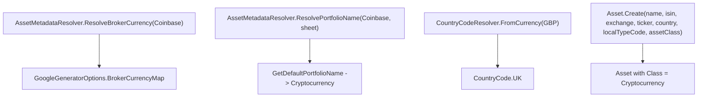

## Technical Overview

**What:** Add unit test coverage proving that the existing Google Spreadsheet import pipeline correctly produces the PRD-required Bitcoin `Asset` shape under the Coinbase broker (Ticker `"BTC"`, blank ISIN/Exchange, `Class = Cryptocurrency`, `Country = UK`, linked to Coinbase's "Cryptocurrency" portfolio). No production code changes are required.

**Why:** Codebase research for this feature confirmed the entire chain already produces the correct result with zero Bitcoin-specific or ticker-specific branching anywhere:
- `GoogleSheetsAssetReader.GetAssetDataAsync` already tolerates blank ISIN/Exchange cells via a generic `try/catch` around indexed cell access (not crypto-specific — the same defense applies to every asset sheet).
- `AssetMetadataResolver.ResolveAssetMetadataAsync` already resolves Coinbase → GBP → `CountryCode.UK` via the pre-existing `BrokerCurrencyMap`/`CountryCodeResolver`, and already resolves "Bitcoin" → `GlobalAssetClass.Cryptocurrency` via F01's classification data — both generic, data-driven mechanisms.
- `Asset.Create` (7-arg overload) performs no validation that would reject blank ISIN/Exchange.
- `AssetMetadataResolver.GetDefaultPortfolioName` already maps `"Coinbase" => "Cryptocurrency"` (pre-existing, generic per-broker default).
- `GoogleGenerator.ProcessSheetAsync` already wires `broker.AddPortfolio(portfolioName)` + `portfolio.AddAsset(asset)`, and this generic linking mechanism is already covered by existing `BrokerTests`/`PortfolioTests`.

F02's job is therefore to lock this behavior in with tests, so a future change to any of these generic mechanisms cannot silently break Bitcoin's classification without a test failing.

**Scope:**
- Included: unit tests for the parts of the pipeline that are testable in isolation (broker currency resolution, broker→country resolution, default portfolio name resolution, and `Asset.Create` with the exact data shape Bitcoin's sheet produces).
- Excluded: the actual Google Sheets API read call (`GoogleSheetsAssetReader.GetAssetDataAsync`) is not unit-tested. Its dependency, `GoogleService`, is a `sealed` class with a constructor that builds real Google API clients — it cannot be faked without introducing a new interface seam, and the codebase has no mocking library and no existing precedent for mocking live-API calls (existing tests that would need one are marked `[Skip]` instead). Introducing such a seam is a production architecture change the PRD did not request, so it is out of scope here (see Technical Decisions).
- Excluded: implementing the PRD's stated "blank ticker → log error and skip asset creation" behavior. Research confirmed this does not match current behavior — a blank ticker is silently tolerated and the asset is still created with an empty `Ticker`, identically for every asset type, not something F01/F02 introduced. Per explicit decision, this gap is documented and a test is added proving the actual (silent) behavior instead of implementing new validation, since that would be a cross-cutting behavior change beyond a classification/import-verification feature (see Technical Decisions).
- Consumes (per PRD): `GlobalAssetClass.Cryptocurrency` and the updated Bitcoin classification entry, provided by F01 (merged) and already flowing through `AssetClassificationLookup` with no code changes needed.
- Provides (per PRD): confidence that the imported Bitcoin asset record (Ticker "BTC", blank ISIN/Exchange, Cryptocurrency class, UK country, Coinbase/"Cryptocurrency" portfolio) is correct, consumed by F03 (price fetch) and F06/F07 (Current Values scope) when those are implemented.

## Architecture Impact

**Affected components:**
- `Tests/Financial.Infrastructure.Tests/Integrations/AssetMetadataResolverTests.cs` — new, tests broker currency and default portfolio name resolution for Coinbase
- `Tests/Financial.Infrastructure.Tests/Integrations/CountryCodeResolverTests.cs` — new, tests GBP → UK resolution
- `Tests/Financial.Domain.Tests/Domain/AssetTests.cs` — modified, adds test cases for the 7-arg `Asset.Create` overload with Bitcoin-shaped data and for the blank-ticker tolerance behavior

No production file is modified.

## Technical Decisions

| Decision | Chosen Approach | Alternative Considered | Trade-off |
|----------|----------------|----------------------|-----------|
| Testing the Google Sheets read step | Do not unit test `GoogleSheetsAssetReader.GetAssetDataAsync`; test only the pure/testable pieces downstream (currency/country/portfolio-name resolution, `Asset.Create`) | Extract an interface seam (e.g. `IGoogleSheetsDataSource`) from the sealed `GoogleService` so the full read-through-to-`Asset` path could be tested with a fake | Avoids a production architecture change and new test-infrastructure pattern that the PRD did not request, consistent with this project's "avoid over-engineering" guidance; accepts that the literal cell-read call stays unverified by unit tests, same as every other asset type today |
| Blank Ticker cell behavior | Document the current silent behavior (asset still created with empty Ticker, no error, no skip) with a test; do not implement the PRD's stated log-and-skip behavior | Add new validation/logging in `GoogleSheetsAssetReader`/`AssetMetadataResolver` to detect and skip blank-ticker assets | The PRD's stated behavior does not exist today and is not crypto-specific — implementing it would be a cross-cutting behavior change affecting every asset type, well beyond a classification/import-verification feature; documented as a known PRD/reality gap instead |
| Constructing `AssetMetadataResolver` in tests without a real `GoogleService` | Pass `null!` for the `GoogleSheetsAssetReader` constructor argument when testing `ResolveBrokerCurrency`/`ResolvePortfolioName`, since neither method touches the `_sheetsReader` field and the constructor performs no null-check | Build a real `GoogleSheetsAssetReader`/`GoogleService` in tests | `GoogleService` is sealed and requires real Google credentials to construct; passing `null!` is safe here because the methods under test never read `_sheetsReader`, and avoids any production code change to add a null-check or extra constructor overload |
| Broker/Portfolio linking coverage | No new tests — the existing generic `BrokerTests.AddPortfolio_DifferentNames_AddsDistinct`/`PortfolioTests.AddAsset_AddsToCollection` already prove `broker.AddPortfolio(name)` + `portfolio.AddAsset(asset)` work for any name/asset, which is exactly the mechanism Coinbase's "Cryptocurrency" portfolio linking uses | Add Coinbase/Bitcoin-specific `Broker`/`Portfolio` tests | The mechanism is generic and already fully exercised; a Bitcoin-specific duplicate would test the same code path with different literals, adding no real coverage |

## Component Overview

**Backend (Infrastructure / Domain tests):**

| File Path | New/Modified | Purpose | Key Responsibilities |
|-----------|--------------|---------|---------------------|
| `Tests/Financial.Infrastructure.Tests/Integrations/AssetMetadataResolverTests.cs` | New | Unit tests for `AssetMetadataResolver`'s currency and portfolio-name resolution | Verify `ResolveBrokerCurrency("Coinbase")` returns `"GBP"`; verify an unmapped broker throws `InvalidOperationException` naming the broker; verify `ResolvePortfolioName("Coinbase", sheet)` returns `"Cryptocurrency"` when the sheet has no explicit color |
| `Tests/Financial.Infrastructure.Tests/Integrations/CountryCodeResolverTests.cs` | New | Unit test for `CountryCodeResolver.FromCurrency` | Verify `"GBP"` resolves to `CountryCode.UK` |
| `Tests/Financial.Domain.Tests/Domain/AssetTests.cs` | Modified | Existing `Asset` entity test file | Add a test verifying the 7-arg `Asset.Create` overload produces the correct entity for Bitcoin's resolved import data (blank ISIN/Exchange, Ticker "BTC", Country UK, Class Cryptocurrency); add a test documenting that a blank Ticker does not block asset creation |

No frontend, API, or database components are affected by this feature.

## Testing Strategy

**Test File Structure:**

| Test File | Test Type | Target | Coverage Goal |
|-----------|-----------|--------|---------------|
| `Tests/Financial.Infrastructure.Tests/Integrations/AssetMetadataResolverTests.cs` | Unit | `AssetMetadataResolver.ResolveBrokerCurrency`, `AssetMetadataResolver.ResolvePortfolioName` | Coinbase currency/portfolio-name resolution acceptance criteria |
| `Tests/Financial.Infrastructure.Tests/Integrations/CountryCodeResolverTests.cs` | Unit | `CountryCodeResolver.FromCurrency` | GBP → UK resolution used by Coinbase assets |
| `Tests/Financial.Domain.Tests/Domain/AssetTests.cs` | Unit | `Asset.Create` (7-arg overload) | Bitcoin-shaped asset creation and blank-ticker tolerance |

**Test functions:**

| Test Function | Description | Assertions |
|---------------|-------------|------------|
| `ResolveBrokerCurrency_Coinbase_ReturnsGBP` | Calls `ResolveBrokerCurrency("Coinbase")` on a resolver built from `GoogleGeneratorOptions` containing the real Coinbase→GBP mapping | Returns `"GBP"` |
| `ResolveBrokerCurrency_UnmappedBroker_ThrowsWithBrokerName` | Calls `ResolveBrokerCurrency("NotABroker")` | Throws `InvalidOperationException` whose message contains `"NotABroker"` |
| `ResolvePortfolioName_CoinbaseWithBlankColor_ReturnsCryptocurrency` | Calls `ResolvePortfolioName("Coinbase", sheet)` with a `SheetDTO { Name = "Bitcoin", Color = "" }` | Returns `"Cryptocurrency"` |
| `FromCurrency_GBP_ReturnsUnitedKingdom` | Calls `CountryCodeResolver.FromCurrency("GBP")` | Returns `CountryCode.UK` |
| `Create_CryptocurrencyAssetShape_SetsPropertiesWithBlankIsinAndExchange` | Calls the 7-arg `Asset.Create("Bitcoin", "", "", "BTC", CountryCode.UK, "", GlobalAssetClass.Cryptocurrency)` | `ISIN` and `Exchange` are empty; `Ticker` is `"BTC"`; `Country` is `UK`; `Class` is `Cryptocurrency` |
| `Create_BlankTicker_StillCreatesAssetWithEmptyTicker` | Calls the 7-arg `Asset.Create` with an empty `ticker` argument | Asset is created successfully; `Ticker` is empty (documents the current silent-tolerance behavior, per the explicit decision not to implement new validation) |

**Acceptance criteria traceability (PRD Section 9, F02):**
- "After running the spreadsheet import, the Bitcoin asset under Coinbase has `Class = Cryptocurrency`, `Ticker = "BTC"`, and blank `Exchange`/`ISIN`" → `Create_CryptocurrencyAssetShape_SetsPropertiesWithBlankIsinAndExchange` proves `Asset.Create` produces this shape given the inputs the pipeline resolves; `ResolveBrokerCurrency_Coinbase_ReturnsGBP` + `FromCurrency_GBP_ReturnsUnitedKingdom` prove those inputs (`Country = UK`) are correctly resolved. The `Ticker`/ISIN/Exchange values themselves come from the untested `GoogleSheetsAssetReader` read step (see Scope/Technical Decisions)
- "The imported Bitcoin asset is linked to the Coinbase broker and its existing 'Cryptocurrency' portfolio" → `ResolvePortfolioName_CoinbaseWithBlankColor_ReturnsCryptocurrency` proves the portfolio name resolves correctly; the existing `BrokerTests`/`PortfolioTests` prove the generic linking mechanism
- "Buy/sell transactions for Bitcoin under Coinbase import successfully through the existing generic transaction pipeline, unaffected by the classification change" → no new test; the transaction pipeline is untouched by F01/F02 and has its own existing coverage in `TransactionTests.cs`, unaffected by this feature
- "If the Ticker cell is blank, import logs an error and does not create/update the Bitcoin asset" → **not implemented as stated**; `Create_BlankTicker_StillCreatesAssetWithEmptyTicker` instead documents the actual current behavior, per the explicit decision to document this PRD/reality gap rather than add new validation
- "If the Coinbase broker is missing from `BrokerCurrencyMap`, import fails for that sheet with an error naming the broker" → `ResolveBrokerCurrency_UnmappedBroker_ThrowsWithBrokerName`

**Cross-Feature Integration (PRD Section 9):** F02 is a provider referenced by F06/F07 (Current Values portfolio scope), which consume the imported Bitcoin asset once it exists in a real environment. Those integration criteria are validated when F06/F07 are implemented; F02's testing scope is limited to the acceptance criteria above.
