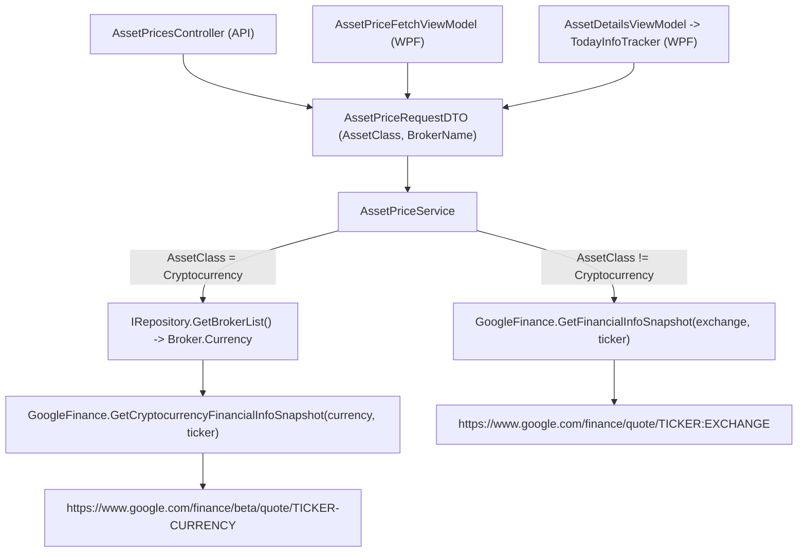

## Technical Overview

**What:** Introduce class-based branching in the price-fetch flow so that Cryptocurrency-class assets (Bitcoin, via F01/F02) build a Google Finance "beta" quote URL (`https://www.google.com/finance/beta/quote/{TICKER}-{CURRENCY}`) instead of the existing stock-style URL (`https://www.google.com/finance/quote/{TICKER}:{EXCHANGE}`), with the currency resolved from the asset's broker.

**Why:** Research confirmed the PRD's original assumption — that `GlobalAssetClass` could be used "internally" with no interface changes — does not hold. The entire existing call chain (`AssetPricesController` → `AssetPriceRequestDTO` → `AssetPriceService` → `GoogleFinance`) carries only raw `Exchange`/`Ticker` strings end to end; neither `GlobalAssetClass` nor `Broker.Currency` is available anywhere in it, and no WPF ViewModel currently has a way to resolve broker currency (no `IRepository`/broker-lookup capability injected anywhere in the chain). A contract change is unavoidable.

**Scope:**
- Included: extending `AssetPriceRequestDTO` with `AssetClass` and `BrokerName`; branching in `AssetPriceService` with broker-currency resolution via `IRepository`; a new `GoogleFinance.GetCryptocurrencyFinancialInfoSnapshot` URL/fetch path; the `AssetPricesController` query-string contract; and the two WPF call sites that already have `GlobalAssetClass` in scope (`AssetPriceFetchViewModel`, `AssetDetailsViewModel`'s single-asset "Refresh" via `TodayInfoTracker`).
- Excluded: `PortfolioAssetSummaryRowViewModel`'s row-level "Refresh" (Portfolio Summary page, a P02 feature) is left passing `AssetClass = Unknown` — its source DTO (`PortfolioAssetSummaryItemDTO`) has no `GlobalAssetClass` field, and adding one would mean modifying an unrelated, already-shipped feature's DTO chain beyond this PRD's stated scope. **Known limitation:** since Portfolio Summary (unlike Current Values) isn't scoped to a fixed portfolio list, a user could already navigate to Coinbase's portfolio there today, and Bitcoin's row-level price refresh will continue to fail silently until a follow-up feature threads `GlobalAssetClass` through that DTO chain.
- Excluded: `IAssetSnapshotSource`/`AssetSnapshotSourceAdapter` — its only consumer is `DividendService` (dividend/credit lookups), and the PRD explicitly puts crypto dividend/credit types out of scope (Section 7). Left unchanged.
- Excluded: Web frontend — it calls the same `/prices/current` endpoint but the change here is purely additive (new optional query params with safe defaults), so existing Web calls are unaffected and require no code change. Wiring the Web UI to actually pass crypto context is F06's job.
- Consumes (per PRD): `GlobalAssetClass.Cryptocurrency`, provided by F01 (merged).
- Provides (per PRD): current price for Cryptocurrency-class assets via the beta quote URL, consumed by F06/F07 (Current Values portfolio scope) when those are implemented.

## Architecture Impact

**Affected components:**
- `Financial.Application/DTOs/AssetPriceRequestDTO.cs` — Application layer, request contract
- `Financial.Infrastructure/Services/AssetPriceService.cs` — Infrastructure layer, branching + broker-currency resolution
- `Integrations/WebPageParser/GoogleFinance.cs` — Infrastructure/Integrations, URL building + HTML fetch/parse
- `Financial.Api/Controllers/AssetPricesController.cs` — Presentation (API), query-string contract
- `Financial.App/ViewModels/AssetPriceFetchViewModel.cs` — Presentation (WPF), bulk "Current Values" refresh
- `Financial.App/ViewModels/TodayInfoTracker.cs` — Presentation (WPF), single-asset refresh helper
- `Financial.App/ViewModels/AssetDetailsViewModel.cs` — Presentation (WPF), wires `Class`/`BrokerName` into the above



## Technical Decisions

| Decision | Chosen Approach | Alternative Considered | Trade-off |
|----------|----------------|----------------------|-----------|
| Where broker-currency resolution happens | `AssetPriceService` (Infrastructure) gains an `IRepository` dependency and resolves `Broker.Currency` internally from a `BrokerName` the caller supplies | Callers resolve `Currency` themselves and pass a raw string; `AssetPriceService` stays fully stateless | Keeps broker-currency lookup out of WPF ViewModels (Presentation layer), consistent with this project's "Presentation must not contain business logic" rule; `AssetPriceService` was already registered as a Singleton alongside `IRepository` (also Singleton) in both the API and WPF composition roots, so no new DI wiring is needed beyond the constructor parameter |
| Portfolio Summary row-refresh (`PortfolioAssetSummaryRowViewModel`) | Left out of scope; passes `AssetClass = Unknown` (existing behavior, unchanged) | Extend `PortfolioAssetSummaryItemDTO`/`RowViewModel` with a `Class` field so all three WPF call sites fully support crypto | Avoids expanding this feature into a different, already-shipped feature's (P02) DTO chain; documented as a known limitation instead of silently or partially fixing it |
| API contract change shape | Additive only — `AssetClass`/`BrokerName` are new optional query params (`assetClass`, `brokerName`) defaulting to `Unknown`/`null`; `exchange`/`ticker` keep their existing required behavior for non-crypto requests | Version the endpoint or require the new params always | Every existing caller (Web frontend, existing API tests) continues to work unmodified; only requests that explicitly pass `assetClass=Cryptocurrency` take the new path |
| Avoiding duplication between the two Google Finance fetch paths | Extract the shared HTML-fetch-and-parse body (URL load, `GetMainData`/`ReadAssetName`/`ReadPriceText`/`ReadAsOfText`) into a private `FetchSnapshot(url, ticker)` helper; both `GetFinancialInfoSnapshot` and the new `GetCryptocurrencyFinancialInfoSnapshot` become one-line callers that only differ in the URL they build | Copy-paste the existing method body into a new method with a different URL line | Matches CLAUDE.md's "avoid code duplication" rule; the multi-strategy selector pipeline (`GoogleFinanceSelectors`) is reused as-is per the PRD's own guidance ("reuse existing scraping where markup matches") — if the beta page's DOM turns out to differ, selector maintenance follows the class's existing documented procedure (`GoogleFinance.Selectors.md`), not a new mechanism |
| Testability of the new URL-building and currency-resolution logic | Extract two small pure/testable seams: `internal static string BuildCryptocurrencyQuoteUrl(currency, ticker)` in `GoogleFinance` (already visible to `Financial.Infrastructure.Tests` via the existing `InternalsVisibleTo` in `WebPageParser/AssemblyInfo.cs`), and `internal static string ResolveBrokerCurrency(IEnumerable<Broker> brokers, string brokerName)` in `AssetPriceService` | Test only through the full `GetCurrentPrice`/`GetCryptocurrencyFinancialInfoSnapshot` path | The actual `HtmlWeb.Load(url)` call performs a real HTTP request with no seam to intercept (same limitation as F02's `GoogleService`) — extracting the pure logic around it lets validation, branching, and currency resolution be verified without live network access, consistent with this PRD's established "test only the pure/testable pieces" approach |

## Component Overview

**Backend (Application / Infrastructure):**

| File Path | New/Modified | Purpose | Key Responsibilities |
|-----------|--------------|---------|---------------------|
| `Financial.Application/DTOs/AssetPriceRequestDTO.cs` | Modified | Price-fetch request contract | Add `AssetClass` (`GlobalAssetClass`, defaults to `Unknown`) and `BrokerName` (nullable `string`) fields; `Exchange`/`Ticker` unchanged |
| `Financial.Infrastructure/Services/AssetPriceService.cs` | Modified | Branches price-fetch strategy by asset class | Gains an `IRepository` constructor dependency; validates `Ticker` always, `BrokerName` when `AssetClass == Cryptocurrency`, else `Exchange`; resolves `Broker.Currency` via `ResolveBrokerCurrency`; calls the matching `GoogleFinance` method |
| `Integrations/WebPageParser/GoogleFinance.cs` | Modified | Builds the request URL and scrapes the result | Extracts shared `FetchSnapshot(url, ticker)` helper; adds `GetCryptocurrencyFinancialInfoSnapshot(currency, ticker)` and internal `BuildCryptocurrencyQuoteUrl(currency, ticker)`; existing `GetFinancialInfoSnapshot` unchanged in behavior |

**Presentation (API / WPF):**

| File Path | New/Modified | Purpose | Key Responsibilities |
|-----------|--------------|---------|---------------------|
| `Financial.Api/Controllers/AssetPricesController.cs` | Modified | `/prices/current` endpoint | Add `assetClass`/`brokerName` optional query params; parse `assetClass` case-insensitively to `GlobalAssetClass` (defaults `Unknown` if absent/unrecognized); branch required-field validation (`brokerName` required for crypto, `exchange` required otherwise) before calling the service |
| `Financial.App/ViewModels/AssetPriceFetchViewModel.cs` | Modified | Bulk "Current Values" price refresh | Carry each asset's `BrokerName` forward through the `_portfolios.SelectMany(...)` projection so it's available alongside `asset.Class` at the `GetCurrentPrice` call site |
| `Financial.App/ViewModels/TodayInfoTracker.cs` | Modified | Single-asset price refresh helper | `RefreshAsync` gains `GlobalAssetClass assetClass, string? brokerName` parameters, threaded into the `AssetPriceRequestDTO` it builds |
| `Financial.App/ViewModels/AssetDetailsViewModel.cs` | Modified | Asset details page | `RefreshTodayInfoAsync` passes its existing `Class`/`BrokerName` properties into `_todayInfo.RefreshAsync`; `LoadPortfolioSummary`/`FetchRowPricesAsync` thread the already-available `brokerName` parameter through (for future use) while passing `AssetClass = GlobalAssetClass.Unknown` per the documented Portfolio Summary limitation |

No Domain layer or database changes — `GlobalAssetClass.Cryptocurrency` already exists (F01), and this solution has no relational database.

## API Contracts

**Endpoint: Get Current Price**
- **Method:** GET
- **Path:** `/api/v1/financial/prices/current`
- **Authentication:** none (matches existing endpoint; no auth on this API today)

**Request (query string):**

| Field | Type | Required | Validation | Description |
|-------|------|----------|------------|--------------|
| `ticker` | `string` | Yes | non-blank | Asset ticker symbol |
| `exchange` | `string` | Conditional | non-blank when `assetClass` is not `Cryptocurrency` | Stock exchange code (unused for cryptocurrency requests) |
| `assetClass` | `string` | No | must parse as a `GlobalAssetClass` name (case-insensitive) if present; unrecognized or absent values default to `Unknown` | Asset classification; drives which URL-building strategy is used |
| `brokerName` | `string` | Conditional | non-blank when `assetClass` is `Cryptocurrency` | Owning broker's name, used to resolve its currency |

**Request Examples:**
```
GET /api/v1/financial/prices/current?exchange=BVMF&ticker=BCIA11
GET /api/v1/financial/prices/current?ticker=BTC&assetClass=Cryptocurrency&brokerName=Coinbase
```

**Response (Success - 200):**

| Field | Type | Description |
|-------|------|--------------|
| `exchange` | `string` | Echoes the request's `exchange` (empty for cryptocurrency requests) |
| `ticker` | `string` | Asset ticker |
| `name` | `string` | Asset display name as read from Google Finance |
| `price` | `decimal` | Current price |
| `asOf` | `datetimeoffset` | Timestamp of the quoted price |

**Response Example:**
```json
{
  "exchange": "",
  "ticker": "BTC",
  "name": "Bitcoin",
  "price": 52340.12,
  "asOf": "2026-07-11T14:32:00+00:00"
}
```

**Error Codes:**

| Code | HTTP Status | Description |
|------|-------------|--------------|
| — | 400 | `ticker` missing, or `exchange` missing for a non-cryptocurrency request, or `brokerName` missing for a cryptocurrency request |
| — | 500 | Unhandled failure from the underlying Google Finance fetch (e.g. page unreachable, unexpected HTML) — same existing behavior as today's non-crypto path, unchanged by this feature |

This endpoint returns unstructured error bodies today (no error-code scheme exists in this API); the table above reflects actual current behavior, not a new convention introduced by this feature.

## Data Model

Not applicable — this solution has no relational database (confirmed during F01/F02 research: persistence is local JSON-file based via `JsonRepository`/`LocalJsonStorage`, no `DbContext`/migrations anywhere). No schema changes of any kind are introduced by this feature.

## Testing Strategy

**Test File Structure:**

| Test File | Test Type | Target | Coverage Goal |
|-----------|-----------|--------|---------------|
| `Tests/Financial.Infrastructure.Tests/Integrations/GoogleFinanceCryptocurrencyUrlTests.cs` | Unit | `GoogleFinance.BuildCryptocurrencyQuoteUrl` | Correct beta quote URL format |
| `Tests/Financial.Infrastructure.Tests/Services/AssetPriceServiceTests.cs` | Unit | `AssetPriceService.GetCurrentPrice`, `ResolveBrokerCurrency` | All branching/validation acceptance criteria |
| `Tests/Financial.Api.Tests/AssetPriceEndpointsTests.cs` | Integration | `AssetPricesController` | New query params parsed and forwarded correctly |

**Test functions:**

| Test Function | Description | Assertions |
|---------------|-------------|------------|
| `BuildCryptocurrencyQuoteUrl_BitcoinGBP_ReturnsBetaQuoteUrl` | Calls `GoogleFinance.BuildCryptocurrencyQuoteUrl("GBP", "BTC")` | Returns `"https://www.google.com/finance/beta/quote/BTC-GBP"` |
| `GetCurrentPrice_NullRequest_ThrowsArgumentNullException` | Calls `GetCurrentPrice(null)` | Throws `ArgumentNullException` |
| `GetCurrentPrice_BlankTicker_ThrowsArgumentException` | Calls with `Ticker = ""` | Throws `ArgumentException` |
| `GetCurrentPrice_NonCryptocurrencyBlankExchange_ThrowsArgumentException` | Calls with `AssetClass = Unknown`, `Exchange = ""` | Throws `ArgumentException` (existing behavior preserved) |
| `GetCurrentPrice_CryptocurrencyBlankBrokerName_ThrowsArgumentException` | Calls with `AssetClass = Cryptocurrency`, `BrokerName = null` | Throws `ArgumentException` |
| `GetCurrentPrice_CryptocurrencyUnknownBroker_ThrowsInvalidOperationException` | Calls with `AssetClass = Cryptocurrency`, `BrokerName = "NotABroker"`, repository has no matching broker | Throws `InvalidOperationException` before any network call is attempted |
| `ResolveBrokerCurrency_KnownBroker_ReturnsCurrency` | Calls `AssetPriceService.ResolveBrokerCurrency([Broker.Create("Coinbase", "GBP")], "Coinbase")` | Returns `"GBP"` |
| `ResolveBrokerCurrency_UnknownBroker_ThrowsInvalidOperationException` | Calls with an empty broker list | Throws `InvalidOperationException` |
| `GetCurrentPrice_WithAssetClassAndBrokerName_ReturnsOk` (API) | Extends the existing stub-swap pattern in `AssetPriceEndpointsTests.cs`; calls `/prices/current?ticker=BTC&assetClass=Cryptocurrency&brokerName=Coinbase` | Returns 200; stub receives `AssetClass = Cryptocurrency` and `BrokerName = "Coinbase"` in the forwarded request |
| `GetCurrentPrice_CryptocurrencyWithoutBrokerName_ReturnsBadRequest` (API) | Calls `/prices/current?ticker=BTC&assetClass=Cryptocurrency` (no `brokerName`) | Returns 400 |
| `GetCurrentPrice_UnrecognizedAssetClass_DefaultsToUnknownAndRequiresExchange` (API) | Calls `/prices/current?ticker=BTC&assetClass=NotARealClass` (no `exchange`) | Returns 400, same as today's missing-exchange behavior |

**What stays untested (documented, not a gap):** the actual live HTTP call inside `GetCryptocurrencyFinancialInfoSnapshot`/`FetchSnapshot` — same limitation as the existing `GetFinancialInfoSnapshot` path, which has never had unit coverage either (only manual, `[Skip]`-marked `GoogleFinanceVerificationTests`). A live-network `[Fact(Skip = "...")]` test for `BTC-GBP` can be added to `GoogleFinanceVerificationTests.cs` mirroring the existing pattern, for manual selector-maintenance verification.

**Acceptance criteria traceability (PRD Section 9, F03):**
- "Fetching the current price for the Bitcoin asset builds the URL `https://www.google.com/finance/beta/quote/BTC-GBP`" → `BuildCryptocurrencyQuoteUrl_BitcoinGBP_ReturnsBetaQuoteUrl`
- "Fetching the current price for a non-cryptocurrency asset continues to build the existing `{TICKER}:{EXCHANGE}` URL, unchanged" → `GetCurrentPrice_NonCryptocurrencyBlankExchange_ThrowsArgumentException` proves the non-crypto branch still enforces `Exchange`, and `GetFinancialInfoSnapshot`'s URL-building code is untouched (verified by code review/diff, not a new test, since it was already unowned by any test)
- "A successful fetch returns a current price value for Bitcoin in GBP" → not unit-tested (live network call, see "What stays untested" above); verified manually via the `[Skip]`-marked verification test
- "A network failure or unreachable beta page results in the same 'price unavailable' failure state used for other asset types, without an unhandled exception" → not unit-tested (same reason); the shared `FetchSnapshot` helper means both paths surface failures identically by construction, which is the mechanism relied on here
- "Existing price-fetch tests for non-cryptocurrency assets continue to pass unmodified" → verified by running the full suite (`GetCurrentPrice_ReturnsOk`, `GetCurrentPrice_WhenMissingTicker_ReturnsBadRequest` in `AssetPriceEndpointsTests.cs`, and any other existing test) with zero modifications to their assertions

**Cross-Feature Integration (PRD Section 9):** F03 is a provider referenced by F06/F07 (Current Values portfolio scope), which will invoke the extended `AssetPriceRequestDTO` for the Coinbase/Cryptocurrency portfolio once those features wire it in. Those integration criteria are validated when F06/F07 are implemented; F03's testing scope is limited to the acceptance criteria above.
