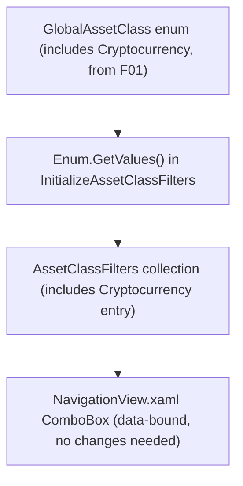

## Technical Overview

**What:** Verify that "Cryptocurrency" already appears as a selectable option in the WPF Investment Tree's asset-class filter, and add test coverage locking that in.

**Why:** Unlike the Web frontend (F04, a hardcoded options array requiring a new literal entry), `MainNavigationViewModelBase.InitializeAssetClassFilters()` builds its filter list dynamically via `Enum.GetValues<GlobalAssetClass>()`. Since F01 (merged) already added `Cryptocurrency` to the `GlobalAssetClass` enum, it automatically appears in this list with **zero WPF code changes required** — `BuildAssetClassLabel` only special-cases `RealEstate` ("Real Estate"); every other value, including `Cryptocurrency`, falls through to `assetClass.ToString()`, which already yields the correct label. The XAML `ComboBox` (`Financial.App/Components/NavigationView.xaml`) is fully data-bound with no hardcoded items, so it needs no change either.

**Scope:**
- Included: a test proving the "Cryptocurrency" option is present in `AssetClassFilters` with the correct label after view-model construction.
- Excluded: end-to-end filter-*selection* behavior (selecting "Cryptocurrency" and verifying the tree actually filters down to crypto assets) is **not** unit-testable today. `ApplyAssetClassFilter()` unconditionally calls `System.Windows.Application.Current.Dispatcher.Invoke(...)` with no null-check, and this solution has zero WPF/STA test infrastructure (no `Xunit.StaFact`, no STA thread setup, no live `Application` instance) to safely exercise that path — confirmed by the fact that no existing test anywhere in the four test projects has ever called `LoadNavigationTreeAsync` or changed `SelectedAssetClassFilter`. This is a pre-existing, generic limitation affecting all 9 filter options equally (Equity through Cryptocurrency) — not something introduced by, or in scope to fix as part of, adding one filter option.
- Consumes (per PRD): `GlobalAssetClass.Cryptocurrency`, provided by F01 (merged) and already flowing through `Enum.GetValues<GlobalAssetClass>()` with no code changes needed.

## Architecture Impact

**Affected components:**
- `Tests/Financial.Presentation.Tests/ViewModels/MainNavigationViewModelBaseTests.cs` — new test case only

No production file is modified — `AssetClassFilterOptionViewModel.cs`, `MainNavigationViewModelBase.cs`, and `NavigationView.xaml` are all already correct as-is.

## Technical Decisions

| Decision | Chosen Approach | Alternative Considered | Trade-off |
|----------|----------------|----------------------|-----------|
| Production code changes | None — the enum-driven filter list already includes Cryptocurrency correctly | Add an explicit `AssetClassFilterOptionViewModel` entry mirroring F04's hardcoded-array approach, per the PRD's literal wording | The PRD assumed WPF mirrors Web's implementation shape (hardcoded array); it doesn't. WPF's actual mechanism (enum enumeration) already satisfies the requirement, so adding a redundant explicit entry would create a duplicate and diverge from the existing dynamic-list pattern for no benefit |
| Filter-selection behavior testing | Not unit-tested; documented as a pre-existing, generic limitation | Introduce a dispatcher abstraction (e.g. `IDispatcherService`) and/or a package like `Xunit.StaFact` to enable full behavioral testing | This is a cross-cutting testing-infrastructure gap affecting all 9 filter options, not specific to Cryptocurrency or introduced by this feature; fixing it is a separate, larger effort out of scope for adding test coverage to one already-working filter option |
| Test placement | Add to the existing `MainNavigationViewModelBaseTests.cs`, reusing its established `TestableNavigationViewModel`/stub-service construction pattern | Create a new test file | Matches the one-file-per-class-under-test convention already used throughout this solution; no other Cryptocurrency-specific behavior belongs in a separate file |

## Component Overview

**WPF (Presentation):**

| File Path | New/Modified | Purpose | Key Responsibilities |
|-----------|--------------|---------|---------------------|
| `Tests/Financial.Presentation.Tests/ViewModels/MainNavigationViewModelBaseTests.cs` | Modified | Existing `MainNavigationViewModelBase` test file | Add a test constructing `TestableNavigationViewModel` and asserting `AssetClassFilters` contains an entry with `Label == "Cryptocurrency"` and `Filter == GlobalAssetClass.Cryptocurrency` |

## Testing Strategy

**Test File Structure:**

| Test File | Test Type | Target | Coverage Goal |
|-----------|-----------|--------|---------------|
| `Tests/Financial.Presentation.Tests/ViewModels/MainNavigationViewModelBaseTests.cs` | Unit | `MainNavigationViewModelBase.AssetClassFilters` | Cryptocurrency option present with correct label |

**Test functions:**

| Test Function | Description | Assertions |
|---------------|-------------|------------|
| `AssetClassFilters_IncludesCryptocurrencyWithCorrectLabel` | Constructs a `TestableNavigationViewModel` (no tree load needed — the filter list is built entirely in the constructor via `InitializeAssetClassFilters`, which never touches `Application.Current`) | `AssetClassFilters` contains exactly one entry where `Filter == GlobalAssetClass.Cryptocurrency` and `Label == "Cryptocurrency"` |

**Acceptance criteria traceability (PRD Section 9, F05):**
- "The WPF asset-class filter dropdown includes a 'Cryptocurrency' option" → `AssetClassFilters_IncludesCryptocurrencyWithCorrectLabel`
- "Selecting 'Cryptocurrency' filters the investment tree to show only assets with Class = Cryptocurrency" → **not unit-tested** (see Scope above); the underlying `assetClass == filter` comparison in `FilterTreeNode` is fully generic and already identical for all 9 asset classes, so there is no Cryptocurrency-specific filtering logic that could behave differently from the other 8 already-working options
- "The 8 pre-existing filter options remain unchanged in label, value, and order" → unaffected by construction — no code path was modified, so the pre-existing 8 options (plus "All") are structurally guaranteed unchanged

**Cross-Feature Integration (PRD Section 9):** F05 has no Consumes/Provides relationships beyond F01 (already merged); no new integration criteria apply.
