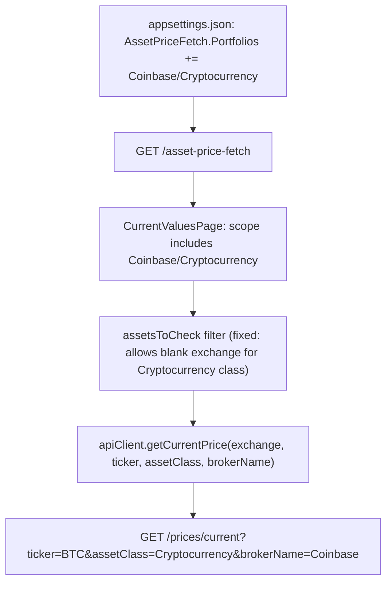

## Technical Overview

**What:** Add the Coinbase "Cryptocurrency" portfolio to the Web Current Values page's fixed portfolio scope, and wire the page's price-fetch call to pass the `assetClass`/`brokerName` parameters F03 added to `/prices/current`, so Bitcoin's price actually fetches successfully instead of failing.

**Why:** Two gaps were found during research that go beyond the PRD's literal wording:
1. The PRD references `Financial.Web/src/config/portfolioScopeConfig.ts` — this file does not exist. The fixed portfolio scope actually lives server-side, in `Financial.Api/appsettings.json` under `AssetPriceFetch:Portfolios`, served to the Web frontend via `GET /asset-price-fetch` and consumed by `CurrentValuesPage.tsx`. Confirmed no environment-specific (`appsettings.Development.json`) or Docker environment-variable overrides exist for this section — `appsettings.json` is the single source of truth.
2. Simply adding Coinbase to scope is not sufficient. `CurrentValuesPage.tsx`'s `assetsToCheck` filter currently excludes any asset with a blank `exchange` (`asset.isActive && asset.ticker && asset.exchange`) — Bitcoin's `Exchange` is blank per F02, so it would be silently dropped before ever reaching the price-fetch call. Separately, the page's `apiClient.getCurrentPrice(asset.exchange, asset.ticker)` call only sends `exchange`+`ticker` — F03's `/prices/current` endpoint requires `assetClass=Cryptocurrency`+`brokerName` instead of `exchange` for crypto assets, so without threading those through, the request would hit the API's `400 Bad Request` branch for a missing `brokerName`.

**Scope:**
- Included: `AssetPriceFetch:Portfolios` config addition; `assetsToCheck` filter fix (generic — any Cryptocurrency-class asset, not hardcoded to "Bitcoin"); `financialApiClient.getCurrentPrice` signature extension; threading `asset.class`/`broker.name` through the existing fetch loop.
- Excluded: any UI/display change beyond what's needed for the fetch to succeed — the results table (Ticker, Name, Price columns) already displays whatever `AssetPriceDto` returns, with no Cryptocurrency-specific formatting required.
- Consumes (per PRD): the Bitcoin asset under Coinbase (F02, merged); the Cryptocurrency price-fetch capability (F03, merged) — specifically its `assetClass`/`brokerName` query-param contract on `/prices/current`.

## Architecture Impact

**Affected components:**
- `Financial.Api/appsettings.json` — Presentation (API) configuration, `AssetPriceFetch:Portfolios` list
- `Financial.Web/src/api/financialApiClient.ts` — `getCurrentPrice` interface + implementation
- `Financial.Web/src/pages/CurrentValuesPage.tsx` — `assetsToCheck` filter + `runPriceCheck` fetch loop

## Technical Decisions

| Decision | Chosen Approach | Alternative Considered | Trade-off |
|----------|----------------|----------------------|-----------|
| Portfolio scope target | Add `{ "BrokerName": "Coinbase", "PortfolioName": "Cryptocurrency" }` to `Financial.Api/appsettings.json`'s `AssetPriceFetch:Portfolios` | Create the `portfolioScopeConfig.ts` file the PRD describes | The PRD's assumed file doesn't exist; the actual mechanism is server-side config already serving this exact purpose for the existing XPI entries — introducing a parallel, unused frontend config file would contradict the existing architecture |
| `assetsToCheck` filter fix | Change the exchange requirement to `asset.exchange \|\| asset.class === 'Cryptocurrency'`, keeping `isActive`/`ticker` checks unchanged | Special-case by ticker (`asset.ticker === 'BTC'`) | Matches F03's own design principle (no hardcoded coin list, works for any Cryptocurrency-classified asset) and mirrors the identical `isCryptocurrency` branching already used in the WPF `TodayInfoTracker` (F03) |
| Threading `assetClass`/`brokerName` | Extend `getCurrentPrice(exchange, ticker, assetClass?, brokerName?)` with two new optional trailing parameters; `CurrentValuesPage` captures `asset.class` (already on `AssetNodeDto`) and the enclosing `broker.name` (already in scope in the `flatMap` closure) when building `assetsToCheck` | Introduce an options-object parameter shape instead of positional args | Matches the existing 2-positional-arg signature and the codebase's established optional-trailing-parameter style elsewhere in `financialApiClient.ts`; no currency resolution is needed client-side since F03 already resolves `Broker.Currency` server-side from `brokerName` |
| Query string construction | Follow the existing `buildExchangeQuery`-style pattern: append `&assetClass=...`/`&brokerName=...` only when present, so non-crypto requests keep sending the exact same URL as today | Always send both params, blank when absent | Keeps the request URL for the 8 pre-existing (non-crypto) portfolios byte-for-byte unchanged, minimizing risk to already-working behavior |

## Component Overview

**Backend (configuration):**

| File Path | New/Modified | Purpose | Key Responsibilities |
|-----------|--------------|---------|---------------------|
| `Financial.Api/appsettings.json` | Modified | Fixed portfolio scope for `/asset-price-fetch` | Add `{ "BrokerName": "Coinbase", "PortfolioName": "Cryptocurrency" }` to `AssetPriceFetch:Portfolios`, alongside the existing two XPI entries |

**Frontend:**

| File Path | New/Modified | Purpose | Key Responsibilities |
|-----------|--------------|---------|---------------------|
| `Financial.Web/src/api/financialApiClient.ts` | Modified | Typed API client | Extend `getCurrentPrice`'s interface and implementation with optional `assetClass`/`brokerName` parameters, appended to the query string only when provided |
| `Financial.Web/src/pages/CurrentValuesPage.tsx` | Modified | Current Values page | Fix `assetsToCheck`'s filter to admit Cryptocurrency-class assets with a blank exchange; capture `asset.class` and the enclosing `broker.name` per asset; pass both into `apiClient.getCurrentPrice` in `runPriceCheck` |

## Testing Strategy

**Test File Structure:**

| Test File | Test Type | Target | Coverage Goal |
|-----------|-----------|--------|---------------|
| `Financial.Web/src/api/financialApiClient.test.ts` | Unit | `getCurrentPrice` | Crypto and non-crypto URL shapes |
| `Financial.Web/src/pages/__tests__/CurrentValuesPage.test.tsx` | Component | `CurrentValuesPage` | Coinbase/Bitcoin scope inclusion and correct request shape |

**Test functions:**

| Test Function | Description | Assertions |
|---------------|-------------|------------|
| `calls current price endpoint with assetClass and brokerName for cryptocurrency` | Calls `client.getCurrentPrice('', 'BTC', 'Cryptocurrency', 'Coinbase')` | Request URL is `${API_BASE_URL}/prices/current?exchange=&ticker=BTC&assetClass=Cryptocurrency&brokerName=Coinbase` |
| `calls current price endpoint unchanged when assetClass/brokerName omitted` | Calls `client.getCurrentPrice('BVMF', 'BCIA11')` (no new args) | Request URL is unchanged: `${API_BASE_URL}/prices/current?exchange=BVMF&ticker=BCIA11` (existing test, must still pass) |
| `fetches Bitcoin under Coinbase/Cryptocurrency scope with assetClass and brokerName` | Mocks scope including `{ brokerName: 'Coinbase', portfolioName: 'Cryptocurrency' }`, broker "Coinbase" with a blank-exchange, `class: 'Cryptocurrency'` Bitcoin asset; clicks "Check Prices" | `getCurrentPriceMock` is called with `('', 'BTC', 'Cryptocurrency', 'Coinbase')` |
| `does not exclude Cryptocurrency assets with blank exchange` | Same setup as above, asserts the asset is NOT silently dropped | `getCurrentPriceMock` is called at least once for the Bitcoin ticker (regression guard against the filter bug found during research) |

**Acceptance criteria traceability (PRD Section 9, F06):**
- "The Coinbase/Cryptocurrency portfolio appears on the Web Current Values page" → covered indirectly by `fetches Bitcoin under Coinbase/Cryptocurrency scope...` (the asset only appears in `assetsToCheck`/results if the scope entry resolves correctly)
- "The Bitcoin asset's 'Refresh' action successfully triggers the price fetch and displays a GBP price" → the request-shape assertion (`fetches Bitcoin under Coinbase/Cryptocurrency scope...`) proves the correct request is sent; the actual GBP price return is F03's already-tested/verified responsibility (live-verified in F03's PR), not re-tested here
- "The existing scoped portfolios (e.g. XPI/Default, XPI/Acoes) remain present and unaffected" → covered by the existing, unmodified `fetches prices only for assets in XPI/Default and XPI/Acoes` test continuing to pass, plus `calls current price endpoint unchanged when assetClass/brokerName omitted`

**Cross-Feature Integration (PRD Section 9):**
- "The Bitcoin asset record produced by F02 ... and the price-fetch capability from F03 are both correctly consumed when the Bitcoin asset appears in the Web Current Values page (F06) ..., returning a GBP price on Refresh" → covered by `fetches Bitcoin under Coinbase/Cryptocurrency scope with assetClass and brokerName`, which exercises the full chain from scope config through to the price-fetch request shape (the live GBP-price return itself was already verified end-to-end during F03's implementation)
