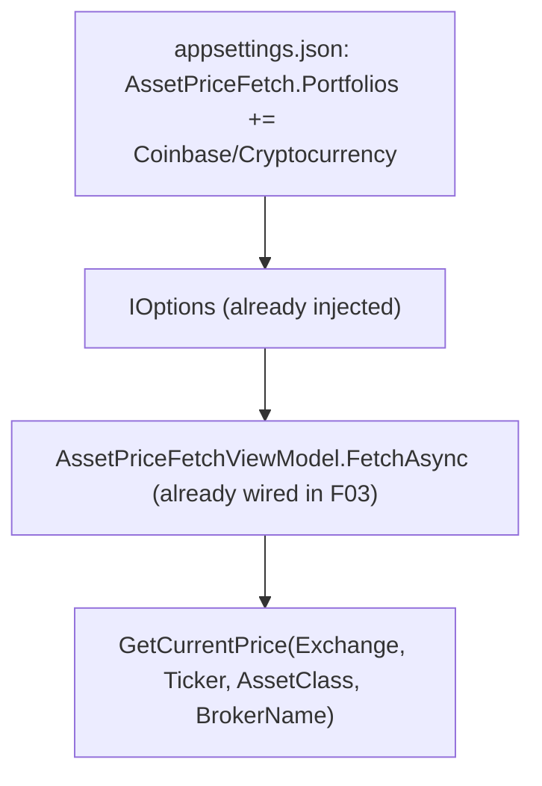

## Technical Overview

**What:** Add the Coinbase "Cryptocurrency" portfolio to the WPF Current Values page's fixed portfolio scope, and add test coverage locking in that Bitcoin's price fetch works correctly through that page.

**Why:** Unlike the Web frontend (F06), which required fixing a blank-exchange filter bug and threading `assetClass`/`brokerName` into an untouched call site, F03 (merged) already fully wired `Financial.App/ViewModels/AssetPriceFetchViewModel.cs` — WPF's Current Values equivalent — to thread each asset's `BrokerName` and `Class` into `AssetPriceRequestDTO`. Research confirmed the entire chain (`AssetPriceFetchViewModel` → `INavigationService.GetAssetsByBrokerPortfolio` → `JSONRepository.GetAssetsByBrokerPortfolio`) applies **no filtering** on `Exchange`/`IsActive`/any other field before queuing an asset for price-fetch — there is no equivalent of the Web bug to fix. F07 is therefore a scope-configuration change plus new test coverage, not a wiring fix.

**Scope:**
- Included: adding the Coinbase/Cryptocurrency portfolio to `Financial.App/appsettings.json`'s `AssetPriceFetch:Portfolios` list; new test coverage for `AssetPriceFetchViewModel` proving Coinbase/Bitcoin correctly threads `AssetClass`/`BrokerName` into the price-fetch request (no such test file exists today for this ViewModel at all).
- Excluded: broader test coverage for `AssetPriceFetchViewModel`'s pre-existing, non-crypto-specific behavior (progress reporting, error handling for non-crypto assets, etc.) — consistent with this PRD's established pattern (F02, F04, F05) of scoping new tests to the crypto-specific behavior being verified, not backfilling unrelated pre-existing gaps.
- Consumes (per PRD): the Bitcoin asset under Coinbase (F02, merged); the Cryptocurrency price-fetch capability including `AssetPriceFetchViewModel`'s existing `AssetClass`/`BrokerName` threading (F03, merged).

## Architecture Impact

**Affected components:**
- `Financial.App/appsettings.json` — `AssetPriceFetch:Portfolios` fixed scope list
- `Tests/Financial.Presentation.Tests/ViewModels/AssetPriceFetchViewModelTests.cs` — new test file (none exists today)

No production WPF code (`AssetPriceFetchViewModel.cs`, `NavigationService.cs`, `JSONRepository.cs`) requires changes — all are already correct as-is per F03.

## Technical Decisions

| Decision | Chosen Approach | Alternative Considered | Trade-off |
|----------|----------------|----------------------|-----------|
| Config target | Add `{ "BrokerName": "Coinbase", "PortfolioName": "Cryptocurrency" }` to `Financial.App/appsettings.json`'s `AssetPriceFetch:Portfolios`, matching the exact section/shape already used by the two existing XPI entries and by the Web API's equivalent config (F06) | Add a separate WPF-specific config file | `Financial.App` and `Financial.Api` each maintain their own `AssetPriceFetchOptions`-bound `appsettings.json` (confirmed separate in F03 research) — this is the established, already-working pattern for this exact ViewModel |
| Test scope | New test file covering only the Coinbase/Cryptocurrency-specific threading behavior (`AssetClass`/`BrokerName` correctly passed for a blank-exchange asset) | Comprehensive test suite covering all of `AssetPriceFetchViewModel`'s existing behavior (progress text, error handling, etc.) | Matches this PRD's established, repeatedly-confirmed pattern (F02, F04, F05) of not expanding scope to backfill pre-existing, unrelated test gaps |
| Test double style | Hand-rolled stubs for `INavigationService`/`IAssetPriceService` implementing only the members exercised, mirroring `StubRepository` in `Tests/Financial.Infrastructure.Tests/Services/AssetPriceServiceTests.cs` and `StubNavigationService` in `MainNavigationViewModelBaseTests.cs` | Introduce a mocking library | No mocking library exists anywhere in this solution; hand-rolled stubs are the established, consistent convention |

## Component Overview

**Backend (configuration):**

| File Path | New/Modified | Purpose | Key Responsibilities |
|-----------|--------------|---------|---------------------|
| `Financial.App/appsettings.json` | Modified | Fixed portfolio scope for WPF Current Values page | Add `{ "BrokerName": "Coinbase", "PortfolioName": "Cryptocurrency" }` to `AssetPriceFetch:Portfolios`, alongside the existing two XPI entries |

**Tests:**

| File Path | New/Modified | Purpose | Key Responsibilities |
|-----------|--------------|---------|---------------------|
| `Tests/Financial.Presentation.Tests/ViewModels/AssetPriceFetchViewModelTests.cs` | New | Unit tests for `AssetPriceFetchViewModel` | Verify a Coinbase-scoped, blank-exchange Bitcoin asset results in a `GetCurrentPrice` call carrying `AssetClass = Cryptocurrency` and `BrokerName = "Coinbase"`; verify existing (non-crypto) scoped assets are unaffected |

## Testing Strategy

**Test File Structure:**

| Test File | Test Type | Target | Coverage Goal |
|-----------|-----------|--------|---------------|
| `Tests/Financial.Presentation.Tests/ViewModels/AssetPriceFetchViewModelTests.cs` | Unit | `AssetPriceFetchViewModel.FetchAsync` | Coinbase/Bitcoin request-shape correctness |

**Test functions:**

| Test Function | Description | Assertions |
|---------------|-------------|------------|
| `FetchAsync_CoinbaseCryptocurrencyAsset_PassesAssetClassAndBrokerName` | Configures `AssetPriceFetchOptions` with `[{XPI, Acoes}, {Coinbase, Cryptocurrency}]`; stub `INavigationService.GetAssetsByBrokerPortfolio("Coinbase", "Cryptocurrency")` returns one blank-exchange, `Class = Cryptocurrency` Bitcoin `AssetNodeDTO`; runs `FetchCommand` | The `AssetPriceRequestDTO` passed to `IAssetPriceService.GetCurrentPrice` has `Ticker = "BTC"`, `Exchange = ""`, `AssetClass = GlobalAssetClass.Cryptocurrency`, `BrokerName = "Coinbase"` |
| `FetchAsync_NonCryptocurrencyAsset_RequestUnaffected` | Same setup, but for an existing XPI/Acoes-scoped asset | The `AssetPriceRequestDTO` passed has the asset's real `Exchange`, `AssetClass = GlobalAssetClass.Equity` (or the asset's actual class), and `BrokerName = "XPI"` — confirms the pre-existing threading (already shipped in F03) is unaffected by adding the Coinbase entry |

**Acceptance criteria traceability (PRD Section 9, F07):**
- "The Coinbase/Cryptocurrency portfolio appears on the WPF Current Values page" → covered by `FetchAsync_CoinbaseCryptocurrencyAsset_PassesAssetClassAndBrokerName` (the asset only reaches the fetch loop if the scope config correctly resolves the portfolio)
- "The Bitcoin asset's 'Refresh' action successfully triggers the price fetch and displays a GBP price" → the request-shape assertion proves the correct request is built; the actual GBP price return is F03's already-verified responsibility (live-verified end-to-end during F03's implementation), not re-tested here
- "The existing scoped portfolios remain present and unaffected" → covered by `FetchAsync_NonCryptocurrencyAsset_RequestUnaffected`

**Cross-Feature Integration (PRD Section 9):**
- "The Bitcoin asset record produced by F02 ... and the price-fetch capability from F03 are both correctly consumed when the Bitcoin asset appears in ... the WPF Current Values page (F07), ... returning a GBP price on Refresh" → covered by `FetchAsync_CoinbaseCryptocurrencyAsset_PassesAssetClassAndBrokerName`, which exercises the full chain from scope config through to the price-fetch request shape (the live GBP-price return itself was already verified end-to-end during F03's implementation)
