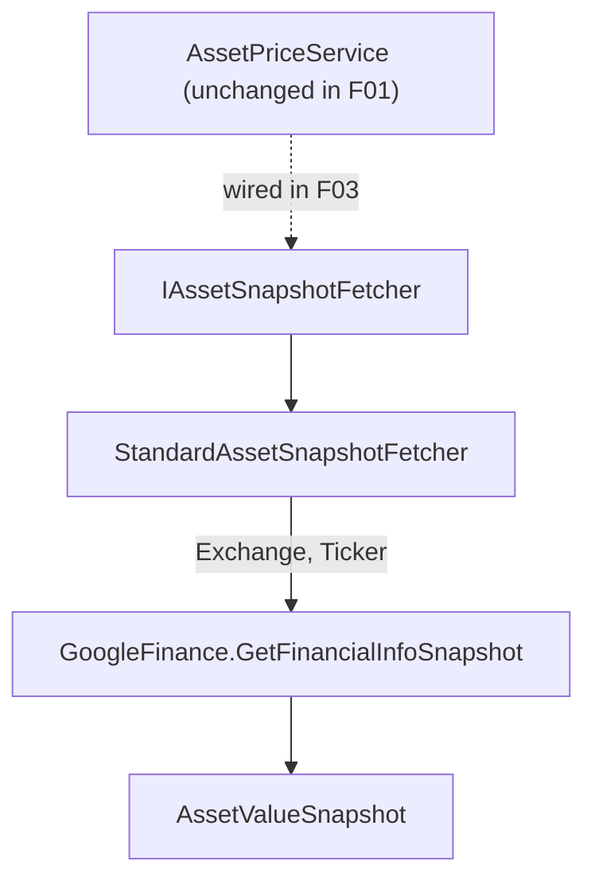

## Technical Overview

**What:** Introduce an `IAssetSnapshotFetcher` strategy interface (`Financial.Application/Interfaces/`) and its first concrete implementation, `StandardAssetSnapshotFetcher` (`Financial.Infrastructure/Services/`), which wraps today's non-cryptocurrency Google Finance stock-quote fetch. Register the new class in DI as an `IAssetSnapshotFetcher`, resolvable as part of an `IEnumerable<IAssetSnapshotFetcher>` collection.

**Why:** `AssetPriceService.GetCurrentPrice` currently selects its fetch strategy with a single hardcoded ternary comparing `request.AssetClass` against `GlobalAssetClass.Cryptocurrency`. Every future asset class that needs different fetch behavior — starting with the planned Tesouro Direto bonds — would otherwise mean editing this already-shipped, already-tested method again. This feature lays the first piece of a strategy pattern: the shared contract plus the default/fallback implementation, so that F02 (`CryptocurrencySnapshotFetcher`) and F03 (the `AssetPriceService` dispatcher refactor) have something to implement and wire against.

**Scope:**
- Included: `IAssetSnapshotFetcher` interface; `StandardAssetSnapshotFetcher` class wrapping `GoogleFinance.GetFinancialInfoSnapshot` with today's exact `Exchange` validation and error message; DI registration in `InfrastructureServiceCollectionExtensions`.
- Excluded (deferred to later features in this PRD, per PRD Section 8): any change to `AssetPriceService` itself — its existing branching logic stays in place and continues to be the only thing callers exercise until F03; the `CryptocurrencySnapshotFetcher` (F02); any change to `IAssetSnapshotSource`/`AssetSnapshotSourceAdapter` (out of scope for the whole PRD, per its Section 7); any API, DTO, or UI change (this feature adds unconsumed types only).
- Consumes: none — F01 has no PRD `Consumes` block and is Wave 1 (no dependencies).
- Provides (per PRD): asset value snapshot for the default/non-cryptocurrency strategy, consumed by F03 once that dispatcher exists.

## Architecture Impact

**Affected components:**
- `Financial.Application/Interfaces/IAssetSnapshotFetcher.cs` — Application layer, new strategy contract
- `Financial.Infrastructure/Services/StandardAssetSnapshotFetcher.cs` — Infrastructure layer, new default fetch strategy
- `Financial.Infrastructure/DependencyInjection/InfrastructureServiceCollectionExtensions.cs` — Infrastructure layer, DI registration
- `Integrations/WebPageParser/GoogleFinance.cs` — Infrastructure/Integrations, consumed unchanged (no modification)

## Technical Decisions

| Decision | Chosen Approach | Alternative Considered | Trade-off |
|----------|-----------------|------------------------|-----------|
| File/folder layout | Flat: `IAssetSnapshotFetcher.cs` in `Financial.Application/Interfaces/`, `StandardAssetSnapshotFetcher.cs` in `Financial.Infrastructure/Services/`, test in `Tests/Financial.Infrastructure.Tests/Services/` — mirrors the existing `AssetPriceService.cs`/`AssetPriceServiceTests.cs` sibling layout exactly | A new `Services/SnapshotFetchers/` subfolder to group fetcher implementations separately | Keeps this feature's diff minimal and consistent with the existing flat `Services/` folder; a subfolder can be introduced later, without breaking any public contract, if the folder becomes crowded once more fetchers land |
| XML documentation | No XML doc comments on the new interface or class | XML summary comments matching `GoogleFinance.cs`'s documented style | Matches the prevailing undocumented style of `AssetPriceService.cs`, `IAssetPriceService.cs`, and the DTOs; avoids introducing inconsistent partial documentation within the Application/Infrastructure services layer |
| Validation ownership | `StandardAssetSnapshotFetcher.GetSnapshot` validates only `Exchange` (its unique precondition); `Ticker` validation remains solely `AssetPriceService`'s responsibility, unchanged | The fetcher independently re-validates `Ticker` as well | Avoids duplicating the same blank-check across every future fetcher (`CryptocurrencySnapshotFetcher` in F02, a future Bond fetcher); matches today's exact single-owner validation behavior with zero change |
| `Supports` semantics | Returns `true` for every `GlobalAssetClass` value **except** `Cryptocurrency` (an explicit exclusion) | `Supports` allowlists only classes it explicitly recognizes (e.g. `Equity`, `ETF`, `Unknown`), leaving other/future classes unmatched | Preserves today's exact "anything non-crypto defaults to standard" behavior for every current and future `GlobalAssetClass` value (`Bond`, `RealEstate`, `Fund`, `Cash`, `Pension`, `Other`) until a dedicated fetcher is added for it, satisfying the PRD's "preserve 100% of existing behavior" objective |

## Component Overview

**Backend (Application / Infrastructure):**

| File Path | New/Modified | Purpose | Key Responsibilities |
|-----------|--------------|---------|----------------------|
| `Financial.Application/Interfaces/IAssetSnapshotFetcher.cs` | New | Strategy contract for asset-class-specific price-fetch | Declares `bool Supports(GlobalAssetClass assetClass)` and `AssetValueSnapshot GetSnapshot(AssetPriceRequestDTO request)` |
| `Financial.Infrastructure/Services/StandardAssetSnapshotFetcher.cs` | New | Default/fallback fetch strategy | Implements `IAssetSnapshotFetcher`; `Supports` excludes only `Cryptocurrency`; `GetSnapshot` validates `Exchange` is non-blank (`ArgumentException`, message `"Exchange is required."`, matching today's `GetStandardSnapshot`) then delegates to `GoogleFinance.GetFinancialInfoSnapshot(exchange, ticker)` unmodified |
| `Financial.Infrastructure/DependencyInjection/InfrastructureServiceCollectionExtensions.cs` | Modified | DI composition root | Adds `services.AddSingleton<IAssetSnapshotFetcher, StandardAssetSnapshotFetcher>();` alongside the existing registrations; `AssetPriceService`'s own registration is untouched in this feature |
| `Tests/Financial.Infrastructure.Tests/Services/StandardAssetSnapshotFetcherTests.cs` | New | Unit tests | Covers the `Supports` true/false matrix and `GetSnapshot`'s `Exchange` validation |

No Presentation-layer (API/WPF/Web) or Domain-layer files are touched — `AssetPriceService`, `AssetPriceRequestDTO`, `IAssetPriceService`, and every caller are unmodified by this feature.

## Testing Strategy

**Test File Structure:**

| Test File | Test Type | Target | Coverage Goal |
|-----------|-----------|--------|----------------|
| `Tests/Financial.Infrastructure.Tests/Services/StandardAssetSnapshotFetcherTests.cs` | Unit | `StandardAssetSnapshotFetcher` | Full `Supports`/`GetSnapshot` validation branching |

**Test functions:**

| Test Function | Description | Assertions |
|----------------|--------------|------------|
| `Supports_Cryptocurrency_ReturnsFalse` | Calls `Supports(GlobalAssetClass.Cryptocurrency)` | Returns `false` |
| `Supports_Equity_ReturnsTrue` | Calls `Supports(GlobalAssetClass.Equity)` | Returns `true` |
| `Supports_Unknown_ReturnsTrue` | Calls `Supports(GlobalAssetClass.Unknown)` | Returns `true` |
| `Supports_Bond_ReturnsTrue` | Calls `Supports(GlobalAssetClass.Bond)` | Returns `true` — documents today's "any class without a dedicated fetcher defaults to Standard" guarantee, including the not-yet-built Tesouro Direto path |
| `GetSnapshot_BlankExchange_ThrowsArgumentException` | Calls `GetSnapshot` with a request whose `Exchange` is `""` | Throws `ArgumentException` with message `"Exchange is required."` |

**What stays untested (documented, not a gap):** `GetSnapshot`'s success path (`GoogleFinance.GetFinancialInfoSnapshot`'s live `HtmlWeb.Load` call) has no unit seam to intercept — the same limitation already documented for this exact code path in `docs/P07-F03-cryptocurrency-price-fetch-strategy/spec.md`. Verified by code review that the delegation is a direct one-line pass-through of `(exchange, ticker)`, unmodified from today's `GetStandardSnapshot`. The DI registration line itself is also not unit-tested, consistent with this codebase's existing convention — `InfrastructureServiceCollectionExtensions` has no test file today.

**Acceptance criteria traceability (PRD Section 9, F01):**
- "`IAssetSnapshotFetcher` exists in `Financial.Application/Interfaces/` with `Supports(GlobalAssetClass)` and `GetSnapshot(AssetPriceRequestDTO)` members" → verified structurally: `StandardAssetSnapshotFetcher` fails to compile unless it implements both members
- "`StandardAssetSnapshotFetcher.Supports` returns `true` for every `GlobalAssetClass` value except `Cryptocurrency`, and `false` for `Cryptocurrency`" → `Supports_Cryptocurrency_ReturnsFalse`, `Supports_Equity_ReturnsTrue`, `Supports_Unknown_ReturnsTrue`, `Supports_Bond_ReturnsTrue`
- "`StandardAssetSnapshotFetcher.GetSnapshot` throws `ArgumentException` when `Exchange` is blank" → `GetSnapshot_BlankExchange_ThrowsArgumentException`
- "`StandardAssetSnapshotFetcher.GetSnapshot` calls `GoogleFinance.GetFinancialInfoSnapshot(exchange, ticker)` and returns its result unmodified" → not unit-tested (live network call, see "What stays untested" above); verified by code review
- "`StandardAssetSnapshotFetcher` is registered in DI as an `IAssetSnapshotFetcher`" → verified by code review of `InfrastructureServiceCollectionExtensions`, consistent with the codebase's existing convention of not testing DI composition roots

**Cross-Feature Integration (PRD Section 9):** F01 is a provider consumed by F03 (`AssetPriceService` dispatcher), which does not exist yet at this point in the wave sequence. The Cross-Feature Integration criterion covering "a non-Cryptocurrency request dispatches to the snapshot provided by `StandardAssetSnapshotFetcher`" is validated when F03 is implemented; F01's testing scope is limited to the acceptance criteria above, exactly mirroring the pattern used by `docs/P07-F03-cryptocurrency-price-fetch-strategy/spec.md` for its own forward-referencing integration criteria.
