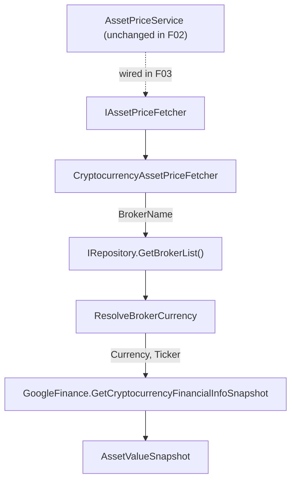

## Technical Overview

**What:** Extract `AssetPriceService`'s existing cryptocurrency-specific price-fetch logic — broker-currency resolution plus the Google Finance beta-quote URL fetch — into a new `CryptocurrencyAssetPriceFetcher` (`Financial.Infrastructure/Services/`), the second implementation of the `IAssetPriceFetcher` strategy contract introduced in F01. Register it in DI alongside `StandardAssetPriceFetcher`.

**Why:** `AssetPriceService.GetCurrentPrice` still contains its original `AssetClass == Cryptocurrency ? : ` branching (F01 only added the contract and the default-path implementation; it did not touch `AssetPriceService`). This feature relocates the crypto-specific half of that branch into its own strategy so that F03 has both concrete fetchers available to dispatch between, and so the `IRepository` dependency — needed only for broker-currency resolution — moves out of `AssetPriceService` and lives exclusively where it's actually used.

**Scope:**
- Included: `CryptocurrencyAssetPriceFetcher` class implementing `IAssetPriceFetcher`; relocated `BrokerName` validation and `ResolveBrokerCurrency` logic (kept `internal static`, independently tested, per interview); delegation to `GoogleFinance.GetCryptocurrencyFinancialInfoSnapshot` unchanged; DI registration in `InfrastructureServiceCollectionExtensions`.
- Excluded (deferred to F03, per PRD Section 8): any change to `AssetPriceService` itself — its existing branching, `GetCryptocurrencySnapshot`, and its own copy of `ResolveBrokerCurrency` all stay in place and keep being the only thing callers exercise until F03; `AssetPriceService`'s constructor keeps its `IRepository` dependency until F03 removes it; any API, DTO, or UI change (this feature adds an unconsumed type only, exactly like F01).
- Consumes: none — F02 has no PRD `Consumes` block; its only PRD dependency (F01, the `IAssetPriceFetcher` contract) is an infrastructure/contract dependency, already implemented and merged.
- Provides (per PRD): asset value snapshot for `Cryptocurrency`-class assets, consumed by F03 once that dispatcher exists.

## Architecture Impact

**Affected components:**
- `Financial.Infrastructure/Services/CryptocurrencyAssetPriceFetcher.cs` — Infrastructure layer, new cryptocurrency fetch strategy
- `Financial.Infrastructure/DependencyInjection/InfrastructureServiceCollectionExtensions.cs` — Infrastructure layer, DI registration
- `Integrations/WebPageParser/GoogleFinance.cs` — Infrastructure/Integrations, consumed unchanged (no modification)
- `Financial.Application/Interfaces/IAssetPriceFetcher.cs` — Application layer, existing contract (F01), implemented but not modified

## Technical Decisions

| Decision | Chosen Approach | Alternative Considered | Trade-off |
|----------|-----------------|------------------------|-----------|
| File/folder layout | Flat: `CryptocurrencyAssetPriceFetcher.cs` in `Financial.Infrastructure/Services/`, test in `Tests/Financial.Infrastructure.Tests/Services/` — mirrors `StandardAssetPriceFetcher.cs`'s established sibling layout from F01 | A `Services/SnapshotFetchers/` subfolder | Same reasoning already settled in F01: keeps the diff minimal, consistent with the now-established flat `Services/` convention |
| `ResolveBrokerCurrency` shape | Kept `internal static string ResolveBrokerCurrency(IEnumerable<Broker> brokers, string brokerName)` on the new class, with its own dedicated unit tests (mirroring today's `AssetPriceServiceTests.ResolveBrokerCurrency_*` pair) | Fold it into a private instance method, covered only indirectly via `GetSnapshot` tests | Matches the PRD's "relocated here unchanged" wording literally; preserves the same pure/testable seam this exact logic already had, consistent with F01's precedent of keeping validation/lookup logic independently testable |
| Validation ownership | `GetSnapshot` validates only `BrokerName` (its unique precondition); `Ticker` validation remains solely `AssetPriceService`'s responsibility, unchanged | The fetcher independently re-validates `Ticker` too | Directly carries forward F01's settled decision — avoids duplicating the same blank-check across every fetcher |
| XML documentation | No XML doc comments | XML summary comments | Directly carries forward F01's settled decision, keeping the fetcher family's documentation style consistent |
| Constructor dependency | `IRepository`, injected exactly as `AssetPriceService` injects it today | A narrower broker-lookup-only interface | PRD explicitly describes this as `IRepository` "moved here from `AssetPriceService`" — no new abstraction introduced, matching the "no over-engineering" project guidance for a personal-use codebase |

## Component Overview

**Backend (Infrastructure):**

| File Path | New/Modified | Purpose | Key Responsibilities |
|-----------|--------------|---------|----------------------|
| `Financial.Infrastructure/Services/CryptocurrencyAssetPriceFetcher.cs` | New | Cryptocurrency-class fetch strategy | Implements `IAssetPriceFetcher`; `Supports` returns `true` only for `GlobalAssetClass.Cryptocurrency`; `GetSnapshot` validates `BrokerName` is non-blank (`ArgumentException`, message `"BrokerName is required for cryptocurrency assets."`, matching today's `GetCryptocurrencySnapshot`), resolves currency via `ResolveBrokerCurrency`, then delegates to `GoogleFinance.GetCryptocurrencyFinancialInfoSnapshot(currency, ticker)`; exposes `internal static string ResolveBrokerCurrency(IEnumerable<Broker> brokers, string brokerName)` throwing `InvalidOperationException` (message containing the broker name) when no match is found, identical to today's implementation |
| `Financial.Infrastructure/DependencyInjection/InfrastructureServiceCollectionExtensions.cs` | Modified | DI composition root | Adds `services.AddSingleton<IAssetPriceFetcher, CryptocurrencyAssetPriceFetcher>();` alongside the existing `StandardAssetPriceFetcher` registration; `AssetPriceService`'s own registration is untouched in this feature |
| `Tests/Financial.Infrastructure.Tests/Services/CryptocurrencyAssetPriceFetcherTests.cs` | New | Unit tests | Covers `Supports`, `GetSnapshot`'s `BrokerName` validation, and `ResolveBrokerCurrency`'s known/unknown broker branching |

No Presentation-layer (API/WPF/Web) or Domain-layer files are touched — `AssetPriceService`, `AssetPriceRequestDTO`, `IAssetPriceService`, and every caller are unmodified by this feature, exactly as in F01.

## Testing Strategy

**Test File Structure:**

| Test File | Test Type | Target | Coverage Goal |
|-----------|-----------|--------|----------------|
| `Tests/Financial.Infrastructure.Tests/Services/CryptocurrencyAssetPriceFetcherTests.cs` | Unit | `CryptocurrencyAssetPriceFetcher` | Full `Supports`/`GetSnapshot`/`ResolveBrokerCurrency` branching |

**Test functions:**

| Test Function | Description | Assertions |
|----------------|--------------|------------|
| `Supports_Cryptocurrency_ReturnsTrue` | Calls `Supports(GlobalAssetClass.Cryptocurrency)` | Returns `true` |
| `Supports_Equity_ReturnsFalse` | Calls `Supports(GlobalAssetClass.Equity)` | Returns `false` |
| `Supports_Unknown_ReturnsFalse` | Calls `Supports(GlobalAssetClass.Unknown)` | Returns `false` |
| `GetSnapshot_BlankBrokerName_ThrowsArgumentException` | Calls `GetSnapshot` with a request whose `BrokerName` is `null` | Throws `ArgumentException` with message `"BrokerName is required for cryptocurrency assets."` |
| `GetSnapshot_UnknownBroker_ThrowsInvalidOperationException` | Calls `GetSnapshot` with `BrokerName = "NotABroker"` against an empty broker list | Throws `InvalidOperationException` with message containing `"NotABroker"`, before any network call is attempted |
| `ResolveBrokerCurrency_KnownBroker_ReturnsCurrency` | Calls `CryptocurrencyAssetPriceFetcher.ResolveBrokerCurrency([Broker.Create("Coinbase", "GBP")], "Coinbase")` | Returns `"GBP"` |
| `ResolveBrokerCurrency_UnknownBroker_ThrowsInvalidOperationException` | Calls `ResolveBrokerCurrency([], "Coinbase")` | Throws `InvalidOperationException` with message containing `"Coinbase"` |

**What stays untested (documented, not a gap):** `GetSnapshot`'s success path (`GoogleFinance.GetCryptocurrencyFinancialInfoSnapshot`'s live `HtmlWeb.Load` call) has no unit seam to intercept — the same limitation already documented for `StandardAssetPriceFetcher` in F01 and for this exact code path in `docs/P07-F03-cryptocurrency-price-fetch-strategy/spec.md`. Verified by code review that the delegation is a direct pass-through of `(currency, ticker)`, unmodified from today's `GetCryptocurrencySnapshot`. The DI registration line is also not unit-tested, consistent with F01 and this codebase's existing convention.

**Acceptance criteria traceability (PRD Section 9, F02):**
- "`CryptocurrencyAssetPriceFetcher.Supports` returns `true` only for `GlobalAssetClass.Cryptocurrency`, `false` for every other value" → `Supports_Cryptocurrency_ReturnsTrue`, `Supports_Equity_ReturnsFalse`, `Supports_Unknown_ReturnsFalse`
- "`CryptocurrencyAssetPriceFetcher.GetSnapshot` throws `ArgumentException` when `BrokerName` is blank" → `GetSnapshot_BlankBrokerName_ThrowsArgumentException`
- "`CryptocurrencyAssetPriceFetcher.GetSnapshot` throws `InvalidOperationException` when `BrokerName` matches no broker returned by `IRepository.GetBrokerList()`" → `GetSnapshot_UnknownBroker_ThrowsInvalidOperationException`
- "`CryptocurrencyAssetPriceFetcher.GetSnapshot` resolves the matching broker's `Currency` and calls `GoogleFinance.GetCryptocurrencyFinancialInfoSnapshot(currency, ticker)`" → `ResolveBrokerCurrency_KnownBroker_ReturnsCurrency` covers the currency-resolution half; the delegation itself is not unit-tested (live network call, see "What stays untested" above), verified by code review
- "`CryptocurrencyAssetPriceFetcher` is registered in DI as an `IAssetPriceFetcher`" → not unit-tested, verified by code review of `InfrastructureServiceCollectionExtensions`, consistent with F01's precedent

**Cross-Feature Integration (PRD Section 9):** F02 is a provider consumed by F03 (`AssetPriceService` dispatcher), which does not exist yet at this point in the wave sequence. The Cross-Feature Integration criterion covering "a Cryptocurrency request dispatches to the snapshot provided by `CryptocurrencyAssetPriceFetcher`" and the DI-collection-count criterion are both validated when F03 is implemented; F02's testing scope is limited to the acceptance criteria above, exactly mirroring the pattern F01 used for its own forward-referencing integration criteria.
