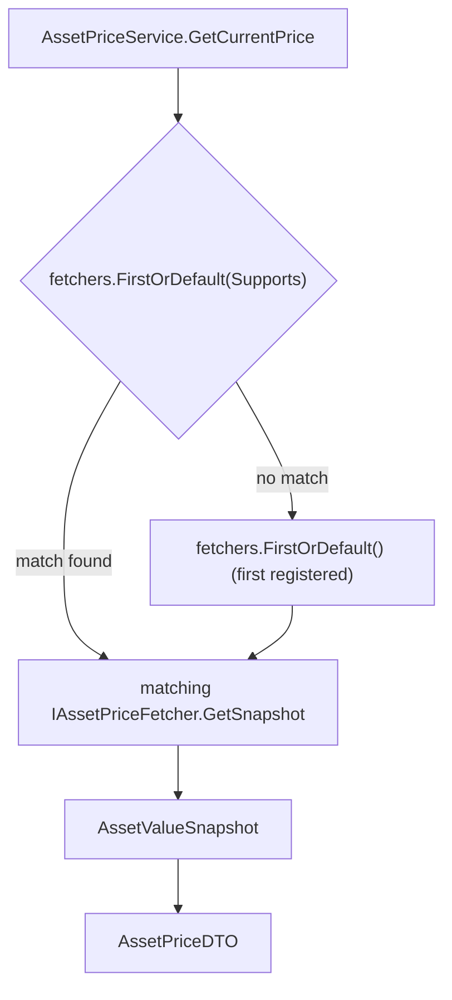

## Technical Overview

**What:** Rewrite `AssetPriceService.GetCurrentPrice` to resolve its fetch strategy from an injected `IEnumerable<IAssetPriceFetcher>` instead of its hardcoded `AssetClass == Cryptocurrency` ternary, delete the now-dead `GetStandardSnapshot`/`GetCryptocurrencySnapshot`/`ResolveBrokerCurrency` methods, and change the constructor from `IRepository` to `IEnumerable<IAssetPriceFetcher>`.

**Why:** F01 and F02 built the two `IAssetPriceFetcher` strategies (`StandardAssetPriceFetcher`, `CryptocurrencyAssetPriceFetcher`) without touching `AssetPriceService`, so both are currently registered in DI but never consumed — `AssetPriceService` still runs its original duplicated logic. This feature is the actual cutover: it completes the Open/Closed refactor by making `AssetPriceService` genuinely strategy-agnostic, and removes its direct `IRepository` dependency (which was only ever needed for the cryptocurrency branch, now owned by `CryptocurrencyAssetPriceFetcher`).

**Scope:**
- Included: `AssetPriceService` constructor and `GetCurrentPrice` rewrite; deletion of the three now-redundant private/internal methods; `AssetPriceServiceTests.cs` rewritten to test dispatch behavior instead of the deleted inline logic.
- Excluded: any API, DTO, or UI change — every caller (`AssetPricesController`, WPF `AssetPriceFetchViewModel`/`TodayInfoTracker`/`AssetDetailsViewModel`) keeps calling `IAssetPriceService.GetCurrentPrice` with the exact same request/response shape; `AssetPriceEndpointsTests.cs` is unaffected since it swaps `IAssetPriceService` itself via a stub, never touching `AssetPriceService`'s constructor.
- Consumes (per PRD): F01's asset value snapshot for the default strategy, F02's asset value snapshot for `Cryptocurrency`-class assets — both already implemented and merged.
- Provides: none — F03 is the last feature in this PRD; nothing downstream consumes its output.

## Architecture Impact

**Affected components:**
- `Financial.Infrastructure/Services/AssetPriceService.cs` — Infrastructure layer, dispatcher rewrite
- `Tests/Financial.Infrastructure.Tests/Services/AssetPriceServiceTests.cs` — test rewrite, dispatch-focused

No change to `Financial.Infrastructure/DependencyInjection/InfrastructureServiceCollectionExtensions.cs` — see Technical Decisions below for why.

## Technical Decisions

| Decision | Chosen Approach | Alternative Considered | Trade-off |
|----------|-----------------|------------------------|-----------|
| Fallback mechanism | `fetchers.FirstOrDefault(f => f.Supports(request.AssetClass)) ?? fetchers.FirstOrDefault()` — the fallback is "the first item in the injected collection," with zero knowledge of any concrete fetcher type | `fetchers.FirstOrDefault(Supports) ?? fetchers.OfType<StandardAssetPriceFetcher>().FirstOrDefault()` — explicit type-check for the Standard class | `AssetPriceService` never references `StandardAssetPriceFetcher` by name — true Open/Closed compliance (the dispatcher doesn't even know Standard exists as a type). In production this resolves to Standard today purely because it's registered first in `InfrastructureServiceCollectionExtensions`; if that registration order ever changes, so does the fallback — an accepted, documented trade-off in exchange for zero concrete-type coupling |
| DI registration file | No change to `InfrastructureServiceCollectionExtensions.cs` | Add an explicit line wiring `IEnumerable<IAssetPriceFetcher>` | Microsoft.Extensions.DependencyInjection already resolves `IEnumerable<T>` constructor parameters automatically from every `AddSingleton<T, TImpl>()` registration of that interface — since F01 and F02 already registered both fetchers, `AssetPriceService`'s new constructor parameter is satisfied with no additional registration code |
| Test double strategy for dispatch-selection tests | Lightweight private fake `IAssetPriceFetcher` implementations (configurable `Supports` predicate + canned `AssetValueSnapshot`) for the 3 pure dispatch-logic tests | Wire the real `StandardAssetPriceFetcher`/`CryptocurrencyAssetPriceFetcher` for every test | Matches this PRD's established "test only the pure/testable pieces, no live network" philosophy; dispatch-selection logic is tested in full isolation, fast and deterministic |
| Proving both real fetchers are reachable (Cross-Feature Integration criterion) | Two additional tests wire the **real** `StandardAssetPriceFetcher` and `CryptocurrencyAssetPriceFetcher` (the latter with a `StubRepository`, no network) into `AssetPriceService` and assert each one's own validation exception surfaces correctly through `GetCurrentPrice` | A new test file exercising the full DI composition root (`AddFinancialInfrastructure` + `IConfiguration` + `ServiceProvider`) to literally count resolved fetchers | Avoids introducing DI-container-level test infrastructure this codebase has never needed (`InfrastructureServiceCollectionExtensions` has no test file today, and stands up file-system-backed repository configuration); the two real-fetcher tests still prove both concrete fetchers are correctly reachable through `AssetPriceService`'s actual resolution path, just without spinning up the full composition root — the exact fetcher count is instead verified by code review of the two `AddSingleton<IAssetPriceFetcher, ...>()` lines, consistent with how F01/F02 already treated DI-registration verification |
| `AssetPriceServiceTests.cs` scope reduction | Remove `GetCurrentPrice_NonCryptocurrencyBlankExchange_ThrowsArgumentException`, `GetCurrentPrice_CryptocurrencyBlankBrokerName_ThrowsArgumentException`, `GetCurrentPrice_CryptocurrencyUnknownBroker_ThrowsInvalidOperationException`, `ResolveBrokerCurrency_KnownBroker_ReturnsCurrency`, `ResolveBrokerCurrency_UnknownBroker_ThrowsInvalidOperationException` | Keep them as regression tests against the real fetchers | These five tests exercised validation logic that has fully relocated to `StandardAssetPriceFetcherTests.cs`/`CryptocurrencyAssetPriceFetcherTests.cs` in F01/F02; keeping duplicate copies here would test the same behavior twice under two different class names, contradicting CLAUDE.md's "avoid code duplication" |

## Component Overview

**Backend (Infrastructure):**

| File Path | New/Modified | Purpose | Key Responsibilities |
|-----------|--------------|---------|----------------------|
| `Financial.Infrastructure/Services/AssetPriceService.cs` | Modified | Price-fetch dispatcher | Constructor takes `IEnumerable<IAssetPriceFetcher> fetchers` (no longer `IRepository`); `GetCurrentPrice` keeps its `request`-null and blank-`Ticker` checks unchanged, resolves the fetcher via `FirstOrDefault(Supports) ?? FirstOrDefault()`, calls its `GetSnapshot`, and maps the result into `AssetPriceDTO` exactly as today; `GetStandardSnapshot`, `GetCryptocurrencySnapshot`, and `ResolveBrokerCurrency` are deleted |
| `Tests/Financial.Infrastructure.Tests/Services/AssetPriceServiceTests.cs` | Modified | Unit tests | Retains `GetCurrentPrice_NullRequest_ThrowsArgumentNullException` and `GetCurrentPrice_BlankTicker_ThrowsArgumentException` (adjusted to the new constructor); adds dispatch-selection tests using fake fetchers and dispatch-reachability tests using the real `StandardAssetPriceFetcher`/`CryptocurrencyAssetPriceFetcher`; removes the five superseded validation tests listed in Technical Decisions |

No Presentation-layer (API/WPF/Web), Application-layer, or Domain-layer files are touched. `Financial.Infrastructure/DependencyInjection/InfrastructureServiceCollectionExtensions.cs` is unmodified (see Technical Decisions).

## Testing Strategy

**Test File Structure:**

| Test File | Test Type | Target | Coverage Goal |
|-----------|-----------|--------|----------------|
| `Tests/Financial.Infrastructure.Tests/Services/AssetPriceServiceTests.cs` | Unit | `AssetPriceService` | Full dispatch selection, fallback, and validation-passthrough branching |

**Test functions:**

| Test Function | Description | Assertions |
|----------------|--------------|------------|
| `GetCurrentPrice_NullRequest_ThrowsArgumentNullException` | Calls `GetCurrentPrice(null)` | Throws `ArgumentNullException` |
| `GetCurrentPrice_BlankTicker_ThrowsArgumentException` | Calls with `Ticker = ""` | Throws `ArgumentException` |
| `GetCurrentPrice_CryptocurrencyAssetClass_DispatchesToMatchingFetcher` | Injects two fake fetchers (one `Supports` only `Cryptocurrency`, one `Supports` only non-crypto classes), calls with `AssetClass = Cryptocurrency` | Returned `AssetPriceDTO` reflects the Cryptocurrency-supporting fake's snapshot, not the other one's |
| `GetCurrentPrice_NonCryptocurrencyAssetClass_DispatchesToMatchingFetcher` | Same two fakes, calls with `AssetClass = Equity` | Returned `AssetPriceDTO` reflects the non-crypto-supporting fake's snapshot |
| `GetCurrentPrice_NoFetcherSupportsAssetClass_FallsBackToFirstRegisteredFetcher` | Injects two fake fetchers whose `Supports` both return `false` for the request's class | Returned `AssetPriceDTO` reflects the first fake in the injected collection, not a thrown exception |
| `GetCurrentPrice_CryptocurrencyRequest_ReachesRealCryptocurrencyAssetPriceFetcher` | Injects a real `StandardAssetPriceFetcher` and a real `CryptocurrencyAssetPriceFetcher` (backed by a `StubRepository` with no matching broker), calls with `AssetClass = Cryptocurrency`, `BrokerName = "NotABroker"` | Throws `InvalidOperationException` mentioning `"NotABroker"` — proves dispatch actually reached the real Cryptocurrency fetcher's own validation, not a fake |
| `GetCurrentPrice_NonCryptocurrencyRequest_ReachesRealStandardAssetPriceFetcher` | Same two real fetchers, calls with `AssetClass = Equity`, `Exchange = ""` | Throws `ArgumentException` with message `"Exchange is required."` — proves dispatch actually reached the real Standard fetcher's own validation |

**What stays untested (documented, not a gap):** the actual successful network-backed fetch path (`GetSnapshot`'s success branch on either fetcher) has no unit seam to intercept, same limitation already documented in F01 and F02. The exact count of DI-registered `IAssetPriceFetcher` implementations is verified by code review of `InfrastructureServiceCollectionExtensions.cs`'s two `AddSingleton<IAssetPriceFetcher, ...>()` lines rather than a dedicated DI-container test, consistent with this codebase's existing convention (no test file exists for that composition root).

**Acceptance criteria traceability (PRD Section 9, F03):**
- "`AssetPriceService`'s constructor takes `IEnumerable<IAssetPriceFetcher>` and no longer takes `IRepository`" → verified structurally: the class fails to compile otherwise; also implicitly exercised by every test in this file, all of which construct `AssetPriceService` with a fetcher collection
- "`GetCurrentPrice` still throws `ArgumentNullException` for a null request and `ArgumentException` for a blank `Ticker`, unchanged" → `GetCurrentPrice_NullRequest_ThrowsArgumentNullException`, `GetCurrentPrice_BlankTicker_ThrowsArgumentException`
- "A request with `AssetClass = Cryptocurrency` and a valid `BrokerName` dispatches to `CryptocurrencyAssetPriceFetcher` and returns its snapshot mapped into `AssetPriceDTO`" → `GetCurrentPrice_CryptocurrencyAssetClass_DispatchesToMatchingFetcher` (fake-based selection proof) and `GetCurrentPrice_CryptocurrencyRequest_ReachesRealCryptocurrencyAssetPriceFetcher` (real-fetcher reachability proof)
- "A request with any non-`Cryptocurrency` `AssetClass` ... dispatches to `StandardAssetPriceFetcher`" → `GetCurrentPrice_NonCryptocurrencyAssetClass_DispatchesToMatchingFetcher` and `GetCurrentPrice_NonCryptocurrencyRequest_ReachesRealStandardAssetPriceFetcher`
- "If no registered fetcher's `Supports` returns `true` for the request's `AssetClass`, dispatch falls back to `StandardAssetPriceFetcher` instead of throwing" → `GetCurrentPrice_NoFetcherSupportsAssetClass_FallsBackToFirstRegisteredFetcher`
- "`GetStandardSnapshot`, `GetCryptocurrencySnapshot`, and `ResolveBrokerCurrency` no longer exist on `AssetPriceService`" → verified structurally: any remaining reference fails to compile
- "All pre-existing `AssetPriceServiceTests` scenarios have an equivalent passing test after the refactor, with unchanged expected outcomes" → the two behaviors that remained `AssetPriceService`'s own responsibility (null request, blank ticker) keep their exact original tests; the five relocated validation scenarios are equivalently covered by `StandardAssetPriceFetcherTests`/`CryptocurrencyAssetPriceFetcherTests` (F01/F02), per the Technical Decisions rationale
- "`AssetPriceEndpointsTests` passes unmodified, proving the public `/prices/current` contract is unaffected" → verified by running the full `Financial.Api.Tests` suite with zero modifications to that file

**Cross-Feature Integration (PRD Section 9) — now fully testable:**
- "A request with `AssetClass = Cryptocurrency` and a valid `BrokerName` produces the same `AssetPriceDTO` shape as today's crypto branch, proving `AssetPriceService` correctly dispatches to the snapshot provided by `CryptocurrencyAssetPriceFetcher` (F02)" → `GetCurrentPrice_CryptocurrencyRequest_ReachesRealCryptocurrencyAssetPriceFetcher`
- "A request with `AssetClass = Equity` (or any other non-crypto value) produces the same `AssetPriceDTO` shape as today's standard branch, proving `AssetPriceService` correctly dispatches to the snapshot provided by `StandardAssetPriceFetcher` (F01)" → `GetCurrentPrice_NonCryptocurrencyRequest_ReachesRealStandardAssetPriceFetcher`
- "Registering both `StandardAssetPriceFetcher` (F01) and `CryptocurrencyAssetPriceFetcher` (F02) in DI and resolving `IEnumerable<IAssetPriceFetcher>` in `AssetPriceService` (F03) yields exactly two fetchers, both reachable by the dispatcher" → the two real-fetcher tests above jointly prove both are reachable through `AssetPriceService`'s actual resolution path; the exact count of two is verified by code review of `InfrastructureServiceCollectionExtensions.cs`, per the Technical Decisions rationale
