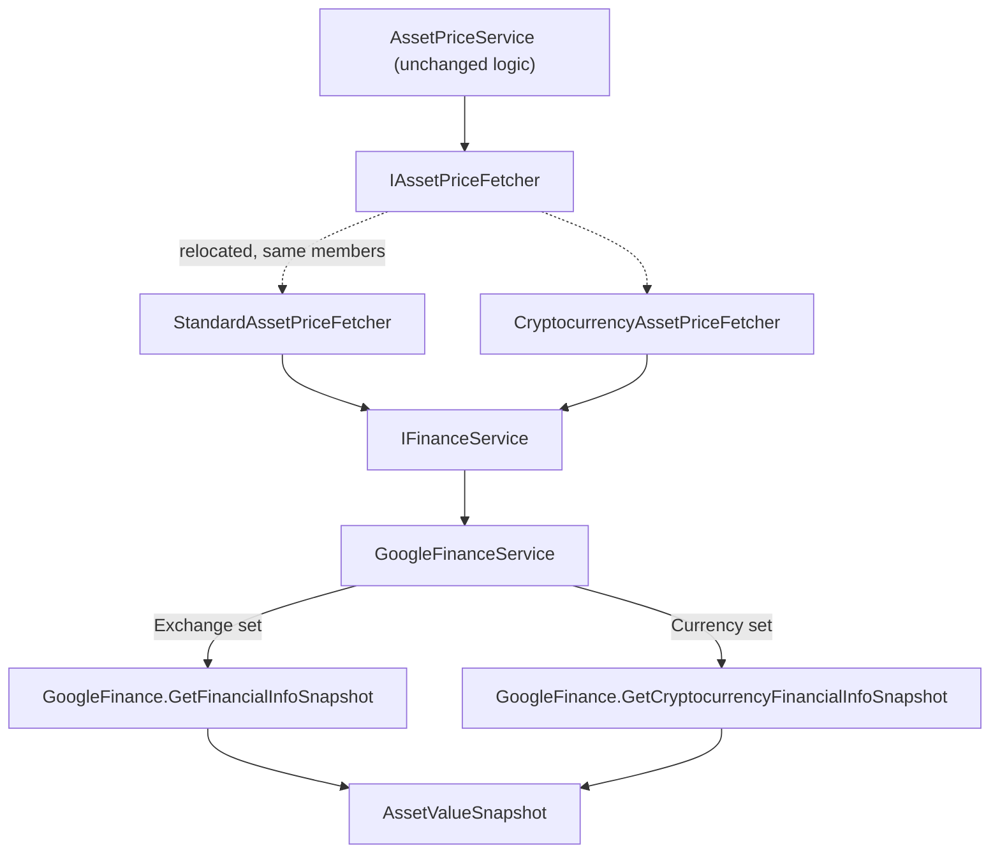

## Technical Overview

**What:** Introduce `IFinanceService` (`Financial.Infrastructure/Interfaces/`), the common contract every website-based price source implements, plus its first implementation `GoogleFinanceService`, which wraps today's static `GoogleFinance` scraper with zero change to its URL-building, HTML parsing, or selectors. As part of the same cleanup, relocate the existing `IAssetPriceFetcher` strategy interface from `Financial.Application/Interfaces/` to `Financial.Infrastructure/Interfaces/`, and update `StandardAssetPriceFetcher`/`CryptocurrencyAssetPriceFetcher` to depend on `IFinanceService` instead of calling the static `GoogleFinance` class directly.

**Why:** The PRD's stated goal is a shared, testable contract for website-scraping sources so F02 (Tesouro Direto) and F03 (Status Invest) have something consistent to implement, and F04 (the Bond fetcher) has something consistent to consume. While placing that contract, an audit of every interface in the codebase (all 15, cross-checked against Presentation and Application usages) showed `IAssetPriceFetcher` is — like the new `IFinanceService` — referenced exclusively within `Financial.Infrastructure` (its two fetchers, `AssetPriceService`, and the DI composition root); Application and Presentation never touch it. That's unlike genuinely cross-layer interfaces such as `IAssetPriceService`, `IRepository`, or `IDividendDataSource`, which Presentation or an Application-layer service actually consumes. Keeping `IAssetPriceFetcher` in `Application/Interfaces` alongside those would blur a distinction this PRD's next two features (F02, F03 implementing `IFinanceService`; F04 implementing `IAssetPriceFetcher`) depend on being clear about. This feature corrects both interfaces' placement in one pass, since F01 already touches every one of `IAssetPriceFetcher`'s implementations and consumers.

**Scope:**
- **Included:** `IFinanceService` interface and its `FinanceQuoteRequest` parameter type; `GoogleFinanceService` implementing `IFinanceService` by delegating to the existing static `GoogleFinance.GetFinancialInfoSnapshot`/`GetCryptocurrencyFinancialInfoSnapshot`; relocating `IAssetPriceFetcher.cs` to `Financial.Infrastructure/Interfaces/` (namespace change only, no member changes); updating `StandardAssetPriceFetcher` and `CryptocurrencyAssetPriceFetcher` to take `IFinanceService` as a constructor dependency instead of referencing the static `GoogleFinance` class; the accompanying DI registration and `using` directive updates; updating the existing test files whose constructor calls or `using` directives are affected by the two changes above.
- **Excluded** (deferred to later features in this PRD, per PRD Section 8): `TesouroDiretoFinanceService` (F02) and `StatusInvestFinanceService` (F03); `BondAssetPriceFetcher` and the `AssetPriceRequestDTO.Name` field addition (F04); any change to `GoogleFinance.cs`'s own scraping/selector logic, which is wrapped, not modified; any change to `IAssetPriceService`, `AssetPriceService`'s public dispatch behavior, or any API/DTO/UI contract.
- **Consumes:** none — F01 has no PRD `Consumes` block and is Wave 1 (no dependencies).
- **Provides (per PRD):** none listed under F01's PRD block — F01 is a Foundation feature; F02 and F03 depend on it structurally (as an implemented contract), not through a PRD `Consumes` data relationship.

## Architecture Impact

**Affected components:**
- `Financial.Infrastructure/Interfaces/IFinanceService.cs` — Infrastructure layer, new strategy contract
- `Financial.Infrastructure/Interfaces/FinanceQuoteRequest.cs` — Infrastructure layer, new request type
- `Financial.Infrastructure/Interfaces/IAssetPriceFetcher.cs` — Infrastructure layer, relocated from `Financial.Application/Interfaces/` (namespace change only)
- `Financial.Infrastructure/Services/GoogleFinanceService.cs` — Infrastructure layer, new `IFinanceService` implementation
- `Financial.Infrastructure/Services/StandardAssetPriceFetcher.cs` — modified, now depends on `IFinanceService`
- `Financial.Infrastructure/Services/CryptocurrencyAssetPriceFetcher.cs` — modified, now depends on `IFinanceService` in addition to `IRepository`
- `Financial.Infrastructure/Services/AssetPriceService.cs` — modified, `using` directive only (its own logic and constructor are untouched)
- `Financial.Infrastructure/DependencyInjection/InfrastructureServiceCollectionExtensions.cs` — modified, new registration plus `using` update
- `Integrations/WebPageParser/GoogleFinance.cs` — consumed unchanged (no modification)
- `Tests/Financial.Infrastructure.Tests/Services/StandardAssetPriceFetcherTests.cs`, `CryptocurrencyAssetPriceFetcherTests.cs`, `AssetPriceServiceTests.cs` — modified for the new constructor shape and relocated `using`
- `Tests/Financial.Infrastructure.Tests/Services/GoogleFinanceServiceTests.cs` — new

## Technical Decisions

| Decision | Chosen Approach | Alternative Considered | Trade-off |
|----------|-----------------|------------------------|-----------|
| `IAssetPriceFetcher`/`IFinanceService` layer placement | Both live in `Financial.Infrastructure/Interfaces/`, breaking the codebase's blanket "every interface lives in Application" convention as a deliberate, audited exception | Keep both in `Financial.Application/Interfaces/`, matching every other interface in the codebase regardless of who consumes it | Chosen approach makes interface placement reflect actual layer boundaries (only interfaces Presentation or an Application service genuinely depends on stay in Application) instead of a single blanket rule; the trade-off is the codebase now has two rules to remember instead of one, so this decision is recorded here for future interfaces to follow consistently |
| `FinanceQuoteRequest` field shape | All four properties (`Ticker`, `Exchange`, `Currency`, `Name`) are optional; each concrete `IFinanceService` validates only the fields it needs | `Ticker` required, others optional | Keeps title-keyed sources (F02, F03, added in later features) from having to fabricate an empty `Ticker`; preserves this codebase's existing pattern of validation ownership living in the concrete fetcher/service, not the shared request shape |
| `GoogleFinanceService.GetQuote` branch selection | Checks `Exchange` first (stock-quote path), then `Currency` (crypto path); throws `ArgumentException` if neither is populated | Silently default to the stock-quote path when both are blank | Fails loud on a caller bug (a fetcher forgetting to populate its half of the request) instead of silently routing to the wrong scrape target with a blank identifier |
| Test doubles for `IFinanceService` | Hand-rolled private nested fake class per test file, mirroring the existing `FakeFetcher`/`StubRepository` pattern already used in `AssetPriceServiceTests.cs` | A shared test-helpers file, or introducing a mocking library | Matches this codebase's existing convention (no mocking library is referenced anywhere in actual test code) and its existing per-file nested fake/stub style; a few lines of duplication across three test files is traded for zero new shared test infrastructure |

## Component Overview

**Backend (Infrastructure only — no Domain, Application, or Presentation changes):**

| File Path | New/Modified | Purpose | Key Responsibilities |
|-----------|--------------|---------|----------------------|
| `Financial.Infrastructure/Interfaces/IFinanceService.cs` | New | Strategy contract for website-based quote sources | Declares `AssetValueSnapshot GetQuote(FinanceQuoteRequest request)` |
| `Financial.Infrastructure/Interfaces/FinanceQuoteRequest.cs` | New | Request shape for `IFinanceService.GetQuote` | Optional `Ticker`, `Exchange`, `Currency`, `Name` properties; each service reads only what it needs |
| `Financial.Infrastructure/Interfaces/IAssetPriceFetcher.cs` | Moved (from `Financial.Application/Interfaces/`) | Strategy contract for asset-class-specific price-fetch | Same two members as today (`Supports`, `GetSnapshot`); only the namespace changes, from `Financial.Application.Interfaces` to `Financial.Infrastructure.Interfaces` |
| `Financial.Infrastructure/Services/GoogleFinanceService.cs` | New | `IFinanceService` implementation wrapping Google Finance | `GetQuote` calls `GoogleFinance.GetFinancialInfoSnapshot(exchange, ticker)` when `Exchange` is populated, `GoogleFinance.GetCryptocurrencyFinancialInfoSnapshot(currency, ticker)` when `Currency` is populated, and throws `ArgumentException` when neither is set |
| `Financial.Infrastructure/Services/StandardAssetPriceFetcher.cs` | Modified | Default/fallback fetch strategy | Constructor now takes `IFinanceService`; `GetSnapshot` keeps its existing `Exchange` blank-check unchanged, then calls `_financeService.GetQuote(new FinanceQuoteRequest { Exchange = request.Exchange, Ticker = request.Ticker })` instead of calling `GoogleFinance` directly |
| `Financial.Infrastructure/Services/CryptocurrencyAssetPriceFetcher.cs` | Modified | Cryptocurrency fetch strategy | Constructor now takes `IFinanceService` in addition to the existing `IRepository`; `GetSnapshot` keeps its existing `BrokerName` validation and `ResolveBrokerCurrency` call unchanged, then calls `_financeService.GetQuote(new FinanceQuoteRequest { Currency = currency, Ticker = request.Ticker })` instead of calling `GoogleFinance` directly |
| `Financial.Infrastructure/Services/AssetPriceService.cs` | Modified | Fetcher dispatcher | No logic change; only its `using Financial.Application.Interfaces;` reference to `IAssetPriceFetcher` is updated to the new `Financial.Infrastructure.Interfaces` namespace |
| `Financial.Infrastructure/DependencyInjection/InfrastructureServiceCollectionExtensions.cs` | Modified | DI composition root | Adds `services.AddSingleton<IFinanceService, GoogleFinanceService>();`; updates the `using` for `IAssetPriceFetcher`'s new namespace; existing `IAssetPriceFetcher` registrations (`StandardAssetPriceFetcher`, `CryptocurrencyAssetPriceFetcher`) are otherwise unchanged |
| `Tests/Financial.Infrastructure.Tests/Services/GoogleFinanceServiceTests.cs` | New | Unit tests | Covers `GetQuote`'s validation branch (neither `Exchange` nor `Currency` populated) |
| `Tests/Financial.Infrastructure.Tests/Services/StandardAssetPriceFetcherTests.cs` | Modified | Unit tests | Constructor calls updated to pass a fake `IFinanceService`; existing `Supports`/`GetSnapshot` assertions unchanged |
| `Tests/Financial.Infrastructure.Tests/Services/CryptocurrencyAssetPriceFetcherTests.cs` | Modified | Unit tests | Constructor calls updated to pass a fake `IFinanceService` alongside the existing `StubRepository`; existing assertions unchanged |
| `Tests/Financial.Infrastructure.Tests/Services/AssetPriceServiceTests.cs` | Modified | Unit tests | The two tests that construct real `StandardAssetPriceFetcher`/`CryptocurrencyAssetPriceFetcher` instances updated to pass a fake `IFinanceService`; assertions unchanged since both tests only exercise validation paths that throw before `GetQuote` would be reached |

No Domain, Application, or Presentation-layer files are touched — `AssetPriceRequestDTO`, `AssetValueSnapshot` (a Domain value object), `IAssetPriceService`, and every Presentation call site are unmodified by this feature.

## Testing Strategy

**Test File Structure:**

| Test File | Test Type | Target | Coverage Goal |
|-----------|-----------|--------|----------------|
| `Tests/Financial.Infrastructure.Tests/Services/GoogleFinanceServiceTests.cs` | Unit | `GoogleFinanceService` | Validation branch when neither `Exchange` nor `Currency` is set |
| `Tests/Financial.Infrastructure.Tests/Services/StandardAssetPriceFetcherTests.cs` | Unit | `StandardAssetPriceFetcher` | Existing `Supports`/`GetSnapshot` coverage, now constructed with a fake `IFinanceService` |
| `Tests/Financial.Infrastructure.Tests/Services/CryptocurrencyAssetPriceFetcherTests.cs` | Unit | `CryptocurrencyAssetPriceFetcher` | Existing coverage, now constructed with a fake `IFinanceService` |
| `Tests/Financial.Infrastructure.Tests/Services/AssetPriceServiceTests.cs` | Unit | `AssetPriceService` dispatch (including the two "reaches real fetcher" tests) | Existing coverage, real fetchers now constructed with a fake `IFinanceService` |

**Test functions:**

| Test Function | Description | Assertions |
|----------------|--------------|------------|
| `GetQuote_NeitherExchangeNorCurrencyProvided_ThrowsArgumentException` | Calls `GoogleFinanceService.GetQuote` with a request whose `Exchange` and `Currency` are both null/blank | Throws `ArgumentException` |
| *(existing, updated construction only)* `Supports_*`, `GetSnapshot_BlankExchange_ThrowsArgumentException` | `StandardAssetPriceFetcherTests` — unchanged assertions | Unchanged from today |
| *(existing, updated construction only)* `Supports_*`, `GetSnapshot_BlankBrokerName_*`, `GetSnapshot_UnknownBroker_*`, `ResolveBrokerCurrency_*` | `CryptocurrencyAssetPriceFetcherTests` — unchanged assertions | Unchanged from today |
| *(existing, updated construction only)* `GetCurrentPrice_CryptocurrencyRequest_ReachesRealCryptocurrencyAssetPriceFetcher`, `GetCurrentPrice_NonCryptocurrencyRequest_ReachesRealStandardAssetPriceFetcher` | `AssetPriceServiceTests` — both already assert on a validation exception thrown before `GetQuote` would be reached, so a fake `IFinanceService` that is never actually invoked is sufficient | Unchanged from today |

**What stays untested (documented, not a gap):** `GoogleFinanceService.GetQuote`'s two successful branches (the live `GoogleFinance.GetFinancialInfoSnapshot`/`GetCryptocurrencyFinancialInfoSnapshot` calls) have no unit seam to intercept — the same limitation already documented for this exact code path in `docs/P08-F01-asset-snapshot-fetcher-contract-standard-fetcher/spec.md`. Verified by code review that each branch is a direct, unmodified pass-through of `(exchange, ticker)` or `(currency, ticker)`. The DI registration line itself is also not unit-tested, consistent with this codebase's existing convention.

**Acceptance criteria traceability (PRD Section 9, F01):**
- "`IFinanceService` exists in `Financial.Infrastructure/Interfaces/` with a `GetQuote(FinanceQuoteRequest)` member returning `AssetValueSnapshot`" → verified structurally: `GoogleFinanceService` fails to compile unless it implements this member, and the file lives at the stated path
- "`IAssetPriceFetcher` is relocated to `Financial.Infrastructure/Interfaces/`, with no change to its members" → verified structurally: the file's namespace changes from `Financial.Application.Interfaces` to `Financial.Infrastructure.Interfaces` with its `Supports`/`GetSnapshot` members untouched; verified by code review that `StandardAssetPriceFetcher`, `CryptocurrencyAssetPriceFetcher`, `AssetPriceService`, and the DI registration all compile against the new namespace
- "`FinanceQuoteRequest` carries `Ticker`, `Exchange`, `Currency`, and `Name` fields" → verified structurally, all four present as optional properties
- "`GoogleFinanceService.GetQuote` calls `GoogleFinance.GetFinancialInfoSnapshot(exchange, ticker)` when `Exchange` is populated, and `GoogleFinance.GetCryptocurrencyFinancialInfoSnapshot(currency, ticker)` when `Currency` is populated" → not unit-tested (live network call, see "What stays untested" above); verified by code review
- "`StandardAssetPriceFetcher` and `CryptocurrencyAssetPriceFetcher` no longer reference the static `GoogleFinance` class directly; both depend on `GoogleFinanceService` via `IFinanceService`" → verified by code review of both files' `using` directives and constructors
- "Every existing `StandardAssetPriceFetcherTests` and `CryptocurrencyAssetPriceFetcherTests` scenario (other than the Bond-dispatch test flipped by F04) still passes with unchanged expected outcomes" → all existing test functions retained with only their construction updated
- "`GoogleFinanceService` is registered in DI as a singleton" → verified by code review of `InfrastructureServiceCollectionExtensions`, consistent with this codebase's existing convention of not testing DI composition roots

**Cross-Feature Integration (PRD Section 9):** F01 has no PRD `Consumes` block, so it generates no Cross-Feature Integration criteria of its own. F01 is the provider `IFinanceService` contract that F02 and F03 (Wave 2) implement; their own specs cover the integration criteria that reference this feature.
