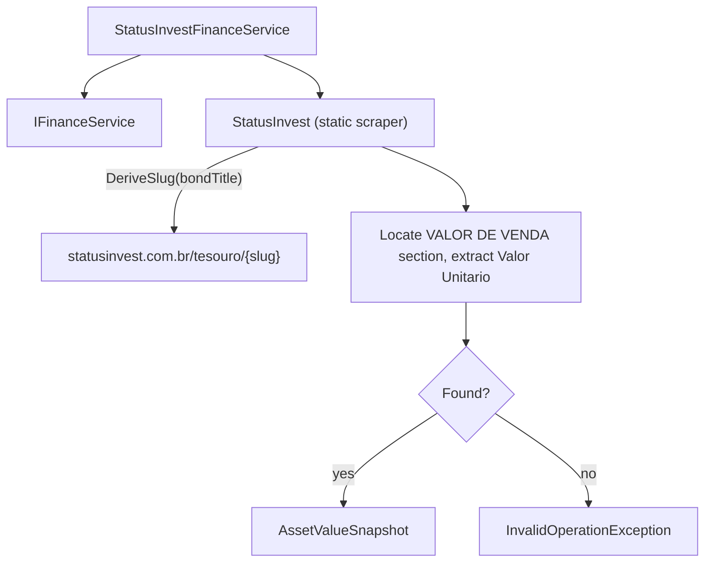

## Technical Overview

**What:** Introduce `StatusInvestFinanceService` (`Financial.Infrastructure/Services/`), implementing `IFinanceService`, backed by a new static scraper `StatusInvest` (`Integrations/WebPageParser/StatusInvest.cs`) that derives a URL slug from a bond's title, fetches its statusinvest.com.br page, and extracts the "Valor de Venda" (sell price) — the value that matches the official Treasury mark-to-market price.

**Why:** With Tesouro Direto's own site ruled out (Cloudflare JavaScript challenge, confirmed while implementing the now-cancelled original F02 — see PRD Section 2), Status Invest is this PRD's sole bond price source. This feature makes that source real, using the same `IFinanceService` contract and per-source-static-class pattern F01 established for Google Finance.

**Scope:**
- **Included:** `StatusInvest` static scraper (slug derivation, HTML fetch, sell-price extraction); `StatusInvestFinanceService` implementing `IFinanceService`; DI registration by concrete type; a manual, network-requiring verification test class mirroring `GoogleFinanceVerificationTests`.
- **Excluded** (deferred to F03 per PRD Section 8): `BondAssetPriceFetcher`, the `AssetPriceRequestDTO.Name` field addition, and wiring this service into asset-class dispatch — nothing calls `StatusInvestFinanceService` until F03.
- **Consumes:** none — F02's only PRD dependency is F01 (the `IFinanceService` contract it implements), an infrastructure dependency, not a PRD `Consumes` data relationship.
- **Provides (per PRD):** current unit value ("Valor Unitário", sell price) and as-of date for a bond matched by derived slug (used by F03, not yet built).

**Research performed while writing this spec:** the live site was fetched three times (three different bond titles: "Tesouro Selic 2029", "Tesouro IPCA+ 2029", "Tesouro IPCA+ com Juros Semestrais 2035") to confirm both the slug-derivation rule and the page's price structure. All three resolved successfully with no anti-bot blocking (unlike tesourodireto.com.br). The sell prices found (R$19.379,93 and R$3.775,97 respectively) exactly matched the official government CSV's "PU Base Manhã" mark-to-market column researched during the cancelled Tesouro Direto work — strong independent confirmation that "Valor de Venda" is the semantically correct value for "current value."

## Architecture Impact

**Affected components:**
- `Integrations/WebPageParser/StatusInvest.cs` — Infrastructure/Integrations layer, new scraper
- `Financial.Infrastructure/Services/StatusInvestFinanceService.cs` — Infrastructure layer, new `IFinanceService` implementation
- `Financial.Infrastructure/DependencyInjection/InfrastructureServiceCollectionExtensions.cs` — modified, new registration
- `Tests/Financial.Infrastructure.Tests/Integrations/StatusInvestTests.cs` — new, pure parsing unit tests (no network)
- `Tests/Financial.Infrastructure.Tests/Services/StatusInvestFinanceServiceTests.cs` — new
- `Tests/Financial.Infrastructure.Tests/Integrations/StatusInvestVerificationTests.cs` — new, manual/skipped, requires internet

## Technical Decisions

| Decision | Chosen Approach | Alternative Considered | Trade-off |
|----------|-----------------|------------------------|-----------|
| Sell vs. buy price | Extracts the "Valor de Venda" (sell) price, confirmed by research to appear in a "VALOR DE VENDA" section before a "VALOR DE COMPRA" section on the page | Extract "Valor de Compra" (buy price), or whichever "Valor Unitário" occurs first without disambiguating | The sell price is what a holder would receive redeeming the bond today — the correct semantic for portfolio valuation — and was independently confirmed to exactly match the official government CSV's mark-to-market column for two different bonds during research |
| Extraction strategy | Works over the page's flattened inner text (`HtmlNode.InnerText`) rather than CSS/XPath selectors: locates the "venda" section by finding "venda" before the next "compra" occurrence, then finds "Valor Unit" within that span, then regex-matches the following `R$ X.XXX,XX` pattern | CSS-class/XPath-based selectors, matching `GoogleFinance`'s primary strategy | The live page's actual CSS classes/IDs are not visible through the tooling available while writing this spec (only rendered text was confirmed, three times, against three different bonds) — text-anchored extraction is resilient to not knowing the real markup, at the cost of being more sensitive to wording changes than a class-based selector would be. This mirrors `GoogleFinance`'s own regex-pattern fallback strategy, just promoted to the primary (only) strategy here since no class name could be confirmed |
| Slug derivation | Lowercase the title, strip accents (Unicode normalization), remove every character except letters/digits/spaces/hyphens, collapse whitespace, then join with hyphens | A lookup table mapping each of the 6 known bond types to a fixed slug prefix | The generic rule was verified correct against three real bond titles during research (including one with `+` and one with "com Juros Semestrais"), so a lookup table would add maintenance for no accuracy gain; the rule is a single isolated method (`StatusInvest.DeriveSlug`) if it ever needs a special case |
| Not-found signaling | `StatusInvest.GetSellValue` throws `InvalidOperationException` when the page can't be loaded, or when no "Valor de Venda" price can be extracted — matching `GoogleFinance`'s existing "structure may have changed" convention. No special not-found exception type is introduced (unlike the cancelled Tesouro Direto attempt), since there is no second bond source to fall back to — per the PRD, a bond Status Invest can't resolve should fail the same way any other unresolvable asset does | Introduce a dedicated not-found exception type for consistency with a possible future second source | The PRD explicitly states this feature needs no fallback signal; adding one preemptively for a hypothetical future source would be speculative, against this project's anti-over-engineering guidance |
| DI registration | `StatusInvestFinanceService` is registered in DI by its own concrete type (`services.AddSingleton<StatusInvestFinanceService>();`), not as `IFinanceService` | Register it as `IFinanceService` alongside `GoogleFinanceService` | `GoogleFinanceService` is the only thing that should ever be resolved when a constructor asks for a single `IFinanceService` (as `StandardAssetPriceFetcher`/`CryptocurrencyAssetPriceFetcher` do); registering a second `IFinanceService` implementation would make that resolution ambiguous. `StatusInvestFinanceService` still implements `IFinanceService` for shape/testability consistency — it's resolved by concrete type when F03 injects it directly |
| Bond name in the snapshot | `AssetValueSnapshot`'s `Ticker` and `Name` are both set to the requested `bondTitle` (the input), not a name scraped from the page | Also scrape the page's own displayed bond title for `Name` | The page's title text wasn't confirmed against a stable selector during research; reusing the input avoids guessing at another unconfirmed selector for a purely cosmetic value — price correctness is what matters for this personal app |

## Component Overview

**Backend (Infrastructure only — no Domain, Application, or Presentation changes):**

| File Path | New/Modified | Purpose | Key Responsibilities |
|-----------|--------------|---------|----------------------|
| `Integrations/WebPageParser/StatusInvest.cs` | New | Static scraper for Status Invest bond pages | `GetSellValue(string bondTitle)` derives the slug (`DeriveSlug`), loads `https://statusinvest.com.br/tesouro/{slug}` via `HtmlWeb`, extracts the sell-section price (`ExtractSellPrice`, operating on `HtmlNode.InnerText`), and returns an `AssetValueSnapshot`; throws `InvalidOperationException` if the page can't load or the price can't be found. `DeriveSlug` and `ExtractSellPrice` are `internal static` and unit-testable without a network call |
| `Financial.Infrastructure/Services/StatusInvestFinanceService.cs` | New | `IFinanceService` implementation | `GetAssetValue(AssetValueRequest request)` validates `Name` is non-blank (`ArgumentException` otherwise), calls `StatusInvest.GetSellValue(request.Name)`, and returns its result directly |
| `Financial.Infrastructure/DependencyInjection/InfrastructureServiceCollectionExtensions.cs` | Modified | DI composition root | Adds `services.AddSingleton<StatusInvestFinanceService>();` (registered by concrete type, not `IFinanceService` — see Technical Decisions) |
| `Tests/Financial.Infrastructure.Tests/Integrations/StatusInvestTests.cs` | New | Unit tests | Covers `DeriveSlug` against the three researched real-world titles, and `ExtractSellPrice` against hand-built in-memory page text mimicking the confirmed VENDA/COMPRA section order |
| `Tests/Financial.Infrastructure.Tests/Services/StatusInvestFinanceServiceTests.cs` | New | Unit tests | Covers `GetAssetValue`'s blank-`Name` validation, using a substitutable lookup seam (see Testing Strategy) |
| `Tests/Financial.Infrastructure.Tests/Integrations/StatusInvestVerificationTests.cs` | New | Manual verification tests | `[Fact(Skip = "...")]` tests calling `StatusInvest.GetSellValue` against real bond titles, mirroring `GoogleFinanceVerificationTests`; should be run unskipped on a machine with normal internet access to reconfirm the live page structure if a downstream consumer (F03) ever reports unexpected failures |

No Domain, Application, or Presentation-layer files are touched — this feature adds a service nothing consumes yet.

## Testing Strategy

**Test File Structure:**

| Test File | Test Type | Target | Coverage Goal |
|-----------|-----------|--------|----------------|
| `Tests/Financial.Infrastructure.Tests/Integrations/StatusInvestTests.cs` | Unit | `StatusInvest.DeriveSlug`, `StatusInvest.ExtractSellPrice` | Slug derivation and price extraction, no network |
| `Tests/Financial.Infrastructure.Tests/Services/StatusInvestFinanceServiceTests.cs` | Unit | `StatusInvestFinanceService` | Validation |
| `Tests/Financial.Infrastructure.Tests/Integrations/StatusInvestVerificationTests.cs` | Manual (skipped in CI) | `StatusInvest.GetSellValue` | Confirms the live page's structure when run manually |

**Test functions:**

| Test Function | Description | Assertions |
|----------------|--------------|------------|
| `DeriveSlug_Selic_ReturnsExpectedSlug` | `"TESOURO SELIC 2029"` | Returns `"tesouro-selic-2029"` (verified against the real URL during research) |
| `DeriveSlug_WithPlusSign_ReturnsExpectedSlug` | `"TESOURO IPCA+ 2029"` | Returns `"tesouro-ipca-2029"` (verified against the real URL during research) |
| `DeriveSlug_WithJurosSemestrais_ReturnsExpectedSlug` | `"TESOURO IPCA+ COM JUROS SEMESTRAIS 2035"` | Returns `"tesouro-ipca-com-juros-semestrais-2035"` (verified against the real URL during research) |
| `ExtractSellPrice_VendaBeforeCompra_ReturnsVendaPrice` | In-memory text with "VALOR DE VENDA ... Valor Unitário R$ 3.775,97 ... VALOR DE COMPRA ... Valor Unitário R$ 3.789,57" | Returns `3775.97m` (the Venda price, not Compra) |
| `ExtractSellPrice_NoVendaSection_ReturnsNull` | Text with no "venda" occurrence | Returns `null` |
| `ExtractSellPrice_NoValorUnitarioInVendaSection_ReturnsNull` | "VALOR DE VENDA" present but no "Valor Unit" text before the next "compra" | Returns `null` |
| `GetAssetValue_BlankName_ThrowsArgumentException` | Calls `GetAssetValue` with a blank `Name` | Throws `ArgumentException` |
| `VerifySelectors_WithKnownBonds` *(manual, skipped)* | Calls `StatusInvest.GetSellValue` against the three researched real bond titles | Returns a positive price for each; failure here means the page structure changed and `StatusInvest`'s extraction logic needs updating |

**Seam for testing `StatusInvestFinanceServiceTests` without network:** `StatusInvest.GetSellValue` wraps a live HTTP call with no unit seam, the same limitation `GoogleFinance`'s and the cancelled Tesouro Direto attempt's static methods have. Since this spec's only `StatusInvestFinanceServiceTests` case (`GetAssetValue_BlankName_ThrowsArgumentException`) never reaches that call — validation throws first — no substitution seam is needed for this feature's test coverage. If F03 needs to substitute this service's result in its own tests, it can do so at the `StatusInvestFinanceService` level via a constructor overload, following the exact pattern `TesouroDiretoFinanceService` used during the cancelled attempt, if that need arises.

**What stays untested (documented, not a gap):** `StatusInvest.GetSellValue`'s live HTTP fetch and its real page structure have no automated unit seam — same limitation already documented for `GoogleFinance`'s and `DadosMercadoDividend`'s live calls. Covered instead by the manual `StatusInvestVerificationTests`, and by the research already performed while writing this spec (three real bonds fetched and confirmed working).

**Acceptance criteria traceability (PRD Section 9, F02):**
- "`StatusInvestFinanceService` derives the correct slug for representative bond titles (e.g., 'TESOURO IPCA+ 2029' → 'tesouro-ipca-2029')" → `DeriveSlug_Selic_ReturnsExpectedSlug`, `DeriveSlug_WithPlusSign_ReturnsExpectedSlug`, `DeriveSlug_WithJurosSemestrais_ReturnsExpectedSlug`
- "`StatusInvestFinanceService.GetAssetValue` returns the page's 'Valor Unitário' value and an as-of date when the derived slug resolves to a valid page" → `ExtractSellPrice_VendaBeforeCompra_ReturnsVendaPrice`; the live success path itself is not unit-tested (see "What stays untested" above), but was manually confirmed during research
- "`StatusInvestFinanceService.GetAssetValue` throws when the derived slug's page 404s or has no 'Valor Unitário' element" → `ExtractSellPrice_NoVendaSection_ReturnsNull`, `ExtractSellPrice_NoValorUnitarioInVendaSection_ReturnsNull` (both feed into `GetSellValue` throwing `InvalidOperationException`, not unit-tested directly for the same live-call reason)
- "`StatusInvestFinanceService` is registered in DI as a singleton" → verified by code review of `InfrastructureServiceCollectionExtensions`, consistent with this codebase's convention of not testing DI composition roots

**Cross-Feature Integration (PRD Section 9):** F02 is a provider consumed by F03 (`BondAssetPriceFetcher`), which does not exist yet at this point in the wave sequence. The Cross-Feature Integration criterion covering "a bond resolved via Status Invest is correctly returned by `BondAssetPriceFetcher`" is validated when F03 is implemented, exactly mirroring the pattern F01's spec used for its own forward-referencing integration criteria.
