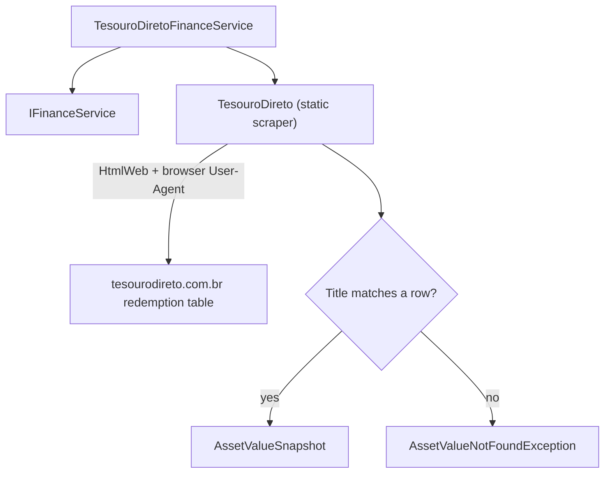

## Technical Overview

**What:** Introduce `TesouroDiretoFinanceService` (`Financial.Infrastructure/Services/`), implementing `IFinanceService`, backed by a new static scraper `TesouroDireto` (`Integrations/WebPageParser/TesouroDireto.cs`) that fetches tesourodireto.com.br's redemption-price table and matches a bond by title. Also introduces `AssetValueNotFoundException`, a shared "expected miss" signal any `IFinanceService` implementation can throw, needed because F01's `IFinanceService.GetAssetValue` contract (non-nullable return, throws on failure) has no existing way to distinguish "not found, try the next source" from a hard failure.

**Why:** F01 shipped `IFinanceService` and `GoogleFinanceService`, but Bond assets still have no real price source — that's this PRD's whole point. The PRD requires Tesouro Direto to be the authoritative source, with Status Invest (F03) as an automatic fallback when Tesouro Direto can't resolve the bond (F04 orchestrates this, not yet built). For that fallback to work, this feature needs a way to say "this bond isn't in the Tesouro Direto table" without that looking like a scrape failure — hence `AssetValueNotFoundException`, introduced here since F02 is the first feature that needs it, and shared so F03 can reuse the exact same signal.

**Scope:**
- **Included:** `TesouroDireto` static scraper (HTML fetch, table location, header-based column resolution, row matching by bond title); `TesouroDiretoFinanceService` implementing `IFinanceService`; `AssetValueNotFoundException`; DI registration of `TesouroDiretoFinanceService` by its concrete type; a manual, network-requiring verification test class mirroring `GoogleFinanceVerificationTests`, since the live page's exact table structure could not be verified from this environment (see Technical Decisions).
- **Excluded** (deferred to later features in this PRD, per PRD Section 8): `StatusInvestFinanceService` (F03); `BondAssetPriceFetcher`, the try-TD-then-SI orchestration, and the `AssetPriceRequestDTO.Name` field addition (F04); any UI/API/DTO contract change (this feature adds an unconsumed service — nothing calls it until F04).
- **Consumes:** none — F02's only PRD dependency is F01 (the `IFinanceService` contract it implements), which is an infrastructure dependency, not a PRD `Consumes` data relationship.
- **Provides (per PRD):** current unit price ("Preço Unit.") and as-of date for a bond matched by title, or a not-found signal when no row matches (used by F04, not yet built).

## Architecture Impact

**Affected components:**
- `Integrations/WebPageParser/TesouroDireto.cs` — Infrastructure/Integrations layer, new scraper
- `Financial.Infrastructure/Services/TesouroDiretoFinanceService.cs` — Infrastructure layer, new `IFinanceService` implementation
- `Financial.Infrastructure/Interfaces/AssetValueNotFoundException.cs` — Infrastructure layer, new shared exception type
- `Financial.Infrastructure/DependencyInjection/InfrastructureServiceCollectionExtensions.cs` — modified, new registration
- `Tests/Financial.Infrastructure.Tests/Integrations/TesouroDiretoTests.cs` — new, pure parsing unit tests (no network)
- `Tests/Financial.Infrastructure.Tests/Services/TesouroDiretoFinanceServiceTests.cs` — new
- `Tests/Financial.Infrastructure.Tests/Integrations/TesouroDiretoVerificationTests.cs` — new, manual/skipped, requires internet

## Technical Decisions

| Decision | Chosen Approach | Alternative Considered | Trade-off |
|----------|-----------------|------------------------|-----------|
| Live site verification | tesourodireto.com.br returned HTTP 403 to two independent fetch attempts made while writing this spec (both from a sandboxed research environment with restricted outbound network to that host); statusinvest.com.br fetched cleanly by contrast. The exact table markup, column order, and whether "Resgatar" is a CSS-only tab toggle or a separate data fetch could not be confirmed. The scraper is written defensively (header-text column resolution, not fixed indices) and ships with a `[Fact(Skip = "...")]` manual verification test — mirroring `GoogleFinanceVerificationTests`' existing convention — that must be run (unskipped) against the live site on a machine with normal internet access before this feature is considered production-ready | Block the spec until the live page is manually inspected first | Chosen approach keeps the feature moving using the same "verify before relying on it in production" convention this codebase already has for Google Finance, rather than stalling on an environment-specific network restriction |
| Anti-bot mitigation | `TesouroDireto`'s `HtmlWeb` request sets a realistic browser `User-Agent` via `PreRequest`, unlike `GoogleFinance`/`DadosMercadoDividend`, which use `HtmlWeb`'s default | No special handling, matching the other two scrapers exactly | Addresses the observed 403 if it's User-Agent-based bot filtering; if the site instead requires a JS challenge (Cloudflare Turnstile or similar), no plain HTML fetch — with or without a User-Agent — will work, and that would need to surface as a follow-up finding once verified live, not something this spec can resolve blind |
| Column resolution | Locate "Título" and "Preço Unit." columns by matching header-row cell text (case-insensitive, trimmed), then read body rows by the resolved index — not hardcoded column-index constants | Fixed column-index constants, matching `DadosMercadoDividend`'s pattern exactly | Since the real column order is unverified, header-text matching is resilient to the table having a different column order than assumed; `DadosMercadoDividend`'s fixed-index approach is only safe there because its structure is already confirmed working in production |
| Not-found signaling | New `AssetValueNotFoundException` (`Financial.Infrastructure/Interfaces/`), thrown when no row's title matches `request.Name`; any other failure (network error, missing table, header columns not found) throws `InvalidOperationException`, matching `GoogleFinance`'s existing "structure may have changed" convention | Return a nullable `AssetValueSnapshot?` from `IFinanceService.GetAssetValue`, changing the interface F01 already shipped | Avoids reopening F01's interface and its already-shipped consumers/tests (`GoogleFinanceService`, `StandardAssetPriceFetcher`, `CryptocurrencyAssetPriceFetcher`); F04 (not yet built) catches specifically `AssetValueNotFoundException` to trigger its Status Invest fallback, while any other exception propagates as a genuine failure |
| DI registration | `TesouroDiretoFinanceService` is registered in DI by its own concrete type (`services.AddSingleton<TesouroDiretoFinanceService>();`), not as `IFinanceService` | Register it as `IFinanceService` alongside `GoogleFinanceService` | `GoogleFinanceService` is the only thing that should ever be resolved when a constructor asks for a single `IFinanceService` (as `StandardAssetPriceFetcher`/`CryptocurrencyAssetPriceFetcher` do); registering a second `IFinanceService` implementation would make that resolution ambiguous (last-registered wins silently). `TesouroDiretoFinanceService` still implements `IFinanceService` for shape/testability consistency — it's just resolved by concrete type when F04 injects it directly |
| Bond title matching | Exact, case-insensitive comparison against `request.Name`, ignoring leading/trailing whitespace (per PRD) | Fuzzy/normalized matching (strip accents, punctuation) | Matches the PRD's explicit decision; if the live table's title formatting turns out to need normalization once verified, that's a follow-up refinement to `TesouroDireto`'s row-matching helper, isolated to one method |

## Component Overview

**Backend (Infrastructure only — no Domain, Application, or Presentation changes):**

| File Path | New/Modified | Purpose | Key Responsibilities |
|-----------|--------------|---------|----------------------|
| `Integrations/WebPageParser/TesouroDireto.cs` | New | Static scraper for the Tesouro Direto redemption table | `GetRedemptionValue(string bondTitle)` loads the page via `HtmlWeb` (browser `User-Agent` set via `PreRequest`), locates the redemption table, resolves the "Título" and "Preço Unit." column indices from the header row, and returns the matching row's price/date, or `null` if no row matches; a separate `internal static` row-matching helper (`FindMatchingRow`) is unit-testable against an in-memory `HtmlDocument` without a network call, mirroring `DadosMercadoDividend.ParseDividendRow`'s testable-without-network seam |
| `Financial.Infrastructure/Services/TesouroDiretoFinanceService.cs` | New | `IFinanceService` implementation | `GetAssetValue(AssetValueRequest request)` validates `Name` is non-blank (`ArgumentException` otherwise), calls `TesouroDireto.GetRedemptionValue(request.Name)`, and either returns the resulting `AssetValueSnapshot` or throws `AssetValueNotFoundException` when the scraper returns no match |
| `Financial.Infrastructure/Interfaces/AssetValueNotFoundException.cs` | New | Shared "expected miss" signal | A plain `Exception` subclass with a message constructor; thrown by any `IFinanceService` implementation (starting with this one) to mean "this source doesn't have the value, try another," as opposed to any other exception meaning a genuine failure |
| `Financial.Infrastructure/DependencyInjection/InfrastructureServiceCollectionExtensions.cs` | Modified | DI composition root | Adds `services.AddSingleton<TesouroDiretoFinanceService>();` (registered by concrete type, not `IFinanceService` — see Technical Decisions) |
| `Tests/Financial.Infrastructure.Tests/Integrations/TesouroDiretoTests.cs` | New | Unit tests | Covers `FindMatchingRow` against hand-built in-memory HTML: exact match, case-insensitive match, whitespace-tolerant match, no match |
| `Tests/Financial.Infrastructure.Tests/Services/TesouroDiretoFinanceServiceTests.cs` | New | Unit tests | Covers `GetAssetValue`'s blank-`Name` validation and its not-found-to-exception translation, using a seam that lets the scraper's result be substituted in tests (see Testing Strategy) |
| `Tests/Financial.Infrastructure.Tests/Integrations/TesouroDiretoVerificationTests.cs` | New | Manual verification tests | `[Fact(Skip = "Manual verification test - requires internet connection")]` tests that call `TesouroDireto.GetRedemptionValue` against real bond titles, mirroring `GoogleFinanceVerificationTests`; must be run unskipped on a machine with normal internet access to confirm the live table structure before this feature ships |

No Domain, Application, or Presentation-layer files are touched — this feature adds a service nothing consumes yet.

## Testing Strategy

**Test File Structure:**

| Test File | Test Type | Target | Coverage Goal |
|-----------|-----------|--------|----------------|
| `Tests/Financial.Infrastructure.Tests/Integrations/TesouroDiretoTests.cs` | Unit | `TesouroDireto.FindMatchingRow` | Row-matching logic against in-memory HTML, no network |
| `Tests/Financial.Infrastructure.Tests/Services/TesouroDiretoFinanceServiceTests.cs` | Unit | `TesouroDiretoFinanceService` | Validation and not-found-to-exception translation |
| `Tests/Financial.Infrastructure.Tests/Integrations/TesouroDiretoVerificationTests.cs` | Manual (skipped in CI) | `TesouroDireto.GetRedemptionValue` | Confirms the live page's structure once run manually with internet access |

**Test functions:**

| Test Function | Description | Assertions |
|----------------|--------------|------------|
| `FindMatchingRow_ExactTitleMatch_ReturnsRow` | Builds an in-memory table with a row titled "TESOURO IPCA+ 2029" and looks up the same title | Returns the matching row |
| `FindMatchingRow_CaseInsensitiveMatch_ReturnsRow` | Looks up `"tesouro ipca+ 2029"` against a row titled `"TESOURO IPCA+ 2029"` | Returns the matching row |
| `FindMatchingRow_WhitespaceDifference_ReturnsRow` | Looks up a title with extra leading/trailing whitespace | Returns the matching row |
| `FindMatchingRow_NoMatch_ReturnsNull` | Looks up a title with no matching row | Returns `null`, no exception |
| `GetAssetValue_BlankName_ThrowsArgumentException` | Calls `GetAssetValue` with a blank `Name` | Throws `ArgumentException` |
| `GetAssetValue_NoMatch_ThrowsAssetValueNotFoundException` | Scraper seam returns no match for the requested title | Throws `AssetValueNotFoundException` |
| `GetAssetValue_Match_ReturnsSnapshot` | Scraper seam returns a match | Returns the corresponding `AssetValueSnapshot` unmodified |
| `VerifySelectors_WithKnownBonds` *(manual, skipped)* | Calls `TesouroDireto.GetRedemptionValue` against real bond titles (e.g., "TESOURO SELIC 2029") with internet access | Returns a positive price and a recent `AsOf`; failure here means the table structure changed and `TesouroDireto`'s column-resolution logic needs updating |

**Seam for testing `TesouroDiretoFinanceServiceTests` without network:** `TesouroDireto.GetRedemptionValue` is a `static` method wrapping a live HTTP call, the same limitation `GoogleFinance`'s static methods have. Rather than duplicating that untestable seam inside `TesouroDiretoFinanceService` too, `TesouroDiretoFinanceService`'s constructor accepts an optional `Func<string, AssetValueSnapshot?>` lookup delegate defaulting to `TesouroDireto.GetRedemptionValue`, so tests can substitute a fake delegate without needing a full interface just for this one static call — a narrower, lower-ceremony seam than introducing a new interface solely for testability, consistent with this codebase's preference for direct static delegation elsewhere (`StandardAssetPriceFetcher` still calls `GoogleFinanceService` via `IFinanceService`, since that seam already existed for DI purposes; this one doesn't need a new interface for a single internal call).

**What stays untested (documented, not a gap):** `TesouroDireto.GetRedemptionValue`'s live HTTP fetch and its real table/column resolution against the actual page have no automated unit seam — same limitation already documented for `GoogleFinance`'s live calls. Covered instead by the manual `TesouroDiretoVerificationTests`, run by hand with internet access.

**Acceptance criteria traceability (PRD Section 9, F02):**
- "`TesouroDiretoFinanceService.GetAssetValue` returns a matching price and as-of date when `request.Name` matches a `Titulo` row case-insensitively (ignoring leading/trailing whitespace)" → `FindMatchingRow_ExactTitleMatch_ReturnsRow`, `FindMatchingRow_CaseInsensitiveMatch_ReturnsRow`, `FindMatchingRow_WhitespaceDifference_ReturnsRow`, `GetAssetValue_Match_ReturnsSnapshot`
- "`TesouroDiretoFinanceService.GetAssetValue` returns a not-found result, not an exception, when no row matches" *(PRD wording predates this spec's `AssetValueNotFoundException` decision — see Technical Decisions)* → `FindMatchingRow_NoMatch_ReturnsNull`, `GetAssetValue_NoMatch_ThrowsAssetValueNotFoundException`; satisfied in substance as "a distinguishable not-found signal F04 can catch," not a literal non-exception return
- "`TesouroDiretoFinanceService` is registered in DI as a singleton" → verified by code review of `InfrastructureServiceCollectionExtensions`, consistent with this codebase's convention of not testing DI composition roots

**Cross-Feature Integration (PRD Section 9):** F02 is a provider consumed by F04 (`BondAssetPriceFetcher`), which does not exist yet at this point in the wave sequence. The Cross-Feature Integration criterion covering "a bond found on Tesouro Direto is correctly returned by `BondAssetPriceFetcher`" is validated when F04 is implemented, exactly mirroring the pattern F01's spec used for its own forward-referencing integration criteria.
