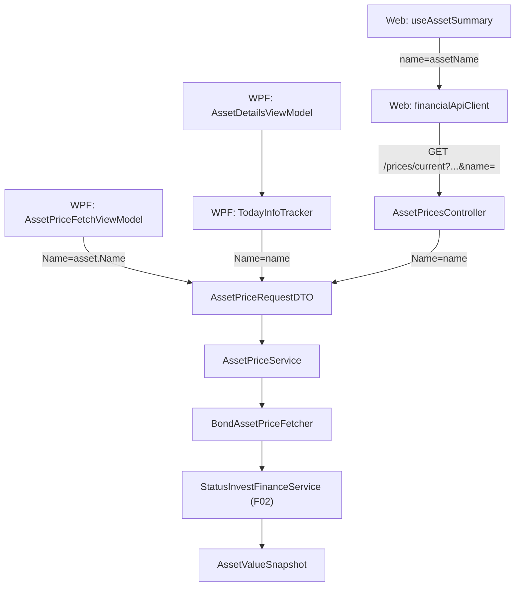

## Technical Overview

**What:** Introduce `BondAssetPriceFetcher` (`Financial.Infrastructure/Services/`), implementing `IAssetPriceFetcher` for `GlobalAssetClass.Bond`, delegating to `StatusInvestFinanceService` (F02). Add a `Name` field to `AssetPriceRequestDTO` and wire it through every call site that constructs one — the API controller, both WPF ViewModels that fetch prices, and the TypeScript Web frontend — so a Bond asset's name actually reaches the new fetcher end-to-end, not just at the Infrastructure layer.

**Why:** F02 built `StatusInvestFinanceService` but nothing calls it yet. The PRD's Capabilities for this feature state "Equity and Cryptocurrency call sites leave [`Name`] unpopulated" — which only holds if Bond call sites populate it, meaning the four places that build an `AssetPriceRequestDTO` today (API controller, `AssetPriceFetchViewModel`, `TodayInfoTracker`/`AssetDetailsViewModel`, and the Web frontend's `financialApiClient`/`useAssetSummary`) all need a `name`/`assetName` value threaded through for the feature to work in the running app, not just in a unit test. This was confirmed during spec research: all four currently construct the DTO/query without any bond-title concept.

**Scope:**
- **Included:** `BondAssetPriceFetcher`; `AssetPriceRequestDTO.Name`; `StandardAssetPriceFetcher.Supports` excluding `Bond`; DI registration; wiring `Name`/`name`/`assetName` through the API controller, `AssetPriceFetchViewModel`, `TodayInfoTracker` (called by `AssetDetailsViewModel`), `financialApiClient.ts`, and `useAssetSummary.ts`.
- **Excluded** (per PRD Section 7): persisting/caching prices; UI indication of which source (Status Invest) supplied a Bond's price; any change to `StatusInvestFinanceService`'s own scraping logic (F02, unmodified).
- **Consumes:** F02 — current unit value and as-of date for a bond matched by derived slug (via `StatusInvestFinanceService.GetAssetValue`).
- **Provides (per PRD):** none — F03 is the final feature in this PRD; its output is consumed directly by end users through the existing `AssetPriceDTO` response shape, not by another feature.

**Research note on existing data:** real Bond assets in `data/data.json` already have `Ticker` and `Exchange` populated (e.g., `Ticker: "TESOURO IPCA+ 2026"`, `Exchange: "BVMF"` — leftover import artifacts, not real values for a bond). This means today's `!isCryptocurrency && string.IsNullOrWhiteSpace(exchange)`-style guards in `AssetPricesController`/`TodayInfoTracker`/`useAssetSummary` don't currently *block* Bond requests (Exchange happens to be non-blank) — they just let Bond requests through to the wrong fetcher (`StandardAssetPriceFetcher` → Google Finance, today's bug). Updating those guards to require `Name` instead of `Exchange` for Bond is still the correct fix (a future bond entry without a stray `Exchange` value shouldn't silently break), but it is a correctness/robustness fix, not something unblocking currently-broken input.

## Architecture Impact

**Affected components:**
- `Financial.Application/DTOs/AssetPriceRequestDTO.cs` — Application layer, modified
- `Financial.Infrastructure/Services/BondAssetPriceFetcher.cs` — Infrastructure layer, new
- `Financial.Infrastructure/Services/StandardAssetPriceFetcher.cs` — Infrastructure layer, modified
- `Financial.Infrastructure/DependencyInjection/InfrastructureServiceCollectionExtensions.cs` — Infrastructure layer, modified
- `Financial.Api/Controllers/AssetPricesController.cs` — Presentation layer, modified
- `Financial.App/ViewModels/AssetPriceFetchViewModel.cs` — Presentation layer, modified
- `Financial.App/ViewModels/TodayInfoTracker.cs` — Presentation layer, modified
- `Financial.App/ViewModels/AssetDetailsViewModel.cs` — Presentation layer, modified (one call site)
- `Financial.Web/src/api/financialApiClient.ts` — Presentation layer (TypeScript), modified
- `Financial.Web/src/hooks/useAssetSummary.ts` — Presentation layer (TypeScript), modified
- Test files: `Tests/Financial.Infrastructure.Tests/Services/{BondAssetPriceFetcherTests.cs (new), StandardAssetPriceFetcherTests.cs (modified)}`, `Tests/Financial.Api.Tests/AssetPriceEndpointsTests.cs` (modified), `Tests/Financial.Presentation.Tests/ViewModels/{AssetPriceFetchViewModelTests.cs (modified), TodayInfoTrackerTests.cs (new)}`, `Financial.Web/src/api/financialApiClient.test.ts` (modified), `Financial.Web/src/hooks/useAssetSummary.test.ts` (modified)

## Technical Decisions

| Decision | Chosen Approach | Alternative Considered | Trade-off |
|----------|-----------------|------------------------|-----------|
| Presentation wiring scope | Wire `Name` through all 4 call sites (API, both WPF ViewModels, Web) so the feature works end-to-end | Ship Infrastructure-only (`BondAssetPriceFetcher` + DTO field) and leave Presentation wiring to a follow-up | Confirmed with the user: an Infrastructure-only cut would leave Bond assets broken in the running app, defeating the PRD's stated goal ("the difference between a real price and a meaningless lookup is the entire point") |
| Validation guard changes | `AssetPricesController`, `TodayInfoTracker`, and `useAssetSummary` are updated so `Bond` requires `Name`/`assetName` instead of `Exchange`, mirroring the existing `Cryptocurrency`-requires-`BrokerName`-not-`Exchange` special case | Leave guards as-is, relying on the fact that today's bond data happens to have `Exchange` populated | Relying on incidental data shape (leftover import artifacts) instead of the actual business rule ("bonds don't have a stock exchange") is fragile; the fix costs one extra branch per call site, symmetric with the existing Cryptocurrency special case |
| `BondAssetPriceFetcher` dependency | Takes `StatusInvestFinanceService` by concrete type (not `IFinanceService`), matching F02's DI registration decision | Take `IFinanceService` and filter by type | `StatusInvestFinanceService` is deliberately registered by concrete type (F02), not as `IFinanceService`, specifically so it's injected directly by fetchers that need it — `BondAssetPriceFetcher` is that consumer |
| `Ticker` field for Bond requests | Continues to be populated (from `asset.Ticker`, which equals `asset.Name` in existing data) at every call site exactly as today, even though `BondAssetPriceFetcher` never reads it | Make `Ticker` optional for Bond requests | `AssetPriceService.GetCurrentPrice`'s existing blank-`Ticker` check applies to every request regardless of asset class; changing that shared validation is out of scope and unnecessary since real bond data already populates `Ticker` |
| `TodayInfoTracker` test coverage | Adds a new `TodayInfoTrackerTests.cs` — this class has no existing tests, and its validation logic is being modified | Skip testing since it's WPF-adjacent | `TodayInfoTracker` is a plain C# class with injectable dependencies (`IAssetPriceService`, callback actions), not a WPF framework control — fully unit-testable, and CLAUDE.md requires tests for new/modified feature logic |

## Component Overview

**Application:**

| File Path | New/Modified | Purpose | Key Responsibilities |
|-----------|--------------|---------|----------------------|
| `Financial.Application/DTOs/AssetPriceRequestDTO.cs` | Modified | Price request shape | Adds `public string? Name { get; set; }`, populated only for Bond requests; `Ticker`/`Exchange`/`AssetClass`/`BrokerName` unchanged |

**Infrastructure:**

| File Path | New/Modified | Purpose | Key Responsibilities |
|-----------|--------------|---------|----------------------|
| `Financial.Infrastructure/Services/BondAssetPriceFetcher.cs` | New | `IAssetPriceFetcher` for Bond | `Supports` returns `true` only for `GlobalAssetClass.Bond`; `GetSnapshot` validates `Name` is non-blank (`ArgumentException` otherwise, matching sibling fetchers' style), builds an `AssetValueRequest { Name = request.Name }`, and returns `StatusInvestFinanceService.GetAssetValue(...)` directly — any failure (including `InvalidOperationException` when Status Invest can't resolve the bond) propagates unmodified, matching the PRD's "fails the same way Standard fails today" requirement |
| `Financial.Infrastructure/Services/StandardAssetPriceFetcher.cs` | Modified | Default/fallback fetch strategy | `Supports` changes from `assetClass != GlobalAssetClass.Cryptocurrency` to `assetClass != GlobalAssetClass.Cryptocurrency && assetClass != GlobalAssetClass.Bond` |
| `Financial.Infrastructure/DependencyInjection/InfrastructureServiceCollectionExtensions.cs` | Modified | DI composition root | Adds `services.AddSingleton<IAssetPriceFetcher, BondAssetPriceFetcher>();` alongside the existing two fetcher registrations |

**Presentation (C#):**

| File Path | New/Modified | Purpose | Key Responsibilities |
|-----------|--------------|---------|----------------------|
| `Financial.Api/Controllers/AssetPricesController.cs` | Modified | `/prices/current` endpoint | Adds `[FromQuery] string? name` parameter; validation becomes: `Cryptocurrency` requires `brokerName`; `Bond` requires `name`; everything else requires `exchange` (unchanged for non-Bond, non-Crypto); builds `AssetPriceRequestDTO` with `Name = name?.Trim()` |
| `Financial.App/ViewModels/AssetPriceFetchViewModel.cs` | Modified | Bulk price refresh | `FetchAsync`'s `AssetPriceRequestDTO` construction adds `Name = asset.Name` (the `asset` — an `AssetNodeDTO` — is already in scope; no new dependency needed) |
| `Financial.App/ViewModels/TodayInfoTracker.cs` | Modified | Single-asset "Current Values" refresh | `RefreshAsync` gains a `string name` parameter; validation becomes `Bond` requires `name` instead of `exchange` (mirroring the existing Cryptocurrency special case); the constructed `AssetPriceRequestDTO` adds `Name = name` |
| `Financial.App/ViewModels/AssetDetailsViewModel.cs` | Modified | Asset details screen | The single call site `_todayInfo.RefreshAsync(...)` passes the already-available `AssetName` property as the new `name` argument |

**Presentation (TypeScript):**

| File Path | New/Modified | Purpose | Key Responsibilities |
|-----------|--------------|---------|----------------------|
| `Financial.Web/src/api/financialApiClient.ts` | Modified | API client | `getCurrentPrice`'s signature gains an optional `name` parameter, appended to the query string as `&name=...` when present, matching the existing `assetClass`/`brokerName` optional-query-param pattern |
| `Financial.Web/src/hooks/useAssetSummary.ts` | Modified | Asset price-fetch hook | `fetchPrice` gains a `name` parameter, passed through to `apiClient.getCurrentPrice`; both call sites (`useEffect` initial fetch and `refresh`) update their guard from "exchange present or Cryptocurrency" to also allow "Bond and `assetName` present", and pass `selectedNode.assetName`/`assetName` through |

No Domain-layer files are touched.

## Testing Strategy

**Test File Structure:**

| Test File | Test Type | Target | Coverage Goal |
|-----------|-----------|--------|----------------|
| `Tests/Financial.Infrastructure.Tests/Services/BondAssetPriceFetcherTests.cs` | Unit | `BondAssetPriceFetcher` | `Supports` matrix, blank-`Name` validation, success/failure delegation |
| `Tests/Financial.Infrastructure.Tests/Services/StandardAssetPriceFetcherTests.cs` | Unit | `StandardAssetPriceFetcher` | Flips the existing `Supports_Bond_ReturnsTrue` test to `Supports_Bond_ReturnsFalse` |
| `Tests/Financial.Api.Tests/AssetPriceEndpointsTests.cs` | Unit (WebApplicationFactory) | `AssetPricesController` | New Bond-with-`name` success case, Bond-without-`name` 400 case |
| `Tests/Financial.Presentation.Tests/ViewModels/AssetPriceFetchViewModelTests.cs` | Unit | `AssetPriceFetchViewModel` | New case asserting `Name` is passed through for a Bond asset |
| `Tests/Financial.Presentation.Tests/ViewModels/TodayInfoTrackerTests.cs` | Unit | `TodayInfoTracker` | New file: Bond-with-name success, Bond-without-name validation message, non-Bond behavior unchanged |
| `Financial.Web/src/api/financialApiClient.test.ts` | Unit | `getCurrentPrice` | New case asserting `&name=` is appended when provided |
| `Financial.Web/src/hooks/useAssetSummary.test.ts` | Unit | `useAssetSummary` | New case: a Bond asset with `assetName` but no `exchange` still fetches a price |

**Test functions:**

| Test Function | Description | Assertions |
|----------------|--------------|------------|
| `Supports_Bond_ReturnsTrue` | `BondAssetPriceFetcher.Supports(Bond)` | Returns `true` |
| `Supports_Equity_ReturnsFalse` | `BondAssetPriceFetcher.Supports(Equity)` | Returns `false` |
| `Supports_Cryptocurrency_ReturnsFalse` | `BondAssetPriceFetcher.Supports(Cryptocurrency)` | Returns `false` |
| `GetSnapshot_BlankName_ThrowsArgumentException` | `GetSnapshot` with blank `Name` | Throws `ArgumentException` |
| `GetSnapshot_ValidName_DelegatesToStatusInvestFinanceService` | Real `StatusInvestFinanceService` reached (validation-level test, not live network — see below) | Reaches the service's own blank-checked path predictably |
| `Supports_Bond_ReturnsFalse` *(replaces `Supports_Bond_ReturnsTrue`)* | `StandardAssetPriceFetcher.Supports(Bond)` | Returns `false` |
| `GetCurrentPrice_BondWithName_ReturnsPrice` *(Api)* | GET with `assetClass=Bond&name=...` (against a stubbed `IAssetPriceService`, matching `AssetPriceEndpointsTests`' existing stub pattern) | 200, price returned |
| `GetCurrentPrice_BondWithoutName_ReturnsBadRequest` *(Api)* | GET with `assetClass=Bond`, no `name` | 400 |
| `FetchAsync_BondAsset_PassesName` | `AssetPriceFetchViewModel.FetchAsync` for a Bond asset | Captured request's `Name` equals the asset's `Name` |
| `RefreshAsync_BondWithName_BuildsRequestWithName` | `TodayInfoTracker.RefreshAsync` with `assetClass=Bond`, `name` set | Stub `IAssetPriceService` receives a request with `Name` set, price applied |
| `RefreshAsync_BondWithoutName_SetsValidationMessage` | `TodayInfoTracker.RefreshAsync` with `assetClass=Bond`, blank `name` | No fetch attempted; `setMessage` called with a validation message |
| `getCurrentPrice_appends_name_query_param_when_provided` | `financialApiClient.getCurrentPrice(..., name)` | Request URL contains `&name=...` |
| `fetches_current_price_for_bond_asset_without_exchange` | `useAssetSummary` with a Bond `selectedNode` (no `exchange`, has `assetName`) | `getCurrentPriceMock` is called (price fetch not skipped) |

**What stays untested (documented, not a gap):** `BondAssetPriceFetcher`'s live delegation to `StatusInvestFinanceService.GetAssetValue` (the actual HTTP scrape) has no automated seam, the same limitation already documented for `GoogleFinanceService` and `StatusInvestFinanceService` themselves in their own specs. Verified by code review that `GetSnapshot` is an unmodified one-line pass-through.

**Acceptance criteria traceability (PRD Section 9, F03):**
- "`BondAssetPriceFetcher.Supports` returns `true` only for `GlobalAssetClass.Bond`" → `Supports_Bond_ReturnsTrue`, `Supports_Equity_ReturnsFalse`, `Supports_Cryptocurrency_ReturnsFalse`
- "`AssetPriceRequestDTO` has a `Name` field, and `BondAssetPriceFetcher.GetSnapshot` throws `ArgumentException` when it is blank" → `GetSnapshot_BlankName_ThrowsArgumentException`
- "A request whose bond title resolves via Status Invest returns that source's price" → `GetSnapshot_ValidName_DelegatesToStatusInvestFinanceService`, `GetCurrentPrice_BondWithName_ReturnsPrice`
- "A request not found by Status Invest fails the same way `StandardAssetPriceFetcher` fails today when Google Finance can't resolve a ticker" → verified by code review (unmodified exception propagation), consistent with this codebase's convention for live-call paths
- "`StandardAssetPriceFetcher.Supports` returns `false` for `GlobalAssetClass.Bond`" → `Supports_Bond_ReturnsFalse`
- "`BondAssetPriceFetcher` is registered in DI as another `IAssetPriceFetcher`" → verified by code review of `InfrastructureServiceCollectionExtensions`
- "A request with `AssetClass = Cryptocurrency` and a request with any other non-Bond, non-Cryptocurrency `AssetClass` still dispatch to `CryptocurrencyAssetPriceFetcher` and `StandardAssetPriceFetcher` respectively, unchanged" → existing `AssetPriceServiceTests` scenarios re-run unchanged

**Cross-Feature Integration (PRD Section 9):**
- "A bond resolved via Status Invest (F02) is correctly returned as the price by `BondAssetPriceFetcher` (F03)" → `GetSnapshot_ValidName_DelegatesToStatusInvestFinanceService`
- "A bond not resolvable via Status Invest (F02) causes `BondAssetPriceFetcher` (F03) to fail rather than return a partial or default price" → verified by code review (unmodified exception propagation)
