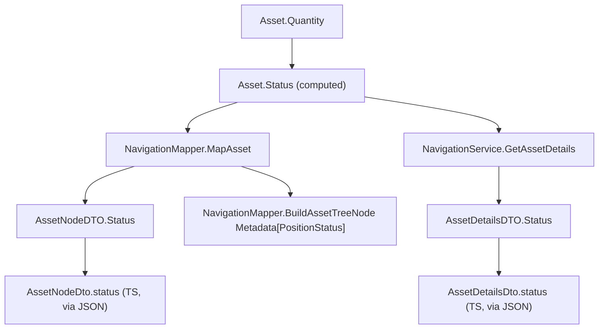

# Feature Spec: F01. Position Status Domain Model

## 1. Technical Overview

**What:** Add a three-state `PositionStatus` enum (`Long`, `Flat`, `Short`) nested inside `Asset`, expose it as a computed `Asset.Status` property derived purely from `Asset.Quantity`'s sign, and surface that value through the existing asset DTOs (`AssetNodeDTO`, `AssetDetailsDTO`) and their TypeScript counterparts (`AssetNodeDto`, `AssetDetailsDto`) via the current mapping paths (`NavigationMapper.MapAsset`, `NavigationMapper.BuildAssetTreeNode`, `NavigationService.GetAssetDetails`).

**Why:** `Asset.Active => Quantity > 0` is a boolean today, so a closed position (`Quantity = 0`) and an open short (`Quantity < 0`) both evaluate to `false` and render identically in the WPF status converter. This feature replaces that binary signal with a genuine three-state one, computed the same way `Active` already is (a pure function of `Quantity`), with no new persisted state and no schema change.

**Scope:**
- **Included:** `PositionStatus` enum; `Asset.Status` computed property; `Status`/`status` field added to `AssetNodeDTO`/`AssetDetailsDTO` (C#) and `AssetNodeDto`/`AssetDetailsDto` (TS); mapping updates in `NavigationMapper` and `NavigationService`; a matching `PositionStatus` entry in the WPF tree's `Metadata` dictionary; Domain and Application unit tests; updates to existing Web test fixtures that construct these DTOs as literals.
- **Excluded:** Any UI rendering of the new status (color converters, tree/detail panel visuals) — that belongs to F08 (Web) and F10 (WPF). Any API scope selector (`?scope=active|historic`) — that belongs to F05. Any change to `Asset.Active` or its existing consumers (`SummaryService`, `CreditService`, `BrokerBreakdownService` all filter with `.Where(a => a.Active)` for real aggregation logic, not just display) — `Active` stays exactly as it is today; `Status` is additive, not a replacement.

## 2. Architecture Impact

**Affected components:**
- `Financial.Domain/Entities/Asset.cs` — new nested `PositionStatus` enum, new `Status` computed property
- `Financial.Application/DTOs/AssetNodeDTO.cs` — new `Status` property
- `Financial.Application/DTOs/AssetDetailsDTO.cs` — new `Status` property
- `Financial.Application/Services/NavigationMapper.cs` — `MapAsset` populates `Status`; `BuildAssetTreeNode` adds a `PositionStatus` entry to `Metadata`
- `Financial.Application/Services/NavigationService.cs` — `GetAssetDetails` populates `Status` on the returned `AssetDetailsDTO`
- `Financial.Web/src/api/types.ts` — `AssetNodeDto`/`AssetDetailsDto` gain a required `status: string` field
- Five existing Web test files gain a `status` value in their `AssetNodeDto`/`AssetDetailsDto` literals (see Section 4)
- `Tests/Financial.Domain.Tests/Domain/AssetTests.cs` — new/extended tests
- `Tests/Financial.Application.Tests/Services/NavigationMapperTests.cs` — new/extended tests

**Data flow:**

## 3. Technical Decisions

| Decision | Chosen Approach | Alternative Considered | Trade-off |
|----------|-----------------|-------------------------|-----------|
| Enum placement | Nest `PositionStatus` inside `Asset` (`Asset.PositionStatus`), matching the existing `Transaction.TransactionType` / `Credit.CreditType` convention | Standalone top-level enum next to `CountryCode`/`GlobalAssetClass` in `AssetClassification.cs` | `PositionStatus` describes a single-entity state, not a cross-cutting classification value shared by multiple entities, so the nested-enum convention fits better |
| Relationship to `Active` | Keep `Asset.Active` unchanged; `Status` is a second, independent computed property | Remove/rename `Active` in favor of `Status` everywhere | `Active` is load-bearing business-logic filtering in `SummaryService`, `CreditService`, and `BrokerBreakdownService` (all outside this PRD's scope) — changing it would silently alter aggregation behavior those services rely on today |
| `Metadata` dictionary key for WPF tree | Add a new `"PositionStatus"` key alongside the existing `"IsActive"` key in `BuildAssetTreeNode` | Replace `"IsActive"` with `"PositionStatus"` | F10 (not this feature) owns switching the WPF converter/binding over; keeping `"IsActive"` prevents breaking today's binding until F10 lands |
| TS field requiredness | `status: string` required, matching `isActive`'s existing required-field convention | `status?: string` optional, to avoid touching existing test fixtures | User decision: consistency with `isActive` outweighs the one-time cost of updating 5 test fixture files |
| DTO property type | `AssetNodeDTO.Status`/`AssetDetailsDTO.Status` typed directly as the domain `Asset.PositionStatus` enum (serialized via `[JsonConverter(typeof(JsonStringEnumConverter))]`), mirroring how `Country`/`Class` are typed directly as `CountryCode`/`GlobalAssetClass` | Introduce a separate Application-layer `PositionStatus` enum decoupled from Domain | Matches the codebase's existing convention of DTOs referencing Domain enums directly; introducing a parallel Application enum would require an extra mapping step for no benefit in this codebase |

## 4. Component Overview

**Backend:**

| File Path | New/Modified | Purpose | Key Responsibilities |
|-----------|--------------|---------|------------------------|
| `Financial.Domain/Entities/Asset.cs` | Modified | Domain state | Nested `PositionStatus` enum; `Status` computed property (`Quantity > 0` → `Long`, `< 0` → `Short`, else `Flat`) |
| `Financial.Application/DTOs/AssetNodeDTO.cs` | Modified | Tree node DTO | New `Status` property (`[JsonConverter(typeof(JsonStringEnumConverter))]`) |
| `Financial.Application/DTOs/AssetDetailsDTO.cs` | Modified | Asset details DTO | New `Status` property (same converter) |
| `Financial.Application/Services/NavigationMapper.cs` | Modified | Mapping | `MapAsset` sets `Status = asset.Status`; `BuildAssetTreeNode` adds `Metadata["PositionStatus"] = asset.Status` (reads from the already-mapped `AssetNodeDTO`) |
| `Financial.Application/Services/NavigationService.cs` | Modified | Mapping | `GetAssetDetails` sets `Status = asset.Status` on the constructed `AssetDetailsDTO` |

**Frontend:**

| File Path | New/Modified | Purpose | Key Responsibilities |
|-----------|--------------|---------|------------------------|
| `Financial.Web/src/api/types.ts` | Modified | Type contracts | `AssetNodeDto`/`AssetDetailsDto` gain required `status: string` |
| `Financial.Web/src/pages/__tests__/CurrentValuesPage.test.tsx` | Modified | Test fixture | `makeBroker`'s nested asset literal gains a `status` value |
| `Financial.Web/src/hooks/useAssetSummary.test.ts` | Modified | Test fixture | `ASSET_DETAILS` literal gains a `status` value |
| `Financial.Web/src/hooks/useCredits.test.ts` | Modified | Test fixture | `ASSET_DETAILS` literal gains a `status` value |
| `Financial.Web/src/hooks/useTransactions.test.ts` | Modified | Test fixture | `ASSET_DETAILS` literal gains a `status` value |
| `Financial.Web/src/components/__tests__/AssetSummaryTab.test.tsx` | Modified | Test fixture | `ASSET` literal gains a `status` value |

No other Web test file needs changes: `InvestmentTree.test.tsx` builds `TreeNodeDto.metadata` as a loosely-typed `Record<string, unknown>` (no compile-time requirement to add the new key), and `DetailPanel.test.tsx`/`useAssetSummary.test.ts`'s other fixtures build `SelectedNode`, whose `isActive` field is already optional and which does not gain a `status` field in this feature.

**Database:** None — `Status` is computed at read time from `Quantity`; no schema or `data.json` shape change.

## 5. API Contracts

Not applicable — this feature has no new or modified endpoints. Existing `GET` endpoints that already return `AssetNodeDTO`/`AssetDetailsDTO` will include the new `status` field automatically once the DTOs are updated (F05 later adds the `scope` query parameter to these same endpoints).

## 6. Data Model

Not applicable — no persisted schema change. `PositionStatus` is a computed, in-memory value derived from `Asset.Quantity` on every read, exactly like `Asset.Active` today.

## 7. Testing Strategy

**Test File Structure:**

| Test File | Test Type | Target | Coverage Goal |
|-----------|-----------|--------|----------------|
| `Tests/Financial.Domain.Tests/Domain/AssetTests.cs` | Unit | `Asset.Status` | All three states |
| `Tests/Financial.Application.Tests/Services/NavigationMapperTests.cs` | Unit | `NavigationMapper.MapAsset`, `NavigationService.GetAssetDetails` | `Status` correctly mapped onto both DTOs and into tree `Metadata` |

**Test Functions:**

| Test Function | Description | Assertions |
|----------------|-------------|------------|
| `Status_PositiveQuantity_ReturnsLong` | Asset with `Quantity > 0` (e.g., after a buy) | `asset.Status.Should().Be(Asset.PositionStatus.Long)` — covers PRD acceptance criterion "Quantity > 0 → Long" |
| `Status_ZeroQuantity_ReturnsFlat` | Newly created asset, or fully sold down to zero | `asset.Status.Should().Be(Asset.PositionStatus.Flat)` — covers "Quantity = 0 → Flat" |
| `Status_NegativeQuantity_ReturnsShort` | Asset sold without a prior matching buy (net short) | `asset.Status.Should().Be(Asset.PositionStatus.Short)` — covers "Quantity < 0 → Short" |
| `GetNavigationTree_AssetNode_MetadataIncludesPositionStatus` | Extend the existing `NavigationMapperTests` pattern | `assetNode.Metadata["PositionStatus"].Should().Be(Asset.PositionStatus.Long)` for a long asset |
| `GetAssetsByBrokerPortfolio_AssetNodeDto_StatusMatchesAssetStatus` | Build assets with Long/Flat/Short quantities via `StubRepository` | Each returned `AssetNodeDTO.Status` matches the source asset's `Status` — covers "Status is present on Active-scoped AssetNodeDTO" |
| `GetAssetDetails_ReturnsStatusMatchingAsset` | Build a single asset via `StubRepository`, call `GetAssetDetails` | Returned `AssetDetailsDTO.Status` matches `asset.Status` — covers "Status is present on ... AssetDetailsDto" |

**Web side:** No new test files — the existing fixture updates (Section 4) are what keep `npm run typecheck`/`tsc -b --noEmit` and the existing Vitest suites green with the now-required `status` field. No new Web behavior is introduced by this feature, so no new Web test assertions are needed.

**Deferred cross-feature integration:** PRD Section 9's Cross-Feature Integration criterion "Position status computed by F01 appears correctly on every Active-scoped asset returned by F05" cannot be tested yet — F05 (the `scope=active|historic` selector) does not exist. The unit tests above establish that `Status` is correctly computed and correctly present on both DTOs today; F05's own spec should add the actual end-to-end assertion once its scoped endpoints exist.
