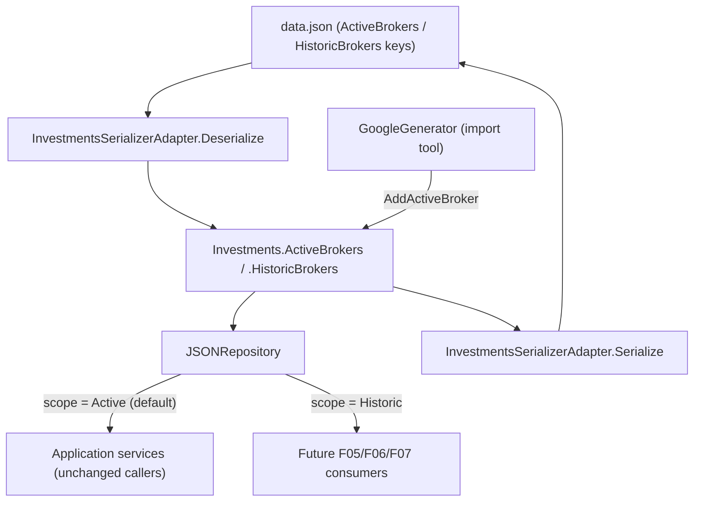

# Feature Spec: F02. Active/Historic Investments Data Model & Storage

## 1. Technical Overview

**What:** Split `Investments` from a single `Brokers` collection into two independent `Broker` collections — `ActiveBrokers` and `HistoricBrokers` — update `data.json`'s persisted shape to match, and make `IRepository` scope-aware (`InvestmentScope.Active`/`.Historic`) so Application services can query either collection through the existing single abstraction.

**Why:** Today, a closed asset lives inside a normal portfolio (`"Encerradas"`) mixed into the same `Brokers` list as active holdings, so every summary/chart feature has to remember to filter it out. This feature makes the separation structural: two physically distinct collections, so a query against one can never leak data from the other, by construction rather than by convention.

**Scope:**
- **Included:** `Investments` domain entity split (`ActiveBrokers`/`HistoricBrokers`, `AddActiveBroker`/`AddHistoricBroker`); `IRepository`'s 4 query methods gain an `InvestmentScope` parameter defaulting to `Active`; `JSONRepository` resolves queries against the correct collection; the one production caller of the old `AddBroker` (`GoogleGenerator.ProcessBrokerAsync`) is updated to keep compiling; the `OrderByNameWithEncerradasLast` sort-last helper is removed (no longer needed once historic data is physically separate) and its 3 call sites use plain alphabetical ordering instead; the 8 test-stub `IRepository` implementations gain the new parameter; the 2 real `data.test.json` fixtures move to the new shape; Domain/Application/Infrastructure unit tests updated and extended.
- **Excluded:** Anything that decides *which* assets go into which collection at import time — that is F04. `AssetClassification.json`'s `historicPortfolio` field — that is F03. The `scope=active|historic` API query parameter and any endpoint change — that is F05. `NavigationMapper.IsEncerradas` itself and `BrokerBreakdownService`'s/`SummaryService`'s `.Where(a => a.Active)`/`.Where(p => !IsEncerradas(...))` filters — those stay exactly as they are today; removing them is F05's stated cleanup once real scoped queries exist, and removing `IsEncerradas` now would break `BrokerBreakdownService.cs`, which this feature does not touch. Migrating the real, currently-running `data.json` — per the PRD, re-running the (future) import is the migration path, not a script this feature writes.

## 2. Architecture Impact

**Affected components:**
- `Financial.Domain/Entities/Investments.cs` — `ActiveBrokers`/`HistoricBrokers` collections, `AddActiveBroker`/`AddHistoricBroker` methods (replacing `AddBroker`)
- `Financial.Application/Interfaces/InvestmentScope.cs` — new enum
- `Financial.Application/Interfaces/IRepository.cs` — 4 methods gain `InvestmentScope scope = InvestmentScope.Active`
- `Financial.Infrastructure/Repositories/JSONRepository.cs` — resolves each query against `ActiveBrokers` or `HistoricBrokers` based on the scope argument
- `Financial.Application/Services/NavigationMapper.cs` — `OrderByNameWithEncerradasLast` removed; `MapPortfolios`/`MapPortfolio` use plain alphabetical ordering
- `Financial.Application/Services/NavigationService.cs` — `GetBrokers()` uses plain alphabetical ordering
- `Integrations/GoogleFinancialSupport/GoogleGenerator.cs` — one-line call-site fix (`AddBroker` → `AddActiveBroker`) to keep the import tool compiling; no routing/color-detection logic added (that's F04)
- 8 test files with an in-file `StubRepository : IRepository` gain the new parameter (see Section 4)
- `Tests/Financial.Infrastructure.Tests/TestData/data.test.json` and `Tests/Financial.Api.Tests/TestData/data.test.json` — move to the new shape
- `Tests/Financial.Domain.Tests/Domain/InvestmentsTests.cs`, `Tests/Financial.Infrastructure.Tests/Persistence/InvestmentsJsonSerializerTests.cs`, `Tests/Financial.Infrastructure.Tests/Repositories/JsonRepositoryTests.cs`, `Tests/Financial.Infrastructure.Tests/Services/NavigationServiceTests.cs` — updated/extended tests

**Data flow:**



## 3. Technical Decisions

| Decision | Chosen Approach | Alternative Considered | Trade-off |
|----------|-----------------|-------------------------|-----------|
| Repository scope mechanism | Add an optional `InvestmentScope scope = InvestmentScope.Active` parameter to all 4 `IRepository` methods | Split into two repository interfaces (`IActiveRepository`/`IHistoricRepository`) | User decision: every existing Application-layer caller keeps compiling and keeps today's behavior unchanged (default = Active); only the 8 test stubs need a mechanical signature update, versus every consumer's constructor changing under the split-interface alternative |
| `Investments.AddBroker` replacement | Rename to `AddActiveBroker`/`AddHistoricBroker`; fix the one production call site (`GoogleGenerator.ProcessBrokerAsync`, `AddBroker` → `AddActiveBroker`) as a compile-keeping change only | Keep `AddBroker` as a permanent alias for `AddActiveBroker` | User decision: a permanent alias whose name doesn't reveal it's active-only would be a lingering confusion; the one-line fix in `GoogleGenerator.cs` is not F04's actual routing logic, just keeps the build green until F04 replaces it properly |
| `IsEncerradas`/sort-last cleanup scope | Remove only `OrderByNameWithEncerradasLast` (the sort-last helper) and inline plain ordering at its 3 call sites; leave the `IsEncerradas(name)` helper method itself in place | Delete `IsEncerradas` entirely now, and also fix `BrokerBreakdownService.cs`'s remaining usage | User decision: `BrokerBreakdownService` (and `SummaryService`, which has the same filter pattern) still call `IsEncerradas` directly; deleting it now would break their compile. That cleanup is explicitly F05's, once real scoped queries make the filter redundant |
| Property naming (`Investments`) | `ActiveBrokers`/`HistoricBrokers` (both `List<Broker>`) | `ActiveInvestments`/`HistoricInvestments` (the PRD's illustrative JSON key names) | The PRD explicitly offers "`ActiveBrokers` and `HistoricBrokers` (or equivalent names)" as its primary suggestion; naming the property after the collection's element type matches the existing `Investments.Brokers` convention exactly, whereas `Investments.ActiveInvestments` reads as redundant with the enclosing class name |
| `data.json` key casing | `ActiveBrokers`/`HistoricBrokers` (PascalCase, matching the property name exactly) | `activeInvestments`/`historicInvestments` (camelCase, as illustrated in the PRD's example JSON snippet) | `InvestmentsSerializerAdapter`'s `JsonSerializerOptions` has no camelCase naming policy — confirmed against the real test fixture, every existing key (`"Brokers"`, `"Name"`, `"ISIN"`, etc.) is PascalCase, matching C# member names verbatim. The PRD's snippet was illustrative; this follows the codebase's actual, observed convention |
| `InvestmentScope` enum location | `Financial.Application/Interfaces/InvestmentScope.cs`, alongside `IRepository` | A new `Enums` folder | It exists solely to parameterize `IRepository`'s signature; co-locating it with the interface it serves avoids introducing a new folder for one small type |

## 4. Component Overview

**Domain:**

| File Path | New/Modified | Purpose | Key Responsibilities |
|-----------|--------------|---------|------------------------|
| `Financial.Domain/Entities/Investments.cs` | Modified | Root aggregate | `ActiveBrokers`/`HistoricBrokers` (`IReadOnlyCollection<Broker>`, backed by private `List<Broker>` fields, same pattern as today's `Brokers`); `AddActiveBroker(Broker)`/`AddHistoricBroker(Broker)` replace `AddBroker(Broker)` |

**Application:**

| File Path | New/Modified | Purpose | Key Responsibilities |
|-----------|--------------|---------|------------------------|
| `Financial.Application/Interfaces/InvestmentScope.cs` | New | Query parameter | `enum InvestmentScope { Active, Historic }` |
| `Financial.Application/Interfaces/IRepository.cs` | Modified | Repository contract | `GetAssetsByBroker`, `GetAssetsByBrokerPortfolio`, `GetBrokerList`, `GetAsset` each gain `InvestmentScope scope = InvestmentScope.Active` |
| `Financial.Application/Services/NavigationMapper.cs` | Modified | Mapping | `OrderByNameWithEncerradasLast<T>` removed; `MapPortfolios` and `MapPortfolio` order by name with `StringComparer.CurrentCultureIgnoreCase` directly |
| `Financial.Application/Services/NavigationService.cs` | Modified | Mapping | `GetBrokers()` orders `_repository.GetBrokerList()` by name directly, no longer via the removed helper |

**Infrastructure:**

| File Path | New/Modified | Purpose | Key Responsibilities |
|-----------|--------------|---------|------------------------|
| `Financial.Infrastructure/Repositories/JSONRepository.cs` | Modified | Repository implementation | Each method resolves `_investments.ActiveBrokers` or `.HistoricBrokers` based on the `scope` argument before filtering by broker/portfolio/asset name; `SaveChangesAsync` unchanged (still serializes the whole `Investments` instance, both collections) |
| `Integrations/GoogleFinancialSupport/GoogleGenerator.cs` | Modified | Import tool (compile-keeping fix only) | `ProcessBrokerAsync`'s `data.AddBroker(broker)` → `data.AddActiveBroker(broker)`; no routing logic added |

**Tests (mechanical `IRepository` signature updates — add `InvestmentScope scope = InvestmentScope.Active`, unused in the stub body):**

| File Path | New/Modified |
|-----------|--------------|
| `Tests/Financial.Application.Tests/Services/NavigationMapperTests.cs` | Modified |
| `Tests/Financial.Application.Tests/Services/SummaryServiceTests.cs` | Modified |
| `Tests/Financial.Application.Tests/Services/TransactionServiceQueryTests.cs` | Modified |
| `Tests/Financial.Application.Tests/Services/PortfolioAssetSummaryServiceTests.cs` | Modified |
| `Tests/Financial.Application.Tests/Services/BrokerBreakdownServiceTests.cs` | Modified |
| `Tests/Financial.Infrastructure.Tests/Services/NavigationServiceTests.cs` | Modified (stub signature, plus the 3 sort-order tests below) |
| `Tests/Financial.Infrastructure.Tests/Services/CryptocurrencyAssetPriceFetcherTests.cs` | Modified |
| `Tests/Financial.Infrastructure.Tests/Services/AssetPriceServiceTests.cs` | Modified |

**Tests (behavior updates):**

| File Path | New/Modified | Purpose |
|-----------|--------------|---------|
| `Tests/Financial.Domain.Tests/Domain/InvestmentsTests.cs` | Modified | Cover `AddActiveBroker`/`AddHistoricBroker` and their independence |
| `Tests/Financial.Infrastructure.Tests/Persistence/InvestmentsJsonSerializerTests.cs` | Modified | Round-trip both collections; missing-key defaults to empty |
| `Tests/Financial.Infrastructure.Tests/Repositories/JsonRepositoryTests.cs` | Modified | Scope-parameterized queries return only the requested collection |
| `Tests/Financial.Infrastructure.Tests/Services/NavigationServiceTests.cs` | Modified | The 3 existing "sort Encerradas last" tests are rewritten to assert plain alphabetical order (`"Alpha", "Encerradas", "Zeta"`), proving the special-casing is gone |
| `Tests/Financial.Infrastructure.Tests/TestData/data.test.json` | Modified | `"Brokers"` → `"ActiveBrokers"`; add empty `"HistoricBrokers": []` |
| `Tests/Financial.Api.Tests/TestData/data.test.json` | Modified | Same change (kept identical to the Infrastructure copy, as today) |

**Not touched (explicitly out of scope):** `BrokerBreakdownService.cs`, `SummaryService.cs`, `CreditService.cs`, and their existing `Encerradas`-filter tests — all still call `NavigationMapper.IsEncerradas` for filtering, unrelated to the sort-last behavior this feature removes.

## 5. API Contracts

Not applicable — this feature has no new or modified endpoints. F05 adds the `scope=active|historic` query parameter to existing endpoints, built on top of this feature's `InvestmentScope`.

## 6. Data Model

**`data.json` root shape — before:**
```json
{
  "Brokers": [ /* Broker[] */ ]
}
```

**`data.json` root shape — after:**
```json
{
  "ActiveBrokers": [ /* Broker[] */ ],
  "HistoricBrokers": [ /* Broker[] */ ]
}
```

`Broker`/`Portfolio`/`Asset`/`Transaction`/`Credit` element shapes are unchanged — the split happens only at the `Investments` root. Serialization continues to go through `InvestmentsSerializerAdapter`'s existing `JsonSerializerOptions` (`JsonStringEnumConverter`, `WriteIndented`, `InvestmentsTypeInfoResolver` for private-setter wiring) — no changes needed there, since `ActiveBrokers`/`HistoricBrokers` are ordinary public properties on an already-`ManagedTypes`-registered type (`Investments`), reflected and wired exactly like today's `Brokers`.

**Compatibility / no migration script:** A `data.json` written before this feature (still shaped `{ "Brokers": [...] }`) deserializes with **both** `ActiveBrokers` and `HistoricBrokers` empty, since the old `"Brokers"` key doesn't match either new property name — no exception, no data loss (the file itself is untouched on disk), just an empty tree until the file is regenerated. Per the PRD, regenerating `data.json` via the (future) import tool is the intended path, not a migration script this feature writes.

**Cross-cutting note:** Every existing `IRepository` caller that doesn't pass a `scope` argument keeps resolving against `ActiveBrokers`, identical to today's single-collection behavior — this is what makes the change non-breaking for every already-implemented feature.

## 7. Testing Strategy

**Test File Structure:**

| Test File | Test Type | Target | Coverage Goal |
|-----------|-----------|--------|----------------|
| `Tests/Financial.Domain.Tests/Domain/InvestmentsTests.cs` | Unit | `Investments.AddActiveBroker`/`.AddHistoricBroker` | Both collections populate independently |
| `Tests/Financial.Infrastructure.Tests/Persistence/InvestmentsJsonSerializerTests.cs` | Unit | `InvestmentsSerializerAdapter` | Round-trip both collections; missing-key error handling |
| `Tests/Financial.Infrastructure.Tests/Repositories/JsonRepositoryTests.cs` | Unit | `JSONRepository` | Scope-parameterized queries return only the requested collection |
| `Tests/Financial.Infrastructure.Tests/Services/NavigationServiceTests.cs` | Unit | `NavigationService.GetBrokers()` | Plain alphabetical ordering (no more sort-last special-casing) |

**Test Functions:**

| Test Function | Description | Assertions |
|----------------|-------------|------------|
| `AddActiveBroker_AddsBrokerToActiveCollection` | Add a broker via `AddActiveBroker` | `investments.ActiveBrokers.Should().ContainSingle()`; `investments.HistoricBrokers.Should().BeEmpty()` |
| `AddHistoricBroker_AddsBrokerToHistoricCollection` | Add a broker via `AddHistoricBroker` | `investments.HistoricBrokers.Should().ContainSingle()`; `investments.ActiveBrokers.Should().BeEmpty()` |
| `SerializeDeserialize_RoundTripPreservesActiveAndHistoricStructure` | Populate both `ActiveBrokers` and `HistoricBrokers`, serialize, deserialize | Both collections round-trip with correct broker/portfolio/asset counts — covers PRD AC "`data.json` round-trips with both top-level arrays" |
| `Deserialize_MissingHistoricBrokersKey_ResultsInEmptyHistoricCollection` | Deserialize JSON containing only `"ActiveBrokers"` | `result.HistoricBrokers.Should().BeEmpty()`, no exception — covers PRD AC "missing one of the two top-level keys succeeds with that collection empty" |
| `GetAssetsByBroker_DefaultScope_ReturnsActiveOnly` | Call `GetAssetsByBroker(name)` with no scope argument against a repository with both Active and Historic data for the same broker name | Only the Active-side assets are returned — covers "omitting the scope preserves today's behavior" and "a repository query scoped to Active never returns an asset from `HistoricBrokers`" |
| `GetAssetsByBroker_HistoricScope_ReturnsHistoricOnly` | Same setup, call with `InvestmentScope.Historic` | Only the Historic-side assets are returned, and vice versa |
| `GetBrokers_ShouldOrderByNameAlphabetically` | Brokers named "Zeta", "Encerradas", "Alpha" | `ContainInOrder("Alpha", "Encerradas", "Zeta")` — replaces the old sort-last assertion, proving `OrderByNameWithEncerradasLast` no longer exists |
| `GetBrokers_PortfoliosShouldOrderByNameAlphabetically` | Portfolios named "Zeta", "Encerradas", "Alpha" within one broker | Same alphabetical assertion at the portfolio level |
| `GetBrokers_AssetsShouldOrderByNameAlphabetically` | Assets named "Zeta", "Encerradas", "Alpha" within one portfolio | Same alphabetical assertion at the asset level |

**Deferred cross-feature integration:** PRD Section 9's Cross-Feature Integration criterion "Data written by import (F04) into `activeInvestments`/`historicInvestments` (F02's structure) is correctly returned by the scoped navigation API (F05)" cannot be tested yet — neither F04 nor F05 exist. The unit tests above establish that `ActiveBrokers`/`HistoricBrokers` round-trip correctly and that scoped repository queries correctly isolate one collection from the other; F04's and F05's own specs should add the actual end-to-end assertions once those exist.

**Scope clarification for the AC "`NavigationMapper.IsEncerradas`/its 'sort last' special-casing no longer exists":** per the resolved decision in Section 3, only the sort-last special-casing (`OrderByNameWithEncerradasLast`) is removed in this feature; `IsEncerradas(name)` itself remains, since `BrokerBreakdownService`/`SummaryService` still call it directly and removing it now would break their compile. That remaining cleanup is F05's.
