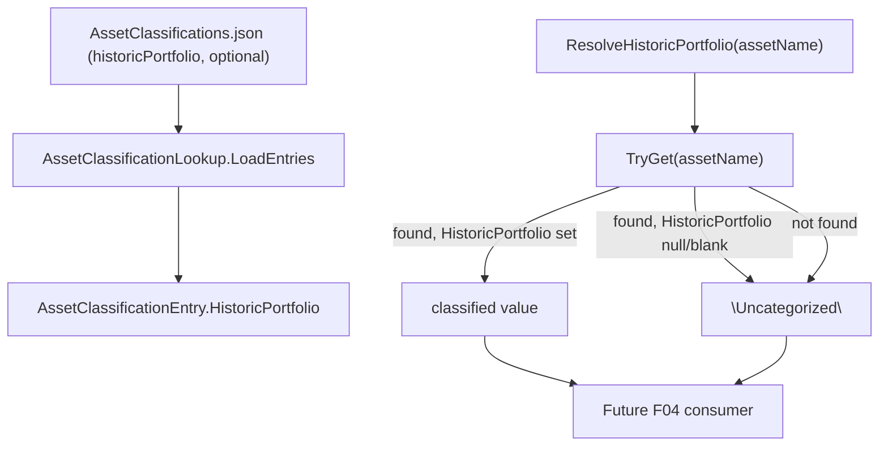

# Feature Spec: F03. AssetClassification Historic Portfolio Metadata

## 1. Technical Overview

**What:** Add an optional `historicPortfolio` field to `AssetClassifications.json` entries, expose it through `AssetClassificationEntry`, and add a `ResolveHistoricPortfolio` resolution method on `AssetClassificationLookup` that returns the classified value when present, or a fallback `"Uncategorized"` name otherwise.

**Why:** When an asset closes, F04 needs to know which portfolio to file it under in Historic Investments. Without this feature, a closed asset would have no way to preserve its original strategy grouping (e.g., "Dividend Portfolio") — it would always land in a single generic bucket instead.

**Scope:**
- **Included:** `historicPortfolio` optional field on `AssetClassifications.json` entries (schema support only — no real entries in the file are populated with values, since that's user-supplied classification data, not something this feature can know); `AssetClassificationEntry` gains a `HistoricPortfolio` member; `AssetClassificationLookup` gains a `ResolveHistoricPortfolio` method and an `UncategorizedHistoricPortfolioName` constant; unit tests.
- **Excluded:** Anything that actually routes a closed asset to a historic broker/portfolio at import time, or calls `ResolveHistoricPortfolio` — that's F04. Populating real entries in `AssetClassifications.json` with actual `historicPortfolio` values — that's the user's own classification data entry, done as needed once F04 exists. The per-broker separation of "Uncategorized" portfolios (each broker gets its own) — that emerges for free from `Broker.AddPortfolio`'s existing per-broker scoping (already true and already tested in F02), not from anything this feature adds.

## 2. Architecture Impact

**Affected components:**
- `Integrations/GoogleFinancialSupport/AssetClassificationLookup.cs` — `AssetClassificationEntry` gains a 4th member (`HistoricPortfolio`, nullable, defaults to `null`); the internal `AssetClassificationJson` model gains a matching optional property; new `UncategorizedHistoricPortfolioName` constant; new `ResolveHistoricPortfolio` method (two overloads: by asset name, and by an already-resolved entry)
- `Tests/Financial.Infrastructure.Tests/Integrations/AssetClassificationLookupTests.cs` — extended with resolution/fallback test cases

**Data flow:**



## 3. Technical Decisions

| Decision | Chosen Approach | Alternative Considered | Trade-off |
|----------|-----------------|-------------------------|-----------|
| Fallback ownership | `AssetClassificationLookup.ResolveHistoricPortfolio(assetName)` applies the `"Uncategorized"` fallback itself, always returning a non-null name | Expose only the raw nullable `HistoricPortfolio` field via `TryGet`, leaving the fallback to the caller (matching how `AssetMetadataResolver.ResolveAssetClassification` already applies its own fallback for `Country`/`LocalTypeCode`/`Class` today) | User decision: one resolution method with the fallback rule in a single place is simpler for F04 to consume (one call, always valid) than every future caller reimplementing the same null-check |
| `AssetClassificationEntry` compile compatibility | Give the new `HistoricPortfolio` positional record member a `= null` default, so the one existing 3-arg construction call in `AssetMetadataResolver.cs` (F04's territory, not yet implemented) keeps compiling unmodified | Make `HistoricPortfolio` a required 4th positional parameter and update that call site as a compile-keeping fix (the pattern used in F02 for `GoogleGenerator.AddBroker`) | The project targets `net10.0` (C# supports default values on record positional parameters), so the default-value escape hatch is available here and avoids touching a file outside this feature's boundary at all — cleaner than F02's situation, where no such default was possible for a renamed method |
| Real `AssetClassifications.json` entries | No existing entries are given real `historicPortfolio` values as part of this feature | Add a real value to one entry as a demonstration (mirroring the PRD's illustrative example) | Which portfolio a specific closed asset originally belonged to is the user's own classification knowledge, not something this feature can correctly infer; inventing a value would pollute real personal data |
| Method placement | `ResolveHistoricPortfolio` added to the existing `AssetClassificationLookup` static class | New dedicated class | It operates on the exact same embedded lookup table `TryGet` already exposes; a new class would split one cohesive concern across two files for no benefit |

## 4. Component Overview

**Infrastructure:**

| File Path | New/Modified | Purpose | Key Responsibilities |
|-----------|--------------|---------|------------------------|
| `Integrations/GoogleFinancialSupport/AssetClassificationLookup.cs` | Modified | Asset classification lookup | `AssetClassificationEntry` gains `HistoricPortfolio` (nullable `string`, default `null`); `AssetClassificationJson` gains matching optional property; `LoadEntries` passes the new field through; new `internal const string UncategorizedHistoricPortfolioName = "Uncategorized"`; new `ResolveHistoricPortfolio(string assetName)` (applies the fallback, always returns a non-null name) and `ResolveHistoricPortfolio(AssetClassificationEntry entry)` (pure resolution logic, directly unit-testable without going through the embedded resource) |

**Tests:**

| File Path | New/Modified | Purpose |
|-----------|--------------|---------|
| `Tests/Financial.Infrastructure.Tests/Integrations/AssetClassificationLookupTests.cs` | Modified | Cover resolution with a classified value, fallback to `"Uncategorized"` for both a known-but-unclassified asset and an unknown asset name, and that existing entries without the field still deserialize |

**Not touched (explicitly out of scope):** `AssetMetadataResolver.cs`, `GoogleGenerator.cs`, and `AssetClassifications.json`'s real entry data — all F04's territory or the user's own data-entry task.

## 5. API Contracts

Not applicable — this feature has no endpoints. `ResolveHistoricPortfolio` is a plain internal-assembly method consumed by F04's import logic once that exists.

## 6. Data Model

**`AssetClassifications.json` entry shape — before:**
```json
{ "name": "AGNC INVESTMENT CORP. (AGNC)", "country": "UK", "localTypeCode": "REIT", "assetClass": "RealEstate" }
```

**`AssetClassifications.json` entry shape — after (field is optional; existing entries need no change):**
```json
{ "name": "AGNC INVESTMENT CORP. (AGNC)", "country": "UK", "localTypeCode": "REIT", "assetClass": "RealEstate", "historicPortfolio": "Dividend Portfolio" }
```

`AssetClassificationJson` (internal deserialization model) gains `public string? HistoricPortfolio { get; set; }` — no `required` modifier, so an entry that omits the key deserializes with `HistoricPortfolio == null`, exactly like `LocalTypeCode`/`Country`/`AssetClass` already behave when a real-world entry doesn't specify them.

`AssetClassificationEntry` (the `internal readonly record struct` returned by `TryGet`) changes from:
```csharp
internal readonly record struct AssetClassificationEntry(
    CountryCode Country,
    string LocalTypeCode,
    GlobalAssetClass Class);
```
to:
```csharp
internal readonly record struct AssetClassificationEntry(
    CountryCode Country,
    string LocalTypeCode,
    GlobalAssetClass Class,
    string? HistoricPortfolio = null);
```

No changes to the actual `Integrations/GoogleFinancialSupport/AssetClassifications.json` production file's 152 existing entries — the schema supports the new key, but no entry is given a value as part of this feature.

## 7. Testing Strategy

**Test File Structure:**

| Test File | Test Type | Target | Coverage Goal |
|-----------|-----------|--------|----------------|
| `Tests/Financial.Infrastructure.Tests/Integrations/AssetClassificationLookupTests.cs` | Unit | `AssetClassificationLookup.ResolveHistoricPortfolio` | Classified value, fallback for unclassified-but-known asset, fallback for unknown asset, existing entries remain valid |

**Test Functions:**

| Test Function | Description | Assertions |
|----------------|-------------|------------|
| `ResolveHistoricPortfolio_EntryWithHistoricPortfolio_ReturnsClassifiedValue` | Call the entry-based overload with a manually constructed `AssetClassificationEntry` whose `HistoricPortfolio` is set (e.g., `"Dividend Portfolio"`) | Returns `"Dividend Portfolio"` — covers PRD AC "an entry with a `historicPortfolio` value resolves to that value when looked up" |
| `ResolveHistoricPortfolio_EntryWithoutHistoricPortfolio_ReturnsUncategorized` | Call the entry-based overload with a constructed entry whose `HistoricPortfolio` is `null` | Returns `"Uncategorized"` |
| `ResolveHistoricPortfolio_KnownAssetWithoutHistoricPortfolio_ReturnsUncategorized` | Call the name-based overload with `"Bitcoin"` (a real entry in the embedded resource that has no `historicPortfolio`) | Returns `"Uncategorized"` — covers PRD AC "an entry without `historicPortfolio` resolves to ... `\"Uncategorized\"`" using real, unmodified data |
| `ResolveHistoricPortfolio_UnknownAssetName_ReturnsUncategorized` | Call the name-based overload with an asset name not in the classification table | Returns `"Uncategorized"` — covers "an asset with no classification entry ... resolves to ... `\"Uncategorized\"`" |
| `TryGet_Bitcoin_HistoricPortfolioIsNull` | Extend the existing `TryGet_Bitcoin_ReturnsCryptocurrencyClass` assertion (or add alongside it) | `entry.HistoricPortfolio.Should().BeNull()` — confirms an existing entry without the new key deserializes successfully with no exception, covers "existing entries without `historicPortfolio` remain valid" |

**Scope clarification for the AC "resolves to that broker's own `\"Uncategorized\"` portfolio (not a bucket shared across brokers)":** the "per broker" separation is not something `ResolveHistoricPortfolio` itself can test or guarantee — it takes only an asset name, no broker context. That guarantee comes from `Broker.AddPortfolio` always scoping a `Portfolio` to the `Broker` it's created on (already true today, already covered by F02's `InvestmentsTests`/`JsonRepositoryTests`). F03's own test coverage is limited to the portion it controls: that the resolved *name* is correct. F04's own spec should verify the per-broker application once it exists.

**Deferred cross-feature integration:** no PRD Section 9 Cross-Feature Integration criterion references F03 directly (F04's own criteria will consume `ResolveHistoricPortfolio` once F04 exists).
