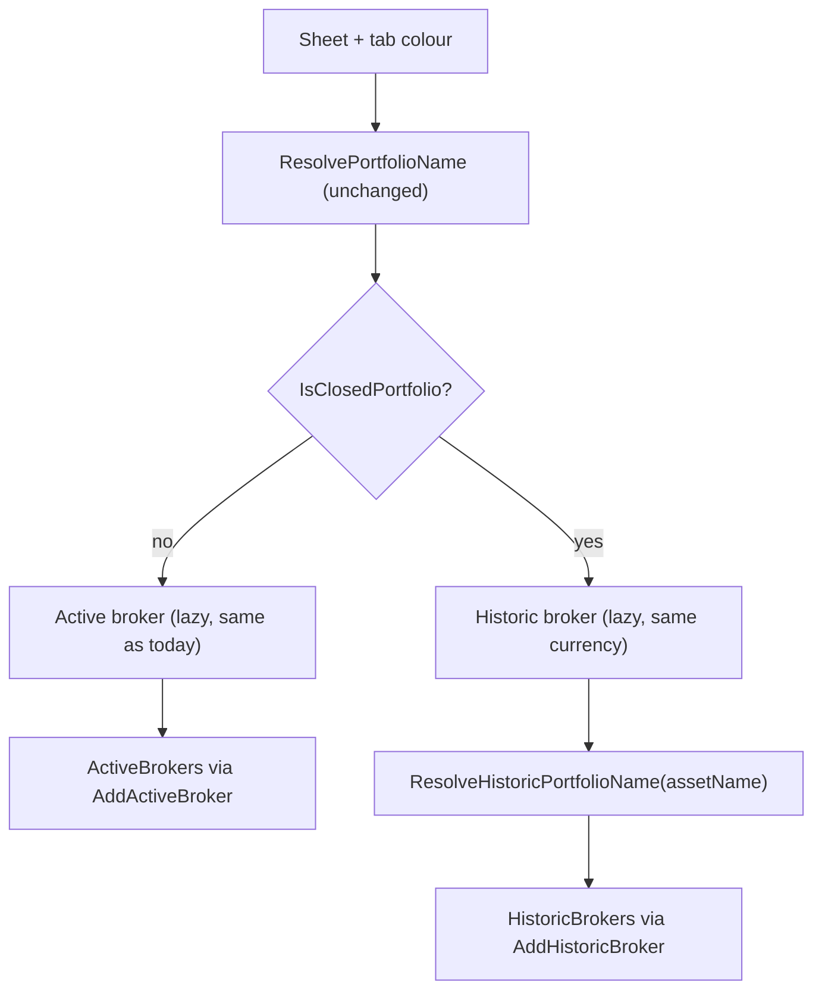

# Feature Spec: F04. Spreadsheet Import — Closed Position Routing to Historic

## 1. Technical Overview

**What:** Keep the import tool's existing tab-colour-based closed-position detection (`AssetMetadataResolver.ResolvePortfolioName` resolving to `"Encerradas"`) exactly as it is, but change what `GoogleGenerator` does once that happens: instead of adding the asset to an `"Encerradas"` `Portfolio` inside the broker's active data, route it into that same broker's entry in `HistoricBrokers`, under a portfolio name resolved via F03's `AssetClassificationLookup.ResolveHistoricPortfolio` (classification-based, or a per-broker `"Uncategorized"` fallback).

**Why:** Today a closed position lands in a normal `"Encerradas"` portfolio mixed into the broker's active data (F02 already separated the storage into `ActiveBrokers`/`HistoricBrokers`, and F03 already built the historic-portfolio-name resolution — F04 is the piece that actually uses both at import time).

**Scope:**
- **Included:** `AssetMetadataResolver` gains a closed-marker check and a historic-portfolio-name resolution method (thin wrapper over F03's `AssetClassificationLookup.ResolveHistoricPortfolio`); `GoogleGenerator.ProcessBrokerAsync`/`ProcessSheetAsync` are restructured to lazily create and register an Active broker and/or a Historic broker per file (same currency for both), and route each sheet to the correct one based on the closed-marker check; unit tests for the new resolver-level decision logic.
- **Excluded:** Any change to `GoogleGeneratorConfiguration`'s `PortfolioNameMap`/`IgnoreSheetNames`/`BrokerCurrencyMap` — every existing color mapping, including the three `"...→ Encerradas"` entries, stays exactly as configured. Any change to how quantity is computed or used — quantity is never consulted as an import-time routing signal (that's F01's separate, purely computed display concern). Any "move" or "merge" logic for reopened positions — `GoogleGenerator` already rebuilds `Investments` from scratch every run, so a sheet recoloured away from the closed marker simply routes to Active on its own on the next run, with no special code required. Unit-testing `GoogleGenerator`'s own orchestration (creating the Active/Historic `Broker` objects, calling `AddActiveBroker`/`AddHistoricBroker`) — see Decisions below.

## 2. Architecture Impact

**Affected components:**
- `Integrations/GoogleFinancialSupport/AssetMetadataResolver.cs` — new `IsClosedPortfolio(string portfolioName)` and `ResolveHistoricPortfolioName(string assetName)` methods, plus a local `ClosedPortfolioMarkerName` constant
- `Integrations/GoogleFinancialSupport/GoogleGenerator.cs` — `ProcessBrokerAsync` restructured to lazily create an Active and/or a Historic `Broker` per file, routing each sheet to the correct one; `ProcessSheetAsync` accepts an already-resolved `(Broker, portfolioName)` pair instead of resolving the portfolio name itself
- `Tests/Financial.Infrastructure.Tests/Integrations/AssetMetadataResolverTests.cs` — extended with tests for the two new methods

**Data flow:**

## 3. Technical Decisions

| Decision | Chosen Approach | Alternative Considered | Trade-off |
|----------|-----------------|-------------------------|-----------|
| Testing boundary | Push the closed-marker check and historic-name resolution into `AssetMetadataResolver` (already unit-tested in isolation, no Google I/O); leave `GoogleGenerator`'s new orchestration (broker creation/registration) at the same untested integration-glue level the whole class is at today | Introduce a `GoogleService` interface to make `GoogleGenerator` fully mockable/unit-testable | User decision: the class has zero existing tests because its dependencies aren't behind interfaces; adding that seam is a much larger refactor than this feature's actual purpose (route based on already-working color detection). The real decision logic — the part with actual business rules — is fully covered where it now lives |
| Closed-marker constant | A local `private const string ClosedPortfolioMarkerName = "Encerradas"` inside `AssetMetadataResolver`, compared with an ordinal equality check | Reuse `Financial.Application.Services.NavigationMapper.IsEncerradas`/`EncerradasName` | Not possible: `NavigationMapper` is `internal` to `Financial.Application`, and there is no `InternalsVisibleTo` granting access to the `Integrations` projects (confirmed — only `Financial.Infrastructure`/`GoogleFinancialSupport`/`WebPageParser` grant it to `Financial.Infrastructure.Tests`). An ordinal (not case-insensitive/trimmed) comparison is sufficient here because the value being checked always originates from `PortfolioNameMap`'s own hardcoded dictionary values, not arbitrary user input |
| Reopening (recolour away from closed) | No special "move" logic — `GoogleGenerator.GenerateAsync` already builds a brand-new `Investments` from scratch every run, so a sheet's current color is re-evaluated independently each time | Track previous-run state and explicitly move an asset from Historic back to Active | The existing full-regenerate architecture already produces the correct result for free; adding state-tracking would solve a problem that doesn't exist |
| Portfolio-name resolution ordering | `ProcessBrokerAsync` resolves the portfolio name (and decides Active vs Historic) *before* calling `ProcessSheetAsync`, passing the resolved `(Broker, portfolioName)` pair in | Keep resolution inside `ProcessSheetAsync` as today, with an added parameter for scope | Resolving in `ProcessBrokerAsync` is where the per-file lazy broker creation naturally lives (one Active/Historic broker pair per file, not per sheet); keeping it in `ProcessSheetAsync` would require passing scope-selection parameters down instead of a single resolved target |

## 4. Component Overview

**Infrastructure:**

| File Path | New/Modified | Purpose | Key Responsibilities |
|-----------|--------------|---------|------------------------|
| `Integrations/GoogleFinancialSupport/AssetMetadataResolver.cs` | Modified | Metadata/naming resolution | `IsClosedPortfolio(string portfolioName)` — ordinal-compares against the local `"Encerradas"` marker; `ResolveHistoricPortfolioName(string assetName)` — delegates to `AssetClassificationLookup.ResolveHistoricPortfolio` |
| `Integrations/GoogleFinancialSupport/GoogleGenerator.cs` | Modified | Import orchestration | `ProcessBrokerAsync` tracks two lazily-created `Broker` locals (Active, Historic) per file, both sharing the same resolved currency; for each sheet, resolves the portfolio name once, checks `IsClosedPortfolio`, and routes to the corresponding broker — creating and registering it (`AddActiveBroker`/`AddHistoricBroker`) on first use; `ProcessSheetAsync` no longer resolves the portfolio name itself, it receives the target `Broker` and resolved portfolio name as parameters |

**Tests:**

| File Path | New/Modified | Purpose |
|-----------|--------------|---------|
| `Tests/Financial.Infrastructure.Tests/Integrations/AssetMetadataResolverTests.cs` | Modified | Cover `IsClosedPortfolio` for both the closed marker and a normal portfolio name, and `ResolveHistoricPortfolioName`'s delegation to F03's fallback behavior |

**Not touched (explicitly out of scope):** `GoogleGeneratorConfiguration.cs` (no mapping changes), `GoogleService.cs`/`GoogleSheetsAssetReader.cs` (no new interfaces/mocking seams), anything related to `Asset.PositionType`/`Asset.Active` (quantity is not an import-time signal).

## 5. API Contracts

Not applicable — this feature has no endpoints; it's a change to the standalone `ImportGoogleSpreadSheets` tool's orchestration logic.

## 6. Data Model

No schema change beyond what F02 already introduced (`Investments.ActiveBrokers`/`HistoricBrokers`). This feature only changes *which* of those two collections `GoogleGenerator` writes a given broker/portfolio/asset into, and *which* portfolio name it uses when writing to `HistoricBrokers`. `Broker`/`Portfolio`/`Asset`/`Transaction`/`Credit` construction is unchanged — the same `Asset.Create`, `Broker.Create`, `Broker.AddPortfolio`, `Portfolio.AddAsset`, `Asset.AddTransactions`, `Asset.AddCredits` calls run exactly as they do today, just against whichever `Broker` instance (Active or Historic) this feature routes them to.

## 7. Testing Strategy

**Test File Structure:**

| Test File | Test Type | Target | Coverage Goal |
|-----------|-----------|--------|----------------|
| `Tests/Financial.Infrastructure.Tests/Integrations/AssetMetadataResolverTests.cs` | Unit | `AssetMetadataResolver.IsClosedPortfolio`, `.ResolveHistoricPortfolioName` | Closed-marker detection and historic-name resolution delegation |

**Test Functions:**

| Test Function | Description | Assertions |
|----------------|-------------|------------|
| `IsClosedPortfolio_Encerradas_ReturnsTrue` | Call with the exact string `"Encerradas"` | Returns `true` — covers the detection half of PRD AC "An asset whose tab colour resolves to a broker's closed marker ... is written to ... historicInvestments" |
| `IsClosedPortfolio_OtherPortfolioName_ReturnsFalse` | Call with a normal resolved name (e.g., `"Acoes"`) | Returns `false` — covers "An asset whose tab colour does not resolve to the closed marker is written to activeInvestments under its normal colour-resolved portfolio, unchanged from today" |
| `ResolveHistoricPortfolioName_DelegatesToAssetClassificationLookup` | Call with `"Bitcoin"` (a real embedded-resource entry with no `historicPortfolio` value, per F03) | Returns `"Uncategorized"` — confirms the wiring to F03's resolution without re-testing F03's own fallback logic (already covered by `AssetClassificationLookupTests`) |

**Manually verified (documented, not unit-tested — see Decisions):** the actual placement into `ActiveBrokers`/`HistoricBrokers` inside `GoogleGenerator.ProcessBrokerAsync`, including per-broker `"Uncategorized"` separation (via `Broker.AddPortfolio` already being instance-scoped, proven by F02's own tests) and same-currency historic broker creation. This is the class's pre-existing untested boundary; the decision logic feeding it is what's covered above.

**PRD acceptance criteria not covered by a runnable unit test (require the manual-verification path above):**
- "An asset whose tab colour resolves to a broker's closed marker ... is written to that broker's entry in `historicInvestments` ... — not to an `"Encerradas"` portfolio inside `activeInvestments`" (routing/placement portion)
- "No `Portfolio` literally named `"Encerradas"` exists inside `activeInvestments` after import"
- "Re-importing a sheet previously resolving to the closed marker, now recoloured to a normal active grouping, results in the asset appearing only in `activeInvestments`"

**Deferred cross-feature integration:** no PRD Section 9 Cross-Feature Integration criterion references F04 yet (F05, the scoped navigation API that will read what F04 writes, doesn't exist).
