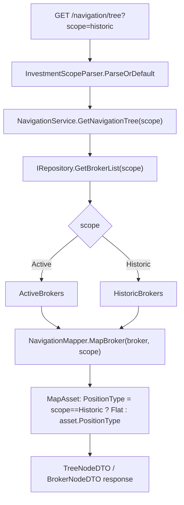

# Feature Spec: F05. Scoped Navigation & Summary API

## 1. Technical Overview

**What:** Thread the `InvestmentScope` concept that F02 already introduced on `IRepository` up through the Application-layer navigation/summary services and out to the API surface. `NavigationController` (`GET /navigation/tree`, `GET /navigation/brokers`) and `AssetsController` (`GET /assets/{brokerName}/{portfolioName}/{assetName}`) gain a `scope` query parameter; `SummaryController`'s four endpoints (`/summary/broker/{name}`, `/summary/portfolio/{broker}/{portfolio}`, `/summary/portfolio/{broker}/{portfolio}/assets`, `/summary/broker/{name}/breakdown`) gain the same parameter. Every controller action defaults to `Active` when the parameter is omitted, so no existing caller (WPF `Financial.App`, current Web SPA) breaks. `NavigationMapper.MapAsset` starts returning `PositionType.Flat` for Historic-scoped assets, since a historic asset is closed by definition regardless of its stored `PositionType`.

**Why:** F02 built the two-collection repository (`ActiveBrokers`/`HistoricBrokers` behind one `IRepository`, scoped via an optional `InvestmentScope` parameter) and F04 already routes closed positions into `HistoricBrokers` at import time. Nothing yet lets a caller ask for the Historic collection through the API — every Application service still calls `_repository.*(...)` with the implicit default (`Active`), and `BrokerBreakdownService`/`SummaryService` still carry the old `Encerradas`/`Active`-bool filters left over from before F02 physically separated the data. F05 is the piece that exposes the scope choice to callers and retires those now-redundant filters, since scope purity is now a property of which repository collection was queried, not of a runtime `.Where()`.

**Scope:**
- **Included:** `scope` query parameter (`active` default, `historic`) on all 7 controller actions listed above; a new `InvestmentScopeParser` validation helper mirroring the existing `TransactionTypeParser`/`CreditTypeParser` pattern; `InvestmentScope` threaded through `INavigationService`/`NavigationService`, `ISummaryService`/`SummaryService`, `IPortfolioAssetSummaryService`/`PortfolioAssetSummaryService`, `IBrokerBreakdownService`/`BrokerBreakdownService`, and `NavigationMapper`'s internal mapping chain (`MapBroker`→`MapPortfolios`→`MapPortfolio`→`MapAsset`); removal of `SummaryService`'s and `BrokerBreakdownService`'s `.Where(p => !NavigationMapper.IsEncerradas(...))` / `.Where(a => a.Active)` filters; Historic-scoped `PositionType` forced to `Flat` in both `NavigationMapper.MapAsset` and `NavigationService.GetAssetDetails`; test fixture updates (both `data.test.json` copies) adding historic broker data so `scope=historic` is exercisable end-to-end.
- **Excluded:** `INavigationService.GetAssetsByBrokerPortfolio` — not exposed by any controller (confirmed via repo-wide search; its only caller is WPF's `AssetPriceFetchViewModel`, which has no historic-scope use case per the PRD's "no live price fetch for Historic" rule) — stays scope-less (YAGNI). `CreditService`/`TransactionService`'s own `.Where(asset => asset.Active)` query filters — the PRD's F05 Capabilities name only `NavigationController`/`SummaryController`; these two services are outside F05's declared surface and are left untouched. Any new endpoint, DTO field, or Historic-specific business metric (realized totals, breakdown-by-realized-value) — that is F06/F07's job; F05 only makes the *existing* tree/summary/breakdown shapes selectable by scope. `PositionType` derivation itself (already done, F01) and the two-collection storage/serialization format (already done, F02) are not touched, only consumed.

## 2. Architecture Impact

**Affected components:**
- `Financial.Api/Controllers/NavigationController.cs` — `GetNavigationTree`/`GetBrokers` gain `[FromQuery] string? scope`
- `Financial.Api/Controllers/AssetsController.cs` — `GetAssetDetails` gains `[FromQuery] string? scope`
- `Financial.Api/Controllers/SummaryController.cs` — all 4 actions gain `[FromQuery] string? scope`
- `Financial.Application/Validation/InvestmentScopeParser.cs` — new, parses the query string into `InvestmentScope`
- `Financial.Application/Interfaces/INavigationService.cs` — `GetNavigationTree`, `GetAssetDetails`, `GetBrokers` gain `InvestmentScope scope = InvestmentScope.Active`
- `Financial.Application/Services/NavigationService.cs` — threads `scope` into the 3 repository calls above; `GetAssetDetails` forces `PositionType.Flat` when `scope == Historic`
- `Financial.Application/Services/NavigationMapper.cs` — `MapBroker`, `MapPortfolios`, `MapPortfolio`, `MapAsset` gain a required `InvestmentScope scope` parameter; `MapAsset` forces `PositionType.Flat` when `scope == Historic`
- `Financial.Application/Interfaces/ISummaryService.cs` — `GetBrokerSummary`, `GetPortfolioSummary` gain `InvestmentScope scope = InvestmentScope.Active`
- `Financial.Application/Services/SummaryService.cs` — threads `scope` into repository calls; deletes the `IsEncerradas`/`Active`-bool filters
- `Financial.Application/Interfaces/IPortfolioAssetSummaryService.cs` — `GetPortfolioAssetsSummary` gains `InvestmentScope scope = InvestmentScope.Active`
- `Financial.Application/Services/PortfolioAssetSummaryService.cs` — threads `scope` into its repository call (no filter to remove — it already processes every asset unconditionally)
- `Financial.Application/Interfaces/IBrokerBreakdownService.cs` — `GetBrokerBreakdown` gains `InvestmentScope scope = InvestmentScope.Active`
- `Financial.Application/Services/BrokerBreakdownService.cs` — threads `scope` into its repository call; deletes the `IsEncerradas`/`Active`-bool filters
- `Tests/Financial.Application.Tests/Services/{BrokerBreakdownServiceTests,SummaryServiceTests,PortfolioAssetSummaryServiceTests,NavigationMapperTests}.cs` — updated `StubRepository`s already accept `InvestmentScope` (no signature change needed, per F02); obsolete filter-behavior tests rewritten/removed, scope-threading tests added
- `Tests/Financial.Api.Tests/{NavigationEndpointsTests,SummaryEndpointsTests,AssetEndpointsTests}.cs` — new `scope=historic`/`scope=active` HTTP-level test cases
- `Tests/Financial.Api.Tests/TestData/data.test.json`, `Tests/Financial.Infrastructure.Tests/TestData/data.test.json` — both gain a `HistoricBrokers` entry (broker `"XPI"`, a closed asset) so `scope=historic` has real data to return
- `Tests/Financial.Presentation.Tests/ViewModels/TestStubs.cs` — `StubBrokerBreakdownService.GetBrokerBreakdown` signature updated
- `Tests/Financial.Presentation.Tests/ViewModels/AssetPriceFetchViewModelTests.cs` — its private `StubNavigationService`'s `GetNavigationTree`/`GetAssetDetails`/`GetBrokers` signatures updated
- `Tests/Financial.Presentation.Tests/ViewModels/MainNavigationViewModelBaseTests.cs` — its private `StubNavigationService`, `StubPortfolioAssetSummaryService`, `StubSummaryService` signatures updated

**Data flow:**



## 3. Technical Decisions

| Decision | Chosen Approach | Alternative Considered | Trade-off |
|----------|-----------------|-------------------------|-----------|
| Query-parameter parsing convention | Manual `[FromQuery] string? scope` + a new `InvestmentScopeParser` (generic `EnumParser<TEnum>` wrapper, matching `TransactionTypeParser`/`CreditTypeParser`), with a `ParseOrDefault(string?) => InvestmentScope` convenience method | Native ASP.NET Core enum model binding (`[FromQuery] InvestmentScope scope = InvestmentScope.Active`) | Direct precedent in `AssetPricesController` uses manual `Enum.TryParse` for query-string enum-likes, not native binding — following the established codebase convention over introducing a second parsing style. `ParseOrDefault` is new (not present on the two existing parser wrappers) because every one of the 7 controller actions needs exactly "parse-or-default-Active" in one line, and duplicating that ternary at 7 call sites would violate DRY |
| Scope-purity mechanism in `SummaryService`/`BrokerBreakdownService` | Delete the `.Where(p => !NavigationMapper.IsEncerradas(...))` and `.Where(a => a.Active)` filters entirely; correctness now comes from which repository collection (`Active` vs `Historic`) was queried | Keep the filters as defense-in-depth alongside the new scope parameter | PRD explicitly mandates this for `BrokerBreakdownService` ("scope purity now comes from which repository collection was queried, not from a runtime filter"); user confirmed extending the same principle to `SummaryService` during this spec's interview. Keeping both would let a bug in repository scoping hide behind the redundant filter, defeating the purpose of F02's structural split. This is a real behavior change: an Active-scoped asset with `Quantity = 0` (not yet reflected as historic by a re-import) is now included in Active totals, matching `BrokerBreakdownService`'s already-decided behavior instead of the old asymmetric filtering |
| `NavigationMapper` scope threading | Add a required `InvestmentScope scope` parameter to `MapBroker`/`MapPortfolios`/`MapPortfolio`/`MapAsset` (all `internal`, single-assembly surface); only `MapAsset` branches on it (`PositionType.Flat` when `Historic`) | Add scope only to `MapAsset` and have callers thread it manually without changing the intermediate methods' signatures | These are private/internal helper methods with a single call chain inside `Financial.Application`; a required parameter (no default) at every level keeps the branch decision co-located with the one place (`MapAsset`) that actually needs it, while still making it impossible to accidentally call `MapAsset` without an explicit scope |
| `GetAssetDetails`'s inline `PositionType` assignment | `NavigationService.GetAssetDetails` builds `AssetDetailsDTO` directly (not via `NavigationMapper`), so it gets its own `scope == InvestmentScope.Historic ? PositionType.Flat : asset.PositionType` inline, mirroring `MapAsset`'s logic | Route `GetAssetDetails` through `NavigationMapper` to share the branch | `GetAssetDetails` already builds a different DTO shape (`AssetDetailsDTO`, not `AssetNodeDTO`) with additional fields beyond what `NavigationMapper.MapAsset` produces; forcing it through the mapper would require reshaping `NavigationMapper` around a DTO it doesn't otherwise touch. Duplicating one ternary line is cheaper than that reshape |
| Scope support on `AssetsController.GetAssetDetails` | Included in F05, even though the PRD's F05 Capabilities list only names `NavigationController`/`SummaryController` | Leave `AssetsController` out of F05, defer to a later feature | The PRD's F05 User Story explicitly says "asset-detail endpoints" — `AssetsController.GetAssetDetails` is the only asset-detail endpoint in the codebase. User confirmed extending scope here during this spec's interview |
| `CreditService`/`TransactionService` filters | Left untouched — out of scope for F05 | Extend the same filter-removal principle to these services for consistency | Neither service nor its underlying `.Where(asset => asset.Active)` filter is named anywhere in the PRD's F05 Capabilities, User Story, or Acceptance Criteria; their controllers are not among the 7 the PRD lists. Touching them would be scope creep beyond what F05 was asked to deliver — a future feature can address them explicitly if needed |

## 4. Component Overview

**Application — Interfaces:**

| File Path | New/Modified | Purpose | Key Responsibilities |
|-----------|--------------|---------|------------------------|
| `Financial.Application/Interfaces/INavigationService.cs` | Modified | Navigation service contract | `GetNavigationTree(InvestmentScope scope = Active)`, `GetAssetDetails(string, string, string, InvestmentScope scope = Active)`, `GetBrokers(InvestmentScope scope = Active)`; `GetAssetsByBrokerPortfolio` unchanged |
| `Financial.Application/Interfaces/ISummaryService.cs` | Modified | Summary service contract | `GetBrokerSummary(string, InvestmentScope scope = Active)`, `GetPortfolioSummary(string, string, InvestmentScope scope = Active)` |
| `Financial.Application/Interfaces/IPortfolioAssetSummaryService.cs` | Modified | Per-asset summary contract | `GetPortfolioAssetsSummary(string, string, InvestmentScope scope = Active)` |
| `Financial.Application/Interfaces/IBrokerBreakdownService.cs` | Modified | Breakdown chart contract | `GetBrokerBreakdown(string, InvestmentScope scope = Active)` |

**Application — Services:**

| File Path | New/Modified | Purpose | Key Responsibilities |
|-----------|--------------|---------|------------------------|
| `Financial.Application/Services/NavigationService.cs` | Modified | Navigation orchestration | Threads `scope` into `_repository.GetBrokerList(scope)`/`GetAsset(..., scope)`; passes `scope` to `NavigationMapper.MapBroker`; forces `PositionType.Flat` in `GetAssetDetails` when `Historic` |
| `Financial.Application/Services/NavigationMapper.cs` | Modified | Broker→Portfolio→Asset DTO mapping | `MapBroker(Broker, InvestmentScope)`, `MapPortfolios(IEnumerable<Portfolio>, InvestmentScope)`, `MapPortfolio(Portfolio, InvestmentScope)`, `MapAsset(Asset, InvestmentScope)` — only `MapAsset` branches for `PositionType`; `BuildBrokerTreeNode`/`BuildPortfolioTreeNode`/`BuildAssetTreeNode` unchanged (operate on already-mapped DTOs) |
| `Financial.Application/Services/SummaryService.cs` | Modified | Broker/portfolio totals | Threads `scope` into `_repository.GetBrokerList(scope)`/`GetAssetsByBrokerPortfolio(..., scope)`; deletes `.Where(p => !IsEncerradas(...))` and `.Where(a => a.Active)` |
| `Financial.Application/Services/PortfolioAssetSummaryService.cs` | Modified | Per-asset summary computation | Threads `scope` into `_repository.GetAssetsByBrokerPortfolio(..., scope)`; no filter removal needed (none exists today) |
| `Financial.Application/Services/BrokerBreakdownService.cs` | Modified | Portfolio breakdown for charts | Threads `scope` into `_repository.GetBrokerList(scope)`; deletes `.Where(p => !IsEncerradas(...))` and `.Where(a => a.Active)` |
| `Financial.Application/Validation/InvestmentScopeParser.cs` | New | Query-string parsing | `TryNormalize(string?, out string)`, `TryParse(string?, out InvestmentScope)` (both delegating to `EnumParser<InvestmentScope>`), plus `ParseOrDefault(string?) => InvestmentScope` returning `Active` on any parse failure |

**Presentation (API):**

| File Path | New/Modified | Purpose | Key Responsibilities |
|-----------|--------------|---------|------------------------|
| `Financial.Api/Controllers/NavigationController.cs` | Modified | Navigation endpoints | `GetNavigationTree([FromQuery] string? scope)`, `GetBrokers([FromQuery] string? scope)` — both call `InvestmentScopeParser.ParseOrDefault(scope)` before delegating |
| `Financial.Api/Controllers/AssetsController.cs` | Modified | Asset detail endpoint | `GetAssetDetails(string, string, string, [FromQuery] string? scope)` |
| `Financial.Api/Controllers/SummaryController.cs` | Modified | Summary/breakdown endpoints | All 4 actions accept `[FromQuery] string? scope`, parsed the same way |

**Tests:**

| File Path | New/Modified | Purpose |
|-----------|--------------|---------|
| `Tests/Financial.Application.Tests/Services/BrokerBreakdownServiceTests.cs` | Modified | Remove/rewrite `GetBrokerBreakdown_ExcludesInactiveAssets`, `GetBrokerBreakdown_ExcludesEncerradasPortfolio`, `GetBrokerBreakdown_ExcludesEncerradasPortfolio_CaseInsensitive`, `GetBrokerBreakdown_OmitsPortfolioWithNoQualifyingAssets`, `GetBrokerBreakdown_ReturnsEmptyWhenNoEligiblePortfolios` (they assert the now-deleted filter behavior); add tests proving `scope` is forwarded to `GetBrokerList` |
| `Tests/Financial.Application.Tests/Services/SummaryServiceTests.cs` | Modified | Remove/rewrite `GetBrokerSummary_ExcludesInactiveAssets`, `GetBrokerSummary_ReturnsZerosForBrokerWithNoActiveAssets`, `GetBrokerSummary_ExcludesEncerradasPortfolio`, `GetBrokerSummary_ExcludesEncerradasPortfolio_CaseInsensitive`, `GetPortfolioSummary_ExcludesInactiveAssets`, `GetPortfolioSummary_ReturnsZerosForPortfolioWithNoActiveAssets` (same reason); add scope-forwarding tests |
| `Tests/Financial.Application.Tests/Services/PortfolioAssetSummaryServiceTests.cs` | Modified | Add a test proving `scope` reaches `GetAssetsByBrokerPortfolio` |
| `Tests/Financial.Application.Tests/Services/NavigationMapperTests.cs` | Modified | Add tests: Historic-scoped asset reports `PositionType.Flat` regardless of quantity, via both `GetNavigationTree(Historic)` and `GetAssetDetails(..., Historic)` |
| `Tests/Financial.Application.Tests/Validation/InvestmentScopeParserTests.cs` | New | Unit tests for `TryParse`/`ParseOrDefault` (valid values, case-insensitivity, null/empty/garbage input) |
| `Tests/Financial.Api.Tests/NavigationEndpointsTests.cs` | Modified | `GET /navigation/tree?scope=historic` returns only the historic broker; omitted `scope` preserves today's active-only response |
| `Tests/Financial.Api.Tests/SummaryEndpointsTests.cs` | Modified | Each of the 4 endpoints respects `scope=historic` vs default `active` |
| `Tests/Financial.Api.Tests/AssetEndpointsTests.cs` | Modified | `GET /assets/{broker}/{portfolio}/{asset}?scope=historic` resolves the historic asset; `PositionType` is `Flat` |
| `Tests/Financial.Api.Tests/TestData/data.test.json` | Modified | Add `HistoricBrokers: [{ "Name": "XPI", ... }]` with one closed asset in an `"Uncategorized"` portfolio |
| `Tests/Financial.Infrastructure.Tests/TestData/data.test.json` | Modified | Same addition, kept in sync per the established F02 convention |
| `Tests/Financial.Presentation.Tests/ViewModels/TestStubs.cs` | Modified | `StubBrokerBreakdownService.GetBrokerBreakdown(string brokerName, InvestmentScope scope = InvestmentScope.Active)` |
| `Tests/Financial.Presentation.Tests/ViewModels/AssetPriceFetchViewModelTests.cs` | Modified | Its private `StubNavigationService`'s 3 affected methods gain the `scope` parameter (bodies unchanged — this file never exercises them) |
| `Tests/Financial.Presentation.Tests/ViewModels/MainNavigationViewModelBaseTests.cs` | Modified | Its private `StubNavigationService`, `StubPortfolioAssetSummaryService`, `StubSummaryService` gain the `scope` parameter on their respective methods |

**Not touched (explicitly out of scope):** `Financial.Application/Interfaces/IRepository.cs` and its implementation (already scope-parameterized by F02); `INavigationService.GetAssetsByBrokerPortfolio` (no controller exposes it); `CreditService.cs`/`TransactionService.cs` (not named in F05's PRD surface); any WPF production code (existing calls compile unchanged against the new optional-parameter defaults); `NavigationMapper.IsEncerradas`/`EncerradasName` (still relied on elsewhere per F02's boundary).

## 5. API Contracts

**Endpoint: Get Navigation Tree**
- **Method:** GET
- **Path:** `/navigation/tree`
- **Authentication:** None (single-user personal app)

**Request:**

| Field | Type | Required | Validation | Description |
|-------|------|----------|------------|--------------|
| `scope` | `string` (query) | No | `active` \| `historic`, case-insensitive; any other value or omission defaults to `active` | Selects the Active or Historic investment collection |

**Request Example:** `GET /navigation/tree?scope=historic`

**Response (Success — 200):** Unchanged `TreeNodeDTO` shape; for `scope=historic`, every `AssetNodeDTO`-derived tree node's `Metadata["PositionType"]` is `Flat`.

**Response Example (`scope=historic`):**
```json
{
  "nodeType": "Broker",
  "displayName": "XPI",
  "metadata": {},
  "children": [
    {
      "nodeType": "Portfolio",
      "displayName": "Uncategorized",
      "metadata": {},
      "children": [
        {
          "nodeType": "Asset",
          "displayName": "CLOSEDASSET",
          "metadata": { "PositionType": "Flat", "GlobalAssetClass": "Equity" },
          "children": []
        }
      ]
    }
  ]
}
```

**Error Codes:** None new — an unrecognized `scope` value silently falls back to `active` (no 400), consistent with the existing `AssetPricesController` convention of defaulting rather than rejecting an unparseable enum-like query value.

---

**Endpoint: Get Brokers**
- **Method:** GET
- **Path:** `/navigation/brokers`
- Same `scope` query parameter as above. Response: `IEnumerable<BrokerNodeDTO>` filtered to the selected collection.

---

**Endpoint: Get Asset Details**
- **Method:** GET
- **Path:** `/assets/{brokerName}/{portfolioName}/{assetName}`
- Same `scope` query parameter. Response: `AssetDetailsDTO` (404 if not found in the selected scope); `PositionType` is `Flat` when `scope=historic`.

---

**Endpoint: Get Broker Summary**
- **Method:** GET
- **Path:** `/summary/broker/{name}`
- Same `scope` query parameter. Response: `AggregatedSummaryDTO` computed from the selected collection, no `Encerradas`/`Active` filtering applied on top.

---

**Endpoint: Get Portfolio Summary**
- **Method:** GET
- **Path:** `/summary/portfolio/{broker}/{portfolio}`
- Same `scope` query parameter and response shape as Broker Summary, scoped to one portfolio.

---

**Endpoint: Get Portfolio Assets Summary**
- **Method:** GET
- **Path:** `/summary/portfolio/{broker}/{portfolio}/assets`
- Same `scope` query parameter. Response: `IReadOnlyList<PortfolioAssetSummaryItemDTO>`, unchanged shape, sourced from the selected collection.

---

**Endpoint: Get Broker Breakdown**
- **Method:** GET
- **Path:** `/summary/broker/{name}/breakdown`
- Same `scope` query parameter. Response: `IReadOnlyList<PortfolioBreakdownItemDTO>`, unchanged shape, sourced from the selected collection with no runtime filter layered on top.

## 6. Data Model

No schema change. `data.json`'s `ActiveBrokers`/`HistoricBrokers` shape (F02) and `Broker`/`Portfolio`/`Asset`/`Transaction`/`Credit` entities (unchanged since F01–F04) are consumed as-is. The only data-adjacent change is to the two `data.test.json` **test fixtures**, which currently have `"HistoricBrokers": []` and need a non-empty entry so `scope=historic` is exercisable through the real `WebApplicationFactory`-based API tests:

```json
{
  "ActiveBrokers": [ /* unchanged existing "XPI" entry */ ],
  "HistoricBrokers": [
    {
      "Name": "XPI",
      "Currency": "BRL",
      "Portfolios": [
        {
          "Name": "Uncategorized",
          "Assets": [
            {
              "Name": "CLOSEDASSET",
              "ISIN": "TESTISIN2",
              "Exchange": "BVMF",
              "Ticker": "CLOSEDASSET",
              "Transactions": [
                { "Date": "2023-01-01T00:00:00", "Type": "Buy", "Quantity": 5, "UnitPrice": 50, "Fees": 0 },
                { "Date": "2023-06-01T00:00:00", "Type": "Sell", "Quantity": 5, "UnitPrice": 60, "Fees": 0 }
              ],
              "Credits": []
            }
          ]
        }
      ]
    }
  ]
}
```

Using broker name `"XPI"` in both collections (rather than a differently-named historic broker) is deliberate: it lets the new tests prove that `scope` — not broker name — determines which collection is queried.

## 7. Testing Strategy

**Test File Structure:**

| Test File | Test Type | Target | Coverage Goal |
|-----------|-----------|--------|----------------|
| `Tests/Financial.Application.Tests/Validation/InvestmentScopeParserTests.cs` | Unit | `InvestmentScopeParser` | Valid/invalid/case-insensitive parsing |
| `Tests/Financial.Application.Tests/Services/NavigationMapperTests.cs` | Unit | `NavigationService` (via `NavigationMapper`) | Historic-scope `PositionType` override |
| `Tests/Financial.Application.Tests/Services/SummaryServiceTests.cs` | Unit | `SummaryService` | Scope forwarding; filter-removal behavior change |
| `Tests/Financial.Application.Tests/Services/BrokerBreakdownServiceTests.cs` | Unit | `BrokerBreakdownService` | Scope forwarding; filter-removal behavior change |
| `Tests/Financial.Application.Tests/Services/PortfolioAssetSummaryServiceTests.cs` | Unit | `PortfolioAssetSummaryService` | Scope forwarding |
| `Tests/Financial.Api.Tests/NavigationEndpointsTests.cs` | Integration | `NavigationController` | `scope=active`/`historic`/omitted via real HTTP |
| `Tests/Financial.Api.Tests/SummaryEndpointsTests.cs` | Integration | `SummaryController` | Same, across all 4 actions |
| `Tests/Financial.Api.Tests/AssetEndpointsTests.cs` | Integration | `AssetsController` | Same, plus `PositionType == Flat` assertion for historic |

**Test Functions:**

| Test Function | Description | Assertions |
|----------------|-------------|------------|
| `TryParse_ValidValues_ReturnsExpectedEnum` (`Theory`: `"active"`, `"Active"`, `"HISTORIC"`, `" historic "`) | Parse recognized values case-insensitively | Returns `true` and the matching `InvestmentScope` |
| `TryParse_InvalidOrEmpty_ReturnsFalse` (`Theory`: `null`, `""`, `"   "`, `"garbage"`) | Parse unrecognized/empty input | Returns `false` |
| `ParseOrDefault_InvalidOrOmitted_ReturnsActive` | Convenience method on bad input | Returns `InvestmentScope.Active` |
| `GetNavigationTree_HistoricScope_AssetNode_PositionTypeIsFlat` | Historic-scoped asset with a nonzero stored quantity | `Metadata["PositionType"]` is `Flat`, not derived from quantity |
| `GetAssetDetails_HistoricScope_PositionTypeIsFlat` | Same, via `GetAssetDetails` | `PositionType == Flat` |
| `GetBrokerSummary_ForwardsScopeToRepository` | Call with `scope: Historic` | `StubRepository` receives `Historic` in `GetBrokerList` |
| `GetPortfolioSummary_ForwardsScopeToRepository` | Call with `scope: Historic` | `StubRepository` receives `Historic` in `GetAssetsByBrokerPortfolio` |
| `GetBrokerBreakdown_ForwardsScopeToRepository` | Call with `scope: Historic` | `StubRepository` receives `Historic` in `GetBrokerList` |
| `GetPortfolioAssetsSummary_ForwardsScopeToRepository` | Call with `scope: Historic` | `StubRepository` receives `Historic` in `GetAssetsByBrokerPortfolio` |
| `GetNavigationTree_ScopeHistoric_ReturnsOnlyHistoricBroker` (API) | `GET /navigation/tree?scope=historic` | Response contains the `"XPI"`/`"Uncategorized"`/`"CLOSEDASSET"` historic node, not the active `"Default"`/`"BCIA11"` node — covers PRD AC "`GET /navigation/tree?scope=historic` returns only assets from `historicInvestments`" |
| `GetNavigationTree_ScopeOmitted_PreservesActiveOnlyBehavior` (API) | `GET /navigation/tree` (no query string) | Response matches today's active-only tree exactly — covers PRD AC "Omitting the scope parameter preserves today's Active-only behavior" |
| `GetNavigationTree_ScopeActive_AssetNode_IncludesPositionType` (API) | `GET /navigation/tree?scope=active` | Response's asset node metadata includes `PositionType` — covers PRD AC "including their `PositionType`" |
| `GetBrokerSummary_ScopeHistoric_ReturnsRealizedFromHistoricBrokerOnly` (API) | `GET /summary/broker/XPI?scope=historic` | Totals reflect only the historic `CLOSEDASSET` transactions, not the active `BCIA11` ones — covers "Each `SummaryController` endpoint respects the same scope selector" |
| `GetPortfolioSummary_ScopeHistoric_ReturnsHistoricOnly`, `GetPortfolioAssetsSummary_ScopeHistoric_ReturnsHistoricOnly`, `GetBrokerBreakdown_ScopeHistoric_ReturnsHistoricOnly` (API) | Same pattern across the remaining 3 summary endpoints | Same coverage goal, one per endpoint |
| `GetAssetDetails_ScopeHistoric_ResolvesHistoricAsset` (API) | `GET /assets/XPI/Uncategorized/CLOSEDASSET?scope=historic` | 200 with `PositionType == Flat`; the same asset name/portfolio requested with `scope=active` (or omitted) returns 404, proving scope selects the collection, not just the name |

**PRD acceptance criteria covered:**
- "`GET /navigation/tree?scope=active` returns only assets from `activeInvestments`, including their `PositionType`" → `GetNavigationTree_ScopeActive_AssetNode_IncludesPositionType`
- "`GET /navigation/tree?scope=historic` returns only assets from `historicInvestments`" → `GetNavigationTree_ScopeHistoric_ReturnsOnlyHistoricBroker`
- "Each `SummaryController` endpoint respects the same scope selector" → the 4 `*_ScopeHistoric_Returns*Only` API tests
- "Omitting the scope parameter preserves today's Active-only behavior" → `GetNavigationTree_ScopeOmitted_PreservesActiveOnlyBehavior` (and the equivalent default-behavior check across the summary/asset-detail endpoints)

**Cross-Feature Integration (from PRD Section 9):**
- "Data written by import (F04) into `activeInvestments`/`historicInvestments` (F02's structure) is correctly returned by the scoped navigation API (F05)" — covered structurally by the API-level tests above reading from the two-collection `data.test.json` fixture (the same shape F04 writes into); no additional test needed beyond what's listed
- "Position type computed by F01 appears correctly on every Active-scoped asset returned by F05" — covered by `GetNavigationTree_ScopeActive_AssetNode_IncludesPositionType` and the existing `NavigationMapperTests` `PositionType` theory tests (F01, unaffected by this feature)

**Obsolete tests removed/rewritten (documented, not silently dropped):** `BrokerBreakdownServiceTests.GetBrokerBreakdown_ExcludesInactiveAssets`, `.GetBrokerBreakdown_ExcludesEncerradasPortfolio`, `.GetBrokerBreakdown_ExcludesEncerradasPortfolio_CaseInsensitive`, `.GetBrokerBreakdown_OmitsPortfolioWithNoQualifyingAssets`, `.GetBrokerBreakdown_ReturnsEmptyWhenNoEligiblePortfolios`; `SummaryServiceTests.GetBrokerSummary_ExcludesInactiveAssets`, `.GetBrokerSummary_ReturnsZerosForBrokerWithNoActiveAssets`, `.GetBrokerSummary_ExcludesEncerradasPortfolio`, `.GetBrokerSummary_ExcludesEncerradasPortfolio_CaseInsensitive`, `.GetPortfolioSummary_ExcludesInactiveAssets`, `.GetPortfolioSummary_ReturnsZerosForPortfolioWithNoActiveAssets`. Each asserted behavior of the filters being deleted in this feature (Decision #2); the responsibility they tested (never returning a historic/closed asset from an Active-scoped query) is now covered structurally by F02's repository-level tests plus this feature's own scope-forwarding and API-level tests, so removing them is not a coverage regression.
