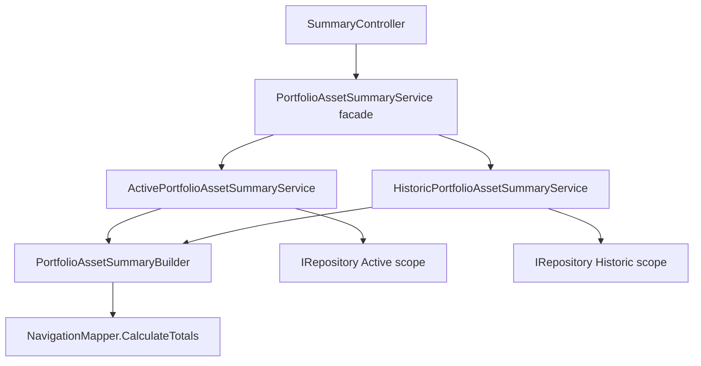

# Historic Realized Totals Service

## 1. Technical Overview

**What:** Make the per-asset portfolio summary returned under `scope=historic` give closed positions metrics that actually mean something: a new `RealizedGainLoss` field, and `PortfolioWeight`/credit-percentage figures weighted by gross `TotalBought` instead of the net-invested formula (`TotalBought - TotalSold`) `PortfolioAssetSummaryService` currently applies to every scope.

**Why:** F05 already made `GET /summary/portfolio/{broker}/{portfolio}/assets` fully scope-aware end to end (repository, controller, DTO plumbing), but the one class doing the metric math, `PortfolioAssetSummaryService`, still weights every percentage-style field by net invested regardless of scope. For a closed historic position, `TotalBought` and `TotalSold` are close in magnitude, so `PortfolioWeight` collapses toward zero (or negative on a loss) — the exact defect F07 already fixed once for the breakdown chart's sizing metric, now showing up in the per-asset summary. Discovery also found the credit-analysis percentage fields (`LastMonthCreditsPercent`, `EstimatedAnnualPercent`) share the same near-zero denominator, though the PRD's F06 acceptance criteria don't name them.

**Scope:**

Included:
- Splitting the existing single-scope metric logic into an Active-scope implementation (net-invested weighting, unchanged behavior) and a Historic-scope implementation (gross-`TotalBought` weighting, adds `RealizedGainLoss`)
- Extracting the shared per-asset computation and portfolio-level aggregation logic so both implementations reuse it instead of duplicating it
- A facade that preserves the existing public `IPortfolioAssetSummaryService` contract so `SummaryController` and its `scope=historic` endpoint (already shipped in F05) require no changes
- Renaming the current `PortfolioAssetSummaryService` class to `ActivePortfolioAssetSummaryService`, matching the scope-explicit-naming precedent F07 set for `BrokerBreakdownService` → `ActiveBrokerBreakdownService`
- New `RealizedGainLoss` field on `PortfolioAssetSummaryItemDTO` (`decimal?`, `TotalSold - TotalBought + TotalCredits` for Historic, always `null` for Active) and its TS type
- Fixing `LastMonthCreditsPercent`/`EstimatedAnnualPercent` for Historic scope to use the same gross-`TotalBought` denominator as `PortfolioWeight`, instead of the net-invested figure that collapses toward zero
- Unit and integration test coverage for the new metric behavior, the shared builder, and the facade's dispatch logic

Excluded (already delivered by earlier features, or explicitly out of scope per the PRD, not touched here):
- The `scope` query parameter, `InvestmentScopeParser`, and `SummaryController` routing (F05)
- Repository-level scope resolution (`IRepository`, `JSONRepository`) (F02/F05)
- Current price fetch and XIRR calculation — the PRD explicitly excludes these for Historic scope, and discovery confirmed `PortfolioAssetSummaryService`/`PortfolioAssetSummaryItemDTO` never fetched a price or computed XIRR to begin with (that happens entirely client-side, downstream, per consumer) — nothing to strip out here
- `CashFlows` field — stays populated for Historic assets too (scope-agnostic, harmless historical data); no scope-specific handling needed
- Any Web/WPF UI consuming these fields (`usePortfolioAssetSummary.ts`, `PortfolioSummaryTab.tsx`, `PortfolioAssetSummaryRowViewModel.cs`) — that's F09 (Web) and F11 (WPF), both listed as depending on F06 in the PRD; this feature is backend-only, matching its PRD Experience note ("No direct UI")

## 2. Architecture Impact

**Affected components:**
- `Financial.Application/Services/PortfolioAssetSummaryBuilder.cs` (new) — shared, scope-agnostic per-asset computation and portfolio-level aggregation
- `Financial.Application/Services/ActivePortfolioAssetSummaryService.cs` (new file, renamed from `PortfolioAssetSummaryService.cs`)
- `Financial.Application/Services/HistoricPortfolioAssetSummaryService.cs` (new)
- `Financial.Application/Services/PortfolioAssetSummaryService.cs` (modified — becomes the scope-dispatch facade)
- `Financial.Application/Interfaces/IActivePortfolioAssetSummaryService.cs` (new)
- `Financial.Application/Interfaces/IHistoricPortfolioAssetSummaryService.cs` (new)
- `Financial.Application/Interfaces/IPortfolioAssetSummaryService.cs` (unchanged — facade keeps implementing this exact contract)
- `Financial.Application/DTOs/PortfolioAssetSummaryItemDTO.cs` (modified — new `RealizedGainLoss` field)
- `Financial.Application/DependencyInjection/ApplicationServiceCollectionExtensions.cs` (modified — DI registration)
- `Financial.Web/src/api/types.ts` (modified — TS type parity for the new field; no UI consumption)
- `Financial.Api/Controllers/SummaryController.cs` (unchanged — the facade absorbs scope dispatch, matching F07's outcome)



## 3. Technical Decisions

| Decision | Chosen Approach | Alternative Considered | Trade-off |
|----------|----------------|----------------------|-----------|
| Service topology | Two scope-specific classes (`ActivePortfolioAssetSummaryService`, `HistoricPortfolioAssetSummaryService`) behind a facade that keeps implementing `IPortfolioAssetSummaryService` | Extend the existing single `PortfolioAssetSummaryService` in place with an internal scope branch on the weighting formula | Mirrors F07's `BrokerBreakdownService` split exactly — same problem shape (a formula wrong for one scope), same fix. Deviating now would leave two different patterns solving the same class of problem in the same codebase |
| Scope dispatch location | A facade (`PortfolioAssetSummaryService`) in the Application layer holds both scoped implementations and picks one based on the `scope` value it already receives; `SummaryController` is unmodified | `SummaryController` injects both scoped services directly and branches on the parsed scope itself | Keeps the Presentation layer free of a scope-routing decision, consistent with CLAUDE.md's Clean Architecture rule and every other endpoint in this codebase (none branch on scope in the controller) |
| Shared per-asset/aggregation logic | Extracted into `PortfolioAssetSummaryBuilder`, an internal static class taking a weight-basis selector (`Func<AssetTotals, decimal>`) and a realized-gain-loss selector (`Func<AssetTotals, decimal?>`) supplied by the caller | Duplicate the per-asset computation, credits-analysis, and portfolio-weight aggregation block in both scoped services | One extra file, but eliminates duplicating the ~50-line computation/aggregation block that would otherwise diverge over time between the two scopes |
| Historic weighting basis | Gross `TotalBought` per asset, used for both `PortfolioWeight` and the credit-analysis percentage fields (`LastMonthCreditsPercent`, `EstimatedAnnualPercent`) | Net invested (`TotalBought - TotalSold`, today's formula) for all three fields | PRD-mandated for `PortfolioWeight`; extended to the two credit-percentage fields since they share the identical root cause (net-invested denominator collapsing toward zero for a closed position) — leaving them unfixed would ship a feature explicitly built to give Historic assets sane numbers next to two fields still nonsensical for that exact scope |
| `RealizedGainLoss` for Active scope | Always `null` | Compute `TotalSold - TotalBought + TotalCredits` for Active too | The PRD frames this as a closed-position concept ("how did my closed strategy perform"); a nonzero value for an open Active position doesn't represent a realized gain, so `null` signals "not applicable" rather than a real-but-misleading number |

## 4. Component Overview

**Backend:**

| File Path | New/Modified | Purpose | Key Responsibilities |
|-----------|--------------|---------|---------------------|
| `Financial.Application/Services/PortfolioAssetSummaryBuilder.cs` | New | Shared, scope-agnostic per-asset computation and aggregation | Computes `TotalBought`/`TotalSold`/`TotalCredits`/`CashFlows`/credits-analysis per asset via `NavigationMapper.CalculateTotals`; sums a caller-supplied weight-basis selector across the portfolio and calculates each asset's `PortfolioWeight` and credit percentages against that sum; assembles `PortfolioAssetSummaryItemDTO`, applying a caller-supplied `RealizedGainLoss` selector |
| `Financial.Application/Services/ActivePortfolioAssetSummaryService.cs` | New (renamed from `PortfolioAssetSummaryService.cs`) | Active-scope summary | Looks up assets from the repository's Active scope; supplies net invested (`TotalBought - TotalSold`) as the weight-basis selector; supplies a selector that always returns `null` for `RealizedGainLoss`; guards null/blank broker/portfolio names |
| `Financial.Application/Services/HistoricPortfolioAssetSummaryService.cs` | New | Historic-scope summary | Looks up assets from the repository's Historic scope; supplies gross `TotalBought` as the weight-basis selector; supplies `TotalSold - TotalBought + TotalCredits` as the `RealizedGainLoss` selector; same guard behavior as the Active service |
| `Financial.Application/Services/PortfolioAssetSummaryService.cs` | Modified | Scope-dispatch facade | Implements the existing `IPortfolioAssetSummaryService` contract unchanged; routes to `IActivePortfolioAssetSummaryService` or `IHistoricPortfolioAssetSummaryService` based on the `InvestmentScope` argument |
| `Financial.Application/Interfaces/IActivePortfolioAssetSummaryService.cs` | New | Active-scope contract | Single method: `GetPortfolioAssetsSummary(string brokerName, string portfolioName)` — no scope parameter, scope is implicit in the interface |
| `Financial.Application/Interfaces/IHistoricPortfolioAssetSummaryService.cs` | New | Historic-scope contract | Single method, same shape as the Active contract |
| `Financial.Application/Interfaces/IPortfolioAssetSummaryService.cs` | Unchanged | Facade contract consumed by `SummaryController` | `GetPortfolioAssetsSummary(string brokerName, string portfolioName, InvestmentScope scope = InvestmentScope.Active)` — identical to today |
| `Financial.Application/DTOs/PortfolioAssetSummaryItemDTO.cs` | Modified | Add realized-gain-loss field | New `decimal? RealizedGainLoss { get; init; }` property |
| `Financial.Application/DependencyInjection/ApplicationServiceCollectionExtensions.cs` | Modified | DI registration | Replaces the single `IPortfolioAssetSummaryService` registration with `ActivePortfolioAssetSummaryService`, `HistoricPortfolioAssetSummaryService`, and the facade, matching F07's registration ordering (scoped implementations first, facade last) |
| `Financial.Web/src/api/types.ts` | Modified | TS contract parity | Adds `realizedGainLoss: number \| null` to `PortfolioAssetSummaryItemDto` — type only, no consuming UI code changes |

## 5. API Contracts

No new endpoint and no request/response shape change beyond one added field — the existing endpoint from F05 is reused unmodified; only the returned values (and the new field) for `scope=historic` change.

**Endpoint: Get Portfolio Assets Summary (existing, unchanged surface)**
- **Method:** GET
- **Path:** `/api/v1/financial/summary/portfolio/{brokerName}/{portfolioName}/assets`
- **Authentication:** None (single-user local application)

**Request:**

| Field | Type | Required | Validation | Description |
|-------|------|----------|------------|--------------|
| `brokerName` | `string` (route) | Yes | non-empty | Broker to build the summary for |
| `portfolioName` | `string` (route) | Yes | non-empty | Portfolio to build the summary for |
| `scope` | `string` (query) | No | `active`\|`historic`, case-insensitive; unparseable/absent defaults to `active` | Selects which collection to build the summary from |

**Response (Success - 200):** DTO shape unchanged except for one added field.

| Field | Type | Description |
|-------|------|--------------|
| `[].totalBought` / `totalSold` / `totalCredits` | `decimal` | Unchanged from today, per-asset historical cash flows |
| `[].realizedGainLoss` | `decimal?` (new) | `TotalSold - TotalBought + TotalCredits` for `scope=historic`; always `null` for `scope=active` |
| `[].portfolioWeight` | `decimal` | For `scope=active`: unchanged, weighted by net invested. For `scope=historic`: weighted by gross `TotalBought` — this is the value this feature changes |
| `[].lastMonthCreditsPercent` / `[].estimatedAnnualPercent` | `decimal?` | Same per-scope weighting-basis change as `portfolioWeight` |

**Response Example (`scope=historic`):**
```json
[
  {
    "assetName": "CLOSEDASSET",
    "totalBought": 300.00,
    "totalSold": 250.00,
    "totalCredits": 0.00,
    "realizedGainLoss": -50.00,
    "portfolioWeight": 100.00,
    "lastMonthCreditsPercent": null
  }
]
```

**Error Codes:** unchanged from F05 — `400 Bad Request` for a null/blank `brokerName`/`portfolioName`.

## 6. Data Model

No schema or `data.json` changes. This feature reads the same `Broker → Portfolio → Asset` structures already established by F02, through the same `IRepository`/`InvestmentScope` abstraction already scope-aware since F05. `Asset.Transactions`/`Asset.Credits` — the source of every figure via `NavigationMapper.CalculateTotals` — are unchanged.

## 7. Testing Strategy

| Test File | Test Type | Target | Coverage Goal |
|-----------|-----------|--------|---------------|
| `Tests/Financial.Application.Tests/Services/PortfolioAssetSummaryBuilderTests.cs` | Unit | `PortfolioAssetSummaryBuilder` | Weight/percentage calculation against a caller-supplied basis selector, `RealizedGainLoss` selector application, independent of scope |
| `Tests/Financial.Application.Tests/Services/ActivePortfolioAssetSummaryServiceTests.cs` | Unit | `ActivePortfolioAssetSummaryService` | Net-invested weighting (unchanged behavior), `RealizedGainLoss` always `null`, Active-scope repository lookup, guard clauses |
| `Tests/Financial.Application.Tests/Services/HistoricPortfolioAssetSummaryServiceTests.cs` | Unit | `HistoricPortfolioAssetSummaryService` | Gross-`TotalBought` weighting, `RealizedGainLoss` computed correctly, Historic-scope repository lookup, guard clauses |
| `Tests/Financial.Application.Tests/Services/PortfolioAssetSummaryServiceTests.cs` | Unit | `PortfolioAssetSummaryService` (facade) | Scope-based dispatch to the correct underlying service |
| `Tests/Financial.Api.Tests/SummaryEndpointsTests.cs` | Integration | `GET /summary/portfolio/{broker}/{portfolio}/assets` | Historic-scope response values (`realizedGainLoss`, `portfolioWeight`), Active-scope regression, weights summing to 100% |

**Test functions:**

`PortfolioAssetSummaryBuilderTests.cs`
| Test Function | Description | Assertions |
|---------------|-------------|------------|
| `Build_UsesProvidedSelectorForPortfolioWeight` | Selector returning a fixed basis value | `PortfolioWeight` reflects the selector's output relative to the portfolio sum, not a hardcoded formula |
| `Build_PortfolioWeightsSumTo100Percent` | Multiple assets with distinct weight-basis values | Sum of `PortfolioWeight` across all assets equals 100% |
| `Build_ReturnsZeroWeight_WhenPortfolioBasisSumIsZero` | All assets' selector output is zero | Every asset's `PortfolioWeight` is `0`, no division-by-zero |
| `Build_AppliesRealizedGainLossSelector` | Selector returning a fixed value / `null` | `RealizedGainLoss` on the DTO equals the selector's output exactly |
| `Build_SortsAssetsAlphabetically` | Multiple assets, out-of-order input | Result ordered case-insensitively by `AssetName` |

`ActivePortfolioAssetSummaryServiceTests.cs`
| Test Function | Description | Assertions |
|---------------|-------------|------------|
| `Constructor_WithNullRepository_Throws` | Null `IRepository` | Throws `ArgumentNullException` |
| `GetPortfolioAssetsSummary_WeightsByNetInvested` | Asset with distinct `TotalBought`/`TotalSold` | `PortfolioWeight` reflects `TotalBought - TotalSold`, matching today's behavior |
| `GetPortfolioAssetsSummary_RealizedGainLossIsAlwaysNull` | Any asset, including one with `TotalSold > TotalBought` | `RealizedGainLoss` is `null` |
| `GetPortfolioAssetsSummary_QueriesActiveScopeFromRepository` | Any broker/portfolio | Repository is queried with `InvestmentScope.Active` |
| `GetPortfolioAssetsSummary_ReturnsEmptyOnNullOrWhitespaceBrokerName` | `[Theory]` over `null`/`""`/`"   "` | Empty result, no repository call |

`HistoricPortfolioAssetSummaryServiceTests.cs`
| Test Function | Description | Assertions |
|---------------|-------------|------------|
| `Constructor_WithNullRepository_Throws` | Null `IRepository` | Throws `ArgumentNullException` |
| `GetPortfolioAssetsSummary_WeightsByGrossTotalBought` | Asset with `TotalBought` and non-zero `TotalSold` | `PortfolioWeight` reflects gross `TotalBought`, not `TotalBought - TotalSold` |
| `GetPortfolioAssetsSummary_ComputesRealizedGainLoss` | Asset with known `TotalBought`/`TotalSold`/`TotalCredits` | `RealizedGainLoss` equals `TotalSold - TotalBought + TotalCredits` |
| `GetPortfolioAssetsSummary_CreditPercentFields_UseGrossTotalBoughtBasis` | Asset with credits and a fully-closed position (`TotalSold` ≈ `TotalBought`) | `LastMonthCreditsPercent`/`EstimatedAnnualPercent` are finite, sane values instead of collapsing toward a huge or negative percentage |
| `GetPortfolioAssetsSummary_QueriesHistoricScopeFromRepository` | Any broker/portfolio | Repository is queried with `InvestmentScope.Historic` |
| `GetPortfolioAssetsSummary_ReturnsEmptyOnNullOrWhitespaceBrokerName` | `[Theory]` over `null`/`""`/`"   "` | Empty result, no repository call |

`PortfolioAssetSummaryServiceTests.cs` (facade)
| Test Function | Description | Assertions |
|---------------|-------------|------------|
| `Constructor_WithNullDependencies_Throws` | Null Active or Historic service dependency | Throws `ArgumentNullException` |
| `GetPortfolioAssetsSummary_DefaultScope_DelegatesToActiveService` | No scope argument supplied | `IActivePortfolioAssetSummaryService.GetPortfolioAssetsSummary` invoked |
| `GetPortfolioAssetsSummary_ScopeHistoric_DelegatesToHistoricService` | `InvestmentScope.Historic` | `IHistoricPortfolioAssetSummaryService.GetPortfolioAssetsSummary` invoked |

`SummaryEndpointsTests.cs` (acceptance/integration — maps to PRD Section 9 F06 criteria and the Cross-Feature Integration criteria tying F05 to F06)
| Test Function | Description | Assertions |
|---------------|-------------|------------|
| `GetPortfolioAssetsSummary_ScopeHistoric_ReturnsRealizedGainLoss` (extend existing historic-scope test) | `scope=historic` for a portfolio with a closed asset | `200 OK`; `realizedGainLoss` equals `TotalSold - TotalBought + TotalCredits` from the fixture |
| `GetPortfolioAssetsSummary_ScopeHistoric_PortfolioWeightsSumTo100` (new) | `scope=historic`, multiple historic assets | Sum of `portfolioWeight` across the response equals 100% |
| `GetPortfolioAssetsSummary_ScopeActive_PreservesNetInvestedWeightingAndNullRealizedGainLoss` (new) | `scope=active`/omitted, unchanged fixture | `portfolioWeight` still net-invested; `realizedGainLoss` is `null` — regression guard proving the facade split didn't alter Active behavior |
