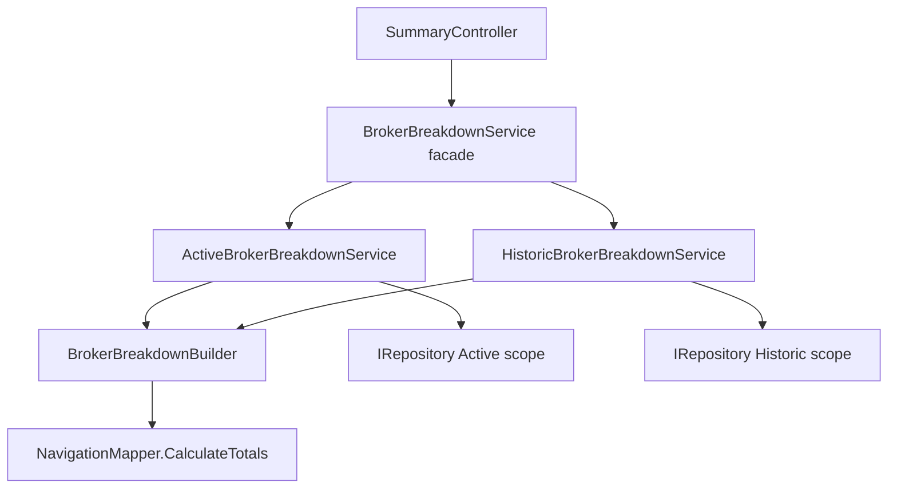

# Historic Broker Breakdown Charts Service

## 1. Technical Overview

**What:** Make the broker breakdown chart data returned under `scope=historic` size each historic asset/portfolio by gross `TotalBought` (capital historically committed) instead of the net-invested formula (`TotalBought - TotalSold`) the existing `BrokerBreakdownService` currently applies to every scope. Active-scope behavior stays exactly as it is today.

**Why:** F05 already made the breakdown endpoint fully scope-aware end to end (repository, controller, DTOs), but the one class doing the sizing math, `BrokerBreakdownService`, still applies the same net-invested formula regardless of scope. For a closed historic position, `TotalBought` and `TotalSold` are close in magnitude, so the net figure collapses toward zero (or negative on a loss) — exactly the defect the PRD calls out when it says a closed position's current value is always zero and asks for gross committed capital instead.

**Scope:**

Included:
- Splitting the existing single-scope sizing logic into an Active-scope implementation (net invested, unchanged behavior) and a Historic-scope implementation (gross `TotalBought`)
- Extracting the shared portfolio/asset filtering, sorting, and DTO-building logic so both implementations reuse it instead of duplicating it
- A facade that preserves the existing public `IBrokerBreakdownService` contract so `SummaryController` and its `scope=historic` endpoint (already shipped in F05) require no changes
- Renaming the current `BrokerBreakdownService` class to `ActiveBrokerBreakdownService` to make its scope explicit, since it is no longer the only breakdown service in the codebase
- Unit and integration test coverage for the new sizing behavior, the shared builder, and the facade's dispatch logic
- Updating the F07 capability wording in the PRD to reflect the class names introduced here

Excluded (already delivered by earlier features, not touched here):
- The `scope` query parameter, `InvestmentScopeParser`, and `NavigationController`/`SummaryController` routing (F05)
- Repository-level scope resolution (`IRepository`, `JSONRepository`) (F02/F05)
- `PortfolioBreakdownItemDTO`/`AssetBreakdownItemDTO` shape and the frontend `BrokerBreakdownCharts.tsx` consumer — both are reused unmodified, per the PRD's explicit requirement that Historic returns "the same DTO shape the Active breakdown already returns"
- Historic Realized Totals (F06) — not a dependency of F07 and not implemented yet; F07 does not consume it

## 2. Architecture Impact

**Affected components:**
- `Financial.Application/Services/BrokerBreakdownBuilder.cs` (new) — shared, scope-agnostic breakdown construction
- `Financial.Application/Services/ActiveBrokerBreakdownService.cs` (new file, renamed from `BrokerBreakdownService.cs`)
- `Financial.Application/Services/HistoricBrokerBreakdownService.cs` (new)
- `Financial.Application/Services/BrokerBreakdownService.cs` (modified — becomes the scope-dispatch facade)
- `Financial.Application/Interfaces/IActiveBrokerBreakdownService.cs` (new)
- `Financial.Application/Interfaces/IHistoricBrokerBreakdownService.cs` (new)
- `Financial.Application/Interfaces/IBrokerBreakdownService.cs` (unchanged — facade keeps implementing this exact contract)
- `Financial.Application/DependencyInjection/ApplicationServiceCollectionExtensions.cs` (modified — DI registration)
- `Financial.Api/Controllers/SummaryController.cs` (unchanged — the facade absorbs the scope dispatch so the controller's existing call site is untouched)



## 3. Technical Decisions

| Decision | Chosen Approach | Alternative Considered | Trade-off |
|----------|----------------|----------------------|-----------|
| Service topology | Two scope-specific classes (`ActiveBrokerBreakdownService`, `HistoricBrokerBreakdownService`) behind a facade that keeps implementing `IBrokerBreakdownService` | Extend the existing single `BrokerBreakdownService` in place with an internal scope branch on the sizing formula | More files/interfaces for one narrow behavioral difference, but each class now has a single, explicit responsibility and scope is no longer a silent runtime branch buried inside metric math — matches user direction to make the Active/Historic split explicit in naming |
| Scope dispatch location | A facade (`BrokerBreakdownService`) in the Application layer holds both scoped implementations and picks one based on the `scope` value it already receives; `SummaryController` is unmodified | `SummaryController` injects both scoped services directly and branches on the parsed scope itself | Keeping the branch in the facade means the Presentation layer never makes a routing decision between two service instances, consistent with CLAUDE.md's Clean Architecture rule that Presentation must not contain business logic, and consistent with every other endpoint in this codebase, none of which branch on scope in the controller |
| Shared sort/filter/DTO logic | Extracted into `BrokerBreakdownBuilder`, an internal static class parameterized by an `investedSelector` delegate (`Func<Asset, decimal>`) supplied by the caller | Duplicate the filtering/sorting/DTO-building block in both `ActiveBrokerBreakdownService` and `HistoricBrokerBreakdownService` | One extra file, but eliminates duplicating the ~25-line filter/sort/DTO-assembly block that would otherwise diverge over time between the two scopes |
| Historic sizing metric | Gross `TotalBought` per asset (from `NavigationMapper.CalculateTotals`) | Net invested (`TotalBought - TotalSold`, today's formula) or current value | PRD-mandated: a closed position's current value is always zero, and net invested collapses toward zero for a fully-closed position, which is the defect this feature exists to fix |

## 4. Component Overview

**Backend:**

| File Path | New/Modified | Purpose | Key Responsibilities |
|-----------|--------------|---------|---------------------|
| `Financial.Application/Services/BrokerBreakdownBuilder.cs` | New | Shared, scope-agnostic breakdown construction | Filters assets/portfolios to those with a positive selected amount; sorts portfolios and assets alphabetically; assembles `PortfolioBreakdownItemDTO`/`AssetBreakdownItemDTO` from a caller-supplied invested-amount selector |
| `Financial.Application/Services/ActiveBrokerBreakdownService.cs` | New (renamed from `BrokerBreakdownService.cs`) | Active-scope breakdown | Looks up the broker from the repository's Active scope; supplies `TotalBought - TotalSold` as the builder's selector; guards null/blank broker names and unknown brokers |
| `Financial.Application/Services/HistoricBrokerBreakdownService.cs` | New | Historic-scope breakdown | Looks up the broker from the repository's Historic scope; supplies gross `TotalBought` as the builder's selector; same guard behavior as the Active service |
| `Financial.Application/Services/BrokerBreakdownService.cs` | Modified | Scope-dispatch facade | Implements the existing `IBrokerBreakdownService` contract unchanged; routes to `IActiveBrokerBreakdownService` or `IHistoricBrokerBreakdownService` based on the `InvestmentScope` argument |
| `Financial.Application/Interfaces/IActiveBrokerBreakdownService.cs` | New | Active-scope contract | Single method: `GetBrokerBreakdown(string brokerName)` — no scope parameter, scope is implicit in the interface |
| `Financial.Application/Interfaces/IHistoricBrokerBreakdownService.cs` | New | Historic-scope contract | Single method: `GetBrokerBreakdown(string brokerName)` — same shape as the Active contract |
| `Financial.Application/Interfaces/IBrokerBreakdownService.cs` | Unchanged | Facade contract consumed by `SummaryController` | `GetBrokerBreakdown(string brokerName, InvestmentScope scope = InvestmentScope.Active)` — identical to today, no changes needed |
| `Financial.Application/DependencyInjection/ApplicationServiceCollectionExtensions.cs` | Modified | DI registration | Registers `ActiveBrokerBreakdownService`, `HistoricBrokerBreakdownService`, and the `BrokerBreakdownService` facade as singletons, matching the existing registration style for every other Application service |

## 5. API Contracts

No new endpoint and no request/response shape change — the existing endpoint from F05 is reused unmodified; only the returned values for `scope=historic` change.

**Endpoint: Get Broker Breakdown (existing, unchanged surface)**
- **Method:** GET
- **Path:** `/api/v1/financial/summary/broker/{brokerName}/breakdown`
- **Authentication:** None (single-user local application)

**Request:**

| Field | Type | Required | Validation | Description |
|-------|------|----------|------------|--------------|
| `brokerName` | `string` (route) | Yes | non-empty | Broker to build the breakdown for |
| `scope` | `string` (query) | No | `active`\|`historic`, case-insensitive; unparseable/absent defaults to `active` | Selects which collection (`activeInvestments`/`historicInvestments`) to build the breakdown from |

**Response (Success - 200):** DTO shape unchanged from today.

| Field | Type | Description |
|-------|------|--------------|
| `[].portfolioName` | `string` | Historic portfolio name, resolved by F03/F04 (classification-based or per-broker `Uncategorized` fallback) |
| `[].totalInvested` | `decimal` | For `scope=active`: net invested (`TotalBought - TotalSold`), unchanged. For `scope=historic`: gross `TotalBought` — this is the value this feature changes |
| `[].assets[].assetName` | `string` | Asset name |
| `[].assets[].totalInvested` | `decimal` | Same per-scope semantics as the portfolio-level field, at asset granularity |

**Response Example (`scope=historic`):**
```json
[
  {
    "portfolioName": "Uncategorized",
    "totalInvested": 5000.00,
    "assets": [
      { "assetName": "CLOSEDASSET", "totalInvested": 5000.00 }
    ]
  }
]
```

**Error Codes:** unchanged from F05 — `400 Bad Request` for a null/blank `brokerName`; an unknown broker or a historic portfolio with no qualifying assets is omitted from the array rather than erroring.

## 6. Data Model

No schema or `data.json` changes. This feature reads the same `Broker → Portfolio → Asset` structures already established by F02, through the same `IRepository`/`InvestmentScope` abstraction already scope-aware since F05. `Asset.Transactions`/`Asset.Credits` — the source of the `TotalBought`/`TotalSold`/`TotalCredits` figures via `NavigationMapper.CalculateTotals` — are unchanged.

## 7. Testing Strategy

| Test File | Test Type | Target | Coverage Goal |
|-----------|-----------|--------|---------------|
| `Tests/Financial.Application.Tests/Services/BrokerBreakdownBuilderTests.cs` | Unit | `BrokerBreakdownBuilder` | Filtering/sorting/DTO-assembly behavior, independent of scope |
| `Tests/Financial.Application.Tests/Services/ActiveBrokerBreakdownServiceTests.cs` | Unit | `ActiveBrokerBreakdownService` | Net-invested sizing, Active-scope repository lookup, guard clauses |
| `Tests/Financial.Application.Tests/Services/HistoricBrokerBreakdownServiceTests.cs` | Unit | `HistoricBrokerBreakdownService` | Gross-`TotalBought` sizing, Historic-scope repository lookup, guard clauses |
| `Tests/Financial.Application.Tests/Services/BrokerBreakdownServiceTests.cs` | Unit | `BrokerBreakdownService` (facade) | Scope-based dispatch to the correct underlying service |
| `Tests/Financial.Api.Tests/SummaryEndpointsTests.cs` | Integration | `GET /summary/broker/{name}/breakdown` | Historic-scope response values, Active-scope regression, empty-portfolio exclusion |

**Test functions:**

`BrokerBreakdownBuilderTests.cs`
| Test Function | Description | Assertions |
|---------------|-------------|------------|
| `Build_ExcludesAssetsWithNonPositiveSelectedAmount` | Asset whose selector result is `<= 0` | Asset absent from the built portfolio's `Assets` |
| `Build_ExcludesPortfoliosWithNoQualifyingAssets` | Portfolio where every asset is filtered out | Portfolio absent from the result |
| `Build_SortsPortfoliosAlphabetically` | Multiple portfolios, out-of-order input | Result ordered case-insensitively by `PortfolioName` |
| `Build_SortsAssetsAlphabeticallyWithinPortfolio` | Multiple assets, out-of-order input | `Assets` ordered case-insensitively by `AssetName` |
| `Build_UsesProvidedSelectorForAssetAmount` | Selector returning a fixed value | `AssetBreakdownItemDTO.TotalInvested`/`PortfolioBreakdownItemDTO.TotalInvested` equal the selector's output, not a hardcoded formula |

`ActiveBrokerBreakdownServiceTests.cs`
| Test Function | Description | Assertions |
|---------------|-------------|------------|
| `Constructor_WithNullRepository_Throws` | Null `IRepository` | Throws `ArgumentNullException` |
| `GetBrokerBreakdown_UsesNetInvestedAsSelectedAmount` | Asset with distinct `TotalBought`/`TotalSold` | Returned amount equals `TotalBought - TotalSold` |
| `GetBrokerBreakdown_QueriesActiveScopeFromRepository` | Any broker | Repository is queried with `InvestmentScope.Active` |
| `GetBrokerBreakdown_ReturnsEmptyForUnknownBroker` | Broker name not present in Active collection | Empty result |
| `GetBrokerBreakdown_ReturnsEmptyOnNullOrWhitespaceBrokerName` | `[Theory]` over `null`/`""`/`"   "` | Empty result, no repository call |

`HistoricBrokerBreakdownServiceTests.cs`
| Test Function | Description | Assertions |
|---------------|-------------|------------|
| `Constructor_WithNullRepository_Throws` | Null `IRepository` | Throws `ArgumentNullException` |
| `GetBrokerBreakdown_UsesGrossTotalBoughtAsSelectedAmount` | Asset with `TotalBought` and non-zero `TotalSold` | Returned amount equals `TotalBought`, not `TotalBought - TotalSold` |
| `GetBrokerBreakdown_IncludesFullyClosedPositionWithNonZeroTotalBought` | Fully closed position where `TotalSold` ≈ `TotalBought` | Asset is present in the result sized by gross `TotalBought` (the defect this feature fixes) |
| `GetBrokerBreakdown_QueriesHistoricScopeFromRepository` | Any broker | Repository is queried with `InvestmentScope.Historic` |
| `GetBrokerBreakdown_ReturnsEmptyForUnknownBroker` | Broker name not present in Historic collection | Empty result |
| `GetBrokerBreakdown_ReturnsEmptyOnNullOrWhitespaceBrokerName` | `[Theory]` over `null`/`""`/`"   "` | Empty result, no repository call |

`BrokerBreakdownServiceTests.cs`
| Test Function | Description | Assertions |
|---------------|-------------|------------|
| `Constructor_WithNullDependencies_Throws` | Null Active or Historic service dependency | Throws `ArgumentNullException` |
| `GetBrokerBreakdown_DefaultScope_DelegatesToActiveService` | No scope argument supplied | `IActiveBrokerBreakdownService.GetBrokerBreakdown` invoked |
| `GetBrokerBreakdown_ScopeActive_DelegatesToActiveService` | `InvestmentScope.Active` | `IActiveBrokerBreakdownService.GetBrokerBreakdown` invoked |
| `GetBrokerBreakdown_ScopeHistoric_DelegatesToHistoricService` | `InvestmentScope.Historic` | `IHistoricBrokerBreakdownService.GetBrokerBreakdown` invoked |

`SummaryEndpointsTests.cs` (acceptance/integration — maps to PRD Section 9 F07 criteria and the Cross-Feature Integration criterion tying F05 to F07)
| Test Function | Description | Assertions |
|---------------|-------------|------------|
| `GetBrokerBreakdown_ScopeHistoric_ReturnsHistoricOnly` (extend existing) | `scope=historic` for a broker with a closed asset | `200 OK`; portfolio/asset `totalInvested` equal gross `TotalBought` from the fixture, not net invested |
| `GetBrokerBreakdown_ScopeHistoric_ExcludesPortfolioWithNoAssets` | Historic broker with an empty portfolio | Portfolio absent from the response — F07 acceptance criterion |
| `GetBrokerBreakdown_ScopeActive_PreservesNetInvestedBehavior` | `scope=active`/omitted, unchanged fixture | `totalInvested` still equals `TotalBought - TotalSold` — regression guard proving the facade split didn't alter Active behavior |
