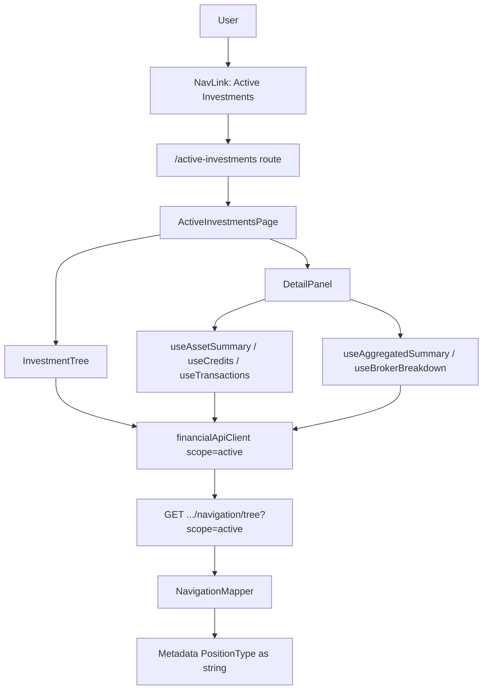

# Web — Active Investments Tab Update

## 1. Technical Overview

**What:** Relabel the Web app's "Portfolio Navigator" tab to "Active Investments", make its data fetching explicitly scope-pure (`scope=active`) now that F02/F05 have shipped the Active/Historic split, and replace the boolean active/inactive status indicator (tree + detail panel) with a three-way `Long`/`Flat`/`Short` → green/black/red mapping driven by F01's `positionType` field.

**Why:** Today's page relies entirely on the backend's implicit `Active` default to stay scope-pure — no Web call site passes `scope` at all. That's a silent dependency on a default that could change. The status indicator is still driven by the old `IsActive` boolean, which cannot distinguish a closed position from an open short — exactly the ambiguity F01's `PositionType` was built to resolve, but nothing on the Web frontend consumes it yet. Discovery also surfaced a real defect blocking this: the navigation tree's `Metadata["PositionType"]` currently serializes as a raw integer (`0`/`1`/`2`), not the string every other typed enum property in this codebase uses (`AssetNodeDTO`/`AssetDetailsDTO` both apply `[JsonConverter(typeof(JsonStringEnumConverter))]` to their `PositionType` property) — confirmed by hitting the live endpoint. This is fixed as part of this feature since F08 is the first and only consumer of that metadata field.

**Scope:**

Included:
- Backend: fix `Metadata["PositionType"]`'s serialization to a string, matching the codebase's established enum-as-string convention
- Nav label rename ("Portfolio Navigator" → "Active Investments") and route rename (`/portfolio-navigator` → `/active-investments`)
- Explicit `scope=active` on every scope-capable endpoint this page's component tree reaches: navigation tree, broker/portfolio summary, broker breakdown, and asset details (which also covers the Summary/Credits/Transactions tabs, since all three hooks feeding them call the now-scoped asset-details endpoint)
- Three-way position-type color/status indicator in both `InvestmentTree` and `DetailPanel`, replacing the boolean `isActive` check in both places
- Page/file rename (`PortfolioNavigatorPage` → `ActiveInvestmentsPage`) for scope-explicit naming, matching the precedent set by F07's `BrokerBreakdownService` → `ActiveBrokerBreakdownService` rename

Excluded (deferred to later features, not touched here):
- `useCredits`/`useTransactions`'s own list-fetching calls (`getCreditsByBroker`, `getTransactionsByPortfolio`, etc.) — these have no backend scope parameter at all; F05 explicitly left `CreditService`/`TransactionService` outside its scoped surface, and F08 doesn't reopen that
- `getBrokers` (used only by the unrelated `CurrentValuesPage`) — left untouched, no historic use case there
- Any reusable `scope` prop/parameter threading through `InvestmentTree`/`DetailPanel`/hooks for F09's future reuse — F09 is not a dependency of F08 per the PRD's dependency graph; `scope=active` is hardcoded, and F09 threads its own parameter when it's implemented
- WPF (`Financial.App`) — that's F10, a separate feature; this spec touches only `Financial.Web` and the one backend metadata fix

## 2. Architecture Impact

**Affected components:**
- `Financial.Application/Services/NavigationMapper.cs` — `Metadata["PositionType"]` serialization fix
- `Financial.Web/src/api/types.ts` — `PositionType` union type; DTO/`SelectedNode` field updates
- `Financial.Web/src/api/financialApiClient.ts` — `scope=active` on 5 methods
- `Financial.Web/src/components/InvestmentTree.tsx` + `.css` — three-way status indicator
- `Financial.Web/src/components/DetailPanel.tsx` + `.css` — three-way status indicator
- `Financial.Web/src/pages/ActiveInvestmentsPage.tsx` + `.css` (renamed from `PortfolioNavigatorPage`)
- `Financial.Web/src/App.tsx`, `Financial.Web/src/main.tsx` — label/route rename



## 3. Technical Decisions

| Decision | Chosen Approach | Alternative Considered | Trade-off |
|----------|----------------|----------------------|-----------|
| `PositionType` metadata serialization | Fix `NavigationMapper.cs` to emit `asset.PositionType.ToString()`, matching the DTO-level convention (`CountryCode`/`GlobalAssetClass`/`PositionType` all use `JsonStringEnumConverter` on `AssetNodeDTO`) | Read the raw integer ordinal on the frontend via the existing `getMetaNumber` pattern (as `GlobalAssetClass` already does) | Touches already-merged F01/F05 backend code for a defect F08 is the first feature to expose, but keeps the wire format consistent with every other typed enum in the API instead of adding a second, ordinal-based convention |
| Route path | Rename to `/active-investments` | Keep `/portfolio-navigator`, only relabel the nav text | Slightly larger diff (`main.tsx`, `App.tsx`, 5 assertions in `App.test.tsx`) but the URL now matches the label and the upcoming `/historic-investments` (F09) sibling; confirmed safe — no external deep links or stored references exist |
| Scope threading | Hardcode `scope=active` inside `financialApiClient.ts`'s request URLs (one named constant, no new method parameters) | Thread a reusable `scope` prop through `InvestmentTree`/`DetailPanel`/hooks so F09 can pass `'historic'` later | Simpler, smaller diff, matches an explicit YAGNI call (F09 isn't a dependency of F08) — F09 will need to add its own parameter when implemented, touching the same files again |
| Flat-state color | `var(--text, #333)`, reusing the app's existing default-text CSS variable pattern | A new standalone literal hex (e.g. `#333333`) | Keeps a single source of truth for "default text" instead of introducing a parallel hardcoded value; also used to fix `DetailPanel.css`'s inconsistent `color: green` keyword to `#2e7d32` while touching that file |
| Tree status glyph | Single filled `●` for all three states | Three distinct glyphs (e.g. `▲`/`●`/`▼`) for colorblind-accessible redundant signaling | Matches the PRD's capability text, which specifies only color, not iconography; avoids introducing unspecified new design surface |
| `SelectedNode.isActive` | Retired — replaced by `positionType` | Keep both fields, `isActive` unused | Confirmed via repo-wide search it has no consumer once `DetailPanel`'s indicator switches; keeping unused fields around is dead code |

## 4. Component Overview

**Backend:**

| File Path | New/Modified | Purpose | Key Responsibilities |
|-----------|--------------|---------|---------------------|
| `Financial.Application/Services/NavigationMapper.cs` | Modified | Fix tree metadata serialization | `BuildAssetTreeNode` sets `Metadata["PositionType"] = asset.PositionType.ToString()` instead of the raw enum |
| `Tests/Financial.Application.Tests/Services/NavigationMapperTests.cs` | Modified | Keep existing coverage accurate | The two existing `Metadata["PositionType"].Should().Be(PositionType.Long/Flat)` assertions updated to expect the string values `"Long"`/`"Flat"` |
| `Tests/Financial.Api.Tests/NavigationEndpointsTests.cs` | Modified | Strengthen existing coverage | The existing key-presence-only assertion extended to assert the actual string value returned over HTTP |

**Frontend:**

| File Path | New/Modified | Purpose | Key Responsibilities |
|-----------|--------------|---------|---------------------|
| `Financial.Web/src/api/types.ts` | Modified | Type-safe `PositionType` | Adds `export type PositionType = 'Long' \| 'Flat' \| 'Short'`; changes `AssetNodeDto.positionType`/`AssetDetailsDto.positionType` from `string` to `PositionType`; replaces `SelectedNode.isActive?: boolean` with `positionType?: PositionType` |
| `Financial.Web/src/api/financialApiClient.ts` | Modified | Scope-pure requests | Adds a local `scope=active` query constant; appends it to `getNavigationTree`, `getSummaryByBroker`, `getSummaryByPortfolio`, `getBrokerBreakdown`, `getAssetDetails` request URLs |
| `Financial.Web/src/components/InvestmentTree.tsx` | Modified | Three-way tree indicator | `AssetNode` reads `positionType` via `getMetaString(node.metadata, 'PositionType')` instead of `isActive` via `getMetaBool`; maps to a status-icon modifier class (`long`/`flat`/`short`); always renders `●`; passes `positionType` into `setSelectedNode` |
| `Financial.Web/src/components/InvestmentTree.css` | Modified | Three-way colors | Replaces `--active`/`--inactive` status-icon color rules with `--long` (`#2e7d32`), `--flat` (`var(--text, #333)`), `--short` (`#c62828`) |
| `Financial.Web/src/components/DetailPanel.tsx` | Modified | Three-way detail indicator | Status span switches from `selectedNode.isActive` to `selectedNode.positionType`, rendering `● Long`/`● Flat`/`● Short` with the matching modifier class |
| `Financial.Web/src/components/DetailPanel.css` | Modified | Three-way colors + consistency fix | Adds `--long`/`--flat`/`--short` status classes with the same hex values as `InvestmentTree.css`; replaces the literal `color: green` keyword with `#2e7d32` |
| `Financial.Web/src/pages/ActiveInvestmentsPage.tsx` (renamed from `PortfolioNavigatorPage.tsx`) | Modified (renamed) | Composition root | Unchanged internals (`SelectedNodeProvider` + `SplitPanel` wiring `InvestmentTree`/`DetailPanel`), file/class renamed for scope-explicit naming |
| `Financial.Web/src/pages/ActiveInvestmentsPage.css` (renamed) | Modified (renamed) | Layout styling | Unchanged content, renamed alongside the component |
| `Financial.Web/src/App.tsx` | Modified | Nav label + route target | `NavLink` text "Portfolio Navigator" → "Active Investments"; `to="/portfolio-navigator"` → `to="/active-investments"` |
| `Financial.Web/src/main.tsx` | Modified | Route definition | Index redirect target and `Route path` both updated to `active-investments`; import updated to `ActiveInvestmentsPage` |

## 5. API Contracts

No new endpoint. The existing `GET /navigation/tree`, `GET /summary/broker/{name}`, `GET /summary/portfolio/{broker}/{portfolio}`, `GET /summary/broker/{name}/breakdown`, and `GET /assets/{broker}/{portfolio}/{asset}` endpoints (all shipped by F05) are reused unmodified — only the Web client's request URLs change (adding `scope=active`) and the tree's `PositionType` metadata value changes shape.

**Endpoint: Get Navigation Tree (existing, F05) — response shape change**
- **Method:** GET
- **Path:** `/api/v1/financial/navigation/tree?scope=active`

**Response (Success — 200):** `TreeNodeDTO` shape unchanged; only the `Metadata["PositionType"]` value type changes.

| Field | Type (before) | Type (after) | Description |
|-------|--------|--------|--------------|
| `metadata.PositionType` (Asset nodes) | number (`0`/`1`/`2`, unintentional) | string (`"Long"`/`"Flat"`/`"Short"`) | Matches the string convention already used on `AssetNodeDTO`/`AssetDetailsDTO`'s typed `PositionType` property |

**Response Example (after fix):**
```json
{
  "nodeType": "Asset",
  "displayName": "BCIA11",
  "children": [],
  "metadata": {
    "AssetName": "BCIA11",
    "IsActive": true,
    "PositionType": "Long",
    "GlobalAssetClass": 0
  }
}
```

**Error Codes:** unchanged from F05.

## 6. Data Model

No schema or `data.json` changes. This feature only changes how an already-computed value (`Asset.PositionType`, from F01) is serialized into an existing response field, and how the Web frontend requests/consumes already-shipped scope-aware endpoints (F02/F05).

## 7. Testing Strategy

| Test File | Test Type | Target | Coverage Goal |
|-----------|-----------|--------|---------------|
| `Tests/Financial.Application.Tests/Services/NavigationMapperTests.cs` | Unit | `NavigationMapper` | `Metadata["PositionType"]` is a string matching the asset's position type |
| `Tests/Financial.Api.Tests/NavigationEndpointsTests.cs` | Integration | `GET /navigation/tree` | HTTP response's `Metadata.PositionType` value is the correct string |
| `Financial.Web/src/components/__tests__/InvestmentTree.test.tsx` | Unit | `InvestmentTree` | Three-way color-class mapping, single-glyph rendering, `positionType` propagated to `setSelectedNode` |
| `Financial.Web/src/components/__tests__/DetailPanel.test.tsx` | Unit | `DetailPanel` | Status indicator renders the correct label/class per `positionType` |
| `Financial.Web/src/App.test.tsx` | Unit | `App` nav + routing | Nav item reads "Active Investments"; route `/active-investments` renders the page; root redirects there |
| `Financial.Web/src/pages/__tests__/ActiveInvestmentsPage.test.tsx` (renamed) | Unit | `ActiveInvestmentsPage` | Existing tree/detail-panel composition tests still pass under the new name |
| `Financial.Web/src/api/__tests__/financialApiClient.test.ts` (or equivalent) | Unit | `financialApiClient` | The 5 updated methods build request URLs containing `scope=active` |

**Test functions:**

`NavigationMapperTests.cs`
| Test Function | Description | Assertions |
|---------------|-------------|------------|
| `GetNavigationTree_AssetNode_MetadataIncludesPositionType` (updated) | Long-position asset | `Metadata["PositionType"]` equals `"Long"` |
| `GetNavigationTree_HistoricScope_AssetNode_PositionTypeIsFlat` (updated) | Historic-scoped asset | `Metadata["PositionType"]` equals `"Flat"` |

`NavigationEndpointsTests.cs`
| Test Function | Description | Assertions |
|---------------|-------------|------------|
| `GetNavigationTree_AssetNode_PositionTypeMetadata_IsStringValue` (new) | Real HTTP round-trip for a long-position fixture asset | Deserialized `Metadata["PositionType"]` is the JSON string `"Long"`, not a number |

`InvestmentTree.test.tsx`
| Test Function | Description | Assertions |
|---------------|-------------|------------|
| `renders Long asset status icon in green` (updated) | Asset with `positionType: 'Long'` | Status icon has the `--long` modifier class |
| `renders Flat asset status icon in the neutral text color` (updated) | Asset with `positionType: 'Flat'` | Status icon has the `--flat` modifier class |
| `renders Short asset status icon in red` (updated) | Asset with `positionType: 'Short'` | Status icon has the `--short` modifier class |
| `renders a filled bullet regardless of position type` (updated) | Any position type | Glyph is always `●` |
| `selecting an asset propagates positionType to the selected node` (new) | Click an asset node | `setSelectedNode` called with `positionType` matching the node's metadata |

`DetailPanel.test.tsx`
| Test Function | Description | Assertions |
|---------------|-------------|------------|
| `renders Long status label and color` (updated) | `selectedNode.positionType === 'Long'` | Renders `"● Long"` with the `--long` class |
| `renders Flat status label and color` (updated) | `selectedNode.positionType === 'Flat'` | Renders `"● Flat"` with the `--flat` class |
| `renders Short status label and color` (updated) | `selectedNode.positionType === 'Short'` | Renders `"● Short"` with the `--short` class |

`App.test.tsx`
| Test Function | Description | Assertions |
|---------------|-------------|------------|
| `renders Active Investments nav label` (updated) | Default render | Nav link text is "Active Investments", not "Portfolio Navigator" |
| `redirects root to /active-investments` (updated) | Navigate to `/` | Redirected to `/active-investments` |
| `renders ActiveInvestmentsPage at /active-investments` (updated) | Navigate to `/active-investments` | Page content renders |

`financialApiClient` client tests
| Test Function | Description | Assertions |
|---------------|-------------|------------|
| `getNavigationTree requests scope=active` (new) | Call `getNavigationTree()` | Fetch URL contains `scope=active` |
| `getSummaryByBroker/getSummaryByPortfolio/getBrokerBreakdown/getAssetDetails request scope=active` (new, one per method) | Call each method | Fetch URL contains `scope=active` |

**Acceptance tests (PRD Section 9, F08):**
| PRD Acceptance Criterion | Covered By |
|---|---|
| The nav item previously labeled "Portfolio Navigator" reads "Active Investments" | `App.test.tsx: renders Active Investments nav label` |
| The Active Investments tree never displays a historic asset | `financialApiClient.test.ts: getNavigationTree requests scope=active` (scope-purity now explicit, not implicit) |
| Each asset's tree node shows green/black/red matching Long/Flat/Short | `InvestmentTree.test.tsx` three color-mapping tests |

**Cross-Feature Integration test (PRD Section 9):**
| Criterion | Covered By |
|---|---|
| Active-scoped data and position type from F01/F05 render correctly in the Web (F08) Active Investments tab | `NavigationEndpointsTests.cs: GetNavigationTree_AssetNode_PositionTypeMetadata_IsStringValue` (F05's data reaching F08 in a consumable shape) + `InvestmentTree.test.tsx`/`DetailPanel.test.tsx` (F08 rendering it correctly) |
