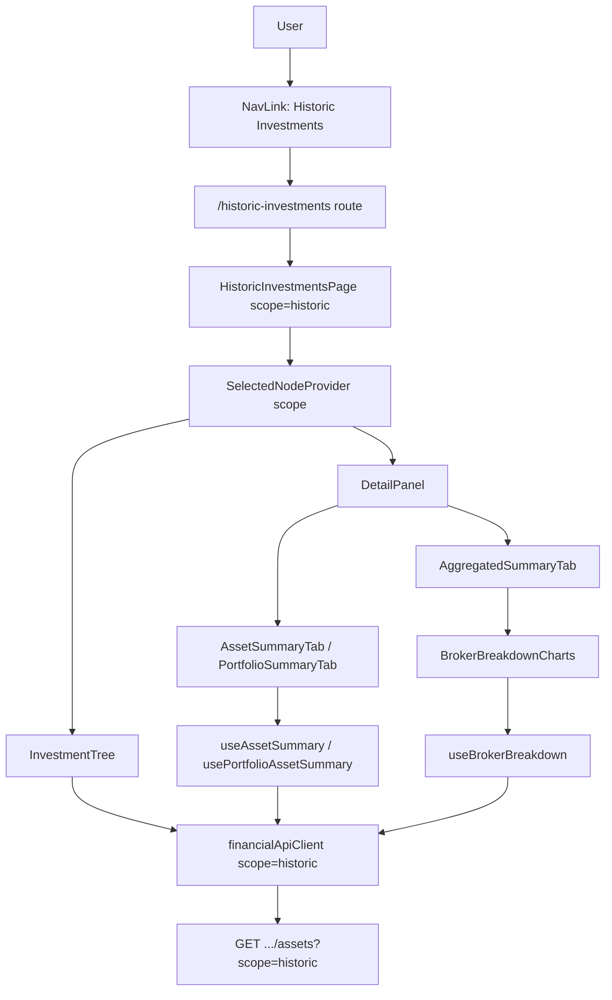

# Web — Historic Investments Tab

## 1. Technical Overview

**What:** Add a "Historic Investments" nav item and `/historic-investments` route that reuses the exact same `InvestmentTree`/`SplitPanel`/`DetailPanel` component tree as Active Investments (F08), scoped to `scope=historic` throughout, showing F06's realized totals (`TotalBought`, `TotalSold`, `TotalCredits`, `RealizedGainLoss`, `PortfolioWeight`) in place of current-value/XIRR figures, and F07's historic breakdown data in the existing charts view.

**Why:** F08 deliberately hardcoded `scope=active` everywhere on the frontend and explicitly deferred scope-prop threading to this feature ("F09 threads its own parameter when it's implemented" — F08 spec, Technical Decisions). Every backend endpoint this page needs (`GET /navigation/tree`, `GET /summary/broker/{name}`, `GET /summary/portfolio/{broker}/{portfolio}`, `GET /summary/broker/{name}/breakdown`, `GET /summary/portfolio/{broker}/{portfolio}/assets`, `GET /assets/{broker}/{portfolio}/{asset}`) is already fully scope-aware (F05, F06, F07) — this feature is pure frontend wiring plus one real gap: no endpoint returns `RealizedGainLoss`/`PortfolioWeight` at single-asset granularity, only at portfolio-list granularity.

**Scope:**

Included:
- `SelectedNodeContextValue` gains a `scope: InvestmentScope` field; `SelectedNodeProvider` accepts a `scope` prop
- `financialApiClient.ts`'s 6 scope-capable methods (`getNavigationTree`, `getAssetDetails`, `getSummaryByBroker`, `getSummaryByPortfolio`, `getBrokerBreakdown`, `getPortfolioAssetsSummary`) gain an explicit `scope` parameter, replacing F08's hardcoded `ACTIVE_SCOPE_QUERY` constant
- New `HistoricInvestmentsPage.tsx` mirroring `ActiveInvestmentsPage.tsx`, passing `scope="historic"` to `SelectedNodeProvider`; new nav item and route
- Every hook reading `useSelectedNode()` (`useAssetSummary`, `usePortfolioAssetSummary`, `useAggregatedSummary`, `useBrokerBreakdown`) also reads `scope` and forwards it to its `apiClient` call
- `AssetSummaryTab`/`PortfolioSummaryTab` gain scope-conditional rendering: current-value/XIRR block only for Active, a realized-totals block (`RealizedGainLoss`, `PortfolioWeight`) only for Historic
- `useAssetSummary`, for Historic scope only, makes one additional call to `getPortfolioAssetsSummary` and matches the selected asset's row to source `RealizedGainLoss`/`PortfolioWeight` (no single-asset endpoint carries them)
- `useCredits`/`useTransactions`'s `getAssetDetails`-backed Asset-node lookup forwards `scope`, so selecting a historic asset and editing its transactions/credits resolves against the correct collection
- Charts stay exactly where they are today (nested inside `AggregatedSummaryTab` for broker-node selections) — no new "Charts" tab is introduced, matching Active's actual current structure rather than the PRD's looser "Charts tab" phrasing

Excluded (deliberate limitation, not fixed here):
- `useCredits`/`useTransactions`'s Broker/Portfolio-node list-fetching (`getCreditsByBroker`, `getCreditsByPortfolio`, `getTransactionsByBroker`, `getTransactionsByPortfolio`) has no backend `scope` parameter at all — F05 explicitly left `CreditService`/`TransactionService` outside its scoped surface, and F09 doesn't reopen that boundary. Selecting a Historic Broker/Portfolio node and viewing its Credits/Transactions tab will show that broker/portfolio's full credit/transaction history (Active and Historic assets mixed), not scope-pure data. The PRD's F09 acceptance criteria only require asset-level add/edit/delete to work correctly, which this spec's `getAssetDetails` scoping satisfies; the broker/portfolio list view's scope purity is a pre-existing F05-level architectural boundary
- A first-class "Charts" `DetailPanel` tab — not introduced for either scope (see Technical Decisions)
- `AssetDetailsDTO`/`AssetDetailsDto` gaining `RealizedGainLoss`/`PortfolioWeight` fields — resolved instead by reusing the existing portfolio-list endpoint (see Technical Decisions)
- Any backend change — every endpoint this feature needs already exists and is scope-aware (F05, F06, F07); this is a frontend-only feature
- WPF (`Financial.App`) — that's F11, a separate feature

## 2. Architecture Impact

**Affected components:**
- `Financial.Web/src/api/types.ts` — `InvestmentScope` type; `scope` on `SelectedNodeContextValue`
- `Financial.Web/src/context/SelectedNodeContext.tsx` — `SelectedNodeProvider` takes a `scope` prop
- `Financial.Web/src/api/financialApiClient.ts` — 6 methods gain a `scope` parameter
- `Financial.Web/src/components/InvestmentTree.tsx` — forwards `scope` to `getNavigationTree`
- `Financial.Web/src/hooks/useAssetSummary.ts` — forwards `scope`; historic-only extra `getPortfolioAssetsSummary` call for realized fields
- `Financial.Web/src/hooks/usePortfolioAssetSummary.ts` — forwards `scope`; skips current-price fetch for Historic
- `Financial.Web/src/hooks/useAggregatedSummary.ts` — forwards `scope`
- `Financial.Web/src/hooks/useBrokerBreakdown.ts` — forwards `scope`
- `Financial.Web/src/hooks/useCredits.ts` / `useTransactions.ts` — forward `scope` on the Asset-node `getAssetDetails` lookup only
- `Financial.Web/src/components/AssetSummaryTab.tsx` — scope-conditional current-value/XIRR vs. realized-totals block
- `Financial.Web/src/components/PortfolioSummaryTab.tsx` — scope-conditional current-value columns/footer
- `Financial.Web/src/pages/HistoricInvestmentsPage.tsx` + `.css` (new)
- `Financial.Web/src/App.tsx`, `Financial.Web/src/main.tsx` — new nav item and route

## 3. Technical Decisions

| Decision | Chosen Approach | Alternative Considered | Trade-off |
|----------|----------------|----------------------|-----------|
| Scope threading | Extend `SelectedNodeContextValue` with a `scope` field; `SelectedNodeProvider` takes a `scope` prop | A second, sibling `ScopeContext` | Every hook already imports `useSelectedNode()` from one file — a one-line addition per hook, versus a second context read everywhere. Matches the codebase's existing single-context convention |
| Asset-level realized totals | `useAssetSummary` makes an additional `getPortfolioAssetsSummary(broker, portfolio, 'historic')` call and matches the selected asset's row for `RealizedGainLoss`/`PortfolioWeight` | Add `RealizedGainLoss`/`PortfolioWeight` to `AssetDetailsDTO`, computed backend-side for historic scope | Zero backend changes, reuses an endpoint that already computes exactly this data (F06). `PortfolioWeight` is inherently portfolio-relative — awkward to compute correctly from a single-asset endpoint that doesn't see the rest of the portfolio anyway. Costs one extra request, only for Historic asset selections |
| Charts tab placement | Leave charts nested inside `AggregatedSummaryTab` (Summary tab, broker-node selections) exactly as today | Introduce a first-class "Charts" entry in `DetailPanel`'s `TabId`/`TABS` | The PRD says "Charts tab" but no such tab exists for Active today either — charts are nested in Summary. Historic reaches parity with Active's actual structure without inventing new navigation the PRD didn't ask Active to adopt too |
| Summary tab reuse | `AssetSummaryTab`/`PortfolioSummaryTab` gain scope-conditional rendering blocks | New `HistoricAssetSummaryTab`/`HistoricPortfolioSummaryTab` components | Matches the PRD's framing that the Summary tab shows F06's fields "instead of" Active's; avoids duplicating the shared layout/table shell. `AssetSummaryTab`'s current-value block already self-suppresses for historic assets (`quantity === 0`), so this is mostly additive, not a rewrite |
| Credits/Transactions scope | Forward `scope` only on the `getAssetDetails`-backed Asset-node lookup; leave Broker/Portfolio-node list-fetching untouched | Also fix Broker/Portfolio-level credit/transaction lists to be scope-pure | The PRD's F09 acceptance criteria only require asset-level add/edit/delete to work; fixing list-level scope purity would require reopening F05's explicit exclusion of `CreditService`/`TransactionService` from its scoped surface — a decision beyond this feature's charter, documented as a known limitation instead of silently expanded scope |

## 4. Component Overview

**Frontend:**

| File Path | New/Modified | Purpose | Key Responsibilities |
|-----------|--------------|---------|---------------------|
| `Financial.Web/src/api/types.ts` | Modified | Scope type | Adds `export type InvestmentScope = 'active' \| 'historic'`; adds `scope: InvestmentScope` to `SelectedNodeContextValue` |
| `Financial.Web/src/context/SelectedNodeContext.tsx` | Modified | Scope-aware provider | `SelectedNodeProvider` accepts a `scope: InvestmentScope` prop, exposes it unchanged through context alongside `selectedNode`/`setSelectedNode` |
| `Financial.Web/src/api/financialApiClient.ts` | Modified | Scope-parameterized requests | Replaces the `ACTIVE_SCOPE_QUERY` constant with a `buildScopeQuery(scope)` helper (mirroring the existing `buildExchangeQuery` pattern); `getNavigationTree`, `getAssetDetails`, `getSummaryByBroker`, `getSummaryByPortfolio`, `getBrokerBreakdown`, `getPortfolioAssetsSummary` each gain a `scope: InvestmentScope` parameter |
| `Financial.Web/src/components/InvestmentTree.tsx` | Modified | Scope-aware tree fetch | Reads `scope` from `useSelectedNode()`; forwards it to `getNavigationTree` |
| `Financial.Web/src/hooks/useAssetSummary.ts` | Modified | Scope-aware asset summary | Forwards `scope` to `getAssetDetails`; for `scope === 'historic'`, also calls `getPortfolioAssetsSummary` and extracts the matching asset's `RealizedGainLoss`/`PortfolioWeight`; skips `getCurrentPrice`/`calculateXirr` calls for Historic |
| `Financial.Web/src/hooks/usePortfolioAssetSummary.ts` | Modified | Scope-aware portfolio summary | Forwards `scope` to `getPortfolioAssetsSummary`; skips the per-row `getCurrentPrice` fetch for Historic |
| `Financial.Web/src/hooks/useAggregatedSummary.ts` | Modified | Scope-aware aggregated summary | Forwards `scope` to `getSummaryByBroker`/`getSummaryByPortfolio` |
| `Financial.Web/src/hooks/useBrokerBreakdown.ts` | Modified | Scope-aware breakdown | Forwards `scope` to `getBrokerBreakdown` |
| `Financial.Web/src/hooks/useCredits.ts` | Modified | Scope-aware asset lookup | Forwards `scope` on the Asset-node `getAssetDetails` call only; Broker/Portfolio-node list calls unchanged |
| `Financial.Web/src/hooks/useTransactions.ts` | Modified | Scope-aware asset lookup | Same shape as `useCredits.ts` |
| `Financial.Web/src/components/AssetSummaryTab.tsx` | Modified | Scope-conditional summary content | Renders the existing current-value/XIRR block only when `scope === 'active'`; renders a new realized-totals block (`TotalBought`, `TotalSold`, `TotalCredits`, `RealizedGainLoss`, `PortfolioWeight`) only when `scope === 'historic'` |
| `Financial.Web/src/components/PortfolioSummaryTab.tsx` | Modified | Scope-conditional summary content | Suppresses current-value/profit%/XIRR columns and footer sums for `scope === 'historic'`; the existing `RealizedGainLoss`/`PortfolioWeight` columns (already on the DTO since F06) render for both scopes, with Active's staying `null`/unused visually |
| `Financial.Web/src/pages/HistoricInvestmentsPage.tsx` | New | Composition root | Mirrors `ActiveInvestmentsPage.tsx`: `SelectedNodeProvider scope="historic"` wrapping `SplitPanel` with `InvestmentTree`/`DetailPanel`, unmodified otherwise |
| `Financial.Web/src/pages/HistoricInvestmentsPage.css` | New | Layout styling | Mirrors `ActiveInvestmentsPage.css` |
| `Financial.Web/src/App.tsx` | Modified | Nav entry | New `NavLink to="/historic-investments"` labeled "Historic Investments" |
| `Financial.Web/src/main.tsx` | Modified | Route definition | New `<Route path="historic-investments" element={<HistoricInvestmentsPage />} />` |

## 5. API Contracts

No backend changes. Every endpoint this feature calls already exists and is scope-aware (F05, F06, F07):

| Endpoint | Scope support | Consumed by |
|---|---|---|
| `GET /navigation/tree?scope=historic` | F05 | `InvestmentTree` |
| `GET /assets/{broker}/{portfolio}/{asset}?scope=historic` | F05 | `useAssetSummary`, `useCredits`, `useTransactions` (Asset-node lookup) |
| `GET /summary/broker/{name}?scope=historic` | F05 | `useAggregatedSummary` (broker node) |
| `GET /summary/portfolio/{broker}/{portfolio}?scope=historic` | F05 | `useAggregatedSummary` (portfolio node) |
| `GET /summary/broker/{name}/breakdown?scope=historic` | F07 | `useBrokerBreakdown` |
| `GET /summary/portfolio/{broker}/{portfolio}/assets?scope=historic` | F06 | `usePortfolioAssetSummary`, `useAssetSummary` (realized-totals lookup) |

## 6. Data Model

No schema or backend changes. This feature only threads an already-existing `scope` concept through the frontend.

## 7. Testing Strategy

| Test File | Test Type | Target | Coverage Goal |
|-----------|-----------|--------|---------------|
| `Financial.Web/src/context/__tests__/SelectedNodeContext.test.tsx` | Unit | `SelectedNodeProvider` | `scope` prop is exposed through context unchanged |
| `Financial.Web/src/api/financialApiClient.test.ts` | Unit | `financialApiClient` | The 6 updated methods build request URLs with the passed `scope` value, both `active` and `historic` |
| `Financial.Web/src/components/__tests__/InvestmentTree.test.tsx` | Unit | `InvestmentTree` | Calls `getNavigationTree` with the scope read from context |
| `Financial.Web/src/hooks/useAssetSummary.test.ts` | Unit | `useAssetSummary` | Historic scope triggers the extra `getPortfolioAssetsSummary` call and surfaces `RealizedGainLoss`/`PortfolioWeight`; Active scope behavior unchanged (current price/XIRR still fetched) |
| `Financial.Web/src/hooks/usePortfolioAssetSummary.test.ts` | Unit | `usePortfolioAssetSummary` | Historic scope skips the per-row current-price fetch; Active scope unchanged |
| `Financial.Web/src/hooks/useAggregatedSummary.test.ts` | Unit | `useAggregatedSummary` | Forwards scope to both broker and portfolio summary calls |
| `Financial.Web/src/hooks/useBrokerBreakdown.test.ts` | Unit | `useBrokerBreakdown` | Forwards scope |
| `Financial.Web/src/hooks/useCredits.test.ts` / `useTransactions.test.ts` | Unit | Asset-node lookup scoping | `getAssetDetails` called with the correct scope for an Asset-node selection |
| `Financial.Web/src/components/__tests__/AssetSummaryTab.test.tsx` | Unit | `AssetSummaryTab` | Historic scope renders realized-totals block, not current-value/XIRR; Active scope unchanged |
| `Financial.Web/src/components/__tests__/PortfolioSummaryTab.test.tsx` | Unit | `PortfolioSummaryTab` | Historic scope suppresses current-value columns/footer; Active scope unchanged |
| `Financial.Web/src/pages/__tests__/HistoricInvestmentsPage.test.tsx` | Unit | `HistoricInvestmentsPage` | Renders tree/detail-panel composition, mirroring `ActiveInvestmentsPage.test.tsx`'s coverage |
| `Financial.Web/src/App.test.tsx` | Unit | Nav + routing | New "Historic Investments" nav item and route render correctly, alongside "Active Investments" |

**Test functions (representative, for the files with real branching logic):**

`financialApiClient.test.ts`
| Test Function | Description | Assertions |
|---------------|-------------|------------|
| `getNavigationTree requests the passed scope` (extend existing) | Call `getNavigationTree('historic')` | Fetch URL contains `scope=historic` |
| `getAssetDetails/getSummaryByBroker/getSummaryByPortfolio/getBrokerBreakdown/getPortfolioAssetsSummary request the passed scope` | Call each with `'historic'` | Fetch URL contains `scope=historic` for each |

`useAssetSummary.test.ts`
| Test Function | Description | Assertions |
|---------------|-------------|------------|
| `fetches_asset_details_with_historic_scope_when_context_scope_is_historic` | Historic-scoped `SelectedNodeProvider` | `getAssetDetails` called with `'historic'` |
| `fetches_realized_totals_from_portfolio_summary_for_historic_asset` | Historic asset selected | `getPortfolioAssetsSummary` called; returned `realizedGainLoss`/`portfolioWeight` for the matching asset name surfaced on the hook's result |
| `skips_current_price_and_xirr_fetch_for_historic_scope` | Historic asset selected | `getCurrentPrice`/`calculateXirr` not called |
| `active_scope_behavior_unchanged` (regression) | Active-scoped selection | `getCurrentPrice`/`calculateXirr` still called, no `getPortfolioAssetsSummary` call |

`AssetSummaryTab.test.tsx`
| Test Function | Description | Assertions |
|---------------|-------------|------------|
| `renders realized totals section for historic scope` | Historic asset, hook returns `realizedGainLoss`/`portfolioWeight` | Realized-totals block visible; current-value/XIRR block absent |
| `renders current value and xirr section for active scope` (regression) | Active asset | Current-value/XIRR block visible, unchanged from F08 behavior |

`PortfolioSummaryTab.test.tsx`
| Test Function | Description | Assertions |
|---------------|-------------|------------|
| `suppresses current value columns and footer for historic scope` | Historic portfolio selected | Current-value/profit%/XIRR columns and footer sums absent |
| `renders current value columns for active scope` (regression) | Active portfolio selected | Unchanged from F08 behavior |

`useCredits.test.ts` / `useTransactions.test.ts`
| Test Function | Description | Assertions |
|---------------|-------------|------------|
| `resolves asset via getAssetDetails with historic scope` | Historic asset node selected | `getAssetDetails` called with `'historic'` |

**Acceptance tests (PRD Section 9, F09):**
| PRD Acceptance Criterion | Covered By |
|---|---|
| A new "Historic Investments" nav item renders a tree scoped to historic data only | `App.test.tsx` (nav item) + `InvestmentTree.test.tsx` (scope forwarding) |
| The Summary tab for a historic asset shows realized totals, not current-value/XIRR fields | `AssetSummaryTab.test.tsx` |
| The Charts tab renders historic breakdown data | `useBrokerBreakdown.test.ts` (scope forwarding) — charts render via the existing, already-tested `BrokerBreakdownCharts` |
| A transaction or credit can be added, edited, and deleted for a historic asset through the same UI flow as an active asset | `useCredits.test.ts` / `useTransactions.test.ts` (scope-correct asset resolution; mutation flows themselves are F08-era unmodified code, already covered) |

**Cross-Feature Integration tests (PRD Section 9):**
| Criterion | Covered By |
|---|---|
| Realized totals from F06 render correctly in the Web (F09) Historic Investments summary views | `useAssetSummary.test.ts` + `AssetSummaryTab.test.tsx` + `usePortfolioAssetSummary.test.ts` + `PortfolioSummaryTab.test.tsx` |
| Breakdown data from F07 renders correctly in the Web (F09) Historic Investments charts views | `useBrokerBreakdown.test.ts` |
