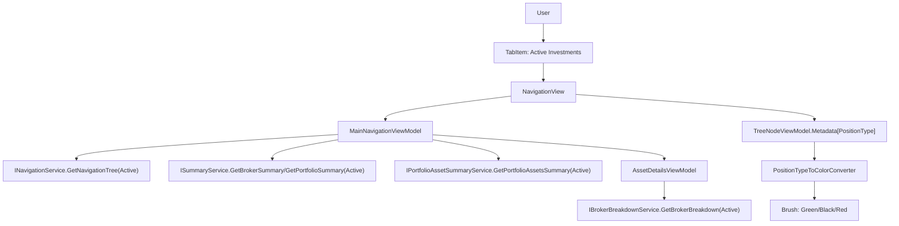

# WPF — Active Investments Tab Update

## 1. Technical Overview

**What:** Relabel the WPF app's single investments tab from "Portfolio Navigator" to "Active Investments", make its data-loading path explicitly `InvestmentScope.Active` at every in-process service call site, and replace the boolean active/inactive tree-icon color indicator with a three-way `Long`/`Flat`/`Short` → green/black/red mapping driven by F01's `PositionType`, which is already flowing through `TreeNodeDTO.Metadata` (fixed for string serialization by F08, consumed by no WPF code yet).

**Why:** Financial.App is not an HTTP client of Financial.Api — it calls `INavigationService`/`ISummaryService`/`IPortfolioAssetSummaryService`/`IBrokerBreakdownService` in-process via DI, and every one of those calls today omits the `scope` argument, relying entirely on each method's `InvestmentScope.Active` default. That's already scope-pure, but it's an implicit dependency on a default that could silently change — the same problem F08 fixed on the Web side by making `scope=active` explicit. Separately, the tree's asset icon is still driven by `BoolToActiveColorConverter`/`BoolToIconConverter`, both bound to the old `Metadata[IsActive]` boolean, which cannot distinguish a closed/flat position from an open short (both render `Brushes.Red` under today's binary model, and a short position — `IsActive == false` — would even render the "inactive" hollow glyph despite being a real, non-flat position).

**Scope:**

Included:
- Tab relabel: `MainWindow.xaml`'s `TabItem Header` changes from "Portfolio Navigator" to "Active Investments"
- Explicit `InvestmentScope.Active` at all 6 in-process service call sites reached by this tab (`GetNavigationTree`, `GetAssetDetails`, `GetPortfolioSummary`, `GetBrokerSummary`, `GetPortfolioAssetsSummary`, `GetBrokerBreakdown`)
- Three-way position-type color indicator: `BoolToActiveColorConverter` is replaced by a new `PositionTypeToColorConverter` mapping `Long`/`Flat`/`Short` (read from `Metadata[PositionType]`) to `Brushes.Green`/`Brushes.Black`/`Brushes.Red`, matching the three-state color convention already established in this codebase by `SignedValueToBrushConverter`/`TransactionTypeToColorConverter`
- Icon glyph simplified to a constant filled `●` for every asset node, removing the `Metadata[IsActive]`/`BoolToIconConverter` binding from the tree template (per interview decision — matches F08's Web precedent of color-only signaling)

Excluded (deferred to F11, not touched here):
- A new "Historic Investments" tab, `NavigationView` reuse for the Historic scope, and any historic summary/breakdown wiring — that is F11
- `Financial.Web` — already covered by F08; this spec touches only `Financial.App` and its test project
- Any reusable `scope` parameter/switcher UI for choosing Active vs Historic at runtime — F10 hardcodes `InvestmentScope.Active`; F11 introduces its own tab wired to `InvestmentScope.Historic`
- Renaming `MainNavigationViewModel`/`NavigationView`/`MainNavigationViewModelBase` classes or files — the PRD capability text scopes this feature to relabeling the tab and fixing the indicator, not a component rename; unlike Web's `PortfolioNavigatorPage` → `ActiveInvestmentsPage` rename (needed there because F09 was about to introduce a sibling page in the same file layout), WPF's `NavigationView`/`MainNavigationViewModel` stay generic and reusable — F11 will host its own historic-scoped view model rather than renaming this one

## 2. Architecture Impact

**Affected components:**
- `Financial.App/MainWindow.xaml` — tab header text
- `Financial.App/Converters/BoolToActiveColorConverter.cs` — deleted
- `Financial.App/Converters/PositionTypeToColorConverter.cs` — new
- `Financial.App/App.xaml` — converter resource registration
- `Financial.App/Components/NavigationView.xaml` — icon glyph + color binding
- `Financial.App/ViewModels/MainNavigationViewModelBase.cs` — explicit scope at 5 call sites
- `Financial.App/ViewModels/AssetDetailsViewModel.cs` — explicit scope at 1 call site

## 3. Technical Decisions

| Decision | Chosen Approach | Alternative Considered | Trade-off |
|----------|----------------|----------------------|-----------|
| Icon glyph | Hardcode a literal `●` in `NavigationView.xaml`'s asset-icon `TextBlock.Text`, removing the `Metadata[IsActive]`/`BoolToIconConverter` binding entirely | Keep `BoolToIconConverter` bound to `Metadata[IsActive]`, showing `●`/`○` | Matches F08's Web precedent (single glyph, color-only signal) and avoids the "hollow but red" combination a bound-to-`IsActive` short position would otherwise render; confirmed via interview |
| Scope explicitness | Pass `InvestmentScope.Active` explicitly at all 6 call sites (`MainNavigationViewModelBase.cs` ×5, `AssetDetailsViewModel.cs` ×1) instead of relying on each method's default parameter | Leave the implicit default as-is (already scope-pure today) | Slightly larger diff across two files, but removes an implicit dependency on a default that could change, matching the explicit-scope decision already made for Web in F08; confirmed via interview |
| Converter color values | `Brushes.Green` (Long) / `Brushes.Black` (Flat) / `Brushes.Red` (Short) — named `System.Windows.Media.Brushes`, not hex literals | Hex values matching Web's `#2e7d32`/`#c62828` for cross-app visual consistency | This codebase's existing three-state converters (`SignedValueToBrushConverter`, `TransactionTypeToColorConverter`) both already use named `Brushes.Green`/`Brushes.Red`/`Brushes.Black` — following that established local convention over introducing a new hex-literal pattern into WPF, where none exists today outside two unrelated `SystemColors` overrides |
| Converter class strategy | Delete `BoolToActiveColorConverter.cs`, add a new `PositionTypeToColorConverter.cs`; update the two reference sites (`App.xaml` resource key, `NavigationView.xaml` binding) | Extend `BoolToActiveColorConverter` in place to also accept a string | Matches the PRD's own wording ("replaced with") and keeps one converter, one input type, one purpose — consistent with every other single-purpose converter in `Converters/` |
| Test coverage for the new converter | Add `Tests/Financial.Presentation.Tests/Converters/PositionTypeToColorConverterTests.cs`, the first test file under a new `Converters/` test folder | Skip converter-level tests, rely on manual visual verification only (no existing precedent for converter tests in this codebase) | `Converters/` currently has zero test coverage codebase-wide, but the CLAUDE.md Definition of Done requires unit tests for new code; a small `[Theory]`-driven test is proportionate and establishes the pattern for future converters rather than leaving a gap |

## 4. Component Overview

**Presentation (WPF):**

| File Path | New/Modified | Purpose | Key Responsibilities |
|-----------|--------------|---------|---------------------|
| `Financial.App/MainWindow.xaml` | Modified | Tab label | `TabItem Header` text: "Portfolio Navigator" → "Active Investments" |
| `Financial.App/Converters/BoolToActiveColorConverter.cs` | Deleted | — | Superseded by `PositionTypeToColorConverter` |
| `Financial.App/Converters/PositionTypeToColorConverter.cs` | New | Three-way status color | `IValueConverter` mapping the string `"Long"`/`"Flat"`/`"Short"` (as read from `Metadata[PositionType]`) to `Brushes.Green`/`Brushes.Black`/`Brushes.Red`; unrecognized/null input falls back to `Brushes.Black`, matching `SignedValueToBrushConverter`'s fallback pattern |
| `Financial.App/App.xaml` | Modified | Converter resource registration | `<converters:BoolToActiveColorConverter x:Key="BoolToActiveColorConverter"/>` replaced with `<converters:PositionTypeToColorConverter x:Key="PositionTypeToColorConverter"/>` |
| `Financial.App/Components/NavigationView.xaml` | Modified | Tree asset icon | Icon `TextBlock.Text` becomes the literal `"●"`; `Foreground` binding switches from `Metadata[IsActive]`/`BoolToActiveColorConverter` to `Metadata[PositionType]`/`PositionTypeToColorConverter` |
| `Financial.App/ViewModels/MainNavigationViewModelBase.cs` | Modified | Explicit scope | `LoadNavigationTreeAsync`'s `GetNavigationTree`, `LoadAssetDetails`'s `GetAssetDetails`, `LoadPortfolioCredits`'s `GetPortfolioSummary`/`GetPortfolioAssetsSummary`, and `LoadBrokerCredits`'s `GetBrokerSummary` all pass `InvestmentScope.Active` explicitly |
| `Financial.App/ViewModels/AssetDetailsViewModel.cs` | Modified | Explicit scope | `LoadBrokerBreakdown`'s `GetBrokerBreakdown` call passes `InvestmentScope.Active` explicitly |

**Tests:**

| File Path | New/Modified | Purpose | Key Responsibilities |
|-----------|--------------|---------|---------------------|
| `Tests/Financial.Presentation.Tests/Converters/PositionTypeToColorConverterTests.cs` | New | Converter coverage | `[Theory]` over `Long`/`Flat`/`Short`/unrecognized input asserting the returned brush |
| `Tests/Financial.Presentation.Tests/ViewModels/MainNavigationViewModelBaseTests.cs` | Modified | Scope-explicitness coverage | `StubNavigationService`, `StubSummaryService`, `StubPortfolioAssetSummaryService` (private nested stubs, lines 376-418) each gain a `LastScope` capture property; new assertions confirm `InvestmentScope.Active` was passed by `TestableNavigationViewModel`'s calls |
| `Tests/Financial.Presentation.Tests/ViewModels/AssetDetailsViewModelBrokerSummaryTests.cs` | Modified | Scope-explicitness coverage | New assertion on `StubBrokerBreakdownService.LastScope` after `LoadBrokerBreakdown` |
| `Tests/Financial.Presentation.Tests/ViewModels/TestStubs.cs` | Modified | Shared stub scope tracking | `StubBrokerBreakdownService.GetBrokerBreakdown` records the passed `scope` into a new `LastScope` property |

## 5. API Contracts

Not applicable — this feature makes no HTTP calls and adds no endpoints. Financial.App consumes `Financial.Application`'s services in-process via DI; the only interface-level change is which argument value is passed to already-existing `scope`-parameterized methods (all shipped by F05), not a signature or contract change.

## 6. Data Model

Not applicable — no `data.json` or schema changes. This feature only changes which existing, already-computed value (`Asset.PositionType`, already present in `Metadata` since F01/F05) a WPF converter reads, and which explicit argument value WPF passes to already-scoped Application services.

## 7. Testing Strategy

| Test File | Test Type | Target | Coverage Goal |
|-----------|-----------|--------|---------------|
| `Tests/Financial.Presentation.Tests/Converters/PositionTypeToColorConverterTests.cs` | Unit | `PositionTypeToColorConverter` | Each of `Long`/`Flat`/`Short` maps to the correct brush; unrecognized/null input falls back to `Brushes.Black` |
| `Tests/Financial.Presentation.Tests/ViewModels/MainNavigationViewModelBaseTests.cs` | Unit | `MainNavigationViewModelBase` | `InvestmentScope.Active` is passed explicitly to `GetNavigationTree`, `GetAssetDetails`, `GetPortfolioSummary`, `GetBrokerSummary`, `GetPortfolioAssetsSummary` |
| `Tests/Financial.Presentation.Tests/ViewModels/AssetDetailsViewModelBrokerSummaryTests.cs` | Unit | `AssetDetailsViewModel.LoadBrokerBreakdown` | `InvestmentScope.Active` is passed explicitly to `GetBrokerBreakdown` |

**Test functions:**

`PositionTypeToColorConverterTests.cs`
| Test Function | Description | Assertions |
|---------------|-------------|------------|
| `Convert_Long_ReturnsGreenBrush` (new) | Input `"Long"` | Returns `Brushes.Green` |
| `Convert_Flat_ReturnsBlackBrush` (new) | Input `"Flat"` | Returns `Brushes.Black` |
| `Convert_Short_ReturnsRedBrush` (new) | Input `"Short"` | Returns `Brushes.Red` |
| `Convert_UnrecognizedOrNullValue_ReturnsBlackBrush` (new) | Input `null` or an unexpected string | Returns `Brushes.Black`, matching `SignedValueToBrushConverter`'s fallback |

`MainNavigationViewModelBaseTests.cs`
| Test Function | Description | Assertions |
|---------------|-------------|------------|
| `LoadNavigationTreeAsync_RequestsActiveScope` (new) | Calls `LoadNavigationTreeAsync` | `StubNavigationService.LastScope` equals `InvestmentScope.Active` |
| `SelectingAssetNode_RequestsActiveScopeAssetDetails` (new) | Selects an asset node | `StubNavigationService.LastScope` (for `GetAssetDetails`) equals `InvestmentScope.Active` |
| `SelectingPortfolioNode_RequestsActiveScopeSummaryAndAssetItems` (new) | Selects a portfolio node | `StubSummaryService.LastScope`/`StubPortfolioAssetSummaryService.LastScope` both equal `InvestmentScope.Active` |
| `SelectingBrokerNode_RequestsActiveScopeSummary` (new) | Selects a broker node | `StubSummaryService.LastScope` equals `InvestmentScope.Active` |

`AssetDetailsViewModelBrokerSummaryTests.cs`
| Test Function | Description | Assertions |
|---------------|-------------|------------|
| `LoadBrokerBreakdown_RequestsActiveScope` (new) | Calls `LoadBrokerBreakdown` | `StubBrokerBreakdownService.LastScope` equals `InvestmentScope.Active` |

**Acceptance tests (PRD Section 9, F10):**
| PRD Acceptance Criterion | Covered By |
|---|---|
| The existing investments tab is relabeled "Active Investments" and shows only active data | Manual verification of `MainWindow.xaml` tab header text (no automated WPF UI test harness in this codebase for tab labels, consistent with existing precedent) + `MainNavigationViewModelBaseTests.cs` scope-explicitness tests confirming only `InvestmentScope.Active` is ever requested |
| Each asset's status indicator shows green/black/red matching `Long`/`Flat`/`Short` | `PositionTypeToColorConverterTests.cs` three color-mapping tests |

**Cross-Feature Integration test (PRD Section 9):**
| Criterion | Covered By |
|---|---|
| Active-scoped data and position type from F01/F05 render correctly in the WPF (F10) Active Investments tab | `MainNavigationViewModelBaseTests.cs` scope-explicitness tests (F05's data reaching F10 with the correct scope) + `PositionTypeToColorConverterTests.cs` (F10 rendering F01's `PositionType` correctly) |
